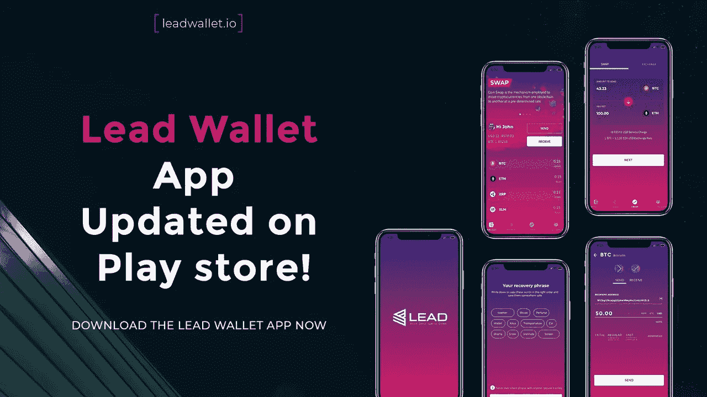
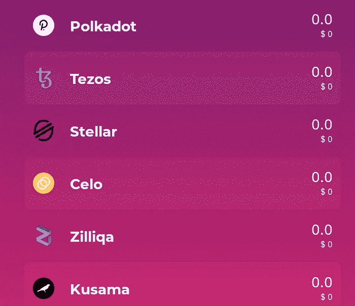
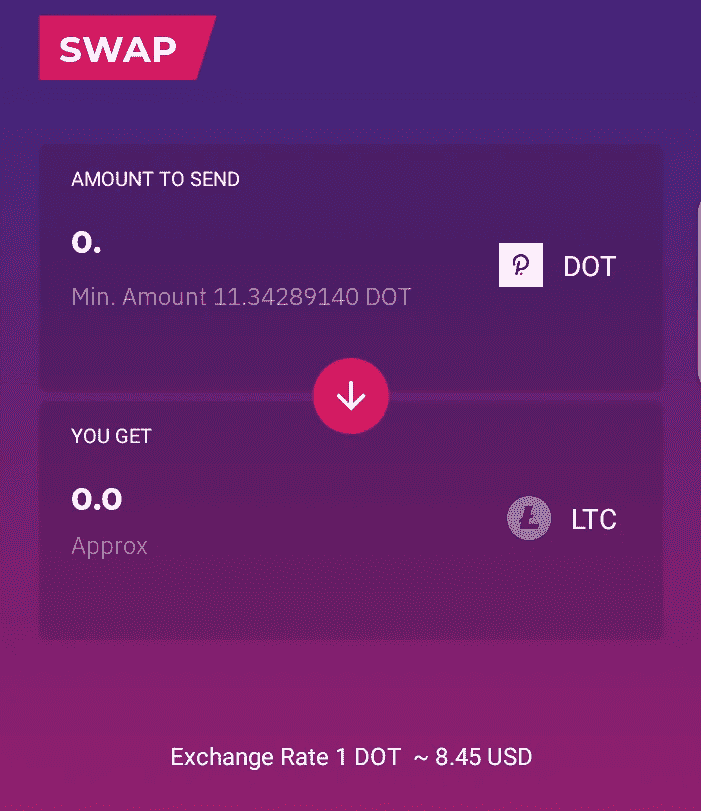

# 为什么我把我的波尔卡多特和草间弥生放在铅制钱包里。

> 原文：<https://medium.datadriveninvestor.com/why-i-hold-my-polkadot-and-kusama-on-lead-wallet-7492e6890883?source=collection_archive---------7----------------------->

如果你在 2020 年最后一个季度的大部分时间里一直活跃在加密领域，你每天至少会遇到两次“Polkadot”这个术语。在令人惊叹的互操作性技术的推动下，Polkadot 项目越来越受欢迎，其生态系统中的项目也是如此。随着许多新项目从波尔卡多特生态系统中涌现出来；你可能正在观看几个波尔卡多特附属项目。

建造方式与波尔卡多特相似；草间弥生——这是一个实验性的开发环境，适合那些希望在草间弥生上快速行动和创新的团队，或者准备在波尔卡多特上部署的团队，这也让加密货币投资者感到高兴。两个惊人的项目，相关的技术…同一个团队。很难忽视这两个准备在加密领域做出大胆声明的项目。

嗯，我个人很着迷，最近买了一些波尔卡多特(dot)和草间弥生(KSM)。然而，Polkadot 和草间弥生团队还没有发布任何用于存放这些硬币的官方(移动)钱包。感谢加密领域辛勤工作的基础设施开发人员；开发者提供了各种各样的钱包来安全保管波尔卡多特或草间弥生。

在考虑了不同的可用选项后，我最终决定将两枚硬币都存储在 [**铅钱包**](https://leadwallet.io/) 中

# 但是..为什么？

[来源](https://pixabay.com/vectors/help-information-question-tip-1724292/)

你可能会想，有成千上万的钱包可以用来存放波尔卡多特和草间弥生，为什么我选择了 Lead wallet，尽管它还处于测试阶段。我会告诉你…

## 支持波尔卡多特和草间弥生

在我寻找最好的钱包来存放我新买的草间弥生和波尔卡多特代币的过程中，我发现了许多很酷的钱包。不幸的是，这些钱包大多只支持波尔卡多特或草间弥生，而不是两者都支持。尽管大多数钱包都支持多种资产，但大多数钱包只支持草间弥生或波尔卡多特中的一种。

选择这些钱包中的任何一个都意味着将这些代币存储在两个不同的钱包中。加密货币的保管是一个非常微妙的过程，管理多个钱包可能会从各个角度增加这一漏洞。管理两个不同的钱包基本上意味着管理两个不同的安全基础设施，努力保持两个密码的安全，并记住两个密码。

Lead wallet 通过支持这两个项目以及许多其他加密货币解决了这一困境。它提供了一个逃避拥有多个钱包的机会，让我有机会将这些非常重要的令牌放在一个地方，而不必担心要保留多个钱包或多保存两个私人钥匙。

自从发现了 Lead 钱包，我把更多的资产从其他钱包搬到了 Lead 钱包；这包括我的 Zilliqa，币安硬币和 Tezos 控股公司。对于持有更多代币的投资者，lead wallet 支持更多的硬币，并且支持的硬币数量不断增加。

## 草间弥生和波尔卡多特的钱包内换货服务。

我个人喜欢从我的钱包里安全地执行一些操作的想法。将我的硬币/代币换成其他代币以及访问赌注服务等操作。领先钱包开发者已经集成了允许用户用他们钱包上的其他可用令牌交换他们的令牌的设施，而不会使他们的投资暴露于安全威胁。

由于我的草间弥生和波尔卡多特在我的铅制钱包里，我可以很容易地用我选择的其他可用的代币来交换它们。除了草间弥生和波尔卡多特，这项互换服务也可用于铅钱包上的其他代币。对于普通用户来说，这种掉期服务既时尚又简单，而且交易费用也非常便宜。当然，它又快又高效！

Lead wallet 还提供了一个用于标记代币的平台，这可用于 POS 硬币和带有标记程序的代币。铅钱包接口与这些项目的赌注平台，使其用户赌注硬币的权利，他们的铅钱包。这项服务仍在开发中，我希望能尽快完成。

## 幸福的用户界面和简化的用户体验

Lead wallet 专为日常密码爱好者打造。Lead wallet 提供了一个简单的用户界面，每个功能都旨在满足每个加密货币投资者的渴望。lead wallet 采用简单的字体设计和视觉友好的颜色，将“可用性”放在首位。Pro 或 noobLead wallet 通过直观的设计和用户协助基础架构来驱动每个用户。简单的版式、颜色选择和空白的使用进一步简化了钱包的外观，使用户能够适应它的便利。

对于一个没有核心技术背景的普通加密货币投资者来说，一个简单的钱包是一种普遍的渴望。即使是技术专家也会喜欢尽可能简单的做事方式。因此，在这方面，Lead wallet 适合加密货币投资者的各种能力。

## 令人难以置信的支持团队

在我的手机上发现并安装了 Lead wallet 后，我联系了它背后的团队。熟悉支持团队就像钱包本身一样简单快捷。这是一个热情的氛围，在很短的时间内，我了解了很多关于这个项目的情况，并且我所有的问题都得到了解答。

尽管已经获得了一些流行，但大多数加密货币设施仍然有点复杂，因此，在使用任何加密货币设施时，响应迅速的支持团队是一个重要的考虑因素。Lead wallet 支持团队致力于倾听用户的心声，回答他们的问题，并指导他们使用 wallet 的条款。充分了解我有一个团队，我可以接触并获得快速反馈，这再次加强了我对 lead wallet 的偏好。

在与团队交流的过程中，我也了解了 Lead token。铅代币是铅钱包经济的传统代币。这意味着以共生的方式促进项目的发展。由于这个代币背后出色的代币组学，我也从 Uniswap 买了一些铅代币。

## 成为更光明未来的一部分

铅钱包正处于其最早期的增长阶段。钱包还远未完成。新功能以令人难以置信的速度增加，团队坚持不懈地致力于发布更多令人兴奋的功能。一个紧凑的路线图和一个乐观的未来。在加密货币钱包领域，Lead 将成为一个非常强大的竞争对手。它给游戏带来了如此多的新东西，这些带来了很大的不同。这是一个独特的界面，会让很多加密货币投资者和许多其他已经存在的功能和新功能感到高兴。

除了把我的波尔卡多特和草间弥生放在铅包里，把其他资产移到铅包里，当然还有把我的铅代币放在铅包里；成为新的有前途的项目的一部分是一种非常令人兴奋的感觉。这简直是不可抗拒的…另一个因素，加强了我对铅钱包的偏好。

想得到铅钱包？
[在 PlayStore](https://play.google.com/store/apps/details?id=com.leadwallet.io&hl=en-GB&ah=TyVu8llbLlx6WoTSfmoEjGLodsg) 下载 Lead wallet Beta 版

关注最新消息[在 twitter 上关注 Lead wallet](https://twitter.com/LeadWallet)