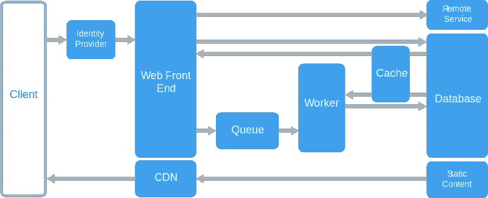

# 为什么我在开发了一个网络应用 3 个月后喜欢上了 Django

> 原文：<https://medium.datadriveninvestor.com/why-i-love-django-after-building-a-web-app-for-3-months-e9f0331c02da?source=collection_archive---------3----------------------->

我对使用 Django 构建 web 应用程序的简单程度感到惊讶

本帖原帖[此处](https://fadhil-blog.dev/blog/love-django/)。

Photo by [Faisal M](https://unsplash.com/@hejfaisal?utm_source=medium&utm_medium=referral) on [Unsplash](https://unsplash.com?utm_source=medium&utm_medium=referral)

在过去的三个月里，我一直在用 Django 为我们公司的新项目编写一个 web 应用程序。它还没有推出，所以我不能透露太多关于它的信息。然而，当我和团队一起做这个项目时，我学到了很多。

此前，我一直在与 Flask、Cherrypy 和 Bottle 合作，为特定的需求构建一个小而简单的 web 应用程序。在 Django 写了几个星期的 web 应用后，我震惊了。在写我的第一行 Django 代码之前，我读了这本由 Andrew Pinkham 写的非常棒的电子书

 [## 用 Django 用 Python 进行高级 Web 开发

### 超过 8 小时的视频教学概述旨在用 Django LiveLessons 进行 Python 高级 Web 开发…

www.oreilly.com](https://www.oreilly.com/library/view/advanced-web-development/9780136552949/) 

如果您是 Python 或 Django web 编程的新手，我建议您从一本解释其基本原理的书或教程开始，以便了解这个概念。

# 喜欢 Django 框架的理由

## 原因 1:大公司在他们身上下注

在我们讨论 Django 的酷之前，让我们看看谁在赌框架。许多组织在他们的堆栈中使用 Django。最值得一提的是 **Instagram、Mozilla、Pinterest 和 NASA** 。Instagram 从第一天开始就在使用 Django，因为这让他们可以快速进化。我明白，在经历了多年的指数级增长后，这个框架会带来一些痛苦，但 Django 是一个能让他们如此快速地扩大规模的框架。

观看下面的视频，了解 Django 在 Instagram 上的使用情况。

## 原因 2:快速原型/开发

使用 Django 编写 Web 应用程序就像 ABC 一样简单。Django 使得从零开始构建一个 web 应用程序变得非常简单。与 Flask 这样的最小框架相比，您需要编写数据库迁移脚本、页面路由、用户认证、序列化程序等..在姜戈，一切都为你准备好了。

老实说，如果我在 Flask 中单独从头开始编写一个完整且经过全面测试的用户管理模块，包括用户注册、用户登录、社交登录、密码重置、电子邮件激活、密码加密和基于角色的访问控制(RBAC)，我可能需要 1-2 周的时间。这将总结成千上万行代码。在 Django，使用其 scaffold `django startapp`工具只需不到 1 天的时间。

编写模型、视图和模板也非常容易。假设您正在为您的 web 应用程序创建一个新的投票模块，您需要启动一个新的应用程序，定义它的模型，编写视图和模板。最后，在配置文件中注册应用程序。瞧啊。

使用 Django 的其他好处包括:

*   简单部署模型
    你可以在 Heroku、Python Anywhere 或 AWS Elastic Beanstalk 上轻松部署 Django 应用程序，只需一个 git 命令。您还可以作为容器部署到几乎任何地方。
*   **适合 80%的 web 应用用例** 如果你正在构建一个需要用户管理系统、ORM、后台工作的 Web 应用，Django 可以满足你。所有的好东西都来自盒子。
*   **Unittest 超级干净**
    我很惊讶 Django 附带了很多方便的单元测试工具。构建弹性应用程序现在又变得有趣了！
*   **安全由你负责**
    Django 内置了针对常见攻击的缓解措施，例如 XSS、SQLi、CSRF、密码破解和点击劫持。

如果你是一名自由职业者，以很快的速度从事各种项目，这应该在你的工具带之下。

## 原因 3:第 2 天的运营令人安心

构建一个 web 应用程序只是这项工作的 20%。在接下来的 5 年里，维护 web 应用程序是另外 80%的工作。这包括扩展其功能、服务器和数据库迁移、确保服务正常运行、数据清理、服务器扩展等。在 Django 中，所有这些过程都很容易，只要你正确设计你的系统。

Django 有一个非常乐于助人的社区。这对你的项目的寿命非常重要。Django 于 2005 年首次发布，15 年后，这个社区每天都在发展，没有任何放缓的迹象。越来越多的人和大公司依赖于这个项目，这意味着它将在未来许多年继续存在。充满活力的开发者社区意味着:

*   **大量 StackOverflow 问题** 有超过 [220，000 个带 tag Django](https://stackoverflow.com/questions/tagged/django) 的问题在 StackOverflow 中被提问。你遇到的几乎每一个与 Django 有关的问题都可能在那里被问过和讨论过。
*   扩展你的应用程序很容易
    Django 提供了大量随时可用的插件。这是一个很长的可用软件包列表[https://djangopackages.org/](https://djangopackages.org/)
*   **公司官方指南**
    由于其知名度，很多公司喜欢[谷歌云](https://cloud.google.com/python/django)、 [AWS](https://docs.aws.amazon.com/elasticbeanstalk/latest/dg/create-deploy-python-django.html) 、[蟑螂 DB](https://www.cockroachlabs.com/docs/stable/build-a-python-app-with-cockroachdb-django.html) 、[数字海洋](https://www.digitalocean.com/community/tutorials/how-to-set-up-a-scalable-django-app-with-digitalocean-managed-databases-and-spaces)等。正在根据 Django 生态系统编写指南。
*   用于招聘的巨大人才库 Django 是一个时髦的框架。如果你的公司想雇佣 Django 开发人员，你可能很容易在就业市场上找到他们。他们并不稀缺。

# 何时使用 Django

Web-Queue-Worker architecture style. Courtesy of Microsoft

根据经验，如果您正在开发一个**整体 Web 队列工作器架构**项目，您至少应该尝试一下 Django。微软已经在这个文档页面上深入解释了 Web 队列工作器架构。

 [## Web-Queue-Worker 架构风格——Azure 应用架构指南

### 该体系结构的核心组件是一个服务于客户端请求的 web 前端和一个执行…

docs.microsoft.com](https://docs.microsoft.com/en-us/azure/architecture/guide/architecture-styles/web-queue-worker) 

整体式 web 队列工作器架构是一种非常常见的 Web 架构。这种架构适用于许多用例。就个人而言，如果我要开始一个项目，我会使用 Django:

*   **期望一个全功能的 web app** 自带完整的用户管理系统，全面的 API 文档，完整的单元测试覆盖等。
*   **我正在独自或在一个小团队项目中工作**,不想担心可伸缩性、服务间通信和复杂的部署策略(例如，Kubernetes 编排)
*   **我需要它快 *(MVP 在几天或几周，而不是几个月)*并且愿意牺牲灵活性、优化和定制**，因为它的进入门槛低。这是一个权衡。
*   **我知道我永远不会在项目*中使用最新的技术***(例如 AWS QLDB、AWS Neptune DB、AWS DynamoDB、Firebase Realtime Database、ScyllaDB) 并在其整个生命周期中坚持使用传统的(成熟且稳定的)技术。
*   我知道我永远不会偏离网络队列工作者架构。这意味着你永远不应该在 Django 应用之上实现事件源、CQRS、六角形/端口&适配器和/或微服务架构。它不是为此而建的。如果你这样做，你可能用错了。
*   **避免厂商锁定**
    不像无服务器编程(我说的是 AWS Lambda、Azure Functions 和 Google Functions)，除非你在 Kubernetes 上做，大多数无服务器编程意味着你被锁定在那个特定的厂商，离开他们并不容易。
*   可能会建立另一个 [Instagram](https://github.com/andyalam/django_instagram) 、 [Youtube](https://github.com/ayushjainrksh/YTC) 、 [Medium](https://github.com/gothinkster/django-realworld-example-app) 、 [Airbnb](https://github.com/evrenesat/ganihomes) 和 Yelp 克隆(嗯，不是那种完整复杂的系统，但你会有想法)

## 整体服务与微服务范例

如今，每个人都喜欢微服务，但整体架构没什么好害羞的。Basecamp 一直在做 monolithic，他们为此感到自豪。

微服务以复杂性为代价。设计和管理成百上千的微服务并不是一件容易的事情。你需要考虑的事情太多了。更不用说，调试和跟踪是一个棘手的过程。微服务根本不适合所有人。

# 何时不使用 Django

这是我个人的看法。任何 web 框架都有一个权衡。

*   **如果您想使用最新的技术** 大多数新技术可能需要一段时间才能被社区采用。如果你想使用像 FaunaDB、DynamoDB 等新技术。你可能需要在 Django 中为其编写适配器/插件。
*   **你的团队已经扩展到超过两个披萨大小的团队**
    这是我非常个人的看法。如果团队已经发展到超过 100 个开发人员在同一个代码库上工作，也许你应该考虑把他们分成小的微服务，有一个非常清晰的分离边界。然而，我可能是错的，Instagram 多年来一直在做正确的事情。
*   当你想要完全控制你的代码时，Django 是一个固执己见的框架。您必须根据 Django 的设计来构建您的应用程序，并坚持使用它。你甚至不能切换 ORM 库。如果你重视灵活性胜过易用性，你应该考虑使用像 Flask 这样的最小框架。
*   也许你想建立一个只显示任何时区的当前时间的网站，或者一个响应 Slack 消息的 webhook，那么 Django 对你来说是多余的。您应该考虑使用最小的 web 框架。
*   **你想学习端到端的一切**
    你不会体验到在 Django 中构建端到端的一切，因为大多数操作都是为你抽象的。

# 结论

我用 Django 才两个月。我现在只看到姜戈光明的一面。也许一年后，我会发现更多 Django 的缺点和缺陷以及解决方案，我很乐意在这里再次分享我的经验。

我知道 Django 提供了很多我还没有探索的东西:Django 通道、内存缓存、芹菜任务、Django REST、异步支持等等。我还需要了解更多关于 Django 的最佳实践，以便优化我的应用程序。学习是一个永无止境的过程。