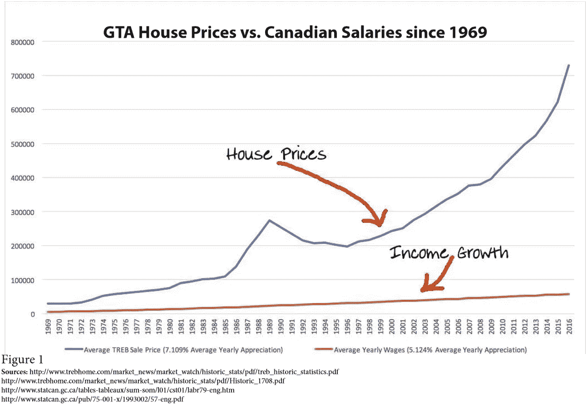
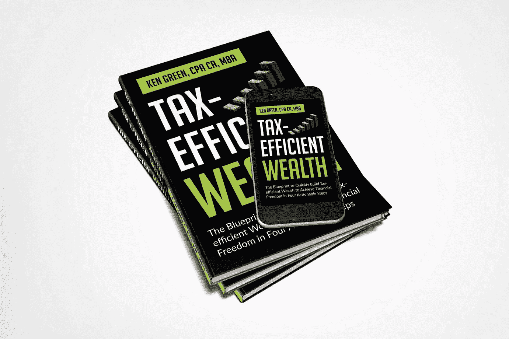

# 为什么我喜欢把房地产作为投资工具

> 原文：<https://medium.datadriveninvestor.com/why-i-love-real-estate-as-an-investment-vehicle-d136182fd8f9?source=collection_archive---------11----------------------->

## 房地产是积累财富的最佳工具之一的 7 个理由

Photo by [Morning Brew](https://unsplash.com/@morningbrew?utm_source=unsplash&utm_medium=referral&utm_content=creditCopyText) on [Unsplash](https://unsplash.com/s/photos/real-estate?utm_source=unsplash&utm_medium=referral&utm_content=creditCopyText)

> “房地产投资即使规模很小，也是积累个人现金流和财富的一种屡试不爽的方法。”—罗伯特·清崎

当我评估任何投资时，我使用以下 4 个标准:

1.  **增长:**投资必须提供持续的增长，最好是年增长率高于 10%。
2.  **税收优惠:**投资必须提供税收优惠。换句话说，我要么不交税，要么交很少的税。
3.  **杠杆作用:**投资必须提供杠杆作用或使用他人资源的能力，以提高我的回报。
4.  **流动性:**投资必须提供流动性，或者在我需要的时候可以轻松获得现金。

房地产检查所有这些框，除了最后一个可能具有挑战性的取决于你如何投资。

尽管如此，房地产可能是你能找到的最好的税收优势资产类别。这是以节税方式增加和加速你的财富的主要工具之一。

在我的书《节税型财富》(你可以使用链接免费获得电子书版本)中，房地产是我探索的以节税方式积累和加速你的财富的六个工具之一，这样你就可以退休并免税度过余生。

 [## 2020 年最佳短期投资选择精选资源|数据驱动型投资者

### 投资是增加你净财富的一个好方法。如果你通过遵循一个严格的…

www.datadriveninvestor.com](https://www.datadriveninvestor.com/2020/03/28/handpicked-resources-for-the-best-short-term-investment-options-of-2020/) 

如果你想偷税漏税，你必须有房地产作为工具。对于那些认识我的人来说，我喜欢这类资产，并持有我在房地产方面的大部分投资。顾名思义，它是你看得见摸得着的“真实”资产。除此之外，它随着时间的推移保持其价值。

> **“不动产不能丢，不能偷，也不能带走。根据常识购买，全额支付，并以合理的谨慎管理，这是世界上最安全的投资。”—富兰克林·罗斯福**

为什么房地产是如此伟大的工具？以下是 7 个原因:

# 1.优惠税收待遇

当你以高于最初购买价格的价格出售租赁房地产时，利润将作为资本利得征税，这通常比普通所得税税率低。

在加拿大，如果你出售的房产是你的主要住所，那么整个过程都是免税的。这是一个伟大的税收优惠拥有自己的房子，尽早买得起一个。

此外，如果你拥有的房地产主要用于从企业获得收入，你可以延期缴纳房地产销售税。根据《加拿大所得税法》第 44 或 44.1 节，您可以将资本收益延期并滚入替代房产。

# 2.税收减免

拥有租赁房地产就像拥有一家企业。因此，您可以扣除所有为赚取租金收入而产生的费用。房贷利息、水电费、维修费、物业管理费、差旅费、电话费、折旧等费用。都可以扣。

有了这些扣除，你可以减少或消除你的出租财产的税收，以及其他收入来源的税收，如果出租财产是以你的个人名义持有的话。这可能会导致节税。

# 3.抵押贷款首付

租赁房地产被认为是一种自我清偿的资产，因为随着时间的推移，你的房客会帮助你偿还抵押贷款债务。每个月，当你从租户那里收取租金并支付抵押贷款时，你支付的每笔款项中的一部分将用于偿还抵押贷款的本金余额。

随着时间的推移，应用于抵押贷款本金部分的付款百分比会增长。这种按揭付款提供了拥有租赁房地产的最大潜在回报。

作为一名投资者，你希望密切关注你的抵押贷款付款，并努力实现这样一种情况，即你为每笔抵押贷款付款支付的利息部分等于或理想情况下少于你为本金支付的金额。这有可能加速你的房地产财富。

Photo by [Francesca Tosolini](https://unsplash.com/@fromitaly?utm_source=unsplash&utm_medium=referral&utm_content=creditCopyText) on [Unsplash](https://unsplash.com/s/photos/real-estate?utm_source=unsplash&utm_medium=referral&utm_content=creditCopyText)

# 4.收入分割的机会

当你经营出租物业的生意时，你可以让你的家庭成员参与其中，并与你的孩子、配偶和其他家庭成员分享收入。

如果家庭成员的税率比你低，通过让他们参与到企业中来，你实际上是将原本应该在你手中征税的收入转移到了免税或税率较低的收入中。这将导致节税。

# 5.资金流动

如果做得正确，投资租赁房地产可以每月提供正现金流。现金流是从出租物业获得的净租金收入在支付所有运营和融资费用后剩余的资金净额。

随着时间的推移，一旦租赁物业的抵押贷款还清，现金流就会显著增长。这些现金流可以再投资于其他能产生现金的资产，或者按照你的意愿用于其他用途。

如果你有能产生足够现金流的投资性房地产，你也许可以靠这些收入生活，而不需要朝九晚五的工作。出租房地产的现金流当然可以给你提供一些自由。

# 6.杠杆作用

在房地产投资中，杠杆简单地说就是用别人的钱来购买投资性房地产。它可以被描述为用最少的努力和资本(投入)获得最大的投资“回报”(产出)。

杠杆使得房地产成为如此有吸引力的投资。其他投资工具都没有这种程度的杠杆作用。银行和其他金融机构通常会借给你大部分(高达 80%)的资金，作为你想购买的房地产资产的抵押。这给了你巨大的杠杆作用。

杠杆的使用使你的回报最大化，并大大缩短了获得财富所需的时间。如果你真正理解并接受这个积极杠杆的概念，并在你的投资中一次又一次地应用它，你将通过房地产的使用加速你的财富积累。

# 7.欣赏

历史继续证明，你持有房地产的时间越长，你赚的钱就越多。

到处都有证据表明，房地产市场总能从过去导致房屋升值下滑的泡沫中恢复过来。在不确定的时期，如果你坚持你的房地产投资，价格最终将恢复正常，升值将继续。

你买房产不是因为升值。房地产自然会升值。这是购买房地产并长期持有的额外收获。

> **“不要等着买房产，买了房产再等。”T·哈维·艾克**

下图基于加拿大大多伦多地区(GTA)房地产市场的数据，显示了房地产如何超越加拿大雇员的平均收入增长。

Credit: Chat put together by Tom Karadza of Rock Star Real Estate

# 结论

房地产无疑是一种独特的资产类别，提供了巨大的税收优惠和快速增加财富的机会。

所有的亿万富翁和百万富翁都是通过在他们的生意、个人理财和其他努力领域使用某种形式的杠杆来获得财富的。可以得出这样的结论:这些人中的大多数是通过使用房地产来实现他们的目标的。

> **“百分之九十的百万富翁是通过拥有房地产而成为百万富翁的。”—安德鲁·卡内基**

正如我在我的[书](https://www.5dayspersonalfinancechallenge.com/book)中所讨论的，如果运用得当，你可以将房地产作为优化税收的工具，过上免税或节税的退休生活。

附注:我的任务是用金融教育来武装你。这是我开始在媒体上写作的一个原因，也是我写节税型财富的原因。这本书将帮助你以节税的方式加速你的财富。 [***拿一本我的新书《节税型财富***](https://www.5dayspersonalfinancechallenge.com/book) ***》的免费电子书版本，来学习如何利用能帮你省下一吨税的策略快速积累财富。***

Image Credit: Author

**访问专家视图—** [**订阅 DDI 英特尔**](https://datadriveninvestor.com/ddi-intel)