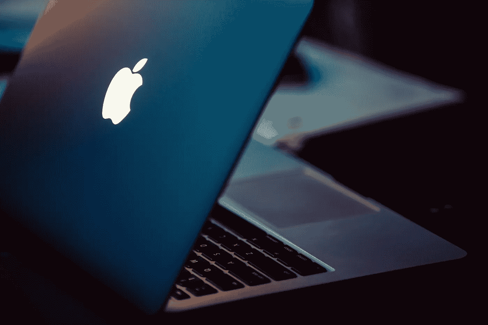

# 为什么我现在开始投资

> 原文：<https://medium.datadriveninvestor.com/why-i-started-investing-during-the-coronavirus-739f69db683f?source=collection_archive---------14----------------------->

## 街头流血，绝对收益

Photo courtesy of Unsplash

我是世界上经济上最依赖的人。我不认为自己是金融专家。我就像你认识的其他好人一样。无论从哪方面来说，我都不富有。事实上，我可以有把握地说，这个短语永远不会被用来形容我。甚至投资股票市场的想法都让我想回去看我最喜欢的网飞秀。直到我决定做出改变。那么，我到底是如何决定开始投资的呢？是什么支持了我的决定？

# 通往财务自由的唯一途径

在我们的社会中，我们经常被教导去上大学，获得学位，找工作。那是非常传统和乏味的。你有没有想过这条路会把你带到哪里？给你什么好处？你还有别的路可以走吗？有没有更好的路可以走？你能用更少的资源做更多的事吗？我们从来都懒得问这些问题，这就是为什么我们大多以同样无聊的结果告终。

 [## 投资区块链前要问的三个简单问题(也是一个困难的问题)|数据…

### 现在是了解区块链的最佳时机。不同货币之间的增长率，比如…

www.datadriveninvestor.com](https://www.datadriveninvestor.com/2020/03/12/three-simple-questions-and-one-difficult-one-to-ask-before-investing-in-a-blockchain/) 

在生活中，我们总是想得太多，要么得到更多的女孩或男孩，要么比我们赚更多的钱，但却不知道如何才能做到这一点。最重要的决定是为某人工作，拿月薪，等几个月或几年，要求加薪，要求升职，WOAH，你发财了。那完全是胡说八道。我们没有被教导获得财务自由的正确方法。这是为什么呢？

根据对亿万富翁的研究，他们都有多种收入来源，其中大部分是投资。无论是股票，出租物业，还是企业。这是普通人变富，富人变得更富的地方。做任何你想做的事的自由，永远不用担心钱。

# 停下 YOLO，为你未来的家庭想想

大多数情况下，我们只考虑如何在当下生存，而很少考虑 20 年后我们将如何生存。当你失业时会发生什么？当你有紧急开支时。或者你如何支付你未来孩子的教育费用？

现在发生的一切都是暂时的。你应该开始制定计划和替代方案来创造新的收入来源。这样你未来的自己就会心存感激。投资可以是阅读书籍、与人交往、健身、冥想、学习新技能和/或投资公司股票。现在努力工作，聪明行事，将来像国王一样生活。

随着冠状病毒事件的发生，我们看到就业机会大幅减少，人们失去了赚钱的手段。许多人破产了，因为他们没有存款或多余的资金。这不仅给我，也给全世界敲响了警钟。下次全球灾难发生时，你应该做好准备。

# 不参与这个游戏才是傻瓜

你大概听过有人说“我不懂金融”或者“我在学校没学过金融”或者更难听的“我钱不够”。

好吧，让我告诉你，这是一个破产的心态。如果你对自己的未来想得足够简单，你会尽一切努力让一切发生。

郑重声明，进入投资领域并不需要金融专家。这是一个很大的误解，也是为什么大多数人破产，并且从来没有真正体验过财务自由的一个很大的原因。

此外，即使你不懂金融，也没有理由学习和实践它，因为互联网让一切触手可及。我很高兴地说，我现在的社交圈里有几个已经开始投资的同行。所以，快点！

# 薪水离破产的生活方式只有一步之遥

正如我在第一段中强调的，有了薪水，就离破产只有一步之遥了。如果你只有一份朝九晚五的工作，你就像是社会的奴隶。一只典型的羊。你只是为了钱而工作。相反，你应该做的是让钱为你工作。想象一下睡觉，但仍然产生金钱。多酷啊。

金钱本身不会给你幸福，但它是你幸福的一种手段。你只是任何一个认为金钱是权力和影响力的人，但这完全没问题。你不能改变不可改变的。除非你朝九晚五的工作与你的激情和目标有关，能给你带来快乐和高薪，否则你应该考虑投资。

# 又一次经济崩溃，经济衰退

由于冠状病毒疫情，世界经济陷入低迷。这意味着，大多数企业价值下降，因为他们失去了客户、投资者、合作伙伴和关键人物。但最重要的是，因为他们的盈利方法已经变得停滞不前。不是每个公司都会经历低迷，但是如果整体经济下滑，所有的东西都会下滑。

经济崩溃意味着街上血流成河，这意味着把钱投入市场几乎没有风险。如果你等待合适的时机，将会有一个确定的投资回报。比方说，你现在决定在 Snap 上投资 5000 美元，每股大约 16 美元，然后等 2 到 3 个月，每股涨到 32 美元。这已经产生了 5000 美元的利润和 200%的投资回报率。这有多简单？

所以，在你读完这个故事后，我希望它能鼓励你采取必要的步骤，开始把你的钱投资到市场上，从而向前迈出一大步。耐心绝对是游戏的基础。崩溃是暂时的，所以在不久的将来，几个月或几年内，经济肯定会恢复正常。这意味着，如果你现在开始投资价值低的公司，等到经济恢复正常，你肯定会从中获利。

事后看来，我的头脑告诉我应该做更多的投资研究，我可以承认我没有。我纯粹的本能反应是开始采取行动。是的，没错。在金融界，采取行动比学习更有价值。即使失败了，你还是会学到东西，这是吸取教训和获得经验的最好方式。如果你是特朗普经济刺激方案的接受者之一，也许你可以用这笔钱开始！这将是你现在能做出的最明智的决定。

当我们屈服于当下，直面它提供给我们的一切，我们就能在当下的简单中找到平静。不管你的平静来自哪里，玩电子游戏，冥想，还是锻炼，这真的完全取决于你，在你的控制之内。*感谢您的阅读！如果你对这个故事的内容有任何意见或反馈，请随时告诉我你的想法，并与我联系。所有的观点都是我自己的，并不反映任何上帝(耶稣基督)的观点。*

# 如果你喜欢这个故事，请随意点击下面的按钮👏帮助其他人找到它。谢谢大家！