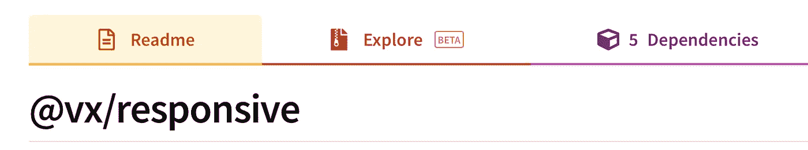
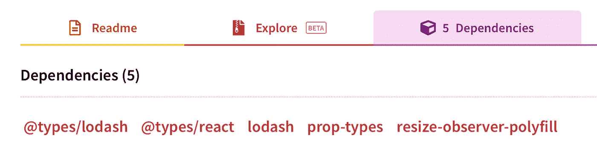

# 为什么我开始研究开源库？

> 原文：<https://medium.datadriveninvestor.com/why-i-started-looking-into-open-source-libraries-6113d57c227c?source=collection_archive---------15----------------------->


挑战自己，看看别人不会的地方🙆‍♂️

这将是一个简短的问题，从我开始开发生涯到现在已经有五年了。我从后端转移到数据库，最终在前端找到了自己的位置。在过去的三年里，我一直在做一名反应开发人员，我觉得我找到了我的人生。

我喜欢学习和探索，但有时我会觉得自己停滞不前，感到空虚，因为我已经停止了成长。以前，我会通过在 Udemy 上一门新课程来填补这一空白，如果需要，我会重新学习我已经知道的东西，以获得新的视角。

关于学习的事情是，当你有东西可以参考的时候，学习会更容易。只是为了好玩，我在浏览 angular.js 库文件。令我惊讶的是，我能够按照代码，我想学习得到了回报。所以现在我觉得我有知识去了解正在发生的事情，我所需要的只是代码。这就是开源世界的由来。

我首先浏览了我们在应用程序中使用的库。作为参考，这就是为什么以及如何我创造了[使用尺寸](https://medium.com/@abhimanyuchauhan_61309/usedimension-react-hook-dcd0ecaf1160)钩。

> **这是为什么？**

我们使用了 [***VX 库***](https://vx-demo.now.sh) 来满足我们的数据可视化需求，为了使可视化响应迅速，我们使用了[*VX/responsive*](https://www.npmjs.com/package/@vx/responsive)*。*这将给我们提供



> **该如何？**

**步骤 1:** 打开**依赖项**选项卡，查看核心实现实际使用了哪些依赖项。



Resize-observer-polyfill is the main

**步骤 2:** 打开 github repos，了解每个依赖项的作用。在上面的例子中，最明显的是我们可以忽略的前四个。所以我们需要检查 ResizeObserver。

[](https://github.com/que-etc/resize-observer-polyfill) [## que-etc/resize-observer-polyfill

### 调整观察器 API 大小的聚合填充。实现基于变异观测器，并使用变异事件作为…

github.com](https://github.com/que-etc/resize-observer-polyfill) 

如果我们看一下使用示例，我们会得到什么是很清楚的:

```
**import** ResizeObserver **from** 'resize-observer-polyfill';const ro **=** **new** ResizeObserver((entries, observer) => {**for** (const entry **of** entries) {
  const {left, top, width, height} **=** entry.contentRect;
  console.log('Element:', entry.target);
  console.log(`Element's size: ${ width }px x ${ height }px`);
  console.log(`Element's paddings: ${ top }px ; ${ left }px`); 
  }
});ro.observe(document.body);
```

**第三步:**看看库(vx/responsive)是怎么用的:

[](https://github.com/hshoff/vx/blob/master/packages/vx-responsive/src/components/ParentSize.tsx) [## hshoff/vx

### 🐯react + d3 = vx |可视化组件。在 GitHub 上创建一个帐户，为 hshoff/vx 开发做贡献。

github.com](https://github.com/hshoff/vx/blob/master/packages/vx-responsive/src/components/ParentSize.tsx) 

第四步:试着把解决方案变成你自己的，试着用你自己的方式去实现它。每次遇到错误时，您已经有了一个工作原型可以参考。

我的实现得到了相同的输出:

# 那么，是什么阻止了你呢？

开始刺探别人的代码。这有助于你获得多种视角，也有助于你作为开发人员的进步。