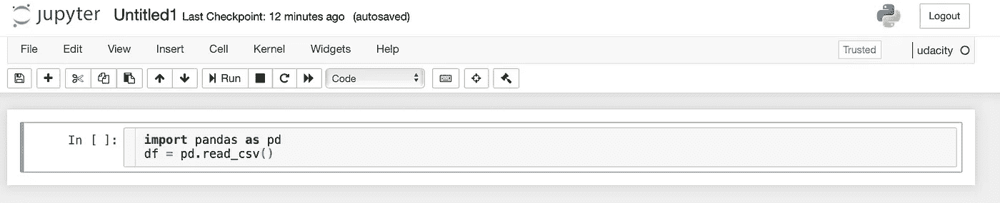

# 为什么我从 Excel 转换到 Python，你也可以？

> 原文：<https://medium.datadriveninvestor.com/why-i-switched-from-excel-to-python-ac77304dcc2c?source=collection_archive---------4----------------------->


Photo by [Myriam Jessier](https://unsplash.com/@mjessier?utm_source=medium&utm_medium=referral) on [Unsplash](https://unsplash.com?utm_source=medium&utm_medium=referral)

在我成年后的大部分时间里，我都在使用 **Excel** 进行从本科作业和项目到产品性能指标评估的各种形式的分析，在 2020 年，我最终决定完成向 **Python** 的切换，以提高我的结果的速度和可重复性。

任何经常使用 Excel 的人都知道处理大文件有多乏味。那些大文件及其伴随的计算会迫使你强制性地休息，因为在那段时间里你的电脑毫无用处。

## 一些背景

我加入了 [gomoney](https://gomoney.medium.com/) 来领导战略和分析职能部门(数据和财务),以指导绩效分析和财务分析，并提供战略来帮助实现我们的增长目标。

这里的目标是确保产品按照商定的基准运行，并足够频繁地测量这些指标，以确保我们灵活运用我们的市场方法。

当时，这包括每天测量以下内容:

*   交易绩效；
*   用户获取性能；
*   谷歌分析信息和指标

在最初的几周，这并不乏味，因为我使用了一台性能不错的计算机，并创建了我认为是“可扩展”的方法。

## 我的“可扩展”方法:

这些是我当时认为可扩展的步骤。😂


I see you judging me!

*   以 CSV 格式下载前一天的交易报告
*   将此信息添加到所有交易的 Excel 表中。
*   应用我的分析所需的所有转换
*   创建一个迷你仪表板来评估转换的所有结果。

## 我的经历

在最初的三(3)周，这是惊人的，我认为我已经征服了报告，我的想法是如何改进报告，以获得更多信息，更好地评估指标，如保留和客户激活(我将在未来的帖子中谈到这些)

在第 3 周结束时，我注意到该报告花费了大约 18 分钟，我只是假设这是因为我在过去的十(10)天没有重新启动我的计算机。减速持续到新的一周，并在接下来的几周变得更糟。然而，正如任何使用 Excel 的人都知道的那样，这往往会发生在包含仪表板的报表中，所以我只是将工作安排到我不必主动使用计算机并接受这是我的“新常态”(在 COVID 破坏该短语的含义之前)。

## …压垮骆驼的稻草

六月份，我们开展了一场营销活动，推动了该解决方案的采用和使用。这一活动提高了下载量、激活量、交易价值和交易量。数量的增加意味着现在的报告平均需要 90 分钟，我的风扇开到最大，笔记本电脑放在我们的空调上。

然后就发生了，报告运行了一会儿，突然我的电脑就自己关机重启了。


Me when the computer restarted after 90 minutes of running a report

那时，我知道我需要一个新的解决方案。多年来，我一直在摆弄 Python。尽管如此，我从来没有完全转换过，由于结果的速度和可靠性，除了偶尔的线性回归之外，我没有使用过它。

当这种情况发生时，我决定加倍努力，设计一个培训计划，复制我在 Python 中使用 Excel 经常做的事情，以便让自己熟悉情况并管理过渡。

# 我是如何转变的？

我决定了解数据分析的最基本的库，并挑选了我要学习的库。

我还想要一个可以实时查看分析的地方，这就是 Jupyter 笔记本派上用场的地方，而纯 Python 的输出需要打印语句，可能有点乏味。

## 一种真正可扩展的方法

*   直接连接到数据库，以获得基于所考虑的时间段的交易所需的所有信息
*   创建一个转换脚本，捕获执行分析所需的所有变更
*   准备一个输出该期间所有考虑因素的函数，然后做出决策或进行进一步的分析(如果需要的话)。


Feeling like a boss

# Python 入门指南(使用 Chipotle 数据集)

虽然我实现了可扩展的方法，但我必须一步一步来，这些步骤如下。

我将使用 Chipotle 数据集来捕捉一些我认为将 Python 视为 Excel 的自然扩展的第一步。

在开始之前，让我提供一些对您的过渡最有用的库的背景。

## 数据分析的主要库

*   这是一个开源库，可用于数据分析、数据操作和数据可视化(虽然，Pandas 中的数据可视化很快，但有点有限，你应该考虑其他库，如 Seaborn 和 Plotly——我个人的最爱)
*   **Numpy** —这是一个科学计算库，可以提高大量计算的速度。执行速度来自于将 Python 转换为针对数值分析而优化的编写良好的 C 代码的实现。Numpy 很快，非常快。
*   **Matplotlib(我不太喜欢它，但它是一个必要的邪恶)** —这是一个非常灵活的可视化库。尽管如此，这种默认方式仍有许多不足之处。我不使用它，但是它提供了一个极好的观想入门。我喜欢的库是 [Plotly](https://plotly.com/python/) (我会写一些关于这个的帖子，因为我喜欢这个库，因为它很灵活)。

```
import pandas as pd
import numpy as np
import matplotlib.pyplot as plt
```

## Jupyter 笔记本:查看和理解您的数据和分析



Jupyter Notebook

Jupyter Notebook 在您需要了解数据、处理数据和查看评估结果时非常有用。它运行在所谓的 REPL(读取→评估→打印→循环)模型中。REPL 意味着 Jupyter 读取你的代码，评估它，打印输出(可选)，然后在下一个单元格中重复这个过程。

安装非常简单，一旦你使用了 [Anaconda 发行版的默认安装](https://docs.anaconda.com/anaconda/install/)，你就可以开始了。

如果您有空间限制，您可以使用 mini-conda [安装](https://docs.conda.io/en/latest/miniconda.html)并只安装您想要的软件包。

如果你没有时间做所有这些，并且想要开始或者使用安装有限的工作计算机，我建议你使用 [Google Colab](https://colab.research.google.com/) 并且马上开始。对于 Google Colab，没有安装，您可以直接进入您的分析。

## 在 Python 中打开我的 CSV 和 Excel 文件

这包括读取通常双击的文件，并将其转换为代码行。好在在 excel 中打开 XLS/XLSX/CSV 文件只需要两行代码。

通过导入`pandas`并使用`read_table`或`read_csv`或`read_excel`选项来读取 CSV 和 EXCEL 文件。

```
import pandas as pd
df = pd.read_table('http://bit.ly/chiporders')
```

## 运筹学

```
import pandas as pd
df = pd.read_csv('chiporders.csv')
```


这里的输出显示了数据集中包含的行数和列数，但是您无法一目了然地看到所有信息，因此建议使用`describe`和`info.`来“理解”您的数据

```
df.info()
```


## 解释输出:

Pandas 中的列只是一种数据类型。因此，数据类型是一致的。

*   `order_id` —这意味着`order_id`列不包含空行(*非空*)，该列中的所有值都是整数；
*   `quantity` —这意味着`quantity`列不包含空行(*非空*)，并且列中的所有值都是整数
*   `item_name` —这意味着`item_name`不包含空行，该列中的所有值都是对象。我会小心使用条目，因为默认情况下许多数据类型都可以表示为对象，所以通常有必要粗略地查看一下列，以便采取必要的步骤
*   `choice_description` —这意味着`choice_description`列包含 3376 个非空行，这意味着这里有 1246 列没有信息。有多种方法可以管理缺失值，但这将在以后进行交流，并且取决于您练习的目标和对数据集的理解。
*   `item_price` —这意味着`item_price`列不包含空行，该列中的所有值都是对象。但是，我们知道价格不应该是对象，而应该是小数(金融专业人士在报告日元 4DP 之外的货币时通常有两位小数)。这里的问题是美元符号。

```
df.describe()
```


describe 函数返回 dataframe(我们导入的表)中数值的评估，并提供数据如何分布的上下文。

*   `Count` —数据帧列中的行数(数据帧中的一列称为一个系列)
*   `Mean` —这是数据帧中被评估的列的平均值
*   `Std` —这是数据帧中带有数值的列的标准偏差。
*   `Min` —这是数据帧中带有数值的列的最小值。
*   `25%` —这是数据帧中具有数值的列的第 25 个百分位的值。
*   `50%` —这是数据帧中具有数值的列的第 50 个百分位的值。这也是中值
*   `75%` —这是数据帧中具有数值的列的第 75 个百分位的值。这也是中值
*   `max` —这是数据帧中带有数值的列的最小值。

## 修复 item_price 列的问题

> 价格是作为一个对象捕获的，我们需要它作为一个数值，这样我们就可以用它进行进一步的分析。

如果我们在 Excel 中遇到这样的问题，我们可以通过单击列来更改数据类型，并将其更改为 accounting，或者我们可以使用 **CTRL+F** 并删除所有的$。


Excel Implementation

这与熊猫有一点不同，但同样有效和可读。

```
df['item_price'] = df['item_price'].str.replace('$', '')
```

这里采取的步骤是将列中每个值的美元符号($)替换为“nothing ”,这意味着 dataframe 现在全部是数字。


正如你所看到的，`item_price`仍然是一个字符串(对象),这不是我们想要的格式，所以我们告诉 Python 将它改为浮点数(float 是一个带小数点的数字),这是通过指示 pandas 将数据类型改为`float`来实现的。


## 结论

如果你要从 Excel 转到 Python，不要苛责自己。你需要为更复杂的事情设定时间表，但第一步是用新工具做简单的事情，然后从那里开始构建。

这种转变提高了我完成任务的速度，并为我负责的[产品](https://gomoney.medium.com/)提供了可扩展且易于重现的分析。我已经进行了几个月的调查，但是因为在基本的 Excel 中没有`for`循环，我最初把这些搁置起来，但是现在我已经完成了所有的调查。

我已经能够衡量更多的[高级业务指标](https://a16z.com/2015/09/23/16-more-metrics/)，如集中度风险，并评估一组平台对收入的影响。我衡量了失去这些交易的影响(在衡量集中风险之后)以及随后对总交易价值的影响。这是在不限制估计潜在影响的工作范围的情况下实现的，但实际上限制了其测量。这在 excel 中是不可能的，只有像 Python 这样的编程语言提供给我的简单快捷的计算才能实现。