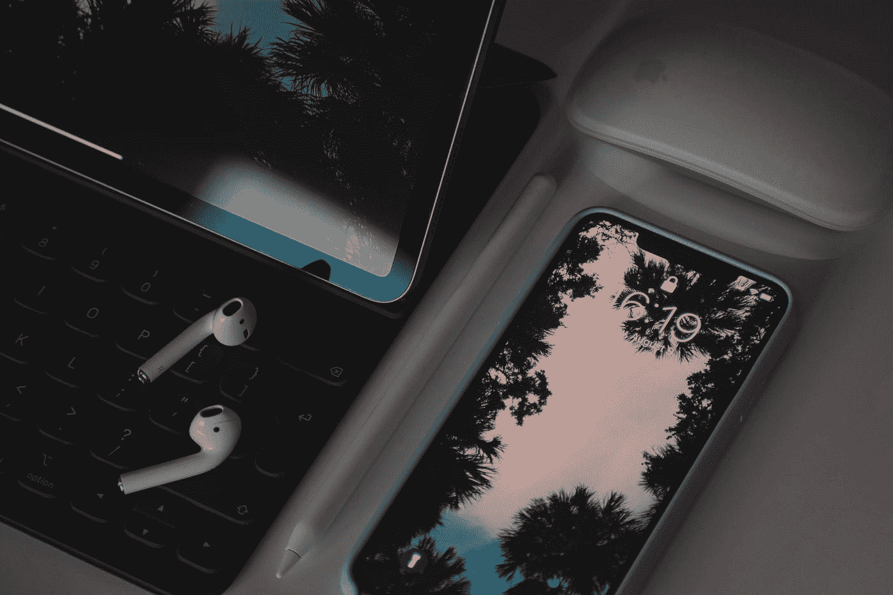
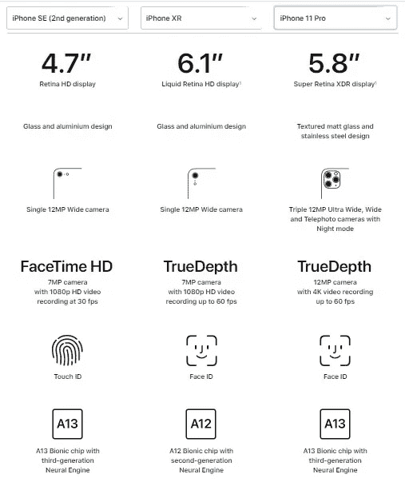

# 为什么我不会再购买旗舰智能手机

> 原文：<https://medium.datadriveninvestor.com/why-i-wont-be-buying-flagship-smartphones-anymore-9e3fdb0170e?source=collection_archive---------5----------------------->

Photo by [Alexandar Todov](https://unsplash.com/@alexandar_todov?utm_source=medium&utm_medium=referral) on [Unsplash](https://unsplash.com?utm_source=medium&utm_medium=referral)

## 这真的是一种需要，还是只是为了满足你想要最好最贵的东西的渴望？

就在几周前，苹果发布了 2020 年的 iPhone SE，它将取代旧的 iPhone SE。现在，这早就应该发生了，因为旧 iPhone SE 自 2016 年 3 月以来一直存在，所以更换是迟早的事。有人传言它将在 2018 年到来，但它没有。然而，今年它终于做到了，我们将看到最新的 iPhone SE 出现在许多人的手中——特别是那些推迟将旧 SE 或 Android 手机升级到最新最棒的苹果手机的人。

第一代 iPhone SE 使用了与 iPhone 5S 相同的机身，但采用了 iPhone 6S 的内部结构。不用说，在它发布的时候，它是一部野兽般的手机，但它的设计受到了很多人的喜爱——小巧紧凑。

就我个人而言，我会得到那个，但我当时已经在使用 iPhone 6S，我看不到改变的理由。我以为我会等到下一代 se 取代我的 6S，但这并没有发生，因为在 2018 年我终于换了手机，SE 的替代品一直没有到来。相反，随着苹果更加关注更大的屏幕，它已经停产了。他们说没人想要 4 英寸的屏幕了，我想他们是对的。人们希望手机屏幕更大，我猜这就是 6.1 英寸 iPhone XR 在 2018 年推出时大受欢迎的原因。这也是我现在用的手机。

 [## 苹果会成为新的网飞吗？数据驱动的投资者

### 有可能。然而，该公司肯定会与大公司竞争。许多人不得不看到这一天的到来…

www.datadriveninvestor.com](https://www.datadriveninvestor.com/2019/02/15/will-apple-be-the-new-netflix/) 

但如果我说我不想念我的 iPhone 6S，那是在撒谎，它有实体 home 键(触控 id)和 4.7 英寸的屏幕。我怀念手掌上的小手机的大小，怀念用一只手打字而不用伸出大拇指去够屏幕另一边的键盘的感觉。我一直想回到一个更小的屏幕，但我不希望我的眼镜降级。

现在，第二代 SE 已经上市，我可能已经找到了我一直在寻找的答案。

10 月份，我的 XR 将满 2 岁，这通常也是我换手机的时候。我曾经是那种一年换一次手机的人，但最近，我发现这样做只是浪费钱。现在，我会一直留着我的手机，直到它开始变慢，或者它坏掉了，而且修理它的成本太高。我打算把我的 XR 保留至少 3-4 年，因为苹果公司更好，他们的手机现在使用时间更长。我的 XR 很容易坚持更长时间。

但有了 SE，我觉得我可能已经找到了一款至少在未来 4 年内都会满意使用的手机。这将意味着跳过 12 年、13 年、14 年和可能的 15 年。

不像很多人，我真的不需要最好最贵的手机。我的意思是，老实说，我看不出有必要花 1000 美元买一部几乎和 399 美元一模一样的手机。除非你有大把的钱可以花，把手机当成专业摄影师，或者只是想炫耀你最新最棒的小玩意，否则真的没有这个必要。

新款 SE 拥有苹果 A13 芯片(你可以在 iPhone 11 Pro 手机中找到)，但在 iPhone 8 的机身中——4.7 英寸的屏幕。是的，你不会得到 11 的所有相同规格，你也不能指望它们之间有 600 美元的价格差异，但对我来说，SE 与我现在使用的 XR 相当，甚至略好。

Screenshot by author

除了 XR 的“全面”屏幕和大约 1.5 小时的更好的电池寿命，几乎所有其他东西在性能方面都与 se 相同。两者都有相同的后置摄像头，防水防尘等。

老实说，我很少在手机上拍摄 4K 的视频，也很少直接在手机上编辑。如果我确实需要，SE 也完全有能力这么做。大多数时候，我在锻炼的时候用手机发短信、打电话、听音乐(是的，我知道我应该买最新款的 Apple Watch 来做这件事)，只是到处玩随机游戏——所有这些都可以在 se 上轻松完成。

我不需要也可能永远不会需要旗舰 iPhone。如果我真的得到它，那将是因为我有太多的钱可以花，而且我不知道还能用它做什么。

否则，一部能做我通常会做的所有事情的基本手机已经足够好了。有些人甚至问，为什么不买一部便宜的安卓手机，价格只有 SE 的四分之一。我试过安卓手机，就是不喜欢。我现在已经在 iOS 上呆了很长时间(甚至使用 iPad 和 MacBook Air)，我对苹果的生态系统非常适应。

这就是为什么入门级的 iPhone 对我来说很合适。如果我要花 1000 美元买一台设备，那很可能是另一台 MacBook Air 或 11 英寸的 iPad Pro。更合理的做法是，把这笔钱花在功能比手机多得多的设备上——很可能拥有目前手机上最好的摄像头。

看到我不是一个真正需要在我的手机上安装这么棒的摄像头的人，我真的不能再买旗舰 iPhone 了，除非他们制造一个全屏的，像 iPhone 5S 一样小的机身。如果他们这样做，我可能会考虑。

但在那一天到来之前(从苹果最近的表现来看，这可能永远不会发生)，这位苹果粉丝可能很快就会用 SE 取代他的 XR。