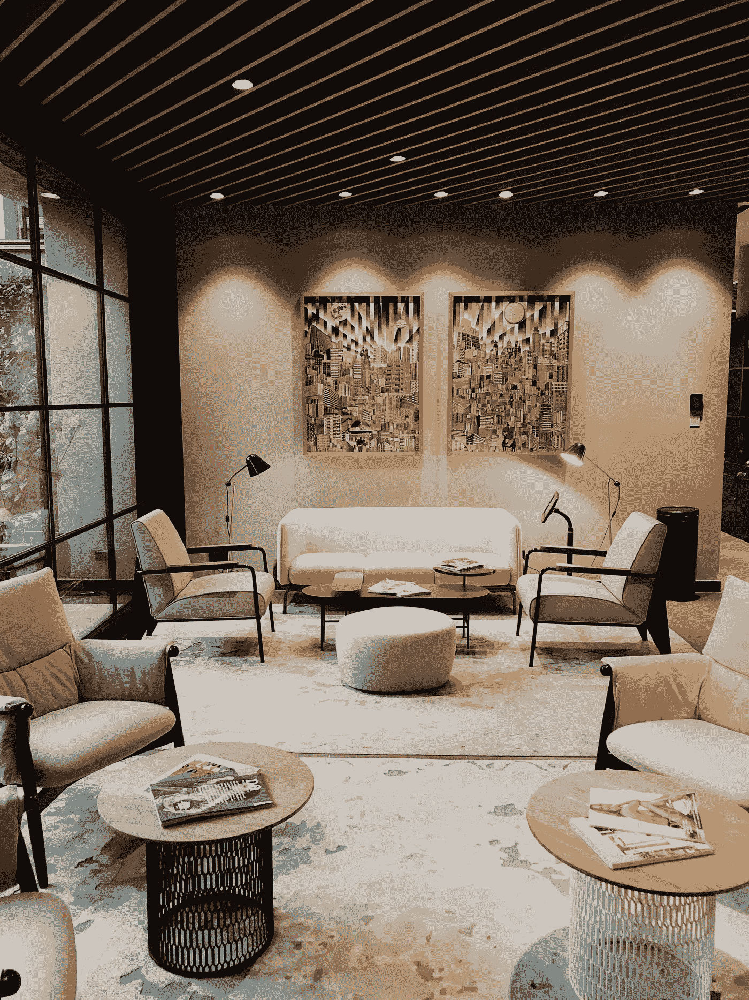
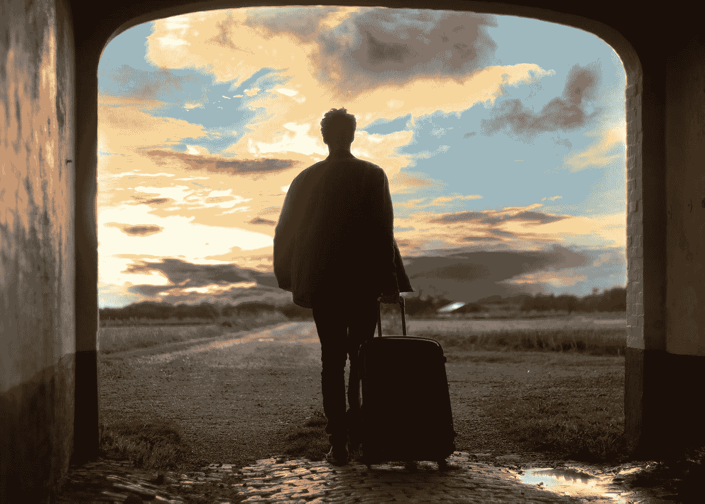

# 为什么我不使用 AirBnB，第二部分

> 原文：<https://medium.datadriveninvestor.com/why-i-wont-use-airbnb-part-ii-5aceb52f18ec?source=collection_archive---------4----------------------->

Photo by [Mateo Fernández](https://unsplash.com/@_mateoofdez_?utm_source=medium&utm_medium=referral) on [Unsplash](https://unsplash.com?utm_source=medium&utm_medium=referral)

## 或者，友好地，我告诉过你。

AirBnB 是一团乱麻。

听着，恕我直言，很多非常好的人家里都有 AirBnB 服务，还有那些使用 AirBnB 服务的人，当我去年写我的原创故事，讲述 Alli Conti 揭露 AirBnB 的内部问题时，我尽了最大努力给像我一样旅行的人(有时是大量旅行的人)一个公平的警告，以及度假租赁的狂野西部的固有问题。

 [## 为什么我不会使用 AirBnB

### 以下是你可能需要重新考虑这个选择的一些原因

medium.com](https://medium.com/writerontherun/why-i-wont-use-airbnb-25aefe8316b2) 

本着跟进的精神，我在此再次呈现[副主编邀请读者来信时发现的](https://www.vice.com/en_us/article/epgvm7/airbnb-scam-how-to-tell)。再次，恕我直言，有很多好人，这是一个腐败的行业，滥用者和人们利用这个平台达到他们自己的邪恶目的。

*对于那个可笑又愚蠢的小个子男人，他认为自己是非凡的“调查记者”,并有效地指责我被酒店行业收买，善意地说，你这个白痴，去你的。这不仅是一篇极其荒谬的论文，任何一个傻瓜都可以做一些真正的研究，发现我不仅鄙视大型连锁酒店，我也不为它们工作。我已经说得够多了。我当然有。我走了很多路去上厕所。令人惊讶的是，早在 1972 年，我在现已停业的佛罗里达布埃纳维斯塔湖荷兰皇家旅馆工作，就在迪斯尼世界外面。我非常喜欢帐篷，住在当地的小旅馆和家庭经营的服装。一直如此，永远如此。*

 [## 面向 Noobs |数据驱动型投资者的数字身份

### 聪明人如何在增强现实中创造身份价值？我最近刚满 40 岁。作为一个生物…

www.datadriveninvestor.com](https://www.datadriveninvestor.com/2019/02/28/digital-identity-for-noobs/) 

我只想说，从那以后，无论是荷兰酒店还是皇家酒店都没有私下付钱给我来破坏 B and B 的行业。至于在我当时的链接个人资料中找到一个组织的列表，我不仅不知道那个现在已被删除的东方酒店组织是如何出现在那里的，即使我在街上遇到他们，我也不认识那些人。所以，请成熟一点，在你指责某人是企业骗子之前，做一些真正的研究。在这个基本上不受控制、不受监管、管理不善和被滥用的行业中，存在着严重的问题。是所有人吗？当然不是。但是你和我需要有所准备就足够了。

*USAToday* 也报道说(他们比这位残疾的资深旅游作家更有可能拥有酒店客户):

 [## 如何识别和保护自己免受 Airbnb、房屋租赁诈骗

### 租房者对骗局并不陌生。Vice 上周报道了主持人如何假冒身份欺骗消费者…

www.usatoday.com](https://www.usatoday.com/story/travel/hotels/2019/11/11/airbnb-scams-how-protect-yourself-vacation-rental-issues/2519594001/) 

我在这里的目的是确保如果你旅行，我经常旅行，你需要了解这里的地形。有些人根本没有问题。但许多人确实如此。AirBnB 一直非常宽松，令人尴尬，导致许多人损失金钱，呆在可怕的地方，他们的性活动在未经他们同意的情况下被监视，以及许多其他可怕的事情，因为这个行业管理不善。这是我所关心的。忽视这些确实是愚蠢的。人们太天真了，以至于他们没有意识到隐藏的摄像头无处不在，人们可以而且确实在世界各地随时进行诈骗，因为直到最近，AirBnB 都很乐意寻找另一种方式，不仅迫使租房者，也迫使旅行者在没有任何钢牙标准强制执行的情况下一决雌雄。

虽然你们中的一些人对联邦调查局介入的评论嗤之以鼻，但我可能会指出，无论你是否喜欢或尊重这个机构，它都是迫使切斯基出手的一部分。

# 摘自 Vice 的后续文章:

这是最常见的诈骗清单，这些诈骗是针对那些轻信的、毫无戒心的租房者的，正如 *Vice* 所发现的那样(我自己的媒体故事帖子中的许多评论也证实了这一点)

1.  **明显的管道骗局**
2.  **让客人同意搬家**
3.  **同时向多人预订 AirBnB**
4.  **假损害赔偿**
5.  **差评被隐藏或完全删除(还好，我在 Trip Advisor 上也遇到过这种情况，那里充斥着虚假评论和骗子)**
6.  **耗尽时间**
7.  **报复**

平心而论，我明白这是双向的，这篇文章详细描述了被虐待的主人遇到的问题，从不负责任和虐待的游客，他们可以破坏他们的地方，或者像被宠坏的孩子一样，或者在不允许的时候吸烟。

两人都生活在差评的极度恐惧中，就像《南方公园》中关于自视甚高的 Yelp 滥用者的爆笑剧集《T21》一样，他们利用这种恐惧来操纵对方。

总之，人们行为不负责任，这是硬币的另一面。在我的国际旅行中，我见过很多这样的事情，我站在那些相信我们在别人家里表现得像个大人的人一边。

如果你是 AirBnB 的用户或租户，我强烈建议你阅读这篇文章。你可以随意攻击我，但我会把我发现的与我们这些上路的人相关的材料传递给你们。我再说一遍:*买者自负。*

这句话引自切斯基，他幼稚而顽固的傲慢让我想起了马克·扎克伯格，为我总结了这一点。作为《财富》100 强公司的长期顾问，我认为这份令人惊叹的声明真实地强调了他的公司在租赁争论的双方对客户缺乏责任感，他说:

“我们必须对我们平台上的东西承担更多责任。”

# 没有他妈的狗屎，夏洛克。你觉得呢？？？？

脑海中浮现的画面是一群贪婪的白痴，他们坐在摇钱树上，享受着金钱，但不想用真正的日常劳动来保护自己的租金，尤其是租房的公众免受虐待，这种虐待现在已经变得比大多数人意识到的要普遍得多。

如果人们能够逃脱金融谋杀，他们就不会自我监管。显然，在太多的情况下，情况已经如此。因为虽然你和我都愿意相信我们可以把我们的零钱放在那些小“牛奶房”里，像过去在新西兰那样给挨家挨户送牛奶的人，但现在会有很多人经营一帮孩子，他们偷走所有的零钱，因为你和我都傻到相信没有人会做这样的事情。那种古怪的当地信任已经被广泛的[门廊盗窃、](https://en.wikipedia.org/wiki/Package_theft) U 型拖车被清空，而父母和孩子们在当地的汽车旅馆睡觉所取代，还有这个:

 [## 小偷使用蓝牙扫描仪在徒步旅行路线上瞄准车辆

### “有一些人，汽车窃贼，实际上发现了信号，并以你的车为目标。”-圣何塞警察…

unofficialnetworks.com](https://unofficialnetworks.com/2019/12/12/theives-using-bluetooth-scanners-to-target-vehicles-at-hiking-trailheads/) 

仅仅因为你有好的经历，这很可爱，并不意味着这个网站上的七百万个列表中，所有的都是好的。事实上，这仍然是一个非常年轻、基本上不受监管的行业，AirBnB 到目前为止几乎完全不受监管，这意味着双方的骗子和滥用者都有一个全盛时期。因为如果有一千或更多的人写信给 *Vice，*那就意味着还有成千上万的人没有，已经放弃了，太疯狂了，懒得去理会，不读或没看到 *Vice* 的文章。这是理所当然的。

接下来是另一位媒体作家杰克逊·坎宁安的话:

 [## 数字流放:我是如何被 AirBnB 终身禁飞的

### 几个月前，我收到了一条来自 AirBnB 的神秘信息，听起来像是直接从那面黑镜里出来的东西…

medium.com](https://medium.com/@jacksoncunningham/digital-exile-how-i-got-banned-for-life-from-airbnb-615434c6eeba) 

坎宁安是对的。**当场操蛋。**

我袖手旁观了我的原创文章，并且我呈现了 *Vice* 的后续报道作为证据，证明这是一个陷入困境并且急需自我监管的行业。这是一个伟大的想法在开始时，现在它是在严重的污水。同样，如果你有你信任的 AirBnB 人，或者你的产品不符合这些特征，*这些文章不是关于你的*。解雇我一个愤怒的讨厌的克告诉我或那些研究人员是错误的，基于你非常有限的经验，这是非常短视的。全球有*七百万*网站。就像我很久以前对 AirBnB 客服人员说的那样，*你是低处悬挂的果实*。我完全超出了我的想象。问题是真实的，问题是普遍的。你没经历过并不代表它们是假的。

切斯基表示，他的公司将努力解决问题。然而他在马群逃跑后关上了马厩的门。从*副*条:

*验证过程听起来像是一个诚实的尝试，尽管有点晚，试图支撑一个有点摇摇欲坠的平台，并试图让它对客人和主人都更坚固。但我们收到的电子邮件表明，在许多情况下，损害已经造成:旅行毁了，钱丢了，被银鱼吃掉的衬衫已经被丢弃。回忆，就像太多明信片上的陈词滥调一样，会永远存在。*

信任是美好的，在这种情况下，它被高估了。**我还是不会用 AirBnB** 。对于所有的业余记者(请注意，我是一个获奖的记者，所以请不要说我有偏见和行业骗子来侮辱我的智慧)，做好自己的功课。我可以不太关心这个行业，除了两件简单但非常重要的事情:作为一名旅行者，我希望看到其他人安全快乐地旅行。作为一个偶尔面临收入挑战的老年人，我相信如果你有一间卧室要出租，而且你打算好好租，那就租吧。我是粉丝。但是不要盲目地、笨拙地去做，好像每个人都是诚实的、可爱的、善良的、负责任的。因为太多的人正等着扑向你的意愿，相信这个世界充满了迪士尼人物。

# 当然可以。披着羊皮的狼。

你和我都不能带着眼罩旅行，我们也不能向施虐者敞开家门。做阅读。保护好自己。了解风险。文件，文件，文件。当你发现以上任何一个骗局时，立即联系 AirBnB。当涉及到管理、保护和执行 AirBnB 创建的西部荒野时，我们会发现 Chesky 到底有多认真。

求你了。*别天真了*。天真的成本。我这篇文章的重点是，无论是作为房主还是旅行者，都不要被骗。我非常希望我们所有人上路，带着故事回家。但不是那种*恶习*的，这包括我们不仅被剥夺了现金，还被剥夺了我们珍藏的精彩假期故事。

最后，这是从[远方](https://www.afar.com/magazine/airbnb-scams-how-to-avoid-them-and-find-legit-rentals)发来的，以防你被骗子暗算:

# 了解你的权利

万一你最终在度假租赁网站上被骗，以下是你应该知道的。

*通过*[*Vrbo*](https://help.vrbo.com/articles/What-is-the-Book-with-Confidence-Guarantee)*和*[*home away*](https://help.homeaway.com/articles/What-is-the-Book-with-Confidence-Guarantee)*付款的旅客受其书的保护，有信心保证。如果你通过这些网站预订，你会收到:*

*   *针对房源欺诈、网络钓鱼、房产被严重歪曲等情况，为全额租金提供全面的支付保护*
*   *全天候提供客户服务，解答与住宿相关的任何问题*
*   *如果业主或经理在最后一分钟错误地取消预订，重新预订帮助找到另一个度假租赁服务*
*   *保证金保护有助于收回被错误扣留的保证金*

到目前为止，Airbnb 还没有为客人提供任何形式的保证。但从 2019 年 12 月 15 日开始，Airbnb 将实施新的客人保障，让客人安心。 [*新政策规定*](https://news.airbnb.com/in-the-business-of-trust/) *“如果登记的房源不符合我们的准确性标准，Airbnb 将为客人重新预订同等或更高价值的房源，否则他们将获得 100%的退款。”随着 Airbnb 推出这一新政策，将会添加更多信息。*

**旅行。无论如何，请做。但是要聪明旅行，注意旅行，保护好自己。**

Photo by [Mantas Hesthaven](https://unsplash.com/@mantashesthaven?utm_source=medium&utm_medium=referral) on [Unsplash](https://unsplash.com?utm_source=medium&utm_medium=referral)