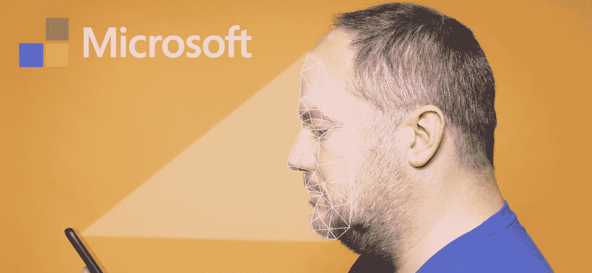

# 为什么 IBM 决定停止所有面部识别的开发

> 原文：<https://medium.datadriveninvestor.com/why-ibm-decided-to-halt-all-facial-recognition-development-6858f463a822?source=collection_archive---------3----------------------->

## IBM 不赞成任何可能导致种族歧视的技术。

在 6 月 8 日发送给国会的一封信中，IBM 的首席执行官 Arvind Krishna 就公司的面部识别政策发表了一份大胆的声明。“IBM 不再提供通用的 IBM 面部识别或分析软件，”Krishna 说。

“IBM 坚决反对也不会宽恕将任何技术(包括其他供应商提供的面部识别技术)用于大规模监控、种族貌相、侵犯基本人权和自由或任何与我们的价值观以及信任和透明原则不一致的目的。”该公司已经停止了所有面部识别的开发，并不赞成任何可能导致种族貌相的技术。

# 人脸识别的问题是

多年来，[人脸识别技术](https://lionbridge.ai/articles/what-is-facial-recognition/)的伦理问题一直备受质疑。然而，在禁止这项技术的官方法律的制定方面几乎没有任何进展。事实上，如今许多执法机构都在积极使用人脸识别技术。例如，[国际刑警组织网站](https://www.interpol.int/en/How-we-work/Forensics/Facial-Recognition)有一整块区域详细介绍了他们如何通过来自 160 个国家的全球图像数据库使用面部识别来抓捕逃犯。

 [## 在 R | Data 中使用 gganimate 和 tmap 制作的带有图表和地图的有趣的新冠肺炎病例动画…

### 新冠肺炎吸引了许多人的注意力，让他们去创建用于数据分析和可视化的图表和图形。在…

www.datadriveninvestor.com](https://www.datadriveninvestor.com/2020/07/22/interesting-animation-of-covid-19-cases-with-charts-and-map-using-gganimate-and-tmap-in-r/) 

然而，根据 IBM 的说法，这项技术可能还没有准备好用于执法。“我们认为现在是时候开始一场全国性的对话，讨论国内执法机构是否应该以及如何使用面部识别技术，”Krishna 说。“人工智能是一种强大的工具，可以帮助执法部门保护公民的安全。但人工智能系统的供应商和用户有共同的责任来确保人工智能在执法中使用时进行偏差测试，并确保这种偏差测试得到审计和报告。”

# 现代人脸识别算法中的偏差

2019 年 12 月，美国国家标准与技术研究所(NIST)发表了一项研究，该研究发现众多当代人脸识别算法的准确性存在很大的[差异](https://lionbridge.ai/articles/is-modern-facial-recognition-biased/)。

## 假阳性

假阳性是当系统说一张脸与数据库中的一个条目相匹配，而事实上他们不是同一个人。最突出的问题是非洲和亚洲后裔的假阳性率要高得多。相反，东欧人的比例最低。该研究发现，“这种影响通常很大，国与国之间的假阳性要高出 100 倍。”

此外，他们发现女性、老年人和儿童的假阳性率更高。

## 假阴性

假阴性是当系统说一张脸与数据库中的任何条目都不匹配时，而事实上它在数据库中。这在机场或边境口岸尤其危险。如果该系统对照犯罪数据库检查个人面孔，它可能会允许危险的个人通过安全检查。

NIST 的研究发现，亚洲人和美洲印第安人的假阴性最高，而高加索人和非洲裔美国人的假阴性最低。

# IBM 对人脸识别技术的抵制会对行业产生怎样的影响？

长期以来，IBM 一直处于机器学习发展的前沿。他们的自然语言处理系统 IBM Watson 被认为是世界上最好的问答系统之一。除了自然语言处理，IBM 在计算机视觉方面也做了令人印象深刻的工作，推出了[沃森视觉识别](https://www.ibm.com/cloud/watson-visual-recognition)。他们的进步在人工智能社区赢得了很多尊重，因此他们的声音很有分量。

# IBM 的立场对面部识别的积极影响

当这样一家大公司在面部识别上采取强硬立场时，势必会掀起波澜。事实上，IBM 的决定似乎已经在业界引起了多米诺骨牌效应。继 IBM 的声明之后，[微软也发布了他们自己的声明](https://www.businessinsider.com/microsoft-brad-smith-facial-recognition-police-departments-2020-6)，称他们将停止向美国警察部门出售面部识别技术。

另一方面，其他公司可能会利用 IBM 暂停面部识别开发的机会。现在市场上有更多的空间让其他公司和创业公司进入。最坏的情况是什么都不改变。公司可能会继续开发面部识别算法，卖给执法机构，而不用担心后果。

理想情况下，其他开发人员将开始投入更多的时间和金钱，以确保他们的算法没有偏见。希望更多的公司在发布新兴技术之前，能够退一步研究它们的影响。

IBM 的首席执行官认为，现代面部识别算法中存在的偏见保证了它们的使用完全停止。他们呼吁政府和供应商确保他们的算法在应用于社会的重要领域(如执法部门)之前没有偏见。

许多人工智能技术的发展速度超过了政府的监管能力。希望 IBM 的立场为其他大型科技公司和初创公司在发展之前考虑道德问题铺平了道路。

有关面部识别的更多文章，请查看:

*   [什么是面部识别？—应用及其工作原理](https://lionbridge.ai/articles/what-is-facial-recognition/)
*   [现代面部识别有偏见吗？](https://lionbridge.ai/articles/is-modern-facial-recognition-biased/)

请务必在[媒体](https://medium.com/@LimarcA)和[推特上关注我。](https://twitter.com/AmbalinaLimarc)

[**原创文章**](https://lionbridge.ai/articles/why-ibm-decided-to-halt-all-facial-recognition-development/) 经许可转贴。

**访问专家视图—** [**订阅 DDI 英特尔**](https://datadriveninvestor.com/ddi-intel)