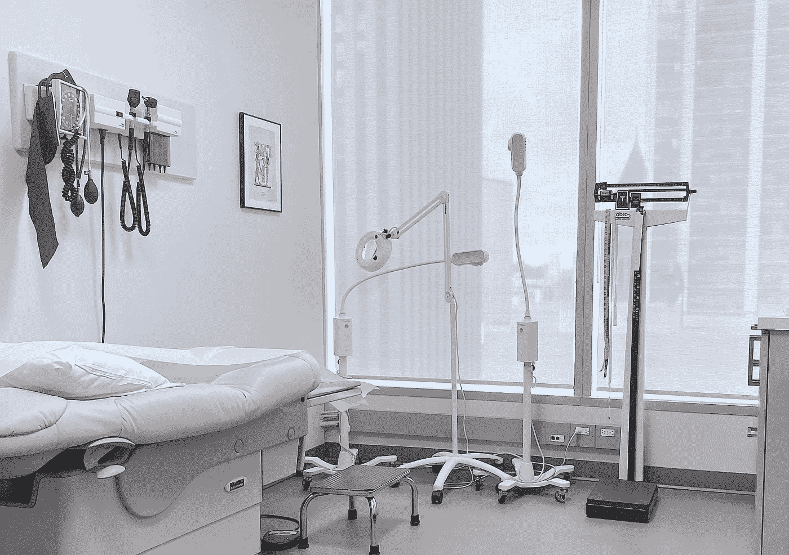

# 为什么我会选择人工智能医生而不是人类医生

> 原文：<https://medium.datadriveninvestor.com/why-ill-choose-an-ai-doctor-over-a-human-physician-c1c6dc708a88?source=collection_archive---------2----------------------->

Hopsital consultation room

人工智能(AI)给医疗保健带来了范式转变。由于医疗保健数据的可用性不断增加，以及分析技术的快速发展。无论是用于为冠状病毒、[提供](https://www.pathai.com/)[早期预警、诊断乳腺癌](https://qz.com/1791222/how-artificial-intelligence-provided-early-warning-of-wuhan-virus/)、执行[机器人手术](https://www.vicarioussurgical.com/)还是在神经科学领域[重新创新药物](https://www.bioxceltherapeutics.com/)，医疗保健生态系统正在经历一场人工智能革命。随着人工智能在检测、诊断、预测甚至预后评估方面比人类做得更好，健康保险公司可能很快会为他们的客户提供由人类医生或人工智能治疗的选择。

 [## 大笔资金和尖端技术:人工智能/人工智能投资将如何革新医疗保健…

### 在过去几年人工智能(AI)和机器学习(ML)的显著发展中…

www.datadriveninvestor.com](https://www.datadriveninvestor.com/2018/03/22/big-money-and-cutting-edge-technology-how-investment-in-ai-ml-will-revolutionize-the-healthcare-industry/) 

如果让我在人工智能医生和人类医生之间做出选择(不能两者都选)，我会选择人工智能。这并不意味着人类医生的工作量会减少。由于满足当前全球需求所需的医务人员不足，人类医生和人工智能都应该有工作可做。虽然由于技术进步，人类劳动的相关性总体上有可能下降，但据说医生是不会因自动化而减少的[“安全”职业之一](http://www3.weforum.org/docs/WEF_Future_of_Jobs.pdf)。人工智能医生将有助于减少人类医生备受争议的工作量，让他们从日常工作中解脱出来。由于汽车没有使马变得无用，或者数字音乐没有限制人类的艺术，人类医生的价值将仍然是人工智能技术无法企及的。因此，我不会因为选择一个人工智能而不选择我的人类同胞而感到难过。其实是情有可原的。

健康是人生的一个重要方面。对我来说，我倾向于考虑在哪里(和从谁那里)可以获得最快和最可靠的医疗服务。由于人工智能可以从以前的情况中学习，以提供输入并自动化复杂的未来决策过程，因此它可以更容易、更快地根据数据和过去的经验(以及家族历史)得出具体的结论。这对于一个人可能遇到医疗紧急情况(如事故或心脏病发作)时非常重要。如果在三秒钟内[沃森压缩了一个普通医生通常需要几周](https://qeprize.org/createthefuture/meet-dr-watson-ibms-answer-healthcare-tomorrow)才能完成的过程，这种节省时间的能力可以帮助早期诊断和治疗干预，以挽救更多生命(包括消除与这种延迟和治疗后并发症相关的成本)。一名人工智能医生可能能够同时“挖掘”成千上万名人类医生的大脑。

医疗人工智能可以通过(并优先考虑)今天可用的前所未有的医疗数据量，结合自然语言处理和社会意识算法的进步，以专家级的准确性执行。人工智能医生甚至可以更好地定制我的治疗选择，根据我的具体健康需求确定最佳治疗方案，并制定个性化的护理方法。机器学习(ML)可以比人类更快地确定我是否有患某些疾病的风险，并且早在它变得危急之前。我相信人工智能医生一定会比人类提供更好更快的健康服务。当谈到他们的性健康时，有了人工智能医生，患者可能不必处理他们在人类面前可能感受到的羞愧和判断。他们可能也不需要处理一些人类医生表现出的“非理性繁荣”或刻板印象。

然而，我知道人工智能系统将受到几个因素的限制，如隐含偏差、故障概率、隐私泄露和缺乏创造性的“常识”(输入信号的轻微变化可能会破坏 ML 模型，这可能是因为人工智能面临的挑战之一是无法解决“常识”问题或复制情境意识。人工智能医生基于情境背景采取适当行动并在不必通过庞大的数据池进行训练的情况下做出决定的能力可能还不太可能)。但是人类医生也有类似的局限性。人类医生有他们的偏见，容易犯错误。更有甚者，他们容易疲劳、健康不佳和恐惧。有了人工智能医生，我们或许可以见证医疗机构的重组。例如，病人应该能够在更短的等待时间内，也许在任何地方看医生。人工智能将不会限制人们的空间和时间，因为他们可以在家里“登录”(可能也不需要处理医院的气味)。

我对人工智能医生的一个明显的担忧是问责制。如果我得到了不明智的建议或疏忽的对待，将很难决定谁来承担责任。我会起诉人工智能制造商、医院或我的保险公司吗？法律会对人工智能医生的使用赋予严格责任、替代责任还是产品责任？即使我不明白人工智能医生如何做出决定或指示，我也必须签署免责声明吗？(ML 算法做出决策的方式对我们来说往往仍然不透明，这就提出了将责任委托给它们的可接受性问题)。在医学中，正当性和信任是紧密联系在一起的，因此这种差距不仅会给确定责任带来问题，还会给法律中的因果关系和补救措施带来问题。基于我的选择，我也可能使自己受到歧视(在使用人类医生和使用人工智能的人之间，健康结果的不平等可能会增加)。这也可能给人类医生带来不必要的压力，因为患者将开始比较(和评价)人工服务与人工智能系统的服务。这可能会促进竞争，或引发紧张局势(就像现存零工经济中的[司机抗议](https://www.cnbc.com/2019/09/17/uber-drivers-are-protesting-again-heres-what-the-job-is-really-like.html)，或[国会关于劳工权利的辩论](https://www.lexblog.com/2019/10/29/congress-debates-what-future-of-work-could-mean-for-gig-economy))。与人类医生不同，我的人工智能医生容易受到黑客攻击，其结果可能是致命的。

另一个担忧是，人工智能可能无法像人类医生那样提供人与人之间的联系。护理不仅仅是由谁更好地拯救生命或减轻痛苦来定义的。交付也很重要。将技术能力与关怀、同情和安慰联系起来是好医学的核心任务。因此，爱、同理心和人类善良的价值观对于医疗保健服务来说是无价的。然而，这些值不仅仅是从医生那里获得的。世界上大多数护理工作不是由医生或护士管理的，而是由家庭和社区管理的(其中大部分是无报酬和无保险的)。

当我们在第四次工业革命中导航我们的生活时，我们的健康将不会由我们在人类医生或人工智能之间的选择有多明智来保证，而是由我们获得高质量的综合社会医学来保证——包括精神、身体和情感健康条款。为了保护它们，我们既需要技术服务，也需要人力服务。人工智能医学的非凡承诺不应该仅仅是选择；但是要覆盖世界上一半的人口(他们缺乏健康保障)，至少要有一个人:无论是人类还是人工智能。