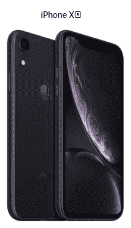
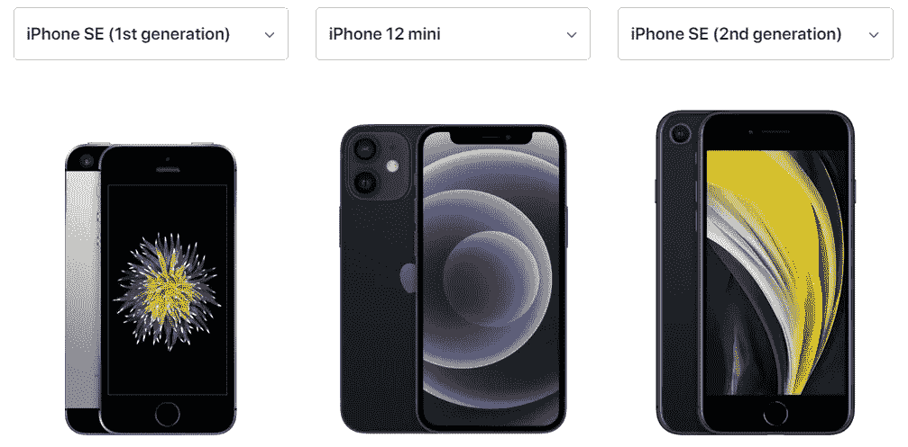
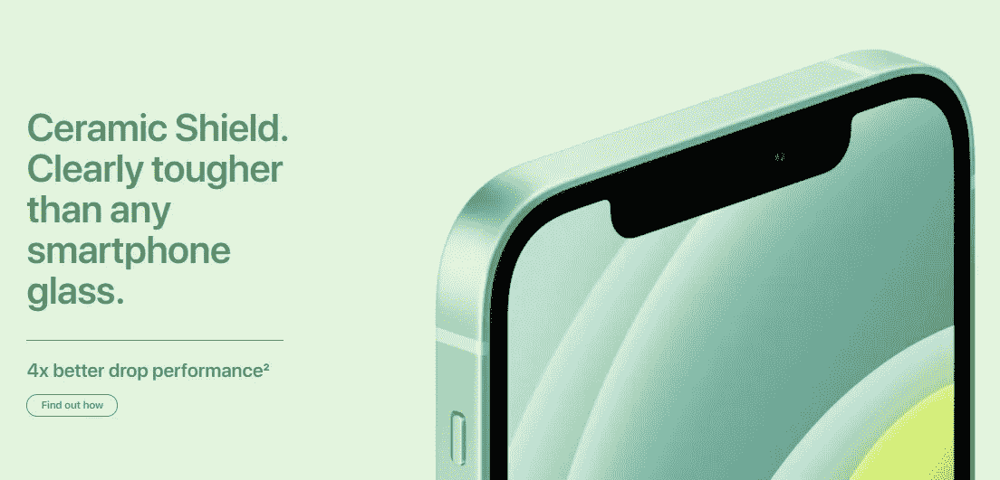

# 为什么我今年可能会跳过 iPhone 12

> 原文：<https://medium.datadriveninvestor.com/why-ill-probably-skip-the-iphone-12-this-year-e1298aa0529?source=collection_archive---------7----------------------->

## 但是为什么你应该得到它

image by [Apple](https://www.apple.com/my/iphone-12/)

当有传言称苹果将在今年的 iPhone 系列中推出一款新的 5.4 英寸机型时，我非常兴奋。最后，一个全屏的 iPhone 小到可以放在你的手掌里，而且不需要你伸出拇指用一只手在上面打字。

自从他们推出 iPhone 5s 以来，我对随后的发布没有那么感兴趣或兴奋。这主要是因为尺寸越来越大。

image by [Apple](https://www.apple.com/my/)

现在，我正在使用的手机是我在 2018 年 10 月取回的 iPhone XR。实际上，大约 17 天后，也就是我拿到手机的整整 2 周。

你可能知道，这款手机的屏幕尺寸为 6.1 英寸，比从 iPhone 6 Plus 开始推出的 Plus 机型略小。

你可能会问为什么我没有得到旗舰机型(XS，11 Pro)，因为尺寸较小，为 5.8 英寸，仅比当前的 iPhone SE 尺寸略大。不是每个人都买得起旗舰机型，也不是每个人都想买，即使他们买得起。告诉你，旗舰机型的价格是我国月最低工资的 4 倍。此外，即使是 SE 尺寸对我来说也有点大。

此外，XR 当时对我来说很有意义，因为它采用了全屏设计(当时没有新的 se，只有 iPhone 8)和更好的整体规格。所以，尽管不是很喜欢这个尺寸，但这是我想要的，也是我过去两年一直在用的。

但是现在 iPhone 12 Mini 已经公布了，我的兴趣和兴奋绝对被激起来了！

image by [Apple](https://www.apple.com/my/)

正如你在上面的图片中看到的，新 Mini 的尺寸介于第一代 SE(或 iPhone 5/5s)和当前一代 SE(或 iPhone 6/6s/7/8)之间，对我来说，这是完美的！

然而，尽管我很想在今年得到 12 款 Mini，我还是会*或许*通过并等待 13 款 Mini。

T 这里可能没有太多的理由让我今年买不到 12 英寸的 Mini，但这里有一些理由让我不买，而是等待明年的 Mini。

# iPhone XR 仍然是一款令人生畏的手机

我不是苹果会称之为的一个 ***PRO*** 用户。我不用手机编辑视频或图片。我很少用手机拍摄 4K 的视频(虽然我真的应该用，因为我打算让我的 YouTube 页面更活跃一些)，也不怎么玩游戏。我的手机通常用于基本功能——打电话、发信息(WhatsApp、Telegram 等)、社交媒体和音乐。

有了 A12 芯片，它仍然是一部非常强大的手机，即使它已经使用了 2 年。它并不落后，在更新到 iOS14 后，它和周围最新的手机一样好。相机仍然足够好，我没有 Face ID 技术的问题。

从第一天起，我就把手机放在一个盒子里，并且有一个屏幕保护装置，我可以用一只手来数它掉在地上的次数。因此，它仍然处于良好的工作状态，我的电池的健康状况仍然是 91%,这对于一个 2 年的旧手机来说并不坏。

# iPhone 13 Mini 将比 12 Mini 有进一步的改进

这不言而喻。每年，苹果都会发布新的 iPhone 系列，比上一年有更好的改进。由于今年是苹果首次发布“迷你”版本，他们仍有许多可以改进的地方。

根据苹果公司的说法，13 Mini 很可能会安装 A15 芯片，甚至可能会有一些设计变化，尽管会有一个“全新”的设计。虽然手机的机身可能会保持不变，但我希望 13 系列的屏幕在屏幕方面会有不同的设计。

自从在 iPhone X 上首次亮相以来，这一顶级设计已经有 4 年的历史了。鉴于苹果能够将触控 ID 集成到 iPad Air 的锁定按钮中，我不明白他们为什么不能在未来的 iPhone 上这样做，并摆脱 Face ID，以便我们最终可以获得一款真正的“全屏”iPhone。或者他们可能最终会集成一个屏幕后的摄像头，这样就不再需要凹槽了。

一个没有顶端的全屏设计的 iPhone mini 会看起来很棒，我不会让他们把它放到 iPhone 13 阵容中。

正如我所说的，没有太多理由不升级，但以上两点足以说服我继续使用我的 XR 至少一年。然而，有很多理由让你升级到 iPhone 12 Mini，这里有几个。

# 如果你用的是 iPhone 8 或更旧的，是时候加快速度了

2017 年 iPhone 8 问世。它使用了更老的 A11 芯片，比 iPad 第八代(iPad 使用 A12)还要低，现在可能有点慢。此外，这是唯一一部仍有 home 键的手机(除了 SE)。

苹果已经正式停止在其网站上销售 iPhone 8。现在的阵容包括:

*   iPhone XR
*   iPhone 11
*   iPhone SE(第二代)
*   iPhone 12/12 Mini
*   iPhone 12 Pro/12 Pro Max

所以如果你有一部 iPhone 8 或者更旧的，为什么不升级到苹果最新最好的呢？显然，如果你能负担得起，我会跳过 XR 和 11，直接去 12。为什么不是 12 迷你？

全新的 A14 芯片一定会让你感受到速度和性能的不同。

# 它拥有最新最坚固的前挡风玻璃

上一次我破解 iPhone 屏幕，是我的老款 iPhone 5s。我太傻了，没有戴上屏幕保护套。从那以后，我所有的 iPhones 只要一开箱就有屏幕保护器保护。

image by [Apple](https://www.apple.com/my/)

现在，苹果公司表示，iPhone 12 系列都拥有任何智能手机中最坚固和最坚韧的前屏幕玻璃——它被称为陶瓷盾，其跌落性能提高了 4 倍。

如果你是那种有摔手机习惯的人，那么这绝对是你应该买的。

# 新设计非常漂亮

我最喜欢的 iPhone 设计肯定是 iPhone 4/4s 和 iPhone 5/5s。但苹果在 iPhone 6 上回归了最初的 iPhone 设计，并从那时起一直保持着圆形边缘。

直到现在。

当他们在 2018 年宣布新的 iPad Pro 11 英寸时，所有人都为这种四四方方的设计和它的美丽而疯狂。每个人都希望 iPhone 11 系列会有相同的外观，但苹果公司决定反对。

所以现在的 iPhone 12 阵容设计和大家喜爱的 iPhone 4/5 设计差不多，只是比前几代好看多了。

当然，这对于用户来说是主观的，但是对于我和许多其他人来说，这种设计早就应该出现了。

我非常喜欢最新的 iPhone 12 系列，尤其是 12 Mini，它的尺寸是我从 iPhone 5s 开始就一直想念的。现在，我们终于又有了这样的选择，我当然很高兴能得到一台，但现在，我可能会跳过这一步，等待明年的 13 Mini。

但到目前为止，苹果做得很好(也许不应该以保护环境为借口移除耳机和充电器)，并且一如既往地改进他们的产品系列。

对我来说，再等 12 个月买一部新 iPhone 不会太久，等到我的 XR 变得迟钝时，我会很乐意排队等着从苹果公司买到最新的 iPhone Mini。