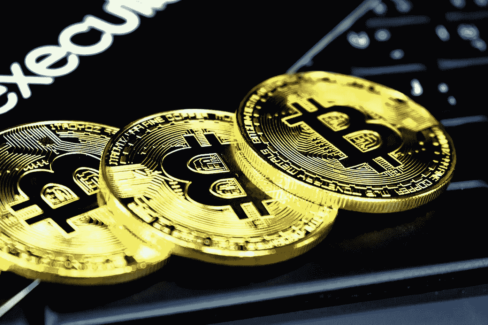
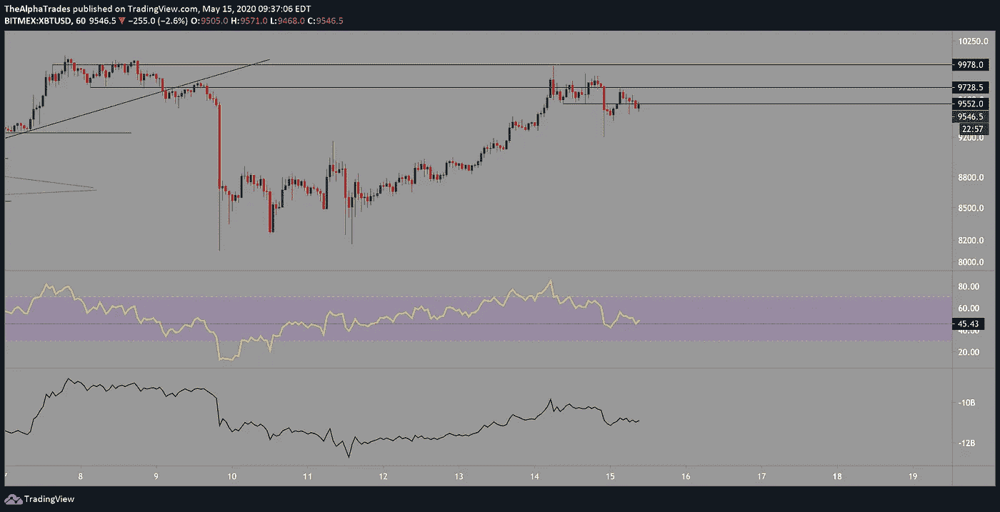
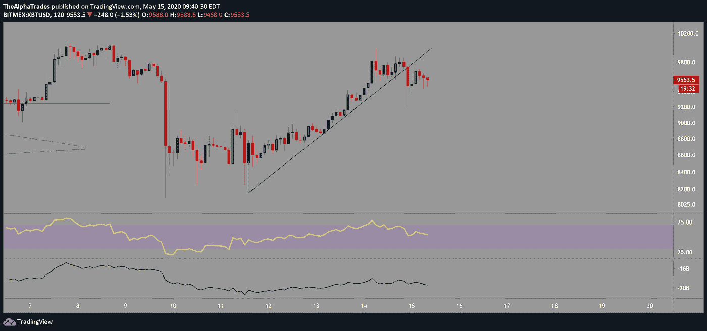
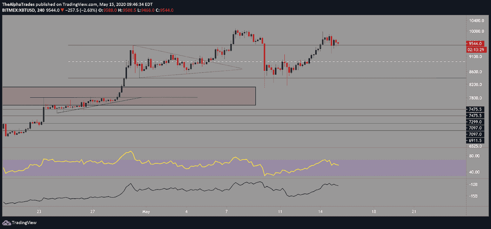
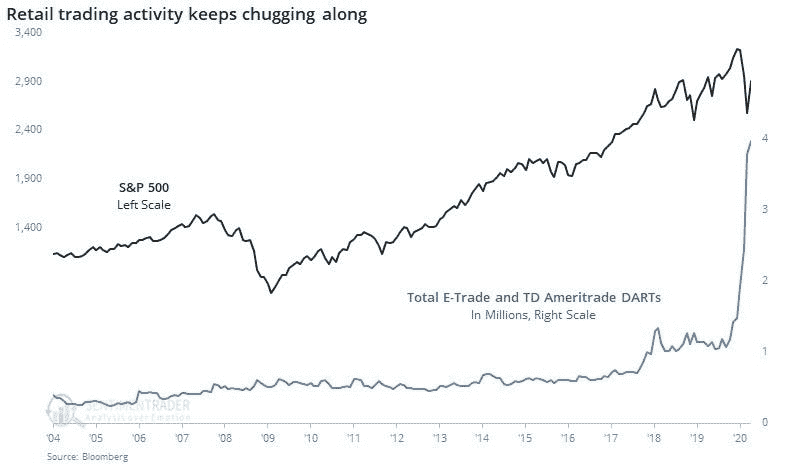

# 为什么我谨慎看空比特币

> 原文：<https://medium.datadriveninvestor.com/why-im-cautiously-bearish-bitcoin-e19d90462a76?source=collection_archive---------15----------------------->

## 矿工出售更多的 BTC！—这对价格意味着什么？

Bitcoin, Photo by [Clifford Photography](https://unsplash.com/@cliffordgatewood?utm_source=unsplash&utm_medium=referral&utm_content=creditCopyText) on [Unsplash](https://unsplash.com/s/photos/crypto?utm_source=unsplash&utm_medium=referral&utm_content=creditCopyText)

周五快乐，这是你的早间加密市场和股票分析，从比特币开始。

在一个小时的时间框架内，我们看到 BTC 突破了昨天一整天积累的盘整区，并且成交量相当大。关键支撑位 9552 被打破，但隔夜价格攀升至该区域上方，并拒绝 9728.5 作为阻力。这是看涨延续的好迹象，因为价格位于这些 SR 水平之间。更好的看涨信号需要 BTC 守住该区域，并最终以可观的成交量突破该区域。如果 BTC 跌破 9552 点的支撑位，然后翻转该阻力位，价格跌破 9204 点的机会就会增加。

我注意到，在最近的所有高点中，都有大量的卖方交易量，这被伪装成散户交易者强烈的看涨情绪所推动的看涨势头。BTC 需要以令人信服的成交量突破 10，100 至 10，500 点，以增加达到 11，000，11，700，甚至 12，500 点的机会。但现在，我的重点是 9500 点区域的盘整。

从两小时的时间框架来看，保持价格上涨约五天的趋势线最终在昨天的 9200 点被打破。从更高的时间框架来看，这对多头来说不是最积极的信号。

Bitcoin ranging, Source: Alpha Trades, LLC

Bitcoin trendline broken, Source: Alpha Trades, LLC

在四小时的时间框架内，需要注意的一点是，区间高点已经翻转为支撑，价格在该区间上方盘整是多头的积极信号。另一件要考虑的事情是 BTC 突破了 4 小时中枢，触及了 R1 阻力，并且无法越过该水平。这为回撤至 8983 点附近的支点增加了力量。RSI 继续打印较低的高点，但我认为随着 BTC FOMO 的冷却，它将继续下降。

从三天的时间框架来考虑市云。几天前，BTC 从云底反弹，跌至 8100 点左右，随后是一根强劲的看涨吞噬蜡烛线。如果 BTC 跌破云层，我预计价格将下降到 7100 附近的 Kijun 线。

 [## 加密货币行业是死是活？数据驱动的投资者

### 九月初，我们在 X-Order 内部就代币市场的未来进行了一场辩论。有趣的是，我们的观点是…

www.datadriveninvestor.com](https://www.datadriveninvestor.com/2019/12/12/will-the-cryptocurrency-industry-be-dead-or-alive/) 

从每周的时间框架来看，BTC 正在遭遇阻力。这是在 10，000 点的几次尝试之后发生的，所以从这个时间框架来看，我谨慎看跌 BTC。随着人们买入更便宜的 BTC，在今年晚些时候再次冲击 10，000 点水平，我们很容易结束另一个几个月的回撤和积累。

正如你所看到的，根据你看的时间框架，有看涨和看跌的观点(我们通常建议人们坚持更高的时间框架，以避免过度紧张而错过更大的画面)。

Bitcoin above range, Source: Alpha Trades, LLC

# 比特币的价格走势仍依赖于股市的混乱。

我怀疑 BTC 是否有能力摆脱目前与标准普尔 500 的关联，如果股市继续下跌，BTC 很可能会步其后尘。[矿商向市场投放的比特币比之前减半期](https://www.newsbtc.com/2020/05/13/post-bitcoin-halving-miners-have-dumped-5m-more-btc-than-before/)多得多，而 [Glassnode 在最近的一份简讯中报道了以下](https://insights.glassnode.com/the-week-on-chain-week-19/):

> 总的来说，在通过 Q1 的国民总收入大部分是积极的发展之后，它经历了一次小的回落，这完全是由于在减半之前的日子里情绪受到了打击。虽然长期来看，环比基本面仍然强劲，但价格减半可能已经反映在价格中，预计夏季价格上涨还为时过早。

我倾向于认为，最近股市的疲软可能与中国有关。美国正在考虑切断与中国的关系，这表明 2018 年升温的贸易战远未结束。与此同时，彭博的数据显示，面对市场的不确定性，零售交易仍然非常强劲，最新的 Redfin 数据显示[房屋购买需求已经从疫情高潮期间 34%的下降中完全恢复。散户投资者的非理性繁荣很强烈，如果沃伦·巴菲特的巨额现金头寸](https://www.redfin.com/blog/homebuying-demand-passes-prepandemic-levels/)有任何迹象的话，人们可能会为时过早地寻找实物资产交易。

# 处于优势

感谢您成为这个社区的一员。如果你对这篇文章有共鸣，请[订阅 Discord 服务器](https://bit.ly/2KJ1oor)。你将可以免费访问公共频道，在那里我们每天发布大量有用的内容。更多细节请看下面的视频。

今天的 Youtube 分析视频(嘿，介质，你的“嵌入”代码又坏了！):[https://bit.ly/2Tozd39](https://bit.ly/2Tozd39)

# 放弃

Alpha Trades，LLC 提供的信息不用于制定任何财务决策，也不是购买、持有和/或销售特定产品、数字资产或 ICO 的请求或建议。

访问我们的完整服务条款:[https://bit.ly/3faVeeV](https://bit.ly/3faVeeV)