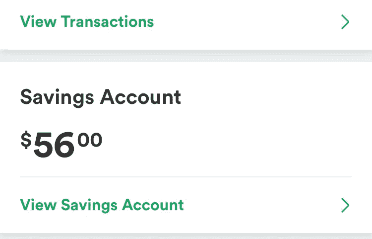

# 为什么我对我的 56 美元存款欣喜若狂

> 原文：<https://medium.datadriveninvestor.com/why-im-ecstatic-about-the-56-in-my-savings-fd3bcafd65bc?source=collection_archive---------14----------------------->

> “不要根据一个人在哪里来判断他，因为你不知道他已经走了多远。”——c . s .刘易斯

56 美元可能意味着很多。

我对我的年度目标进行分类，这样我就可以分析我需要更多关注的领域。2019 年，我没有实现任何财务目标。我决定今年专注于我的财务。我决定，2020 年将是我开始铺砖的一年，到时候，我将构建一个财务健康的结构。

今年我开始阅读《T2:巴比伦最富有的人》，这是最好的金融成功书籍之一。如果你想获得经济上的成功，我鼓励你读读这篇文章；或者留意以下要点中提供的 spark notes 版本:

*   拥有自己的住所，终生租房是愚蠢的。
*   辨别需求和欲望之间的区别。关注你的需求，而不是欲望。
*   创建预算。坚持下去。
*   不要接受财务上不成功的人的财务建议。咄。
*   不要投资你不了解的东西。
*   不要投资快速致富的计划(虽然没有明确说明，但我冒险说这包括传销)。
*   **至少把收入的 10%存起来*。***

*一月份，我读完了这本书，迫不及待地想利用书中的经验并从中获益。但是只有一个问题:我无家可归。不完全是，我有自己的车。然而，考虑到我所有的钱都应该集中在给我提供一个栖身之所上，这不是一个有利于储蓄的情况；你知道，下面还有浴室和厨房。*

*今年 2 月，我终于买得起一个带浴室和其他基本必需品的屋顶。我也有点进退两难:我应该选择财务目标还是职业目标？*

*我在做一份有意义的工作，为动物保护协会筹集资金，但它仍然不适合我。我的老板给了我一次提升，伴随着更多的责任和承诺，还有通常的福利和 5 万英镑的薪水。不算太寒酸。这份薪水意味着到年底我至少能有 4000 美元的存款。*

* [## 如何不做傻钱|数据驱动的投资者

### 为什么要相信一个标题，说我知道如何区分傻瓜和聪明的钱？因为我一直都是，并且从…

www.datadriveninvestor.com](https://www.datadriveninvestor.com/2020/08/19/how-not-to-be-dumb-money/) 

但我是一个有抱负的编剧/电影制作人；我的心意是受雇于与电影有关的行业，或者至少是我能运用写作技巧的行业。我不喜欢担任一个每周需要 50 多个小时、大量热情和注意力的角色，同时转移我的热情和注意力，在其他工作机会到来时寻找它们。

这份工作非常符合我的财务目标，但不利于我的职业目标。最终，我听从了我的心，而不是我的钱包。

在拒绝升职后不久，我得到了一份工作，在一部电影中担任制作助理:这份工作钱少、稳定、有责任，而且没有福利，但非常符合我的职业目标。我立刻就接受了。这是我第一次有机会制作故事片。此外，我有机会培养与电影业人士的关系，他们与 Lifetime Networks 等大公司有联系(这部电影就是卖给这些公司的)。

我辞掉了工作，决定在制作结束后不再回去。我只会寻找与电影或写作相关的工作。我的计算告诉我，我将有足够的钱维持至少两个月。有足够的时间去找工作。但是，考虑到我的财务前景不确定，我还不能开始存钱。

今年 3 月，在制作开始三周后，当一位助理导演问我是否愿意和他以及他工作的制作公司合作时，我眼前一亮。该公司一贯大约每月制作一部电影，需要一名一贯的制作助理；这是一份电影业的工作，对我的财务和职业目标都有帮助。你知道我说了什么。

不幸的是，虽然我说是的，但人们很容易猜到新冠肺炎·疫情对此会说些什么。

我们的制作提前结束了，我和助理导演合作的前景也是如此。显然，他的老板并不热衷于向一个需要根据新的 COVID 限制保持其人数较少的团队增加人员。

六月，我满怀乐观，情绪高涨，埋头工作。不是为了钱，而是写作引发的简单激情。在隔离的三个月后，我写了三本电子书，建立了一个网站，通过 Fiverr 开始了 T2 的自由剧本阅读，开始在 Medium 上写博客，建立了一个双周电子通讯，完成了两个不同剧本的草稿，申请了几十份工作。我一个都没收到。

申请被拒越来越多，我的信心也不断丧失。尽管我在职业上略有进步，但我的财务目标却在退步。老实说，我从剧本阅读中得到的钱不够付房租或其他费用。

当我借钱支付房租和基本必需品时，无家可归的感觉又一次出现了。经济上的成功遥不可及。我开始质疑自己的能力，因为我想知道当我几乎不能自给自足以避免无家可归时，我如何能够努力获得经济上的成功。

在那种情况下，我会答应拿回我的旧工作，但再次，COVID 说“不”

今年 7 月，在失业四个月后，我找到了一份谷歌薪酬(G-Pay)品牌大使的工作。我被雇来为我贴在商业橱窗上的通用支付贴纸拍照。一份轻松、薪水可观的工作，但却让我感到就业不足，远离了我想要的地方。我很感激这些钱，但仍然有想退出的冲动。我需要与我的激情和职业目标相一致的东西。

耐心和毅力扭转了局面。在与一家非盈利性制作公司 [Roadtrip Nation](http://roadtripnation.com) 的合作伙伴关系高级副总裁建立了几个月的关系后，他给了我一个助理的角色:一份每周工作 10 小时的远程工作，在这份工作中，我将利用我的研究和写作技能，为现在和未来的合作伙伴起草建议书。

有了这两份工作，我正慢慢从四个月的失业让我陷入的财务困境中爬出来。

八月，一切都结合在一起，将我的财务和职业目标结合在一起。我收到消息说，我们将恢复生产的电影，已取消在 3 月 COVID。另外，助理导演向我透露了更多的好消息。通过了 COVID 测试(最终赢得了与狗娘养的战斗)后，我成为了每月制作电影的公司的制作团队的一员。我立即辞去了我的高薪工作。

现在，我在 Roadtrip Nation 找到了一份支付账单的工作，一份为我提供赚钱机会的自由职业，一份为我提供职业发展机会的制作助理工作。

最重要的是，我终于能够开始存钱了。* 

*这 56 美元是我还清欠朋友的数百美元后收到的第一张支票的 10%，外加一笔 7 个月的汽车欠款。不过，它远不止 56 美元。*

*这 56 美元是进步；我的第一块砖正在铺设，以建立我的财务成功。*

*这 56 美元是毅力；我克服了无家可归和四个月失业带来的抑郁影响。*

*这 56 美元是对齐；我的职业和财务目标以一种再完美不过的方式融合在一起。*

*这 56 美元是胜利；我赌自己有能力追求自己的目标和激情。*

*大多数人会嘲笑庆祝储蓄账户中 56 美元的想法；我没有的原因是我知道罗马不是一天建成的。罗马是一砖一瓦精心建造的。*

*只要有足够的耐心、毅力和激情，我们可以打造任何我们想打造的东西，包括我们梦想的事业和财务成功。*

***这就是 56 美元对我的意义。***

***访问专家视图—** [**订阅 DDI 英特尔**](https://datadriveninvestor.com/ddi-intel)*