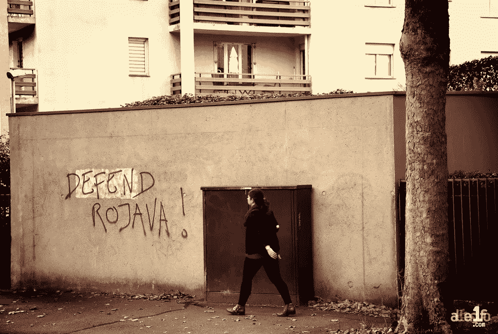
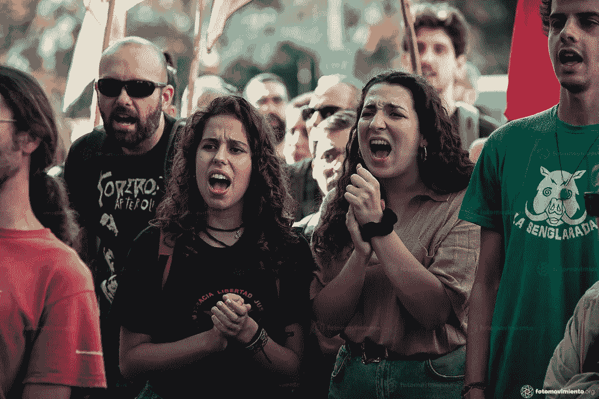

# 为什么我要跟踪 Rojava

> 原文：<https://medium.datadriveninvestor.com/why-im-following-rojava-d2fd8f59b3fb?source=collection_archive---------13----------------------->

## 我是记者，不是活动家

Photo credit: Oct. 11, 2019, Un jour, une photo: « Défend Rojava » by alter1fo licensed under CC BY-NC-ND 2.0.

因为我是一名记者，你可能不会认为我是一名活动家。

作为一名独立记者，我通常不会公开自己对重大问题的看法。

然而，今天，有一些我一直在关注的事情，我认为让世界知道是很重要的，所以我与你分享这些信息。我可能会也可能不会改变你的想法或让你点击几个社交媒体页面，但至少，像一个优秀的记者应该做的那样，我想让你意识到并让你思考世界上你可能永远不会去旅行或在电视上看到的一部分。距离(我现在所在的加州)7000 多英里。

它叫罗爪哇，在叙利亚东北部。

Photo credit: Nov. 2, 2019, [RiseUp4Rojava_Sira Esclasans i Cardona(08)”](https://www.flickr.com/photos/63055421@N04/49005564847) by [Fotomovimiento](https://www.flickr.com/photos/63055421@N04) licensed under [CC BY-NC-ND 2.0](https://creativecommons.org/licenses/by-nc-nd/2.0/?ref=ccsearch&atype=rich).

自 2019 年秋天以来，我在华盛顿州奥林匹亚的常青州立学院参加了一场由[黛比·布克钦](https://www.nybooks.com/daily/2018/06/15/how-my-fathers-ideas-helped-the-kurds-create-a-new-democracy/)主讲的[讲座](https://www.facebook.com/events/407302360199579/?active_tab=about)后，开始关注罗爪哇。黛比是一名记者和作家，20 世纪 90 年代初在佛蒙特州伯灵顿担任伯尼·桑德斯的新闻秘书。

简而言之，黛比的父亲是默里·布克钦(Murray Bookchin)，一位活动家、哲学家和社会理论家，他在 20 世纪 60 年代提出的“社会生态学”理论直接影响了库尔德自治运动，其基础是反资本主义、女权主义、生态学和基层民主——这是今天罗爪哇的大部分基础。

这是一个相当惊人的故事。事实上，[点击这里](https://www.nybooks.com/daily/2018/06/15/how-my-fathers-ideas-helped-the-kurds-create-a-new-democracy/)黛比会告诉你她父亲是如何激励她的。

为了提供一点视角，下面是 2019 年 11 月发表在 [The Guardian](https://amp.theguardian.com/world/2019/nov/01/we-stand-in-solidarity-with-rojava-an-example-to-the-world) 上的一篇文章中的一段:

> “自 2012 年以来，大约 500 万人——库尔德人、阿拉伯人、亚述人、土库曼人、雅兹迪人和其他人——建立了罗爪哇岛自治区，展示了一个多民族社会如何能够超越民族国家、父权制和资本主义的限制，相互尊重地共存。通过促进彻底的民主和分权自治、性别平等、再生农业、基于和解和包容少数民族的司法制度，罗爪哇实验为在最不可能的情况下实现可能性提供了一个活生生的例子。我们鼓励读者阅读《社会契约罗加万宪章》以获得灵感。”

下面是[宪章](https://peaceinkurdistancampaign.com/wp-content/uploads/2014/03/english-version_sc_revised-060314-1.pdf)的链接:[https://peaceinkurdistancampaign . com/WP-content/uploads/2014/03/English-version _ sc _ revised-060314-1 . pdf](https://peaceinkurdistancampaign.com/wp-content/uploads/2014/03/english-version_sc_revised-060314-1.pdf)

请密切注意*女性*和*环境*是如何被提及的。

你还应该知道，该地区一直受到土耳其的不断攻击，土耳其曾两次入侵并占领了罗爪哇岛的部分地区。这是土耳其对库尔德人的长期战争的一部分，无论是在土耳其境内还是在库尔德斯坦的其他地区。去年的入侵得到了特朗普总统的默许，他的撤军决定实际上为土耳其的入侵和随后的占领开了绿灯。

现在我已经给了你一些背景，这里是本周发生的事情，以及你如何参与和了解。

## [**号召行动**](https://riseup4rojava.org/call-for-global-action-days-on-the-18th-and-19th-july/?fbclid=IwAR23vhkF4U0fT20qW7LvQiRBVDN-WAfoHoyFum-1gYigKO84mCr8raAxEuU) **，Sat。2020 年 7 月 18 日至 7 月 19 日，星期日，纽约和其他地方。请在社交媒体上分享和发布。**

**"** 国际支持罗爪哇运动(international campaign for Rojava)呼吁在 7 月 18 日(周六)和 7 月 19 日(周日)开展为期几天的全球行动，以回应土耳其最近对罗爪哇和库尔德斯坦南部(Bashur)的袭击。在这些日子里，我们要求你通过分享、喜欢和张贴以下任何信息和标签来揭示 Rojava 的情况。

新闻:6 月，土耳其开始对库尔德斯坦南部进行一系列空袭和地面袭击，这是自 2015 年以来土耳其在该地区最大的行动。除了以 PKK 难民营为目标，土耳其还袭击了平民村庄、Makhmur 难民营(来自土耳其的 10 000 多名库尔德难民的家园)和 Yezidi 宗教社区居住的 engal 地区，该地区几年前遭受了 ISIS 的灭绝种族袭击。这些袭击导致至少 6 名平民死亡。在另一起事件中，一架无人驾驶飞机袭击了库尔德斯坦南部一个村庄的一个有孩子的家庭，导致一名妇女失去一条腿。与此同时，土耳其升级了在罗爪哇的活动，用无人机轰炸了该地区并暗杀了三名妇女。其中一名死者是 Zehra Berkel，她是 Rojava 妇女团体联合会 Kongra Star 的领导成员。令人不安的是，尽管这些袭击违反了国际法，但土耳其的最新行动几乎没有受到国际社会的谴责。

如果你在纽约，我们邀请你参加 7 月 19 日下午 1 点的汽车和自行车旅行。我们将制造噪音，让人们意识到土耳其最近的袭击。请不要迟到，因为这是一个感人的演示。带上标语和横幅，挂在你的车上或自行车上。我们会先在联合广场的巴诺书店外面见面。我们的路线将包括土耳其领事馆和第五大道的特朗普大厦。

地点:纽约曼哈顿 33e 17 街联合广场的 Barnes & Noble。如果你在世界的其他地方，请组织一次类似的活动或至少分享这篇文章。"

**更多来源和进一步阅读**

拉希拉·古普塔的好文章，“对罗爪哇的攻击”，2019 年 10 月:【https://newint.org/features/2019/10/11/assault-rojava 

听听这个做得很好的播客，“女人的战争。”由我心电台记者罗伯特·埃文斯制作。[https://www . iheart . com/podcast/1119-the-women-war-59464911/](https://www.iheart.com/podcast/1119-the-womens-war-59464911/)

2020 年 2 月《国家》杂志的文章，“这是罗爪哇的末日吗？”[https://www . the nation . com/article/world/rojava-Kurds-Syria/tnamp](https://www.thenation.com/article/world/rojava-kurds-syria/tnamp)

罗爪哇信息中心:[https://rojavainformationcenter.com/about/](https://rojavainformationcenter.com/about/)

来自 Rojava 女后卫的最新消息:[https://womendefendrojava.net/en/category/publications/](https://womendefendrojava.net/en/category/publications/)

让 Rojava 再次变绿:[https://makerojavagreenagain . org/2020/07/03/make-Rojava-Green-Again-call-for-action-days-on-the-18-th-and-19-th-July/](https://makerojavagreenagain.org/2020/07/03/make-rojava-green-again-call-for-action-days-on-the-18-th-and-19-th-july/)

**关注标签和社交媒体账户:**

#RiseUp4Revolution

#riseup4rojava

#Rojava

#停止杀害土耳其女性

#有机农药

#WomenDefendRojava

#巴舒尔

#土耳其入侵者

@InstSocEcology

@defendRojava

@debbiebookchin

@ starrcongress

@RiseUp4Rojava2

@lapinesque

@KurdsCampaign

@RojavaIC