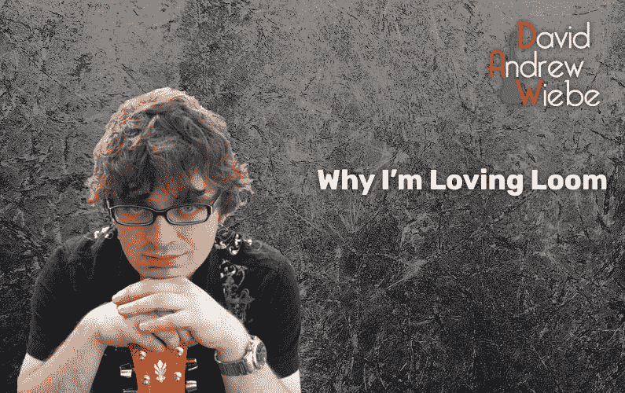

# 为什么我喜欢织机

> 原文：<https://medium.datadriveninvestor.com/why-im-loving-loom-7449a2b56ad0?source=collection_archive---------20----------------------->

人们告诉我为音乐企业家总部制作视频已经有一段时间了。

我明白了。视频内容现在非常庞大。

人们也喜欢能看到你，这样他们就能更好地了解你。

嗯，自从 2016 年左右开始了解詹姆斯·施拉姆科自己的《赛马场法》之后，我就一直在做视频。从技术上来说，我早在那之前就已经在为音乐企业家 HQ 制作视频了——我上传的第一个视频是在 2014 年。

事实上，我从 2009 年开始制作视频内容，同年我开始制作播客。只是，那时我的重点是娱乐。我做了视频游戏和电影评论。

# 这是我开始制作视频时发生的事情

我和其他人一样理解程序化出版的重要性。但我经常发现制作视频很麻烦，所以我没有始终如一地发布。

我也制作多种类型的内容。

我写博客，制作播客，制作视频。不可避免地，我发现制作视频内容花费的时间最长，因为脚本、拍摄、编辑和其他因素。

当我终于开始制作更多的视频内容时，人们开始说这样的话:

“为什么你的背景总是一样？”

“你在视频上看起来很紧张。”

"你在视频上的表达和在播客上是一样的."

这通常是因为我只是对重新投入并养成制作视频的习惯感到兴奋，而不是坚持完美。毕竟，通过练习你会变得更好，对吗？

但是反馈让我笑了一下。因为我做的正是别人要求的事情，显然他们脑子里想象的有点不同。我无法确切知道他们在想象什么。

# 寻找一个工作流程是乏味的

即使在我制作视频的时候，简单的事情也会出错，这让我很苦恼。

例如，糟糕的角度或光线会使一些原始素材几乎无法使用。

或者一些视频软件只输出单声道音频而不是立体声音频(这是 QuickTime 的问题)，我必须想办法在 post 中解决这个问题。

或者用我的智能手机拍摄给了我高质量的视频，但如果我想要更高质量的音频，我必须单独录制音频，并在以后将其与音频匹配。

或者编辑软件很难学，很贵，或者缺少我需要的看似简单的功能。

老实说，这有点像一场噩梦，而且相当耗时。

让我告诉你一些关于我的事情——我是一个“拿起就走”的人。我花了很多年作为一名视觉艺术家，所以我很理解美好的事物需要时间。我对花时间做项目并不陌生。毕竟我有[五本书](https://www.musicentrepreneurhq.com/books/)。

但是如果我找不到一种方法来简化这个过程，我知道这不会发生在我身上。我有太多其他紧急和重要的事情要做，没有时间和精力花在视频上。

# 进入织机

[Loom](https://www.loom.com/) 是一款在创业者中快速增长的视频消息 app。

它非常易于使用，并且提供了创建简单演示风格视频所需的所有功能。

我最近一直在试验它，它极大地简化和改进了我制作视频的过程。

我不是说我不能改进背景、灯光、角度，甚至我的演示风格。但是当我调整了 Loom 中的设置并点击 record 时，我可以放心，一切都会完美地完成。

一旦我完成录制，我可能需要做一些快速编辑，但仅此而已。

最棒的是，我可以使用任何网站或演示文稿作为我的背景。因为我并不总是生活在美丽的环境中(现在我住在几乎没有家具的地下室套房里，好吗？)，我可以在背景看起来不像我的厨房的视频中添加更多的个性。

这是我前几周做的一件事的例子:

现在，你要知道，没有人付钱让我谈论织机。碰巧我了解了它，尝试了一下，我很喜欢它。

# 最后的想法

也就是说，我现在在我的 YouTube 频道上发布每周视频内容[。](https://www.youtube.com/c/Dawcast/?sub_confirmation=1)

我说过 2020 年将会是视频年，事实也的确如此。我在 Dropbox 中有 70 多个文件夹，包含一个或多个视频文件，其中大多数都是今年创建的。

我还做了一个课程，出版了。我已经准备好再推出一个了。

因此，对于那些一直在等待视频内容的人来说，只需知道已经有很多了，更多的即将到来。

*原载于 2020 年 12 月 4 日 https://davidandrewwiebe.com***。**