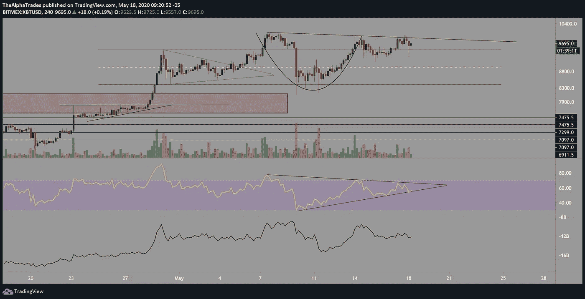

# 我为什么做空比特币——两种交易策略

> 原文：<https://medium.datadriveninvestor.com/why-im-short-bitcoin-two-trading-strategies-eb30c52e8a3?source=collection_archive---------12----------------------->

## BTC CME 差距缩小，现在怎么办？

Bitcoin, Photo by Thought Catalog on Unsplash

各位，周一早上好。Alpha Trades 在这里为您的比特币早间分析服务，并分享我如何交易比特币这样的资产的两个强有力的策略。

如果你错过了与前花旗对冲基金经理奥斯汀·阿什拉夫的谈话，我们在那里讨论了股票和全球市场的现状，请点击这里查看。我们在里面放了一些有趣的选股。

# CME 的缺口今天被填补了。

让我们开始分析。早盘出现了每小时一次的大幅抛售，从大约 9800 点一路跌至 9280 点(在其他交易所高达 9400 点)。此举是有道理的，因为收盘时，BTC CME 期货的缺口在 9395 左右。BTC CME 的交易员可能旨在缩小这一差距。[价差运作的方式](https://cointelegraph.com/news/mind-the-gap-identifying-and-trading-4-different-bitcoin-charts-gaps)是在周末，价格继续波动，而 CME 市场以静态价格收盘，因此在 CME 市场周五收盘和期货市场周日晚间开盘之间的时间里，有时会让交易员陷入不满意的头寸。为了弥补损失，CME 交易员将不得不迫使市场进入一个特定的方向，以弥补 CME 价格和 24–7 市场价格之间的差距。

现在缺口已经被填补了(在大多数情况下，这些缺口在不到一周的时间内被填补的成功率非常高)，这对我上周开仓的比特币空头头寸意味着什么？总的来说，我一直是 BTC 和市场的大力支持者，但没有做好推高的准备。比特币正在努力越过 10，000 点区域，除非它以令人信服的成交量突破该水平，特别是 10，500 点，这是 2019 年 10 月至 2020 年 2 月的关键 SR 水平，否则我预计未来几天内会出现回撤。

我在最近的视频中提到过 [TradingLite](https://tradinglite.com/) 是如何揭示卖出墙的力量给每小时的所有顶部价格带来压力的。价格稳步上升，然后有人再次卸下他们的袋子。

越多人被诱惑以更高的价格购买，专业人士和机构(业内称之为“鲸鱼”)就越容易以更好的价格去杠杆化。这也让鲸鱼有能力以更好的价格买进空头头寸。

# BTC 的牛市案例

我们不能忽视正在形成的看涨形态，其中一个突出的是 4 小时时间框架中的杯子和手柄，它在技术上仍然有效。最近有消息称，美联储“并非弹药耗尽”， BTC 可能会随波逐流。

杯子和把手模式是看涨模式，如果价格突破了这个模式，资产通常会突破杯子的尺寸。这种模式的突破使 BTC 位于 11700 点左右。

Cup and Handle set to break? Source: Alpha Trades, LLC

# 股票如何还能把 BTC 拖下水

让我们考虑一下比特币相对于股票市场的价格行为，重点是标准普尔 500 电子迷你期货(ES1！)，陷入了一个可以追溯到 4 月 16 日的区间。在股市向上突破该区间之前，BTC 将继续受到整体市场的拖累。每个人都在看着美联储，尽管 BTC 可能因为最近的减半事件而享受了一些“量化紧缩”，但它继续随着股票市场的潮流而被拉动。

在我看来，在这一领域做多 BTC 比做空风险更大，在这么长时间没有有意义的回撤后，做空会有更高的风险回报比。在 9575 点附近做空(写这篇文章时有点晚)，深度止损在 10500 点以上，或略高于 5 月 7 日的关键高点 10085 点，将使空头从 1400 美元上涨到 8100 美元，甚至从 2000 美元下跌到 7700 或 7500 美元。*这不是财务建议*，但基于下跌过程中的 SR 水平和缺乏回撤，这是我为未来几周起草的剧本。

**现在我们来讨论策略。**

EMAs(指数移动平均线)对于跟踪价格行为很重要，因为它和以前的 SR 水平一起运行。雅虎！金融将简单移动平均线和指数移动平均线的区别描述如下:

简单移动平均线(SMA)是特定时期内证券的平均价格。…指数移动平均线(EMA)为最近的价格提供了更大的权重，以更好地反映新的市场数据。当比较长期平均值时，两者之间的差异是显而易见的。

我特别关注 20 和 40 日均线，不管时间长短，这些均线提供了有趣的交易机会。我的策略是寻找 20 和 40 均线的交叉。例如，如果 20 均线穿过 40 均线，这是一个看涨信号。一旦 20 均线穿过 40 均线，我会平仓，可能会看跌或做空。当一个资产在一个特定的方向上或在趋势明显的时间框架上运行时，这种方法最有效(尽管你必须小心，不要在较低的时间框架下交易时眼光狭隘，因为较高的时间框架可能会印出一根与你的交易相反的蜡烛线，标志着一个更大趋势的延续，或者挑战较高时间框架上通道的外部界限)

我使用的第二个策略是 VWAP 指标(成交量加权平均价格)。在横盘市场中，这是一个非常有用的工具，因为你可以根据价格远低于 VWAP 来做多，根据价格高于 VAWP 来做空，但是当市场趋势类似时，也可以使用这个指标。这完全取决于你对 SR 水平的理解程度，因为这些会给你的头皮策略带来麻烦。

我经常看到交易者玩弄几十个不同的指标，在 1 到 5 分钟的时间内耗尽自己，但这将给出无数的混合信号，因此非常危险。从我和其他人的经验来看，时间越长的交易越安全。在对较低的时间框架和头皮交易产生兴趣之前，理解你在较高的时间框架(通常不低于 4 小时)下交易的 SR 水平和市场趋势是至关重要的。

其他有用的指标和策略包括 [RSI(相对强弱指数)](https://www.investopedia.com/terms/r/rsi.asp)，理解[成交量的影响](https://www.investopedia.com/articles/technical/02/010702.asp)，以及基于横向 SR 水平的[交易](https://www.investopedia.com/trading/support-and-resistance-basics/)。

# 处于优势

感谢您成为这个社区的一员。如果你觉得这篇文章很有帮助，请查看一下 Discord 服务器。你可以免费访问公共频道，在那里我们每天都会在市场上发布大量有用的内容。更多细节请看下面的视频。

Unique Bitcoin Trading Strategies, Source: Alpha Trades, LLC

# 放弃

Alpha Trades，LLC 提供的信息不用于制定任何财务决策，也不是购买、持有和/或销售特定产品、数字资产或 ICO 的请求或建议。

访问我们的完整服务条款:[https://bit.ly/3faVeeV](https://bit.ly/3faVeeV)