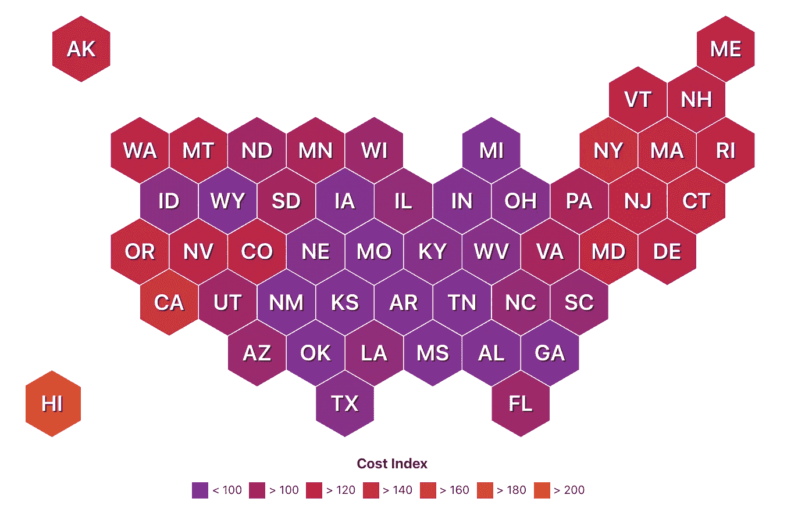

# 无薪实习的问题是

> 原文：<https://medium.datadriveninvestor.com/why-internships-wont-pay-you-6de4a5310704?source=collection_archive---------13----------------------->

> “无薪实习比奴役更糟糕……他们让我们无偿工作荒谬的时间，让我们做员工会做的事情。这是一个骗局，更糟糕的是，他们让你觉得他们在帮你的忙。”— [罗丽莎](https://www.goodreads.com/author/quotes/5809080.Teresa_Lo)

Photo by [Kat Yukawa](https://unsplash.com/@katyukawa?utm_source=medium&utm_medium=referral) on [Unsplash](https://unsplash.com?utm_source=medium&utm_medium=referral)

## 要查看你的实习是否合法无薪，请点击这里的 ***链接*** 。

作为一名即将毕业的大学生，我几乎每天都在问自己这个问题。实习应该是建立关系、获得经验以及为大学毕业后的职业生涯铺平道路的最佳途径，对吗？我过去也是这么想的(我可能现在也是)，但是它们真的那么有用吗？我个人在整个大学生涯中只参加过两次实习，坦率地说，我不认为我的成长直接归功于这两次实习。

 [## 教科书行业是如何最终被颠覆并将继续改变的

### 就此而言，教科书产业在美国乃至全世界都有着悠久的历史。事实上，他们已经…

www.datadriveninvestor.com](https://www.datadriveninvestor.com/2018/09/25/how-the-textbook-industry-has-finally-been-disrupted-and-will-continue-to-change/) 

我不认为我从实习中获得了很多的原因之一是因为第一份实习是没有报酬的，第二份也是直到实习开始大约 3 个月后才得到报酬。即使在那三个月后，他们仍然慷慨地每月付给我 500 美元的津贴。你能想象每月得到 500 美元的可能性吗？我不能。现在一个月 500 美元真的做不了多少事。想想看。大多数大学生已经在为钱而挣扎，作为一名来自加州的大学生，生活费用比美国其他大多数州都要高得多。事实上，根据世界人口评论，加州的生活费用指数在全美排名第三。

[Cost of Living by State](http://worldpopulationreview.com/states/cost-of-living-index-by-state/)

因此，谁能指望一个大学生有足够的动力去追求 500 美元/月的实习，或者更糟糕的是，一份没有报酬的实习？我们已经忙于攻读学位，参加全日制课程，甚至兼职工作。所以基本上，美国教育/工作系统希望我们做的是在兼职工作和保证收入之间做出权衡(在波霸餐厅制作饮料或在学校餐厅卖汉堡)，或者冒险并希望获得实习机会(这是无薪的，利用免费劳动力，或者如果你真的很幸运，你获得了带薪实习机会)。

获得实习机会(带薪或不带薪)是一回事。从实习中获得的好处是另一回事。假设我能找到一份薪水等于或高于最低工资的实习工作，但那份实习对发展我的技能没有用处。嗯，在这一点上，我仍然有一些收入。另一方面，如果我设法获得了一份无薪实习工作，我仍然有可能从实习中学不到任何东西。在这种情况下，这是一个“零和游戏(实习的雇主拿走了所有，而我什么也没拿走)。”

有人可能会问，甚至你可能会问，为什么无薪实习仍然是一件事，为什么你会继续申请它们。tldr 的回答是:**我们别无选择。作为一名全日制学生，他们在大学期间一直在社会生活和学术生活之间进行权衡，几乎没有时间来磨练或发展硬技能。因此，我们几乎不得不申请实习，希望有一个足够友好的雇主为我们的员工提供一些指导或辅导。无薪实习之所以仍然存在，是因为雇主知道“实习”这个词是那些几乎没有经验的大学生非常追捧的东西。不知不觉地，在我们作为学者的一生中，一次又一次地听到和看到“实习”这个词，这强化了我们必须获得实习的想法。**

Photo by [Bill Oxford](https://unsplash.com/@bill_oxford?utm_source=medium&utm_medium=referral) on [Unsplash](https://unsplash.com?utm_source=medium&utm_medium=referral)

再者，如果我们申请的是带薪实习或者是知名公司(苹果、微软、索尼等)下的实习。)与数百名在申请职位上有丰富专业知识的候选人相比，他们接受一名没有经验的年轻人的可能性有多大？一个人如何与之竞争？一个人如何获得获得竞争知识的机会？

从 LinkedIn、朋友或朋友的朋友在谷歌、脸书、德勤等公司获得工作的成功故事中，我内心产生了这种紧迫感(不能代表所有大学生)。除非你非常有才华，并且在上大学之前就有工作经验，否则找到这些合适的实习机会应该不会比普通大学生差。残酷的事实是，并不是所有人都非常有才华。我们都想在一天结束时有一个收入来源。当出纳员或办公室助理的收入只能到此为止。人们想要提升自己的生活，即使这意味着爬上无聊的公司阶梯。至少这样我们可以在我们的职位上获得潜在的提升和名声。

Photo by [Raphael Koh](https://unsplash.com/@dreamevile?utm_source=medium&utm_medium=referral) on [Unsplash](https://unsplash.com?utm_source=medium&utm_medium=referral)

所以，如果你是一名大学生，我理解你找不到实习机会的沮丧。我理解你毕业时想找到一份工作的焦虑。如果碰巧有雇主、成年人或有相对稳定工作的人读到这封信，我希望你能理解单身大学生的感受。

归根结底，这不是一篇唤起绝望和鼓励他人放弃的文章。希望这能打动许多其他学生，激励他们继续推动和发展他们的技能。实习不是摆脱这个困境的唯一途径。互联网和我们今天可以访问的视频可以帮助你学习基本技能。这一切都归结于时间、动力和坚持。如果有的话，我希望我的想法能引起你的共鸣，让你感到足够沮丧，从而激励你去追求一些值得做的事情。

Photo by [Ahmed Hasan](https://unsplash.com/@carsive?utm_source=medium&utm_medium=referral) on [Unsplash](https://unsplash.com?utm_source=medium&utm_medium=referral)

来源:

 [## 2020 年各州生活成本指数

### 生活成本被定义为通过提供基本的生活必需品来维持一定的生活水平所需要的钱数

worldpopulationreview.com](http://worldpopulationreview.com/states/cost-of-living-index-by-state/)  [## 概况介绍#71:公平劳动标准法案下的实习项目

### (2018 年 1 月更新)(PDF)本情况说明书提供了一般信息，以帮助确定实习生和…

www.dol.gov](https://www.dol.gov/agencies/whd/fact-sheets/71-flsa-internships)