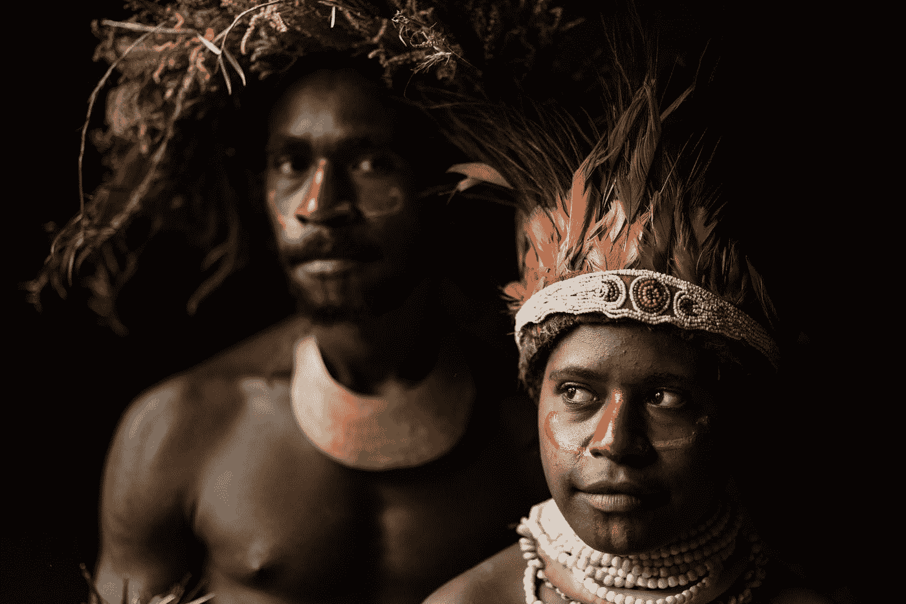

# 我们需要投资于土著社区

> 原文：<https://medium.datadriveninvestor.com/why-investing-in-indigenous-communities-is-essential-47a3f1c746e6?source=collection_archive---------26----------------------->

## 数千年的知识可以帮助应对未来的挑战

Photo by [Trevor Cole](https://unsplash.com/@trevcole?utm_source=medium&utm_medium=referral) on [Unsplash](https://unsplash.com?utm_source=medium&utm_medium=referral)

*本文原载于 Ingena Insight 网站*上 [*此处*](https://ingena.co.uk/2020/10/14/why-investment-in-indigenous-communities-is-essential-for-socio-environmental-development/)

*土著社区处于气候变化和环境退化的前沿。虽然他们只占人口的 5%,但他们的土地却占了世界表面的 22%和世界生物多样性的 80%。土著群体的价值观、传统和文化描绘了与地球的共生关系，他们作为猎人、渔民、牧民和农民的角色都依赖于健康的环境和自然生态系统。*

*这种密切的关系见证了数千年来专家对资源的管理，确保珍贵的生物多样性不会被过度开发。这是代际公平的基石——“每一代人与当代人、过去和未来的其他代人共同拥有地球的原则。”*

*同样，这意味着土著群体能够迅速发现并适应环境的变化，这已经" [**证明了他们在面对环境变化时的可持续性和复原力**](https://sdg.iisd.org/commentary/guest-articles/no-sustainable-development-without-indigenous-peoples/)*

*然而，它们经常被忽视。土著人民在全球温室气体排放中所占比例极小，却不成比例地遭受气候变化的后果。海平面上升使加拿大和南太平洋岛屿的社区流离失所，野火影响着土著土地，融化的冰破坏了北欧萨米人的文化习俗，这些挑战无处不在。*

*这导致了破坏性的后果，包括精神健康负担的增加。正如环境正义基金会指出的， [**瑞典一半的萨米成年人患有焦虑和抑郁症**](https://ejfoundation.org/resources/downloads/EJF-Sami-briefing-2019-final-1.pdf) ，三分之一的驯鹿牧民曾想过自杀，萨米人的自杀率可能是全国平均水平的四倍。赫尔辛基大学最近的一项研究发现，这样的群体特别容易受到资源开发和开采的伤害，尽管他们有抵触情绪。*

*废弃的矿井、侵占神圣土地的石油管道和污染赖以生存的水道的废物设施只是工业发展对社区产生负面影响的一些方式。这种对神圣土地的开发和探索源于植根于殖民主义的历史，殖民主义导致了土地掠夺和将土著群体圈入保留地。*

*当我们考虑到本土知识对气候和保护目标的宝贵价值时，这种行为会变得更糟。从了解退化的自然解决方案到对可持续粮食系统和生态系统健康的认识，它们的作用至关重要。*

*《应用生态学杂志》2020 年的一项研究收集了土著人开发的 300 多项指标，以监测他们生态系统的变化。这些指标给出了详细的 [**见解，这是单靠科学研究不可能做到的。**](https://besjournals.onlinelibrary.wiley.com/doi/full/10.1111/1365-2664.13705) 例如，根据猎物脂肪的颜色了解动物行为的变化，或根据观察到的资源可用性了解潜在的每日渔获量和收获时间。*

*该研究的第一作者 Pamela McElwee 说“ [**科学家和土著社区需要共同努力来理解我们这个快速变化的世界”，并指出“土著知识对于理解生物多样性丧失和生态系统退化的累积影响是绝对必要的。”土著群体、科学家和政府之间需要合作，而不是掠夺，需要更多的投资。**](https://www.futurity.org/indigenous-people-ecosystems-climate-change-2415292-2/)*

## *投资于土著群体*

*正如国际可持续发展研究所所承认的那样， [**“在农业和土地管理方面，土著知识可以与新的信息和创新**](https://sdg.iisd.org/commentary/guest-articles/no-sustainable-development-without-indigenous-peoples/) 相结合，以保护生物多样性并促进对不同食物系统的综合可持续管理。”这已经在一些地区发生了。*

*在秘鲁，政府与当地社区合作制定林业政策，加强土地、资源和文化权利，同时提供应对气候变化的新技术。在巴拿马和象牙海岸等国家，无人机被用来帮助精确绘制森林覆盖和土著领地的地图，以更好地支持土地所有权。这些以权利为重点的合作努力对于减缓世界范围内猖獗的毁林速度至关重要。*

*2018 年对 28 个国家的一项研究比较了土著群体控制的土地和政府管理的保护区。它发现 [**的投资相当可观，相当于 17.1 亿美元，**](https://news.mongabay.com/2018/07/investing-in-indigenous-communities-most-efficient-way-to-protect-forests-report-finds/) 是由土著团体承担的。这种保护和恢复对储存地上碳和限制气候变化的影响至关重要。*

*尽管如此，政府必须理解不同群体的不同需求。有些人特别与世隔绝，并希望保持这种状态。其他人定期与公众互动，在某些情况下希望与新技术或新业务保持一致。因此，一刀切的政策或投资不可能适用于所有土著社区，背景当然很重要。*

*在北美，影响力投资越来越受欢迎。新成立的基金，如加拿大的土著股权基金，寻求支持当地企业，这些企业往往缺乏启动资金，因为殖民化导致了财富的剥夺，无法创造代际财富。随着企业的发展，工作和服务的提供会扩大，这对于影响力投资者来说是一个有吸引力的选择。*

*社会创新和影响力投资中心发布了一份关于在土著背景下进行影响力投资的 2018 年报告**。他们强调了双方的障碍。对于投资者来说，他们的文化理解存在知识差距，高度分散的市场可能意味着获得机会的机会有限，投资者类型和机会之间的不匹配可能会将散户投资者排除在市场之外。对土著群体来说，一个主要障碍是信任。几个世纪的殖民主义导致了可以理解的不稳定的信任——这是一个需要在建立关系的过程中花费时间和努力来克服的挑战。***

***同样，小型土著社区可能缺乏扩大规模的能力或管理外部投资的金融专业知识。尽管如此，该报告的结论是，“影响力投资在开发符合传统本土价值观的新投资市场方面有着巨大的未实现潜力。”尽管如此，合作必须经过深思熟虑，投资者必须小心谨慎，不要重复以前的剥削。***

***还有一种观点认为，支持土著群体的最佳方式就是不支持剥削他们的公司。当然，环境、社会和公司治理措施越来越受欢迎，增加了公司行为的透明度，有助于提升土著群体的形象。然而，我们仍然看到有害行为和投资者情绪之间令人担忧的差距。***

***最近的一个例子是力拓矿业公司，该公司为了扩大业务，导致两个对澳大利亚土著居民有重要文化意义的 46000 年历史的洞穴 坍塌[。他们扣留奖金的最初反应理所当然地遭到了批评，导致首席执行官在最近几周辞职。不过，自爆炸发生以来，该公司的股价已经上涨了 20%以上。](https://www.ft.com/content/06dde6ba-c50c-412d-b286-131d0c1d70c1)***

***没有土著群体的知识和理解，真正的可持续发展是不可能的。他们在没有外部世界财政资源的情况下适应不断变化的环境的能力证明了他们经验的价值。因此，致力于应对气候变化和环境退化的政府必须投资于保护土著群体，并与他们合作，以成功促进未来的进步。***