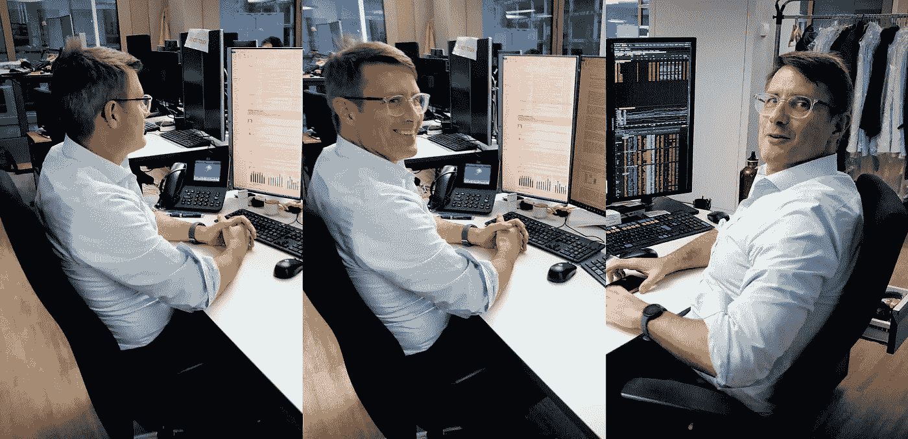

# 为什么投资可持续发展目标不仅是可能的，而且是一个好主意 Florian Esterer 访谈

> 原文：<https://medium.datadriveninvestor.com/why-investing-in-the-sdgs-is-not-only-possible-but-a-really-good-idea-an-interview-with-florian-9f38ce2c4a8b?source=collection_archive---------3----------------------->

My good colleague Florian Esterer at his desk in Zürich!

你能投资联合国的可持续发展目标吗？

尽管听起来令人惊讶，但答案实际上是“是的”。在 J. Safra Sarasin，我们最近推出了名为 *SDG Opportunities* 的 SDG 基金。

在现在成为*同事采访系列*(阅读我之前对[罗宾·罗格](https://medium.com/datadriveninvestor/setting-the-standard-for-corporate-climate-data-an-interview-with-robin-rouger-b03d210aae62)和[皮埃林·门兹利](https://medium.com/swlh/the-future-of-health-an-interview-with-pierin-menzli-about-investing-in-human-health-34c334f7875f)的采访)中，我想更多地了解这个基金是如何运作的——以及它是否有回报。

因此，我采访了新 SDG 基金的首席投资组合经理 Florian Esterer。通过与 Florian 的深入交谈，我们清楚地了解到 SDG 的投资方式有多么特别。

或者正如弗洛里安告诉我的那样:“在我漫长的投资经历中，我很少看到投资者的利益和社会的利益之间有如此好的重合。”

嗯，你应该自己拿主意。以下是我采访弗洛里安的文字记录，为了清晰和篇幅，经过编辑。

*重要提示:请阅读最后的免责声明。这很重要，因为文中提到了一些公司，而这篇文章无论如何都不是投资建议。我选择不在采访中遗漏公司的例子和名称，因为我认为它们有助于澄清我们正在谈论的内容。*

**Sasja Beslik:** Florian，简单介绍一下你自己和你的背景吧？

弗洛里安·埃斯特尔:我做股票投资者已经快 20 年了。在那之前，我确实做过一些咨询，也参与过一些软件初创公司。在 J. Safra Sarasin 的过去 7 年里，我一直从事可持续投资。

我必须承认…首先，我实际上是一个气候怀疑论者。但是今天，我成了一个狂热的信徒。在 ESG 主题下捕捉到的许多内容都是非常好的商业实践，例如治理、员工关系和环境风险管理。

SB: 你为什么从事投资工作？

**FE:** 主要有两个原因。首先，这是我做过的最有趣的工作。我正与一个非常多元化和高度激励的团队一起工作。我遇到有趣的商业领袖。我变得很善于分析。

第二，我们的工作有一个被忽视但很重要的社会功能。我们通过设定资本成本来引导资本流动。通过评估和投资公司，我们可以将资本导向更好的企业。

SB: 从发展的角度来看，你对我们今天生活的世界有什么看法？

**FE:** 在过去的一个世纪里，世界在减少贫困、延长寿命以及将社会不同阶层融入政治和工业进程方面取得了长足的进步。

然而，这一进程带来了一些代价，开始给整个社会带来问题。气候变化已经成为政治讨论的焦点，并且正在做出许多努力来解决与之相关的问题。

然而，其他问题仍然存在，并且仍然多少被忽视。例如，穷人和富人经济财富的差异。女性融入生产过程的程度仍然很低。许多发展中国家以及一些发达国家缺乏教育机会。

**SB:** 你们最近推出了一只有趣的 SDG 基金？为什么？

因为我们相信联合国可持续发展目标的框架有助于思考这些挑战。此外，它还为投资者提供了一个机会。在我漫长的投资经历中，很少看到投资者的利益和社会的利益有如此好的重合。

为了实现可持续发展目标，我们预计融资缺口约为 2.7 万亿美元。我们认为，金融市场在缩小这一差距方面可以发挥明显的作用。

在我们 J. Safra Sarasin 的案例中，我们使用该框架来确定那些创造对实现可持续发展目标至关重要的产品和服务的公司。

 [## 这么说一家大型风投基金正在投资你的初创公司？4 实际考虑|数据驱动的投资者

### 首先，恭喜你。融资总是需要努力的，一个大的风险投资基金当然是一个大的…

www.datadriveninvestor.com](https://www.datadriveninvestor.com/2020/08/09/so-a-big-vc-fund-is-investing-in-your-startup-4-practical-considerations/) 

你可能会问，进展如何？目前的投资组合每笔投资的收益是大盘的 2.5 倍。而这些产品和服务的增长速度更快。如果每个人都这样投资，我们将在 2030 年前轻松缩小差距。

SB: 这与新冠肺炎有关系吗？这与我们如何应对有关吗？

不是这样的。但我认为新冠肺炎暴露了一些长期存在的潜在紧张关系。

不同社会经济阶层的死亡率差异很大，穷人面临的风险更大。如果你没有电脑或高速互联网连接，或者如果你没有父母，远程学习环境中的学习机会会有很大的不同，这可以抵消教师的个别辅导。此外，受 COVID 相关裁员影响最大的是更脆弱、薪酬更低的服务行业员工。

所有这些都让实现可持续发展目标变得比新冠肺炎袭击之前更加紧迫。

**SB:** 投资 SDG 相关公司最有趣的事是什么？

**FE:** 当我们寻找可能适用于该基金的产品和服务时，我们会遇到许多令人兴奋的公司。一些产品和服务是由大公司生产的。一个例子是微软的努力，它让他们团队的产品免费提供给所有学校。

但最有趣的例子是提供非常专业的解决方案的小公司。Befesa 就是一个例子，它是钢铁厂残余物的主要回收公司。另一家是巴伐利亚北欧公司，它是一家疫苗供应商，这是一个大多数大型制药公司都已退出的市场。还有 Kahoot，它提供了一个在线学习平台。

**SB:** 那可持续性呢？这些公司也是可持续发展的吗？怎么会？

正如我之前所说，可持续性是一个独立的问题。我们使用可持续发展数据来补充我们的财务分析，并更好、更深入地了解他们的业务。大多数被归类为可持续发展的东西对我们来说只是一种不同的管理观点。

我们是非常基本面的长期投资者。而可持续性只是管理层长期关注的一种表现。从这个意义上说，我们所有的投资都是可持续的。

**SB:** 这项投资的伟大之处在哪里？

**FE:** 这是获得诱人回报*和*为社会创造价值的一次真正伟大的结盟。随着对 SDG 产品需求的上升，我们的公司应该会受益并实现更好的增长。由于这些产品是向更平等、更开放、更可持续的社会过渡的重要组成部分，这显然是一个双赢的局面。

SB:你是在投资你自己的钱吗？

FE: 我和我的团队花了很多时间分析公司，把我们最好的想法整合到我们的投资组合中。那么，除了我们的产品，我为什么要投资其他东西呢？特别是，新基金 *SDG Opportunities* 是全球股票市场和具有巨大增长机会的小公司的一个非常有趣的组合。

***免责声明:*** *这不是投资建议。本文提供的信息仅供参考和个人使用，不考虑任何个人投资者的个人情况。它并不构成为获取、持有或出售上述金融工具而进行的促销、推荐、诱导、招揽、邀请或要约。*

此处提供的信息和意见既不构成也不旨在成为任何类型的建议或推荐，也不旨在作为任何类型的投资或其他决策的决策辅助。明确建议在做出任何投资决定之前寻求您个人的专家意见。

*我(萨斯卡·贝斯利克)、受访者(弗洛里安·埃斯特尔)和我们的雇主(loss 阿姆)对您可能遭受的任何损失或损害不承担任何责任。*

## 获得专家观点— [订阅 DDI 英特尔](https://datadriveninvestor.com/ddi-intel)