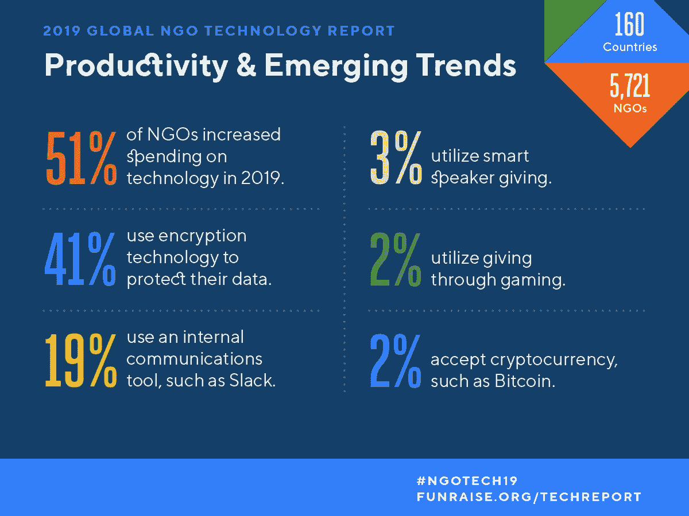
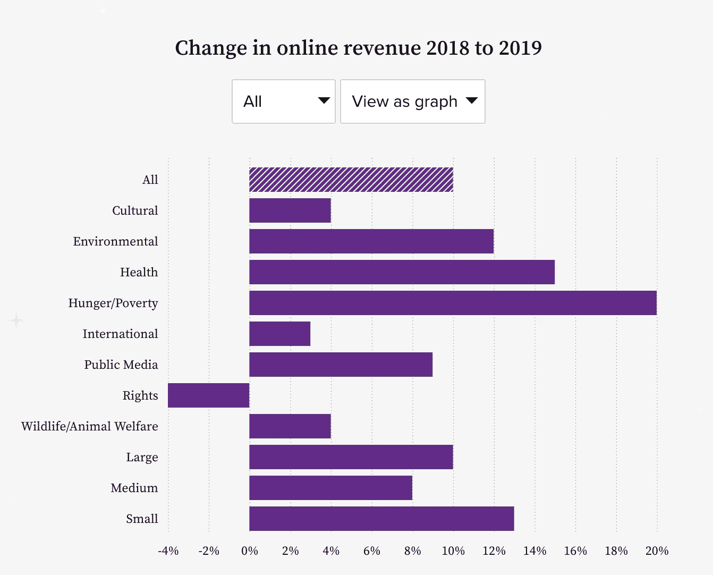

# 为什么投资者应该在后 COVID 时代关注非营利技术

> 原文：<https://medium.datadriveninvestor.com/why-investors-should-be-looking-at-nonprofit-tech-in-a-post-covid-world-c36b03fc4e3a?source=collection_archive---------22----------------------->

Image Credit: [https://www.stonesoupcreative.com/](https://www.stonesoupcreative.com/)

在会议期间,“非营利”这个词通常会立刻引来投资者的怀疑目光。无论推销进行得多么顺利，一旦我完成演示并点击 Q & A，这个词就会吸引投资者的注意。尽管在[希望](https://www.hopefulinc.me/)这里是一家盈利(尽管是由任务驱动的)公司，但我们与一个显然不以盈利为重点的领域相关联这一事实成为投资者的唯一关注点。

这篇文章致力于证明这种无利可图的看法不仅不准确，而且对投资者来说是一个巨大的错失机会。

当这些对话发生时，通常会问三个问题:

1.  非营利组织的顾客很难对付——当他们没钱的时候，你怎么向他们推销产品？
2.  你如何在如此艰难的行业中成功扩展？
3.  对于新冠肺炎，你是如何向一个正在消失的空间销售的？

我将围绕这三个问题来撰写这篇文章，因为它们不仅让我能够更好地了解非营利部门的状况，还可以宣传为什么非营利技术是高速增长的科技初创公司的新领域，这些公司希望在他们的社区和世界各地产生巨大的社会影响。

# 强硬的破产顾客

几乎普遍地，非营利组织被看作是那些靠陈旧的资金勉强度日的组织的典型例子。由于没有自由决定的资金到位，在外界看来，向这样一个行业出售股票是徒劳的。

**看着这些数据，一个不同的故事很快变得明显。** [根据 Imagine Canada](https://www.imaginecanada.ca/en/360/covid-19-threatens-devastate-canadas-charities)2020 年 3 月的一份报告，加拿大非营利部门占我国国内生产总值的 8.1%，雇用了 240 万加拿大人，其中 70%是女性，2018 年为经济贡献了超过 2400 亿美元。在美国，这个数字是惊人的 1 万亿美元——几乎相当于德国的 GDP。

利用这些数字，仅加拿大非营利行业支出(甚至不包括非慈善性质的非营利组织)[就占 GDP 的百分比而言，超过了以下行业](https://www.canadiancharitylaw.ca/blog/key_statistics_on_canadas_charity_and_non_profit_sector/):

*   采矿、采石和石油或天然气开采(8.14%)
*   金融和保险(7.1%)，公共管理(6.33%)
*   批发贸易(5.66%)
*   零售业(5.41%)
*   运输和仓储(4.44%)
*   公用事业(2.27%)
*   住宿和餐饮服务(2.17%)
*   农业、林业、渔业和狩猎业(1.65%)

在最高级别，这表明一个行业有资源可用。进一步挖掘，超过 45%的年度非营利组织预算来自商品和服务的独立销售，表明这些统计数据并没有扭曲政府对这类组织的补贴。

Credit: [funraise.org/techreport](http://funraise.org/techreport)

在技术方面，非营利组织已经开始认识到他们需要引入新的先进技术，非常大的非营利组织(被归类为每年运营预算(AOB)超过 1000 万美元的组织)平均每个员工在 IT 上花费 3000 美元[。](https://biztechmagazine.com/article/2017/06/most-nonprofits-are-investing-more-software-hardware-study-shows)

在企业规模的非营利组织之外，这些数字描绘了一幅更加有趣的画面——**，大型(500 万至 1000 万美元 AOB)和中型(100 万至 500 万 AOB)组织的人均支出更高——分别为 5016.32 美元和 3468.11 美元。规模更小的草根非营利组织平均每个员工在技术上的花费是 2127.45 美元。**

# 扩大非营利部门的规模

所以，非营利组织有钱花——但是一个非营利的技术公司如何在这样一个分散的市场中扩大规模呢？

许多迹象表明，特别是随着 COVID19 的崛起，非营利领域采用新技术的速度正在加快——这是一个千载难逢的机会，让使命驱动的初创公司可以迅速将他们的创新带到世界最紧迫问题的前线的大量非营利组织。

首先，春季是慈善机构和非营利组织的主要筹款时期，物理距离协议已经迫使加拿大各地计划的几乎所有团体筹款活动取消。

即使对于最保守的非营利组织来说，这也迫使他们审视管理和筹款的数字解决方案。也就是说，技术将减少他们的偷听，增加网上捐赠。

据 [M+R 2018 在线学习赠送](https://www.mrbenchmarks.com/insight):

*   2019 年在线总收入增长 10%。
*   继 2016 年增长 15%之后，2017 年在线捐赠增长了 23%。
*   每月在线捐赠比前一年增长了 40%。
*   从前一年开始，在线捐赠增长了 19%。

Credit: [http://www.mrbenchmarks.com/insight](http://www.mrbenchmarks.com/insight)

转向数字解决方案涉及大量数据的创建，这是非营利部门在过去十年中一直在努力解决的问题。即使强制转向在线筹款和对技术解决方案的需求增加，全球只有 6%的非营利组织报告说优化了他们的数据以取得成功，这是使命驱动型科技公司产生重大影响的另一个机会。

对于像霍普这样的中端市场 SaaS 公司来说，这样的机会仅在加拿大市场就代表着 9000 多万美元的 ARR 机会，并且这样的机会将根据特定组织可能提供解决方案的非营利组织的规模继续快速扩大。

# 柯维德效应

史无前例的疫情飓风让地球上的每个部门(也许除了电信和视频会议)都陷入了非常困难的境地。

非营利部门尤其受到了危机的沉重打击，【Imagine Canada 预计慈善机构将损失 95 亿至 156 亿美元，裁员 117，000 至 194，000 人(假设有 3 至 6 个月的隔离期)。

然而，COVID19 是物质领域的危机，而不是数字领域的危机。实施价值优先销售策略的公司受益于向需要持续推动捐赠以维持运营的非营利组织提供免费服务和支持。

回馈社区是 how 如何开展业务的一个关键原则，动员非产品资源对非营利组织的持续成功至关重要。在霍普，我们高度鼓励我们的团队成员尽他们所能为社区的非营利组织做出贡献，无论是资金还是实物捐赠，以帮助那些有需要的人。

加倍努力实现任务优先的目标，而不是财务目标，是许多非营利和营利性科技公司增加收入的强大力量，反过来，也为投资者实现了预期回报。

*(注意:在 COVID19 期间，Note 已经向任何需要我们社交媒体分析工具的非营利组织提供免费访问)*

# 结论

由于当前危机加速的趋势，非营利部门正准备迎接数字化转型的复兴。随着市场规模远远超过 1 万亿美元，该领域的许多组织都渴望新的非营利工具和商业模式，以帮助支持他们和他们服务的选民。

***免责声明:我是*** [*希望公司*](https://www.hopefulinc.me/) *的首席执行官和联合创始人，这是一家高增长的初创公司，它使非营利组织能够超越喜欢，通过社交媒体和利用人工智能的在线捐赠来源获得更多资金。我们自己目前正在筹集种子资金。如需了解更多信息，请发送电子邮件至*[*ajivov @ hopeflinc . me*](http://ajivo@hopefulinc.me/)

***本文原帖***[***LinkedIn***](https://www.linkedin.com/pulse/why-investors-should-looking-nonprofit-tech-post-covid-jivov)