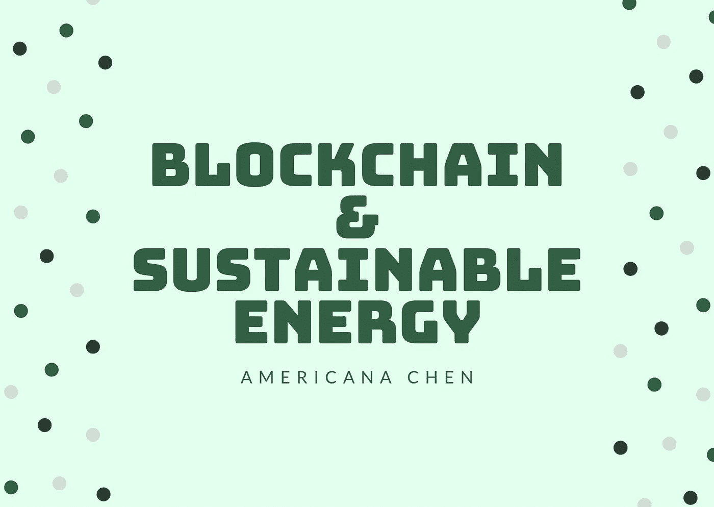
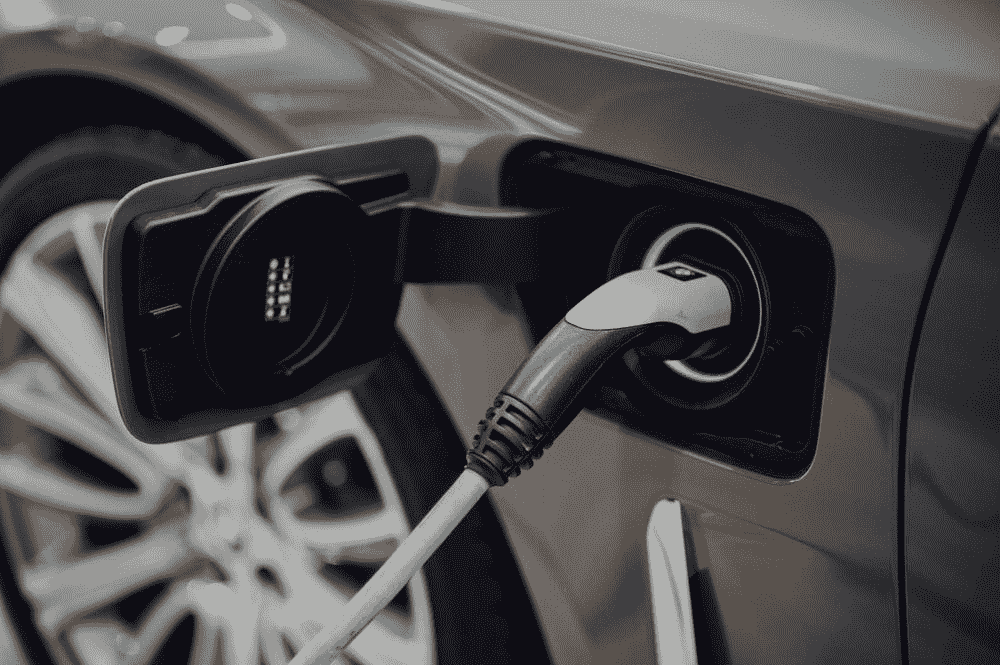
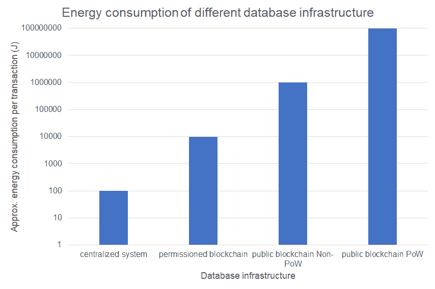

# 为什么区块链不是挑战而是可持续能源的解决方案

> 原文：<https://medium.datadriveninvestor.com/why-is-blockchain-not-the-challenge-but-the-solution-to-sustainable-energy-e3265a42a61a?source=collection_archive---------3----------------------->

image made by Americana using Canva

# **当前对区块链能耗的担忧**

O 对区块链技术最大的批评之一是，**挖掘和工作证明的过程需要大量的计算能力**，这**消耗了巨大的电力**。剑桥大学开发了一种 [**活体比特币网络电源**](https://cbeci.org/) ，根据其历史记录，比特币的能耗从 2015 年底的每年 4TWh 上升到今天的每年**90 twh**(2020 年底)。在电力成本低的国家，主要是中国和印度，大量的投资被投入到建设矿池中。回到 2019 年，当时比特币的年能耗在 **58TWh p.a** 左右，与瑞士的**能耗**持平。现在，随着比特币交易所变得越来越发达，我们可以看到这个数字几乎是 T21 的两倍。一项发表在自然气候变化上的研究还发现，仅比特币能源消耗转化为碳排放就可以将全球变暖推高 2 摄氏度以上。 ***但这是否意味着区块链技术对控制气候变化和走向可持续发展构成了重大挑战？不一定。***

在下面的文章中，我们将主要关注区块链鼓励点对点可再生能源交易并彻底改变我们对能源供应商的看法的潜力。我们还将从**交易记录和可再生能源证书验证**方面简要讨论区块链技术在能源行业的应用，作为迈向更可持续未来的解决方案。

image source: unsplash

# **1。分散能源供应系统和家庭参与**

区块链给能源行业带来的最特别的机会之一是它**鼓励电力‘消费者’的增长。**消费者是指能够发电或成为电力供应商的家庭，例如，通过在其建筑物中安装太阳能电池板。通过将消费者置于系统的核心，**可再生能源的消费和生产都可以得到提高**，创造一个**正反馈循环，加速社会以自我维持的方式从不可再生能源向可再生能源的转变**。为了使这样的系统成为现实，需要有一个激励机制，例如，消费者应该期望从投资安装太阳能电池板中获得正回报。然而，在当前的电力供应系统中，挑战不仅在于**没有一个可信的平台来促进家庭电力交易**，而且在于**多个中介和复杂的监管合规性降低了家庭从事电力交易的潜在收入。**该领域的许多管理者和学者已经认识到变革的必要性，2017 年欧盟清洁能源一揽子计划开始实施，制定了一套关于家庭能源生产、储存和交易的规则，旨在鼓励消费者积极参与电力交易。学术文献广泛地**关注于通过将本地存储系统纳入国家电力系统运营来改善市场设计**，然而，进展缓慢，我们在过去几年中没有看到重大变化。

**这就是去中心化区块链系统发挥作用的地方。**

首先也是最重要的，区块链技术可以**创造一个无信任的网络来鼓励点对点(P2P)电力交易**。在任何 P2P 交易中，双方之间的信任都是极其重要的。如果我们考虑一下优步和 Airbnb 是如何建立他们的 P2P 交换系统的，参与交易的各方对平台的配对和验证机制充满信任，例如，成为优步司机的注册过程。区块链技术提供了一个更强大的**‘无信任’系统**，其中**你不必信任交易对手，只需信任技术**。通过提供**追踪交易的加密方式**，交易记录的透明度和个人信息的匿名性都得到了增强。**在没有集中控制的情况下，记录每笔交易(以加密形式)的相同数据库存储在每个参与者的设备中**，为了记录交易，**所有各方需要达成共识并验证交易。**

image source: unsplash

> *“历史上，尽管有一些例外，人们倾向于不与陌生人或社交网络之外的人分享。分享仅限于信任的个人，如家人、朋友和邻居。如今的分享平台促进了互不相识、缺乏共同朋友或联系的人们之间的分享。”* ( [弗伦肯和肖尔，2017](https://www.sciencedirect.com/science/article/pii/S0301421518308711#bib19) )。

此外，通过使用分布式分类账系统，许多**中介从交易**中移除，可以实现纯粹的点对点交易。这**降低了交易的成本和时间**，增加了“利润空间”并刺激家庭参与能源交易活动。

我们已经在全球许多国家看到了实际的实施，**初创公司和传统的大型能源供应商**都在积极推动这样一场革命。例如，在 2018 年， **Centrica** -英国天然气公司的所有者与一家美国初创公司合作，为他们的当地能源市场启动了一个能源共享项目。该项目旨在实现英国当地企业、消费者、国家电网和其他参与者之间的能源交易。

另一个广为人知的案例是**澳大利亚初创公司“Power Ledger”**。它使用一个基于区块链的网络来建立一个点对点的能源交易平台。它的一些主要优势包括**实时支付、自动化低成本结算、邻里交易、透明的交易信息**等等。Power Ledger 最有趣的特征之一是它**由许可和非许可的区块链基础设施组成。**无许可的区块链在全球范围内运营，允许国际市场交易，而有许可的区块链在本地受信任的同行之间运营。该平台还使用两种令牌作为资产:一种称为“POWR”，用于进入全球 P2P 交易市场，而另一种称为“Sparkz”，通常在本地网络中作为交易货币，代表电价和本地“真实世界”货币。结合起来，该系统通过“POWR”代币确保价值，并通过“Sparkz”促进交换。

你可以探索的其他 P2P 电力交易创业公司和项目包括:

*   
*   *[***one up***](https://www.oneupsaves.io/en/)*
*   *[***推手***](https://www.powerpeers.nl/about)*

*除了太阳能电池板，另一个活跃领域是**电动汽车充电**。电动汽车的销量逐年大幅增长。预计到 2025 年，特斯拉电动汽车的总销量将超过 1000 万辆，为了应对这一趋势，对充电站的需求将呈指数级增长。这给国家电网带来了压力，因为数百万司机需要能量流来同时给他们的汽车充电。“分布式”充电站的想法非常符合区块链的特点，它可以通过允许任何电动汽车充电器的所有者成为供应商，在改善分布式充电网络的协调方面发挥关键作用。使用**区块链智能合约可以在互不相识的电动汽车车主和电动汽车充电器供应商之间进行可信支付和交易。***

**

*image source: unsplash*

*由 *Slock.it* 发起的 **Share & Charge 项目**就是 P2P 电动汽车充电站项目的一个例子，允许拥有充电站的家庭为司机提供充电服务。它**可以通过收回投资成本使‘供应商’受益，同时扩大电动汽车充电站的地理覆盖范围，使司机受益。**该应用程序自 4 月 28 日起在德国的充电站可用。*

# ***2。高效交易记录***

*区块链本质上是一个**分布式账本**，一个**去中心化数据库**。当前的能源供应链涉及**多方和中介**，从发电商，到分销商，到贸易商，监管者，最后到达最终用户。复杂的过程需要**多次计费和现金流交易**，这为区块链技术带来积极变化打开了机会。利用分布式分类账系统，交易中涉及的多个利益相关者都可以对分类账进行读写，实时更新共享数据库中的信息。诸如**用电、用热、智能计量**等数据都可以存储在区块链数据库中，**通过减少记录的复制来提高效率的同时提高安全性**。*

# ***3。可再生能源所有权和验证文件***

*区块链技术在能源领域的应用在**登记电力生产资产的所有权和当前状态**方面也具有重要意义。区块链系统的**不变性和透明性**的特点确保了记录是防篡改的，给了所有者和监管机构**对其产权的信心和保证**。此外，文档允许用户追溯电力生产的起源，并**检查从发电机到分销商**的能源价值链各阶段之间的交易。使用**智能合同进行可再生能源认证(REC)交易**也很有价值。可再生能源认证是国家根据能源供应商生产的特定数量(兆瓦)可再生能源提供的证明。但是，私人实体经常“拆分”此类证书，在私人方之间进行交易，这引起了对欺诈 REC 交易(如双重出售信用)的极大关注。使用区块链，**可以避免双重销售问题**,其遵循的逻辑与消除加密货币交易中双重消费问题的逻辑相同，并且监管机构和消费者始终可以追溯到**REC 的原创性。**欺诈性记录和玩弄监管漏洞的机会可以降至最低。*

# ***回到能耗问题…如何缓解？***

*你可能会问，虽然区块链技术可能会促进可持续能源的使用，但它不会改变它消耗大量能源的事实。为了解决这个问题，我们需要认识到，除了加密货币，区块链的大多数商业和现实世界应用程序都在使用**许可的区块链**。与无许可的区块链相反，许可的区块链通过只允许授权的参与者进入网络进一步增强了安全性。这似乎与去中心化的概念相矛盾，但是**要求所有验证者验证交易以记录交易仍然有效，并且数据库存储在网络中的每个设备中。**它确实妥协了一些不可信的特征，如果所有参与者达成共识，过去的记录可能会被改变，然而**随着参与者之间某种程度的内在信任，允许区块链很好地工作**。*

*得到许可的区块链的能源消耗比没有得到许可的区块链要少得多。根据对不同类型的数据库的能量消耗的研究，在许可的区块链上每个事务的近似能量消耗在**数量级上更小。**如果你考虑将它乘以交易的数量，**与具有工作证明的公共区块链相比，被许可的区块链所使用的能量消耗是可以忽略的**，并且与传统的中央系统相比，其差异不是非常显著。*

**

*Data source: [https://doi.org/10.1007/s12599-020-00656-x](https://doi.org/10.1007/s12599-020-00656-x) , image created by Amereicana Chen*

# *关注我/连接到:*

*领英:[美国陈](https://www.linkedin.com/in/americana-chen-94432219a/)*

*insta gram:[@ africccana](https://www.instagram.com/africcccana/)*

*陈*

# ***参考文献***

1.  *克里斯·巴拉尼克。“比特币的能耗‘等同于瑞士’。” *BBC 新闻*，BBC，2019 年 7 月 3 日，[www.bbc.co.uk/news/technology-48853230.](http://www.bbc.co.uk/news/technology-48853230.)*
2.  *"电力和天然气区块链:去中心化能源交易."*开关*，The Switch . co . uk/energy/guides/technology/区块链-energy #:~:text =区块链有助于分配能源，通过电力公司。*
3.  *普华永道。“区块链——能源生产商和消费者的机会？”*普华永道*，2016，[www . PwC . com/GX/en/industries/assets/PwC-区块链-能源生产商和消费者的机会. pdf.](http://www.pwc.com/gx/en/industries/assets/pwc-blockchain-opportunity-for-energy-producers-and-consumers.pdf.)*
4.  **剑桥比特币电力消费指数(CBECI)* ，cbeci.org/.*
5.  *迪斯特梅尔，丽娅。“改变电力:用区块链技术转变电力消费者的角色——欧盟电力法的政策含义。”*能源政策*，爱思唯尔，2019 年 1 月 9 日，[www . science direct . com/science/article/pii/s 0301421518308711 #:~:text = block chain](http://www.sciencedirect.com/science/article/pii/S0301421518308711#:~:text=Blockchain)可以使电力行业的发展、消费。& text=One 是未经许可而通过购买市场准入来运营的平台。*
6.  *Mora，Camilo 等人，“仅比特币排放就可能推动全球变暖超过 2 摄氏度。”*自然新闻*，自然出版集团，2018 年 10 月 29 日，【www.nature.com/articles/s41558-018-0321-8.】T2*
7.  *"相互进化的技术:区块链、可再生能源和储能."*美国律师协会*、[www . American Bar . org/groups/business _ law/publications/BLT/2019/12/evolving-tech/#:~:text = block chain](http://www.americanbar.org/groups/business_law/publications/blt/2019/12/evolving-tech/#:~:text=Blockchain)和智能合约有，MW)的可再生能源产生。*
8.  *Sedlmeir，j .，Buhl，H.U .，Fridgen，G. *等*区块链技术的能耗:超越神话。*总线信息系统工程* 62，599–608(2020)。[https://doi.org/10.1007/s12599-020-00656-x](https://doi.org/10.1007/s12599-020-00656-x)*
9.  *实际上，斯蒂芬。“Share&Charge 推出了它的应用程序，在区块链上的 1000 多个充电站上运行。” *Medium* ，Slock.it Blog，2017 年 5 月 4 日，Blog . slock . it/share-charge-launches-its-app-on-boards-over-1000-charging-stations-on-the-the-区块链-ba8275390309。*
10.  *批发电力市场中的消费者整合:点对点交易和住宅存储的协同作用。*能源与建筑*，爱思唯尔，2018 年 12 月 14 日，[www . science direct . com/science/article/pii/s 0378778818330378。](http://www.sciencedirect.com/science/article/pii/S0378778818330378.)*