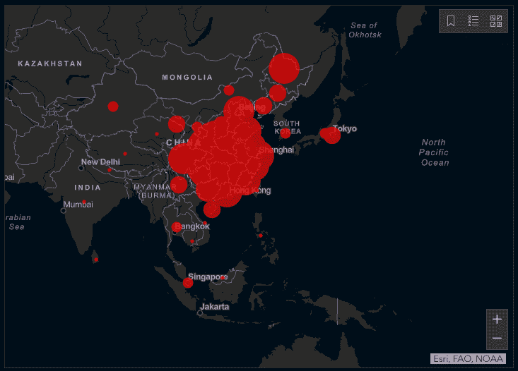
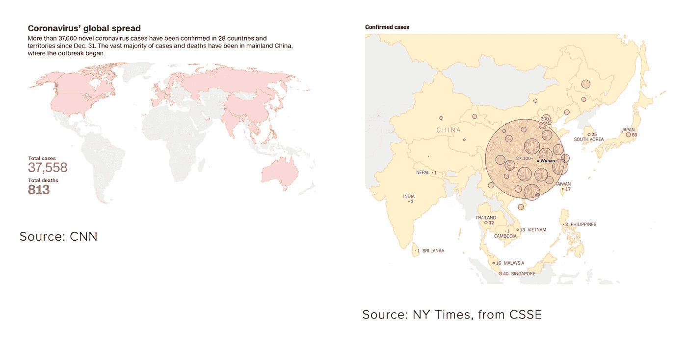
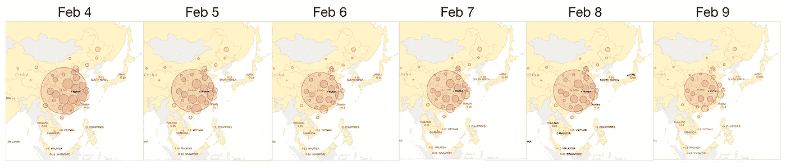
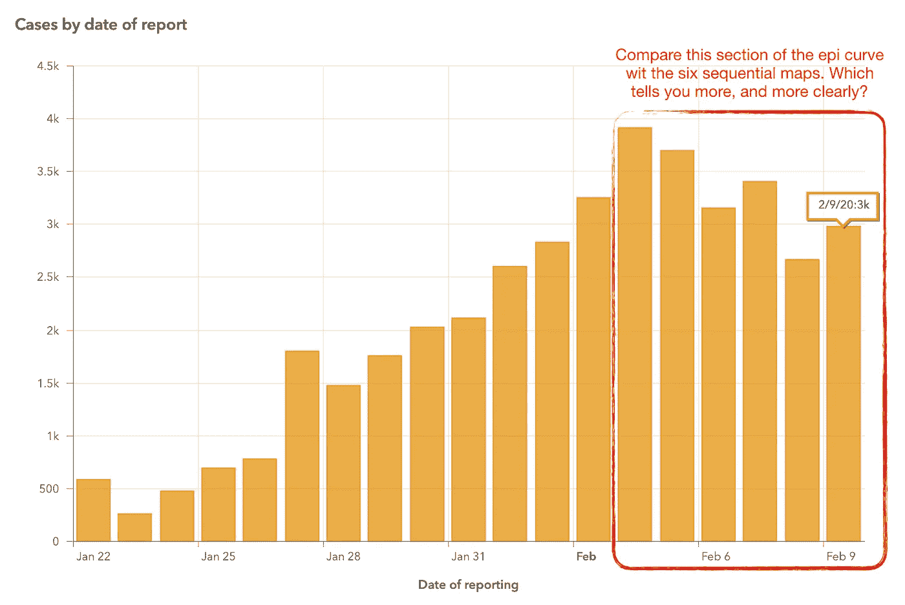
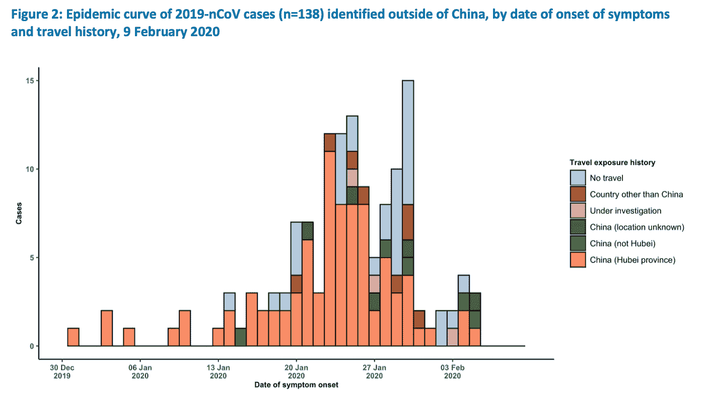

# 为什么冠状病毒数据可视化这么差？

> 原文：<https://medium.datadriveninvestor.com/why-is-coronavirus-data-visualization-so-bad-8dd56dcdb453?source=collection_archive---------8----------------------->

作为一名前 CDC 疫情调查员(在流行病情报服务部门)，我一直饶有兴趣地关注着当前新型冠状病毒的爆发，尤其是数据可视化。

如果你一直在关注疫情，你可能已经注意到了关于病毒的数据可视化映射的优势。当然，地图很棒，但我怀疑过去十年 GPS/GIS/制图能力的巨大爆炸给了我们所有人一个“寻找钉子的锤子”，即使更好的 dataviz 工具可能适用，也要应用地图。

 [## 大笔资金和尖端技术:人工智能/人工智能投资将如何革新医疗保健…

### 在过去几年人工智能(AI)和机器学习(ML)的显著发展中…

www.datadriveninvestor.com](https://www.datadriveninvestor.com/2018/03/22/big-money-and-cutting-edge-technology-how-investment-in-ai-ml-will-revolutionize-the-healthcare-industry/) 

这张来自约翰·霍普金斯系统科学与工程中心(CSSE)的的[共享地图怎么样，它已经被 CNET、ZDNet 和纽约时报等许多媒体推广:](https://gisanddata.maps.arcgis.com/apps/opsdashboard/index.html#/bda7594740fd40299423467b48e9ecf6)

From Johns Hopkins CSSE, February 9, 2020

或者这些来自 CNN 和纽约时报:

虽然这些地图是为了帮助读者“追踪疫情”而推广的，但它们都说明了为什么地图是*而不是*流行病学家追踪疫情的主要方法。

# 地图显示一个时间点

你不可能看着一张快照就知道在那张快照之前发生了什么。同样，一张地图只是向你展示“现在”。要使用地图跟踪进度，您需要查看同一地图随时间推移的多个副本，并确定变化。然而，*的 not 霍普金斯地图不允许你查看随时间的变化*。

我毫不气馁，去互联网档案馆[获取过去六天的 NYT 地图——这需要 30 分钟的编辑、剪切和粘贴。以下是我的发现:](https://archive.org/)

《纽约时报》告诉我们，我们可以利用这张地图来“追踪疫情的传播”。可以吗？**我向你发出挑战，看看这六天的地图，告诉我这次疫情发生了什么变化。**

但是疫情发生了变化，我们将在下面看到这一点。

# 地图扭曲了数据

如上所述，这些地图看起来像是整个中国都被 nCoV 吞没了，但在 14 亿人口中只有大约 3.5 万个病例。中国只有 0.002%的人有冠状病毒！

类似地，上面的 CNN“冠状病毒全球传播”地图似乎显示，北美、欧洲、澳大利亚和俄罗斯以及中国都受到了严重感染——例如，在美国 3 . 3 亿人口中就有 12 例。

如果这种疾病正在国际范围内大规模传播，那么序列地图可能是显示这种疾病国际扩张的一种好方法，但事实并非如此(至少目前还没有):在中国以外的 80 亿人口的地球上，这种冠状病毒的病例不到 400 例。例如，在美国，有 12 个。一周前有 7 个。不完全是野火。

# 有什么比地图更好？epi 曲线

让人们如此依赖地图变得如此奇怪的是，我们有一个久经考验的工具来比较不同时间的价值。这被称为柱形图，或者在流行病的背景下，称为“epi 曲线”根据疾病预防控制中心:

*An* ***epi 曲线*** *是与疫情相关的病例中发病的直观显示。*

事实证明，我们确实有新型冠状病毒的 epi 曲线，来自世界卫生组织辛勤工作的公共卫生专家。在下面的 epi 曲线中，我圈出了上面六个连续地图中描绘的六天。

**什么？哎？等等:病例数呈下降趋势？！**

**是的，报告的病例数在过去 5 天中有 4 天下降。对此可能有许多解释，但最有可能的解释(尤其是在中国现在有时间加强检测能力和医院床位等应对措施的阶段)是最简单的:病例在减少。这些信息没有出现在 CSSE 的仪表盘上，也没有出现在纽约时报的冠状病毒页面上。或者在我见过的其他主要新闻网站上。**

世卫组织还有另一条 epi 曲线，多少隐藏在每日的“情况报告”中:中国以外的病例:

From WHO sitrep, February 9, 2020

你会注意到这条 epi 曲线也在下降。

# 如果地图在追踪疫情方面如此糟糕，为什么新闻里充斥着它们？

当然，我并不反对地图。我是个很久以前的地图迷。但是包含地图而排除 epi 曲线会让读者和观众处于危险的信息不足状态。

我们可以在上面看到

1.  地图可能会夸大冠状病毒爆发的程度:中国有很多病例，但只占人口的极小一部分——但分享最多的地图让这个国家看起来好像每个人都被感染了。
2.  最有用的 dataviz 工具——epi curve——在实际操作中不见了，也没有出现在任何一个媒体网站上。
3.  关于新型冠状病毒爆发的最重要事实——它可能已经达到顶峰——很可能被每一个主要媒体选择的数据可视化工具完全掩盖了。

我不知道为什么媒体将这些地图作为冠状病毒数据可视化的中心，但如果要我猜的话，我会说这是因为过去十年给了我们很多合理的酷地图技术，地图看起来比柱形图酷得多(特别是在戏剧性的黑色和红色)。

正如新闻业的一句老话所说，“流血不止”，而地图让事情看起来更糟。

但是，包括没有 epi 曲线的地图会扭曲和隐藏关于这个重要故事的关键信息，这应该正是像《纽约时报》这样的机构想要避免的那种公开伤害。