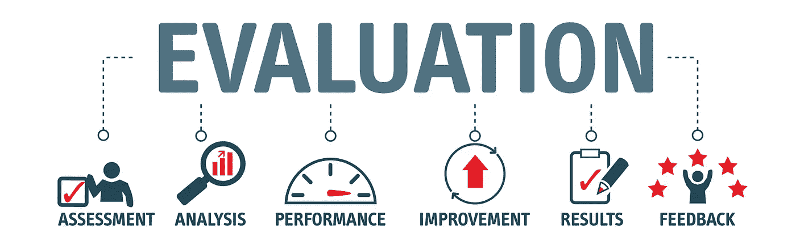

# 为什么客户成功是运营或交付领导的重中之重和关键 KPI？

> 原文：<https://medium.datadriveninvestor.com/why-is-customer-success-a-top-priority-and-the-key-kpi-for-operations-or-delivery-leader-a5b3073b6e7b?source=collection_archive---------3----------------------->

任何公司在危机/灾难场景中必须采取的首要步骤之一是**整合现有业务，避免客户流失**。这意味着在你考虑发展业务和探索新领域之前，先要吸引和加强你的客户群。在动荡时期，忠诚的客户是无价的资产，因为它

1.  确保稳定的收入流，
2.  通过推荐帮助获得新客户。

因此，**在新冠肺炎这样的危机中，客户的成功或满意应该是服务交付领导的首要任务**。具有讽刺意味的是，在这个时代，如此多的公司宣称以客户为中心、客户第一或客户至上，但大多数公司仍然只关注以公司为中心的指标。转变为采用 CPI 的公司——以及 CPI 产生的以客户为中心的文化和实践——将越来越胜过竞争对手，并为加速、差异化和可防御的增长进行更好的优化。

虽然客户通常没有带有数据可视化功能的在线仪表板来反映公司的表现，但客户确实会在每次互动中提出目的、问题、需求、意图或问题——一个期望的结果——以及对该结果实现的速度或难易程度的预期。当您的客户在追求其特定目标的过程中与人、系统、流程或政策互动时，确定与特定结果相关的 CPI。这些结果可以通过相关的客户绩效指标(CPI)来衡量。

一些真实的例子:

**营销:**一家顶级保险公司将*支付灵活性*作为 CPI 进行跟踪，因为他们提供多种支付计划选项的在线选择和管理。该公司跟踪他们提供的选项的数量和类型如何影响客户获取和保留 KPI。

**销售:**一家全球企业数据中心设备提供商跟踪*报价周转时间*，这可能会以与上述保险示例相同的方式影响成功的销售，但这是针对企业买家的(他们可能不期望在几秒钟内获得定制报价，但确实在一天后变得不耐烦)。

**产品管理:**一家音频产品制造商发现 CPI *知道哪些朋友喜欢这首歌*，他们以“朋友数量”的增量来衡量，这加强了社会认可和幸福感。该 CPI 被发现会影响商业 KPI，如客户花在流媒体音乐和新歌购买上的时间。

**客户服务:**许多客户服务组织跟踪 CPI *第一次解决*，它衡量客户的问题在第一次询问时是否得到解决(令客户满意)。这会影响客户保持率和终身价值 KPI。

**运营:**美国一家杂货店送货服务公司测量 CPI *无破损*(鸡蛋或易碎食品或容器)。该 CPI 不仅影响 KPI，如客户保持率和终身价值；它还会影响与客户服务、发放信用和/或更换损坏物品的成本相关的公司节约。

**财务:**虽然许多组织跟踪*客户* *终身价值*，这是一个衡量公司在客户关系持续期间从客户那里获得的价值的 KPI，但一些组织(包括上面提到的音频产品制造商)也开始关注相反的方面:在同一期间交付给客户的价值，这些价值可以在用户门户网站上向客户显示，或在续订前传达。受影响的 KPI 包括客户保持率、忠诚度和经典寿命

# 对优质 CX 的需求正在上升

不可避免的是，当面临经济不确定性时，客户体验和满意度将成为成功企业和苦苦挣扎的企业之间的区分基准。甚至在疫情之前，公司就在寻找新入职的客户体验专家来支持他们的发展。

自 2010 年初首席客户官[首次出现以来，我们已经走过了漫长的道路。今天，这个领域的专家](https://www.forrester.com/report/The+Rise+Of+The+Chief+Customer+Officer/-/E-RES57931)[来自不同的背景](https://www.mycustomer.com/resources/submit/33810)，包括服务交付(22%)和联络中心管理(7%)。他们是服务交付团队(和其他面向客户的利益相关方)的 CX 计划的先锋，确保每个客户的需求都得到认可、满足，并跟进反馈。

换句话说，IT 服务交付变成了以客户为中心的活动，而不仅仅是功能性的活动，不断增加价值来帮助业务。

Innosight 的高级合伙人 Scott Anthony 在产品开发和服务交付的流行的**待完成工作或 JTBD 理论**的背景下解释了这种“客户需求”。他说:“基本的想法是，顾客不买产品和服务，他们雇佣他们是为了完成他们生活中的工作。”。

“突然之间，我们生活中有了新的挑战。我们将如何处理连续 10 个小时的变焦电话？怎样才能让孩子有事可做？在社交距离化的时代，我们如何社交？思考你正在努力完成的真正工作，可以突出创造性地解决这些问题的不明显的方法。”

将 IT 服务和产品视为客户的增值工作，可以帮助服务领导者重新设想他们的交付途径，并在危机期间提高满意度。

# 利用 CPI 有明显的好处

客户绩效指标(CPI)是 IT 中优先考虑以客户为中心的核心。在我们深入研究除传统 KPI 指标之外对 CPI 的需求之前，让我们先看一下这样做的好处:

●**CX 的领导力和客户服务质量之间有很强的相关性。** 73%的 CX 领导者认为改善服务体验极其重要。相比之下，落后者更看重解决方案本身，而不是服务体验。这种单向的方法可能会在经济放缓的环境中阻碍业务的可持续性，并因此降低对 IT 解决方案的投资。

● **对 CX 的强烈关注意味着你的反馈数据是大众化的。**将客户反馈锁在象牙塔里会阻碍你的一线人员在正确的时间采取行动。这就是为什么 CX 领导者接触高级管理层、CX 团队成员、中层管理人员和一线员工的比率比落后者高 7-22 个百分点。

● **以客户为中心有助于您更快获得 CX 投资回报。**客户体验领先者比落后者更有可能从服务体验投资中获得回报，确切地说，是落后者的 6 倍。这使得 CX 的领导者比落后的对手有 3 倍的机会提高他们的市场地位。在危机中，公司已经看到了收入的下降；以客户为中心可以抵消这一点。

现在让我们进入正题:服务交付组织如何以一种切实的方式监控和测量客户满意度？这就是 CPI 的用武之地。

# 什么是客户绩效指标(CPI)？

客户绩效指标(CPI)是对客户增值的**衡量标准**，基于此，您可以让服务交付主管承担责任。它试图为客户至上的世界重新构想传统的 KPIs 这从未像今天这样真实。

让我们举一个联络中心的简单例子。

每个员工每小时处理的**个电话是一个 KPI** ，直接转化为业务盈利能力。但在现实世界中，员工可能会试图在每次通话的体验质量上偷工减料，以提高效率——这个**符合你的 KPI 目标，但没有达到 CX 目标**。

相比之下，每次通话的客户努力是一个 CPI。它**衡量客户与高管互动、讨论问题并解决问题的难易程度。理论上，这可能看起来有点低效，并且需要你的员工投入更多的资金，但是会带来更高、更可持续的 CX 质量。**

今年早些时候， **HBR** [**称**](https://hbr.org/2020/04/the-most-important-metrics-youre-not-tracking-yet) **CPIs 为“你没有跟踪的最重要的指标”**而这背后的一个很大的原因，首先是制定一个 CPI 的问题。大多数公司仍然停留在传统的 CX 指数上，如 NPS 或 CSAT，这些指数充其量只能提供一个鸟瞰图。相反，危机情况需要细致的理解，检查客户旅程的每一个部分，以量化绩效。

# 继续实施消费物价指数

早在 4 月份(当时我们还在疫情的早期阶段)，HBR 就指出**没有两个组织能够朝着同一个 CPI 前进**。每个组织、服务和交付渠道要做的工作是不同的，您的 CPI 框架应该反映这种个性。

根据我的经验，数字优先时代的一些最重要的 CPI 包括:

●IT 自助服务门户上的用户数量占 IT 可支持的客户总数的百分比

●读者/客户参与自助服务内容

●首次联系解决率占票证总数的百分比

●每位服务交付主管的平均电话放弃率

在危机期间，想当然地认为顾客忠诚是一个致命的错误。真正的领导者会反其道而行之——他们会优先考虑 CPI，以激励员工朝着正确的方向努力，认识到客户最终是长期可持续发展的中心。

这当然包括您的**内部服务客户**(即业务单位和员工)和**外部利益相关者**等。

如需了解更多信息或分享您的宝贵反馈，请发送电子邮件至我的邮箱 ID。