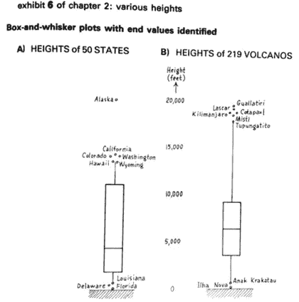

# 数据可视化的重要性从中世纪到现代是如何变化的？

> 原文：<https://medium.datadriveninvestor.com/why-is-data-visualization-important-bb250a448715?source=collection_archive---------2----------------------->

## 数据科学，数据可视化

## 在数据可视化中，许多发展和变化都是从过去到现在发生的

Source: [David Tan](https://unsplash.com/photos/3LTht2nxd34), Unsplash

本文将概述数据可视化从古至今的发展，指出并强调几个重要的发展。

有些时间数据在我们能够以图形或视觉形式查看它之前是没有意义的。您可以快速直观地看到自己的数据集。对于数据科学家和统计学家来说，这都是一项重要的技能。

# 我们所说的“可视化”数据是什么意思？

数据可视化是信息和数据的图形表示。它使用图形元素，如图形、图表和地图。它提供了一种交互式的方式来查看和解释数据趋势和模式。

> “寻找最能支持我们自然感知方式的人工记忆”——雅克·贝尔坦，1967
> 
> “用抽象的、非具象的图片来展示数字”——爱德华·塔夫特，1983
> 
> “分类和定量信息编码，主要通过位置，形状，大小，符号和颜色”——克利夫兰和麦吉尔，1985 年

# 数据可视化设计的历史背景

数据可视化从 17 世纪晚期就开始使用了。当时勒内·笛卡尔开发了一个二维坐标系统来显示数值。当威廉·普莱费尔发明了折线图、场图、圆形图和饼图后，可视化程度进一步提高。

由于“数据”是一个如此普通的概念，以及“可视化”的过程，它可以有几种形式。组合术语“数据可视化”避免了单一含义。

[Inquiry into the Permanent Causes of the Decline and Fall of Wealthy and Powerful Nations](http://www.branchcollective.org/?ps_articles=jonathan-sachs-17861801-william-playfair-statistical-graphics-and-the-meaning-of-an-event), William Playfair, 1805

# 为什么要可视化数据？

作为人类，我们通过视觉化来掌握信息。从外行人的角度来说，数据可视化就是对采集到的数据进行图形化的表示。它允许决策者根据可视化和交付的证据采取更多行动。

它给出了数据和图像之间的关系。数据可视化很重要，因为它可以更容易地看到趋势和模式。随着大量数据的产生，我们需要解读数据趋势。

机器学习在进行预测建模中起着至关重要的作用，这有助于可视化数据。

数据可视化对于数据科学家、数据分析师和业务分析师来说并不重要。而且对于在任何职业中理解数据可视化也是如此。

如果我们与广告、营销、开发、建筑合作，我们需要解释结果。这一事实说明了数据可视化的重要性。

数据可视化有很多用途。同时，业务需求和目标、数据可视化在许多方面有利于提高数据洞察力。

# 越来越接近数据

2013 年进行的关于对情绪指数的身体反应的研究关注了 700 名参与者。参与者得到了两个身体轮廓，并被告知要识别他们身体的部位。

他们相信，操作是基于他们所关注的感觉而增加或减少的。

将调查结果总结为空间密度热图。我们可以看到空间数据是如何展示每种情绪的简单故事的。

[Bodily maps of emotions](https://www.pnas.org/content/pnas/early/2013/12/26/1321664111.full.pdf), Lauri Nummenmaaa, Enrico Glereana, Riitta Harib, Jari K. Hietanend, 2013

# 了解影响

1854 年 8 月，伦敦索霍区的霍乱疫情是该地区众多此类疫情之一。当时，卫生和排水设施不足导致的人口增长加剧了这一问题——超过十分之一的人受到霍乱的影响。

约翰·斯诺博士与其他人合作，对霍乱患者进行研究，试图找到霍乱的病因。

当时霍乱的爆发还不是众所周知的“细菌现象”，巴斯德可能直到 1861 年才发现。

他的研究将宽街水泵描述为一个可能的原因，他主张更换水泵手柄以阻止疫情。

一些人认为这是流行病学研究的起源。这里修改的点状图是数据的直观显示，以及它如何应用于 Broad Street 泵。

[On the mode of the communication of cholera](https://canvas.harvard.edu/files/6632917/download?download_frd=1), John Snow, 1854, A redrawing appearing in “The Visual Display of Quantitative Information,” Edward R Tufte, 1983

# 发现模式

“统计学家”和“数据科学家”这两个搜索词说明了“数据科学家”的崛起是如何大幅度超越“统计学家”的。他们没有相同的作品，但他们有惊人的相似之处。

如果你是一名正在寻找新工作的统计学家，将“数据科学家”视为一个潜在的职业是一个明智的想法。

Google search term trends, 2004 to 2020

# 启用决策

1986 年 1 月，在零下 1 摄氏度(31 华氏度)，甚至比以往任何时候都更冷的温度下，美国国家航空航天局挑战者号航天飞机起飞了。不久后坠毁，七名机组人员全部遇难。

由此引发的对 Nasa 历史上最严重灾难的调查。确定了密封固体火箭助推器(SRB)部分的橡胶“O 型圈”。并防止燃烧气体泄漏。

为开发 SRB 的 Morton Thiokol 公司工作的工程师。声称 O 型圈没有在这么低的温度下测试过。在一次重要的会议上，制作了两张幻灯片。

一份是 SRBS 在华氏 53 度以下没有检查，另一份是 o 型圈发生故障的情况清单。这些数据点在蓝框中突出显示。

许多人声称，比如爱德华·塔夫特，更有可能说服 NASA 的管理者。通过计划数据点来推迟任务。

然而，说真的，我们不能这么说。NASA 的“go-fever”是各种外部和内部企业挑战的产物。

可以声称的是，通过可视化结果，考虑低温发射的可能危险要容易得多。

[Visual and Statistical Thinking](http://williamwolff.org/wp-content/uploads/2013/01/tufte-challenger-1997.pdf), Edward Tufte, 1997

# 激励行动

出生于 1820 年，佛罗伦萨南丁格尔是一个社会改革家，统计学家，和现代护理的先驱。

她对 1853 年至 1856 年克里米亚战争期间英国士兵在医院死于可预防疾病的经历感到震惊。她为更好的护理而奋斗。

南丁格尔的《玫瑰》是她发表研究的一个例子，向非统计学家展示士兵死亡背后的数字。

她的研究激励政府加强军队医院服务。特别是通过减少可预防疾病的死亡。

[Matters affecting the health, efficiency and hospital administration](https://www.ncbi.nlm.nih.gov/pmc/articles/PMC4386633/), British Army Florence Nightingale, 1856

# 语境化信息

这幅图像展示了拿破仑·波拿巴在 1812 年至 1813 年间发动的灾难性俄罗斯战役的流程图。查尔斯·密纳德的《制图》出版于 1869 年，是一位土木工程师，也是在工程和统计学中使用图形的先驱。

爱德华·塔夫特将其归类为有史以来最好的统计图表。但这还不清楚。

这可以很好地将许多变量转化为一个单一的图像。这显示了军队的规模，地理位置，行进路线，以及在某些日子里群体是如何分裂的。这显示了静修时非常寒冷的天气。

[**Army Size, location, dates, direction, the temperature during the retreat**](https://www.edwardtufte.com/tufte/minard)**, Edward Tufte**

# 良好的视觉效果

gap minder 是国家随时间变化的动态气泡图可视化。因汉斯·罗斯林教授在 2007 年引人注目的 TED 演讲而闻名。

如果你以前没看过，就在 YouTube 上。这显示了许多变量的编码，并且对于以可关联的方式向大多数受众表达数据是必要的。

[Life Expectancy Bubble chart](https://www.gapminder.org/tools/#$chart-type=bubbles), Hans Rosling, Gapminder

# 视觉效果不好

此图表明无法直观地传达结果。在现实中，它故意阻止理解是惊人的，但不是积极的事情。

图形太密集，不仔细检查就看不懂，而且条形标记增加了笨拙感。

它只编码一个值，而且做得不好。x 轴是弯曲的，并且整个数据集不在一个维度上表示，这因此避免了简单的视觉比较。

图形的焦点是中间的黑条，但关键信息在图形的两侧。眼睛如何扫描图形？

[Life expectancy at birth](http://visualoop.com/infographics/life-expectancy-at-birth), Macelo Duhalde

# 威廉·普莱费尔

苏格兰政治经济学家，生于 1759 年。他被认为是数据可视化的伟大思想家之一。

在他的职业生涯中，Playfair 做过很多工作，但最突出的是工程图纸设计师和他后来的经济学家工作。

在他作为经济学家的后期研究中，Playfair 试图避免表格化的细节，而决策者已经与这些细节分享了他们的信息。

1786 年，他利用自己所受的制图培训和制图知识，撰写了《经济和政治地图集》。他被认为永远改变了我们看待数据的方式。他将条形图、折线图和饼图正式化。

[Playfair’s trade-balance time-series chart The Commercial and Political Atlas and Statistical Breviary](http://scihi.org/william-playfair-and-the-beginnings-of-infographics/), 1786

# 雅克·贝尔坦

雅克·贝尔坦生于 1918 年，是地理学家和制图师。他的著作《Sémiologie Graphique》被认为是数据可视化的关键文本之一。

根据“视觉变量”的优先信息编码形式对统计图形的研究超越了他的时代。

[Semiologie Graphique](https://perso.liris.cnrs.fr/robert.laurini/4if-pdf/I-1.pdf), 1967

# 约翰·w·图基

他生于 1915 年，是一位传奇的美国统计学家。他在统计学领域贡献良多，但我们对他的数据分析和可视化方法感兴趣。

他提倡探索性方法的例子。对数据进行分析，通过验证性方法得出推论。

例如，用于检验假设的数据。他特别呼吁使用可视化来分析数据。1977 年，他在《探索性数据分析》中发表了一本关于探索性数据分析的书，在此过程中，他发明了一种盒子模式。

[Boxplot](http://www.sumsar.net/blog/2014/03/oldies-but-goldies-statistical-graphics-books/), Exploratory Data Analysis, 1977

# 爱德华·塔夫特

他于 1942 年出生，是耶鲁大学的讲师。1975 年，他应邀在普林斯顿给一群学生记者讲授统计学。他认为现有的统计图在视觉质量上有缺陷。

这个最初的课程变成了约翰·w·图基的系列讲座。以及 1982 年自己出版的一本书《量化信息的可视化展示》。

许多人可能认为 Tufte 是数据可视化的“教父”。数据墨水的定义对重新设计过程至关重要。

数据-墨水比率是用于显示真实数据的墨水相对于整个显示中使用的墨水量的比例。

[**Data Ink Ratio**](https://infovis-wiki.net/wiki/File:DIR.jpg)**, Edward Tufte, 1983**

# 结论

在过去的三十年里，图形的使用更加普遍。在 20 世纪下半叶，杰出的学者们开始发展数据可视化的科学和艺术，并将其推向更高的高度。

信息可视化可以洞察传统描述性统计的弱点。

考虑到当前数据的加速增长，数据可视化方法是一种有效且有凝聚力的数字表达量化内容的方式，它允许用户更高效地访问大量信息。

*现在，把你的想法放在****Twitter*******Linkedin****，以及****Github****！！**

****同意*** *还是* ***不同意*** *与绍拉夫·辛拉的观点和例子？想告诉我们你的故事吗？**

**他对建设性的反馈持开放态度——如果您对此分析有后续想法，请在下面的* ***评论*** *或伸出手来！！**

**推文*[***@ SauravSingla _ 08***](https://twitter.com/SAURAVSINGLA_08)*，评论*[***Saurav _ Singla***](http://www.linkedin.com/in/saurav-singla-5b412320)*，还有明星*[***SauravSingla***](https://github.com/sauravsingla)*马上！**