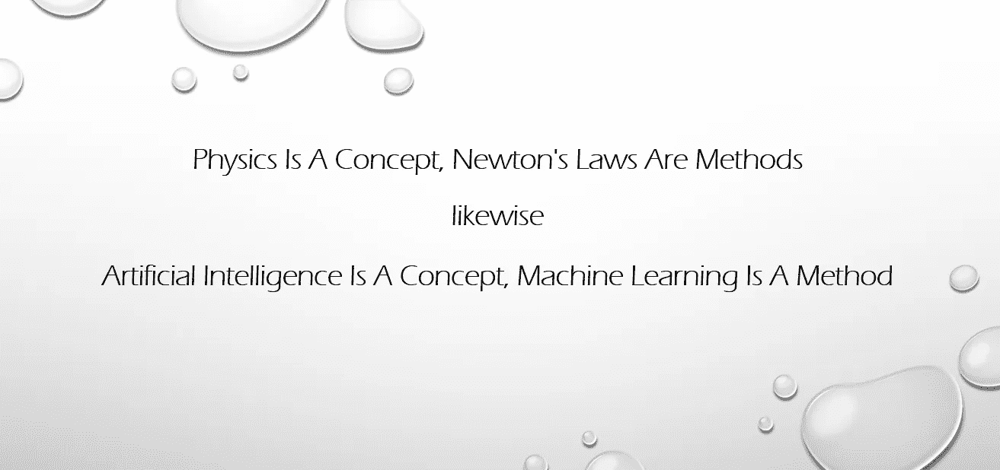

# 为什么企业机器学习预测很难？

> 原文：<https://medium.datadriveninvestor.com/why-is-enterprise-machine-learning-prediction-hard-15bba4d40345?source=collection_archive---------13----------------------->

在我之前的故事中，我们讨论了企业使用 AI/ML 解决问题的目标。它们大致分为以下一种或多种:

1.  *解释—过去*
2.  *推荐—赠送*
3.  预测 *—未来*

“解释”的目标是理解一种现象或支持一种叙述。这在“商业智能”领域得到了很好的处理，它利用从过去的行动中吸取的教训来支持未来的决策。虽然它在许多方面都很有用，但并不特别有趣。

数字化转型的步伐越来越快，导致对人工智能技术的需求不断上升。如果一台机器能够独立感知声音、视觉、说话和移动，我们就称它为人工智能系统。如果我们将其分解为问题域，我们可以推断出以下情况:

> ***1。感知声音*** —语音识别、NLP 系统
> 
> **2** 。 ***见*** —计算机视觉，视频处理
> 
> **3** 。 ***说话*** —对话式人工智能，语音合成
> 
> **4** 。 ***自主移动*** —自主系统，机器人技术

如果我们密切关注所有在技术领域引起轰动的人工智能技术，它们几乎总是解决一个或多个上述问题领域。原因是人工智能系统只能实时推荐下一个最佳行动，因为重点是眼前或瞬间的未来。虽然人工智能系统是技术的奇迹，但它们并不特别有趣。

另一方面，预测是关于未来的。谁不想预测股市，哪个机构不想预测下个月、下个季度或者后年会发生什么。我们知道未来预测是多么具有挑战性，毕竟，如果我们如此擅长它，我们所有的问题都将得到解决。这对企业来说没有什么不同，因此，每当涉及到预测时，人工智能/人工智能的成功就太少了。

为了理解为什么预测是困难的，让我们进一步分解它。通常，企业试图解决两类问题或用例:

1.  **无形系统预测** —预测、业务流程等。
2.  **有形系统的预测** —每当涉及到一些物理的东西，其中数据来自传感器，如工业机器、电信基础设施，用于预测性维护。

为了更好地理解，让我们举几个例子。产品销售预测与产品本身无关。同样，当一个业务流程或系统被量化，并且我们想要预测该系统的未来行为时，它就是一个无形预测的例子。虽然具有挑战性，但这类问题已经取得了较好的成功。

当涉及到有形系统的预测时，如工业机器、航空航天系统、电信基础设施等。或者如果用于预测的数据来自物理系统的传感器，则预测的成功率很低。低成功率部分归因于数据质量问题、上下文和集体异常、数据中的固有噪声等。

任何企业中遇到的大多数业务问题都属于这三大类中的一个或多个。对我们面临的问题类型有一个很好的理解，允许我们快速失败和迭代。

作者 [Subhash Talluri](https://www.linkedin.com/in/subhashtalluri/) 是人工智能/人工智能领域的 AWS 解决方案架构师，拥有航空航天制造领域的专业知识和电信领域的经验。