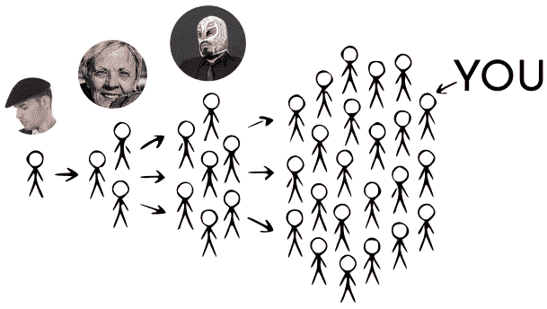
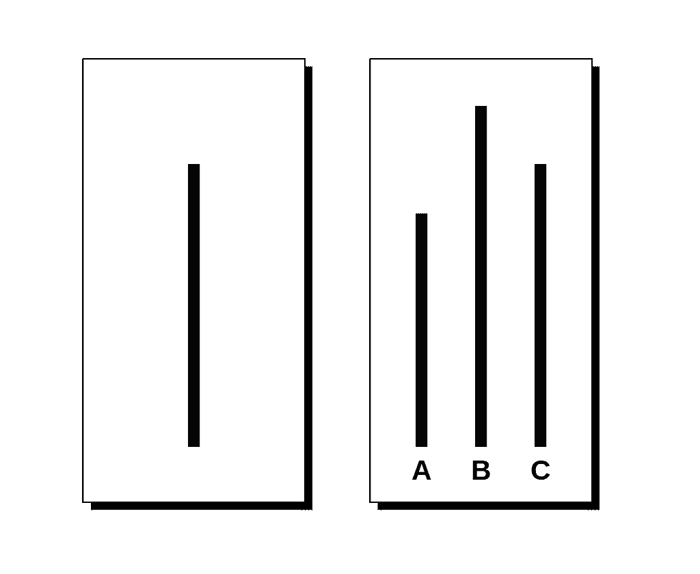
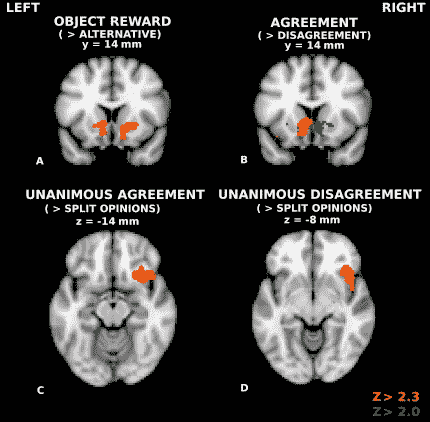
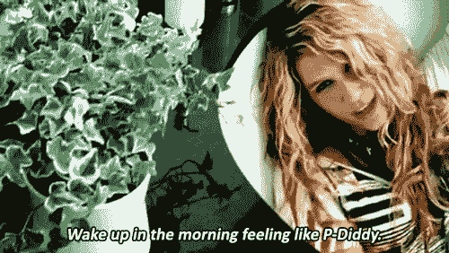

# 为什么大家都在买卫生纸？

> 原文：<https://medium.datadriveninvestor.com/why-is-everyone-buying-toilet-paper-1d5e2f9fd916?source=collection_archive---------6----------------------->

## 因果关系

## 经济学和心理学解释了新冠肺炎的恐慌性购买

Photo by [visuals](https://unsplash.com/@visuals?utm_source=medium&utm_medium=referral) on [Unsplash](https://unsplash.com?utm_source=medium&utm_medium=referral)

听着，我知道你离不开那个超柔的 Charmin 那就是家的感觉。没有羊绒双辊的生活是无法忍受的:谁不喜欢用新生小猫擦屁股的感觉？

**但这似乎有些过分:**

等等。新冠肺炎对你的排便速度没有影响，为什么这是一件事？

简而言之，人们正在囤积，因为在可预见的未来，他们可能不得不被隔离——他们希望限制他们不得不出门的次数。

隔着屏幕我几乎能听到你的笑声。*这些愚蠢的凡人*，你想。*他们应该储备不易腐烂的食物和医疗用品。你可能是对的。*

你当然是，你处于中等水平——你是个*知识分子。*

所以让我们试着弄清楚为什么人们会买这么多卫生纸。如果我们从 3 个不同的学科来探讨这个问题，会有 3 个不同的答案:

*   “嗯，其他人都准备好柔道踢那个老人了。” *(行为经济学)*
*   “这是我文化的一部分。” *(社会文化心理学)*
*   “我在正确的轨道上，宝贝，我是天生完美。” *(进化/神经生物学)(还有 Lady Gaga，2011)*

# 暂时假装你是一个冷静理智的人。

## *(这个对我个人来说很难，但我在努力)。*

你决定去杂货店购物——你计划晚餐做一份三分熟的牛排，因为你今晚有一位有吸引力的客人要来，你希望通过用你与肉类相关的烹饪技巧给他们留下深刻印象来加深你的血统。

当你进去的时候，你遇到一个戴着贝雷帽的高个子男人(大约 6 英尺 3 英寸)，他拿着两张 12 包的卫生纸从你身边走过。你嘲笑这个新冠肺炎焦虑的移动电线杆，不知道他买这些卫生纸只是为了他正在做的一个纸型艺术作品。

Photo by [Ravi Patel](https://unsplash.com/@ravi_patel?utm_source=medium&utm_medium=referral) on [Unsplash](https://unsplash.com?utm_source=medium&utm_medium=referral)

在你旁边，一个大约 40 到 140 岁的老女人(她通常认为病毒是政府的骗局)观察到了同一个男人。她还认为他是在为新冠肺炎的隔离区备货……并认为她最好买几包 12 支装的，以防万一。她得到三个。

Photo by [Jesus Santos](https://unsplash.com/@jesussantosphotography?utm_source=medium&utm_medium=referral) on [Unsplash](https://unsplash.com?utm_source=medium&utm_medium=referral)

一个戴着 luchador 面具的肌肉男看到她买了 3 包卫生纸。他*正在*争论他应该得到多少 TP，但是在看到这次购买后，他意识到情况肯定比他想象的更糟，于是自己拿起了三包。

 [## 为什么包容性财富指数比 GDP 更能衡量社会进步？|数据驱动…

### 你不需要成为一个经济奇才或金融大师就能知道 GDP 的定义。即使你从未拿过 ECON 奖…

www.datadriveninvestor.com](https://www.datadriveninvestor.com/2019/03/08/why-inclusive-wealth-index-is-a-better-measure-of-societal-progress-than-gdp/) 

你自己是鲁查·自由艺术的崇拜者，你停下来想一想……你刚刚看到所有这些人在卫生纸上花的钱比你在狗的生日上花的还多。

(虽然不是很多，但仍然值得注意。)

你到达 TP 通道。

你犹豫了。

想想吧。

你注意到那个老人盯着和你一样的羊绒双层卷。你见过他不时走出社区中心。他辅导坐轮椅的孩子。

你继续柔道踢他的太阳神经丛，因为你抓住三个 12 包，塞进你的购物车。在你意识到你忘了买牛排之前，你迅速逃回家。

现在告诉我…

# 你柔道为什么踢老人的太阳丛？

## 在行为经济学中，这被称为“信息级联”。在现代社会，这叫作妖。

它通常在以下几种情况下发生:

*   我们的理性有其局限性:我们试图根据我们所知道的做出理性的决定，但我们对世界的了解是有限的——这意味着我们会受到社会压力的影响。
*   **我们并不总是知道人们为什么会做出这样的决定:**我们通常试图将他人的行为归因于某些因素，但我们可能会犯错误。
*   **我们可以看到其他人做出的决定:**阵容、人群、社交媒体——比以往任何时候都更容易看到人们在做什么。

它还通常涉及做出一个非此即彼的决定:煎饼对华夫饼，蕾哈娜对碧昂斯，或者在这种情况下，合理数量的卫生纸对不合理数量的卫生纸。

当你看到一群人做出与你的判断相反的决定时，这通常足以证明你的判断是错误的，你应该做他们正在做的事情。

所以你看到了 luchador，看到了老妇人，看到了高大的艺术家，他们都做了同样的决定。尽管高个子艺术家出于完全不相关的原因这样做了，但它*(不正确)*向你和其他所有人传达了这样的信息:COVID 比你想象的更糟糕，你也应该购买不合理数量的 TP。

## Boom —信息*级联*。

许多其他人看到了同样的决定，他们可能会以同样的方式行事。随着这一规模的不断扩大，越来越多的人将会购买大量的茶多酚。**这种现象也解释了为什么人们都在抛售自己的股票和市场的痛苦。**

这里重要的是，这些决定是根据被认为准确的信息顺序做出的。但是你为什么如此关心其他人在做什么？

# "我希望我能像那些酷孩子一样。"Echosmith，2013 年。

## 社会文化心理学可能会把这归咎于你的文化。

你可能听说过从众。这是 99%的朋克明星唱的关于*而不是*在做的事情。

Photo by [Austin Neill](https://unsplash.com/@arstyy?utm_source=medium&utm_medium=referral) on [Unsplash](https://unsplash.com?utm_source=medium&utm_medium=referral)

这也是一种被广泛研究的心理行为，你是否选择从众取决于很多因素，包括你的文化。

心理学家经常使用**阿施线范式**来衡量一致性。想象一下，我把你和另外 5 个人放在一个房间里，给你看这张照片:

然后我问你哪条线的长度最接近左边卡片上的那条线。你前面的 5 个人都回答 a 行。你的答案是什么？

如果你参与最初的实验，**有大约 36%的几率你也会说**，尽管它显然是错的。其他 5 名参与者是演员，他们会在大多数试验中故意一致地选择错误的答案。

研究人员试图了解人们服从多数的频率，老实说，36%是相当高的。Asch 认为这是因为遵从群体理想会赢得社会认可。

## 但这足以解释今天的 TP 热潮吗？

心理学家使用被称为**文化维度**的通用标准来比较不同文化间的行为——基本上是一种针对不同文化的迈尔斯-布里格斯个性测试。

其中一个维度是**个人主义**(人们看重自给自足和个人认同)vs. **集体主义**(群体认同更重要)。

Berry Katz(1967)的一项研究通过对两种不同文化——塞拉利昂的 Temne 人和加拿大的因纽特人——给出 Asch 范式的一个版本，发现了个人主义得分高和从众程度低之间的关联。

Collectivist Temne people (left) tended to conform while individualistic Inuit people (right) did not.

所以，**高个人主义得分=低从众。**澳大利亚、加拿大、美国的个人主义得分分别是 90、80、91(满分 100)，所以文化从众大概起不了多大作用。

如果不是文化影响导致了抢购，那是什么呢？

嗯，可能是因为如果你不储备卫生纸…

# “你会死的。”—特里普·里德，2019。

## 或者至少你的大脑是这么想的。

文化进化研究表明，模仿大多数人可以让我们采取最适合当地生存的行为。从众的进化基础意味着某种相应的神经机制——大脑的一部分，评估其他人做出的决定。

(听起来像是家庭聚会上的未婚阿姨，对不对 tttt)

Photo by [Terry Vlisidis](https://unsplash.com/@vlisidis?utm_source=medium&utm_medium=referral) on [Unsplash](https://unsplash.com?utm_source=medium&utm_medium=referral)

更具体地说，它将着眼于人们之间的共识水平。没有太多的实验从经验上来看这个问题，但是坎贝尔-梅克尔约翰等人(2010 年)的一项实验发现了一些有趣的证据。

他们给参与者看了两首歌的名字，一首是他们喜欢的，一首是他们不知道的。他们还向参与者展示了两位专家评论家对两首歌曲的偏好。当专家和参与者都同意自己的偏好时，大脑中被称为*腹侧纹状体(A)* 的部分被激活。

每当参与者听到凯莎 2010 年的热门歌曲《Tik Tok》时，这个*腹侧纹状体*也会被激活。

(我只是开玩笑。)

如果参与者发现研究人员**会为他们购买他们更喜欢的歌曲**，大脑的同一个部分就会被激活。*(这是 2010 年，人们还在买音乐。)*

换句话说，**如果他们会得到奖励，它就会亮。**

最后，他们发现，当一名参与者看到其他人的观点并影响他们时，腹侧纹状体的大小会对该物体的价值做出相应的改变。

简而言之，当你同意别人的观点时，你大脑中被激活的部分也会在你得到你想要的东西时被激活。你可以看到这在生存环境中是多么有用——如果大多数人都在做某件事，这可能是个好主意，所以你的大脑会奖励你这样做。

看起来这是个很好的服从我的理由。你不同意吗？

😉

# 那么，为什么人们要买这么多卫生纸呢？

*   看到别人做出的决定会影响我们自己的决定——即使这违背了我们的判断。
*   一些文化比其他文化更看重一致性——它允许社会认可。
*   同意大多数人的意见有一种进化优势，所以你的大脑会奖励你这样做。

## 为什么这对我很重要？

*   现在你知道不要投资任何卫生纸创业公司——在这场恐慌结束后，人们不会再购买任何 TP，因为级联将停止；他们会等到目前的供应耗尽。
*   如果你想在一种集体主义文化中销售一种产品，使用像本地证词这样的东西:它可能会比其他方法走得更远。
*   逆势而为是很难的，因为你不是天生的不墨守成规者。

这是我称之为*因果关系*的新系列的一部分，在这里我试图通过不同科学+学科的视角来回答我们现在都在问自己的一个问题。让我知道你的想法！

*大家好，我是 Murto，是一名 17 岁的企业家和加拿大多伦多的学生。如果你对这篇文章有任何反馈，或者你只是想聊天，请通过*[*LinkedIn*](https://www.linkedin.com/in/murto-hilali-7a6068136/)*联系我！下一步:*

*   战胜你的敌人
*   *踢某些人的屁股*
*   *祝你今天愉快*

谢谢！