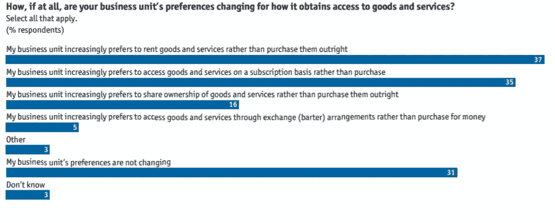

# 为什么现在什么都要订阅？

> 原文：<https://medium.datadriveninvestor.com/why-is-everything-a-subscription-these-days-611926b5bafd?source=collection_archive---------6----------------------->

## 或者如何为你的企业创造经常性收入

Photo by [Markus Winkler](https://unsplash.com/@markuswinkler?utm_source=medium&utm_medium=referral) on [Unsplash](https://unsplash.com?utm_source=medium&utm_medium=referral)

在更新我的苹果音乐订阅、查看网飞的新节目以及在 Medium 上写这篇文章时，我意识到了一些事情。大多数技术产品和服务都是基于订阅的，这在今天并不奇怪。科技公司不仅要制造出令人惊叹的产品，还要找到一种可持续的方式来赚钱。订阅计划无处不在，但为什么它们现在对硬件和软件初创公司如此重要？

# 所有权的概念

在某些领域，订阅模式非常有意义，而且看起来非常直观。例如，定期送货服务，如每周膳食计划或每月美容产品。对于此类服务，一次性付款不再有效。由此，我们可以注意到从拥有转向租赁的大趋势。汽车租赁是最显著的例子。

(Image by The Economist Intelligence Unit)

正如我们从《经济学人》进行的研究中看到的，超过 80%的企业正在将其模式转变为某种类型的定期支付方式。租赁和订阅似乎是请求最多的模式。

 [## 筹集启动资金？保持势头并成功达成交易的 5 个步骤|数据…

### 实质-愿景和结果，换句话说，团队+牵引+技术风格-以一种…

www.datadriveninvestor.com](https://www.datadriveninvestor.com/2020/08/16/raising-a-startup-round-the-5-steps-to-keeping-momentum-and-actually-close-successfully/) 

这些需求得到了很好的满足，现在**软件即服务(SaaS)** 在许多领域占据主导地位。你现在可以订阅健身培训(ClassPass)，营销和销售课程(HubSpot)，网站开发软件(Webflow)，以及许多其他东西。目前，您可以毫无问题地订购任何类型的硬件或软件产品。

# 给客户带来的好处

Photo by [freestocks](https://unsplash.com/@freestocks?utm_source=medium&utm_medium=referral) on [Unsplash](https://unsplash.com?utm_source=medium&utm_medium=referral)

订阅模式可能对软件开发人员有用，但是客户才是我们最终想要满足的。整个想法是由客户推动的，这并不奇怪。相对较低的*月(年)订费*明显低于前期拥有成本。此外，我们可能一辈子都不需要访问网飞(至少不是所有人都需要)，所以服务*可以随时暂停*。同样的退货过程要复杂和耗时得多。理论上，订阅可以让客户*觉得更有价值*，因为他们只是有一个选择。如果 Spotify 的竞争对手碰巧收取更低的费用并提供更好的功能，为什么不转换呢？因此，该公司必须不断更新产品，并照顾好客户。

# 对公司的好处

Photo by [Austin Distel](https://unsplash.com/@austindistel?utm_source=medium&utm_medium=referral) on [Unsplash](https://unsplash.com?utm_source=medium&utm_medium=referral)

订阅模式给公司带来的好处也不可低估。首先，*收入变得一致*且可预测。客户将每月更新他们的订阅，这无疑支持了公司。根据《企业家》杂志，公司的经常性收入是投资者的头号因素。这表明了他们投资的某种稳定性，并使未来变得更加可预测。

订阅模式适用于任何类型的*独家内容*。例如，看看所有主要的流媒体服务。Spotify 不断购买著名的播客并使其成为独家(你好，乔·罗根)，网飞制作仅在该平台上提供的节目，这样的例子不胜枚举。如果你的商业模式可以很好地处理这种类型的内容生产，那么订阅模式就有很大的潜力。

# 从哪里开始

Photo by [Kevin Bhagat](https://unsplash.com/@kevnbhagat?utm_source=medium&utm_medium=referral) on [Unsplash](https://unsplash.com?utm_source=medium&utm_medium=referral)

在决定全力以赴进行订阅之前，*考虑它是否真正适合*你的商业模式是至关重要的。某些产品根本不适合这种模式，而且在很多情况下，这种转换不会带来任何好处。从小的开始*也许是个好主意。*

确保你*对这种转变将如何发生以及首先要做什么有一个清晰的愿景*。商业模式和设计必须经过深思熟虑。测试当然也不会有什么坏处。

如果您正在考虑将订阅模式添加到您的产品中，现在比以往任何时候都更容易。WordPress 通过让任何用户都可以使用它来推动这个过程。他们现在允许你在网站上添加定期付款。平台会用自己的支付系统替你管理。

对于硬件开发者来说，考虑一个目前卖得不好的产品，或者给你的主产品增加一些功能。就 Sphero 而言，教育玩具由学校定期支付。这种订阅解锁必要的功能，并允许更多的优质内容。

# 结论

总的来说，软件订阅和硬件租用现在与技术本身紧密相连。我们日常使用的大多数服务都是以某种形式或临时订阅的形式出现的。作为开发人员或小公司所有者，忽略这种模式可能会对您的利润和产品开发造成严重损害。你不需要一个大公司来开始，任何小的想法都有很大的潜力。尝试这种模式比以往任何时候都更容易，所以尽你所能将它纳入你的计划，它会有回报的。

# 参考资料:

经济学人信息部。(2013).按需供应:适应消费和交付模式的变化。2020 年 8 月 14 日检索，来自[https://eiuperspectives . economist . com/sites/default/files/EIU _ 佐拉 _WEB_Final.pdf](https://eiuperspectives.economist.com/sites/default/files/EIU_Zuora_WEB_Final.pdf)

佩雷斯，S. (2019)。WordPress.com 网站现在可以接受新的“定期付款”功能的订阅。2020 年 8 月 14 日检索，来自[https://TechCrunch . com/2019/11/12/WordPress-com-sites-can-now-accept-subscriptions-with-new-recurring-payments-feature/](https://techcrunch.com/2019/11/12/wordpress-com-sites-can-now-accept-subscriptions-with-new-recurring-payments-feature/)

Priestley 博士(2020 年)。最大化你的企业价值的三个最大因素。检索于 2020 年 8 月 14 日，发自 https://www.entrepreneur.com/article/345528

**访问专家视图—** [**订阅 DDI 英特尔**](https://datadriveninvestor.com/ddi-intel)