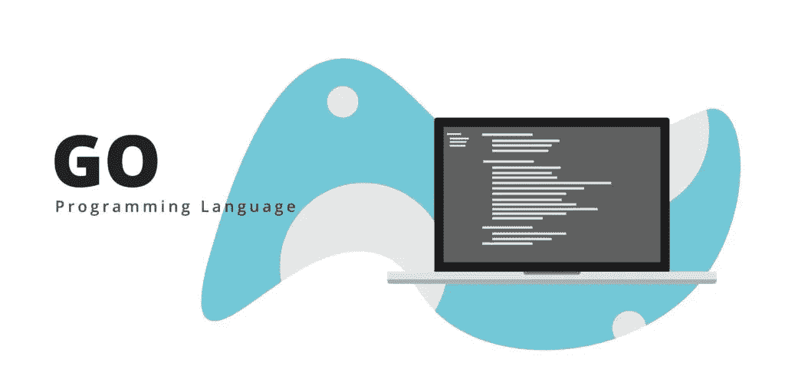
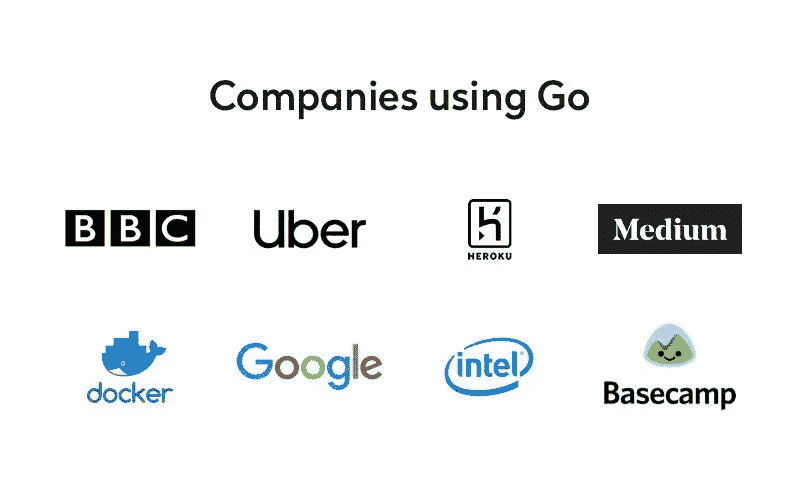

# 为什么 GO 语言是未来有前途的编程语言？

> 原文：<https://medium.datadriveninvestor.com/why-is-go-language-a-promising-programming-language-for-the-future-d48181b3f0bc?source=collection_archive---------3----------------------->

Go 是一种开源编程语言，可用于轻松构建简单、可靠、高效的软件。它是编程语言世界的新成员。Go 语言于 2007 年构思，2012 年正式发布。在多核处理器、计算机网络和大型代码库的时代，Google 首先采用它来提高编程效率。最常用的编程语言是 Python。新东方投资数千万的在线少儿编程教育机构极客晨星应运而生。极客晨星少儿编程是新东方投资的少儿编程机构。它采用游戏式的互动教学方式，螺旋式上升无缝衔接的课程体系，专业教师倾力打造可视化模块课程，培养孩子的逻辑思维能力、想象力和创造力，以及 6–16 岁幼儿的综合学科能力。到目前为止，极客晨星的编辑已经和家长们，尤其是 80 后、90 后的家长们聊过孩子的编程教育问题。

Go 是谷歌在 2009 年推出的一种语言。它是为 web 服务器、存储集群或类似的巨型中央服务器设计的系统编程语言。

对于高性能分布式系统领域，Go 语言无疑比大多数其他语言更高效。它提供了大量的并行支持，这对于游戏服务器开发来说是非常好的。

直到现在，Go 开发都是完全开放的，有活跃的社区。

 [## 2019 年学习的最佳编码语言

### 在我读大学的那几年，我跳过了很多次夜游去学习 Java，希望有一天它能帮助我在…

www.datadriveninvestor.com](https://www.datadriveninvestor.com/2019/02/21/best-coding-languages-to-learn-in-2019/) 

那么，围棋到底有什么样的魔力和魅力呢？有哪些大公司在用 GO？

1.谷歌

作为一家开发 Go 语言的公司，这个就不用介绍了。Google 有很多基于 Go 的优秀项目。

2.脸谱网

脸书也在使用它。为此，他们还在 Github 上建立了开源组织 facebook Go，比如众所周知的平滑升级 grace。

3.腾讯

腾讯作为国内大公司，还是敢于尝试的，尤其是 Docker 容器化。他们已经做了 15 年的码头工人。

4.百度(全球最大的中文搜索引擎)

目前已知的百度的使用是在运维端。它是百度运维的一个 BFE 项目，负责前端流量接入。

5.阿里

阿里巴巴的具体项目不是很清楚，但是听说它的系统部，CDN 等。正在 Go 里招人。

6.京东

京东云消息系统、云存储、京东商城都使用 Go 进行开发。

7.小米

小米对 Golang 的支持不止是运维监控系统的开源，是[http://open-falcon.com/](http://open-falcon.com/)

此外，小米互娱、小米商城、小米视频、小米生态链等团队都在使用 Golang。

8\. 360

360 也大量使用 Golang。一个是开源日志搜索系统 Poseidon，托管在 Github 上。https://github.com/Qihoo360/poseidon