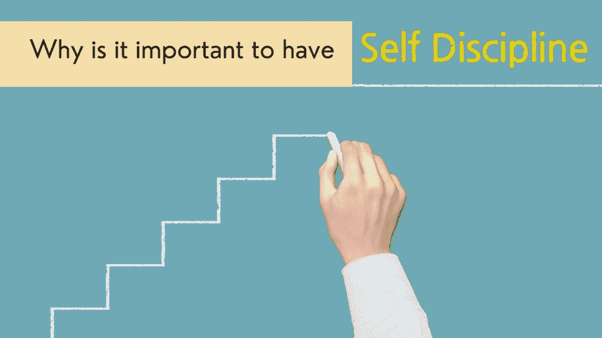
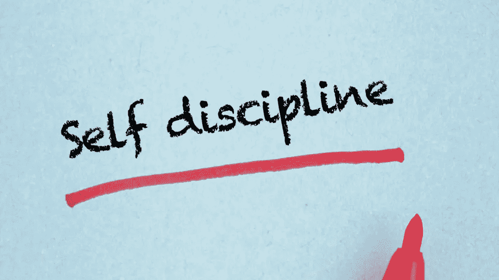

# 为什么自律很重要？

> 原文：<https://medium.datadriveninvestor.com/why-is-it-important-to-have-self-discipline-17e6f2b763a0?source=collection_archive---------1----------------------->

canva.com user-edited photo

自我约束是“最重要的成功原则”之一。这是一种控制自己并跟踪自己行为的能力，主要是做正确的事情来发展个人进步。

许多人都在以不同的方式和原因与自律作斗争，这些人觉得他们对自己的选择或行为缺乏控制，但你知道为什么大多数人缺乏自律或控制自己有许多基础和原因吗？

嗯，第一个原因是因为缺乏动力、激情或紧迫感来实现目标或学习他们渴望的新东西。这是人们需要关注的。如果没有做某事并成功完成它的冲动，就不会有自律，因为，为了在一个人热衷的事情上取得成功，他们必须学会自我控制，知道如何首先自律。

> 事实上，没有人从一开始就在生活的各个方面足够自律。不是每个人都有自制力，因此，培养自律很重要。

也就是说，自律是一种可以通过实践和养成良好习惯来学习的技能。一个人需要有改变的意愿，特别是对于那些缺乏自律意志力的人，因为如果一个人不发展自律，他们生活中的所有其他领域都可能受到影响。问题会出现，包括缺乏重点，拖延，被分心，以及有关他们生活的主要领域的问题，如健康问题和缺乏财务稳定性。这些问题之所以会发生，是因为缺乏自律的人会遇到无法控制的行为或习惯。因此，这是一项非常重要的技能，可以让任何人保持专注，控制自己，以及面对任何情况。

和其他类型的自我提高一样，除非你真的不断努力，否则培养和提高自律是不可能的。话虽如此，训练你的大脑去做一些你不熟悉的新事情，这样你的大脑就会适应变化并熟悉它，同样的道理也适用于每天的好习惯，一旦你每天练习，你最终会适应的。

**为了更好地理解什么是自律，下面列举了一些练习自律的好习惯:**

canva.com user-free photo

**1。准时醒来**——如果你熬夜了，需要早起去做重要的事情，那就去做吧！因为如果你试图抗拒醒来，这只会促使你睡得比预期的时间长，从而错过你需要做或参加的最重要的事情或事件。制定一个睡眠和起床时间表，这样你就不会因为睡过头而错过第二天的任务，因为一旦你已经完成了，第二天早上很可能会和今天一样。

**2。避免拖延，现在就做**——停止找借口！如果你今天能做到，不要说你明天就会开始，这只会拖延你的进步。一劳永逸地停止为自己找借口，现在就开始努力吧。如果你总是拖延，你只是在教自己继续这个坏习惯。

**3。健康饮食**——如果一个人选择健康饮食，那么这个人就足够自律，避免那些只能带来短暂快乐的食物，而是专注于长期变得更健康。当一个人饮食健康时，他们会更加控制自己的食欲，把健康放在第一位。

**4。日常锻炼**——一个经常锻炼的人展示了他们是多么自律，因为他们关注自己的身体健康，这给了他们强烈的责任感。

**5。保持你的空间整洁——整理你的公寓或房子，或者仅仅是你工作的地方，会让你心情平静，提高你的工作效率和生活质量。通过整洁，你不仅发展和变得自律，还提高了你的组织能力。**

**6。设定期限**——如果你需要完成一个项目或一项任务，设定一个开始日期和期限。在你设定的特定时间框架内完成它，并确保在截止日期或之前完成。不要为了做其他事情而拖延或移动你已经设定好的时间。通过这样做，它可以极大地提高你的自律。

**7。列一个优先清单**——把你的任务排序，把需要完成的最重要的事情排到最不重要的，这样你就能在进入下一个任务之前先集中精力完成最困难或最重要的任务。

~~~~~~~~~~~~~~~~~~~~~~~~~~~~~~~~~~~~~~~

**如果错过了我们之前的文章，可以点击下面这些链接阅读；**

 [## 如何更符合自己的人生目标

### 一致性是成功的关键。你必须全身心地投入到你所做的每一项任务中，以实现你的目标和…

medium.com](https://medium.com/datadriveninvestor/how-to-be-more-consistent-with-your-life-goals-69603364c004)  [## 当别人都不相信自己时，如何相信自己

### 相信自己是走向伟大的第一步。如果你…

medium.com](https://medium.com/datadriveninvestor/how-to-believe-in-yourself-when-no-one-else-does-a1bf2b2f01ec)  [## 培养创新思维的 7 个好习惯

### 创新是能够做别人从未想过要做的事情，以前从未做过的事情，或者…

medium.com](https://medium.com/the-innovation/7-good-habits-to-do-to-develop-an-innovative-mindset-413849330446)  [## 5 种方法将帮助你停止过于自我批评(如何处理…

### 你有没有发现自己一直在批评自己的所作所为，因为持续的…

medium.com](https://medium.com/the-innovation/5-ways-that-will-help-you-stop-yourself-from-being-too-self-critical-how-to-deal-with-ac6bce17d47)