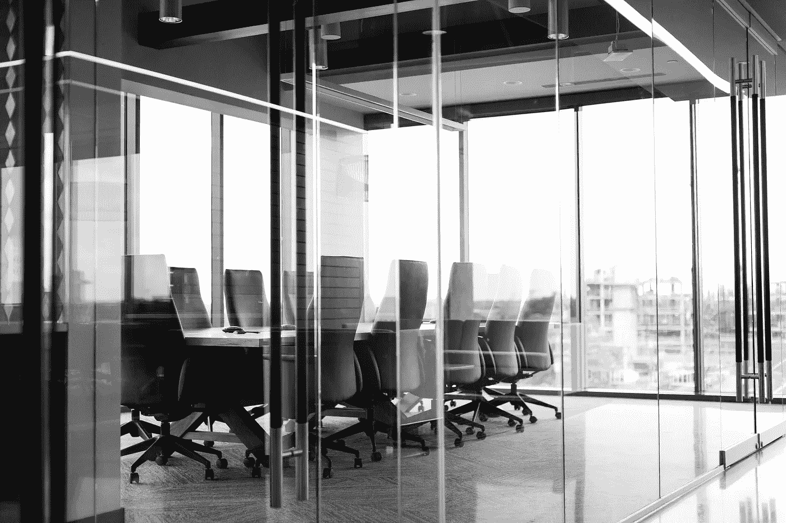

# 为什么没有人谈论主要首席执行官的大规模辞职？

> 原文：<https://medium.datadriveninvestor.com/why-is-nobody-talking-about-the-mass-resignations-of-major-ceos-a16ad83e001d?source=collection_archive---------0----------------------->

## 这里有些不对劲

Image: [Unsplash](https://unsplashe.com/@drew_beamer)

截至 2020 年 7 月，全球已有超过 1300 名来自大型企业的首席执行官在之前的 12 个月中离职。

人们列举了各种离开的动机。这些原因从个人原因到对服务需求的减少，甚至是积极的新冠肺炎诊断。

2019 年标志着历史上多位首席执行官在同一时间内离职的最大记录。

上一次数据如此接近还要追溯到 2002 年的，当时高管再就业公司 Challenger，Gray and Christmas 首次开始统计数据。

到 2020 年初，它没有显示出放缓的迹象。

仅在一月份，[就有 200 多名首席执行官辞去了他们舒适的职位，退出系统，兑现了自己的收入。](https://www.ccn.com/ceos-quitting-in-record-numbers-could-signal-total-stock-market-collapse/)

看看名单上的一些名字，我们也不仅仅是在谈论一些当地企业。

> 诺基亚、微软、洛克希德·马丁、L Brands、LinkedIn、Salesforce、Match、Hulu、Tinder、瑞士瑞信银行、Groupon、迪士尼、哈雷戴维森、万事达、耐克、易贝、IBM……你明白了。

这个清单还在继续。

# **但是为什么呢？**

在经济衰退期间，高层高管下台并不少见，但闸门早在 2019 年就打开了。在此期间，许多这些公司看到了疯狂的股市高点。

经济在蓬勃发展，我们幸福地意识到除了可口的啤酒之外，科罗纳什么也不是。

这种大规模外流甚至在 2008 年金融危机和随后的衰退期间都没有发生。

没什么意义。

对于这些高管中的大多数人来说，他们在今年 3 月冠状病毒在美国全面爆发之前就离开了。

我特别提到美国是因为这些公司中的大多数最初是在那里注册或总部设在那里。

对于大范围的辞职，人们提出了各种各样的假设，有些可能站得住脚，有些至少可以这么说。

在调查此事时，我一直坚持最符合逻辑的理论，而不是任何与阴谋相关的理论。

第一个也是最明显的一个是，这些高管得到了“中国大企业”的朋友的暗示，一种病毒即将袭击美国，而且会很严重。

据报道，早在 2019 年 11 月，中国就爆发了新冠肺炎，到今年 1 月，该国已经处于封锁状态，经济陷入困境。

鉴于其中一些公司拥有的权力和影响力，他们在中国商界的朋友们很容易警告大公司趁着机会离开，这不是不可能的。

这个想法在我看来很有分量，因为这些人中的许多人都是在病毒重创经济之前逃出来的。

他们的公司股票期权很可能被套现，而如果他们等得更久，谁知道他们会留下来处理什么样的金融混乱。

在病毒的全面影响之前离开可能还包括一个漂亮的金色握手，这在这种地位较高的职位上很常见。

Image: [Unsplash](https://unsplash.com/@jeshoots)

从这里开始，接下来的理论很快就变得黑暗，所有的理论都围绕着腐败。

最近在媒体上，大型快时尚公司 BooHoo 被指控在其工作实践中存在奴役行为。

公司的首席执行官们在这一点上对指控表示不知情，并正在私下调查，但正如我们所知，通常无风不起浪。

就在上个月，BooHoo 在英国莱斯特的一家工厂为一名卧底[《星期日泰晤士报》](https://www.thetimes.co.uk/article/boohoos-sweatshop-suppliers-they-only-exploit-us-they-make-huge-profits-and-pay-us-peanuts-lwj7d8fg2)记者提供了一份工作，时薪仅为 3.5 英镑，工作环境拥挤、肮脏。

没有观察到社会距离，现在这些工厂据称是莱斯特目前在英国冠状病毒病例数第二多的原因。

尽管 BooHoo 的首席执行官们没有下台，我还是用这个故事作为证据 A 来展示大企业中可能存在的腐败程度。

回到我们上面的列表，瑞士瑞信银行首席执行官 Tidjane Thiam 于 2020 年 2 月 6 日辞职，原因是该公司被发现利用私家侦探跟踪一名前员工。

当一位明星银行家决定叛逃到一家竞争对手公司时，该公司擅自跟踪前雇员伊克巴尔·汗，最终导致实际的[私家侦探](https://fortune.com/2019/10/01/credit-suisse-banker-spying-investigator-dead/)死亡和一大堆负面新闻。

老实说，我不会编这种东西。

到目前为止，主要是企业间谍和不安全的劳动行为。但是最令人担忧的谣言(在这一点上，我必须这样称呼它们)至少是令人担忧的。

2017 年 12 月 21 日，现任总统唐纳德·特朗普签署了一项[行政命令](https://www.whitehouse.gov/presidential-actions/executive-order-blocking-property-persons-involved-serious-human-rights-abuse-corruption/)，该命令授权立即扣押属于参与任何形式的侵犯人权、人口贩运或腐败的个人和组织的资产。

**考虑到这一点，这些首席执行官中的许多人会在他们的公司陷入人权丑闻之前离开吗？**

L Brands [的首席执行官莱斯·韦克斯纳](https://www.businessinsider.com/bob-iger-keith-block-ceos-that-stepped-down-in-2020?r=US&IR=T)(拥有维多利亚的秘密等零售店)在执掌近 60 年后于 2 月卸任。他是财富 500 强公司中任职时间最长的首席执行官。

最近几个月，他与杰弗里·爱泼斯坦的广泛联系被曝光，这是巧合吗？

鉴于吉斯莱恩·马克斯韦尔的被捕，他显然已经“准备好说出”她和杰弗里多年来在性交易中的同谋的名字，这个兔子洞可能会比我们所知道的更深。

蛇头们是不是在为时已晚之前就逃跑了？

在这一点上，几乎没有确凿的证据证明这些公司大规模侵犯人权，但这不是我们应该掉以轻心的事情。

2018 年的牛津饥荒救济委员会慈善丑闻表明，即使是表面上最好的公司也可能隐藏着可怕的内幕。

时间会告诉我们，2020 年 CEO 大规模外流是否会有进一步的线索，但现在我仍然保持着强烈的好奇心，希望再吃一点面包屑。