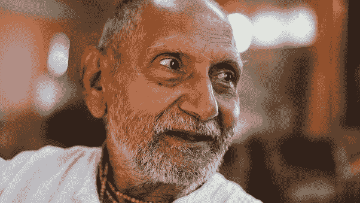

# 为什么个人理财如此重要？

> 原文：<https://medium.datadriveninvestor.com/why-is-personal-finance-so-important-7d42cfabdff7?source=collection_archive---------3----------------------->

## 一个简短的列表。

Photo by [Michael Longmire](https://unsplash.com/@f7photo?utm_source=medium&utm_medium=referral) on [Unsplash](https://unsplash.com?utm_source=medium&utm_medium=referral)

我们办公室有一位年近七旬的职员。他看起来像这样

[*(Source)*](https://www.google.com/search?biw=1366&bih=657&tbm=isch&sa=1&ei=fzY4XNqKKNXW-Qaf0LnIAg&q=old+indian+person&oq=old+indian+person&gs_l=img.3.0.0j0i8i30.6865.8089..8395...0.0..0.256.1476.0j2j5......0....1..gws-wiz-img.......0i67j0i7i30j0i8i7i30.ZqqZ-10za6g#imgrc=bTozWP0TGcO7sM)

我们称他为 Mamu。

一生中*马穆*都是工作狂。他从 20 岁开始工作，一直工作到最近，他决定放弃这份每月工资不到 6000 卢比的工作。那是大约 50 年的工作。

他教育他的孩子，帮助他们结婚，在花掉他挣的一点点钱之前从来没有想过。

结果相当惨！当他变老时，孩子们从来没有照顾过他，不断的工作对他来说是强制性的，让他过着最基本的生活。当被问到他打算什么时候退休时，他总是说他会工作到身体支持他为止。

 [## 外汇投资如何帮助偿还债务|数据驱动的投资者

### 外汇是对外汇市场的投资，不同国家的货币在外汇市场上进行兑换

www.datadriveninvestor.com](https://www.datadriveninvestor.com/2019/02/13/how-forex-investment-helps-to-repay-your-debts/) 

缺乏个人理财会让你陷入如此无助的境地！如果*马穆*对他的财务进行规划，并将他的微薄收入投资于股票或其他一些想法，他可能会留下足够的钱来避免这么老的工作。在他的全盛时期，Mamu 的月收入确实超过 6000 英镑，但是他从来没有计划过自己的退休生活。

个人理财很重要，因为钱能让你独立。

世界上最富有的人享受独立，因为他们知道个人理财是怎么回事。口袋里有钱让你独立。你不需要用钱买所有的东西，但是你可以用你所有的钱买东西的自由和想法是令人惊奇的。

从未考虑过个人理财和投资的人，总有一天会缺乏他们的同龄人所享有的那种独立性。

我热爱商业。

我开着一辆马鲁蒂 swift，我对公司这些年的指数增长方式感到惊讶。我希望像马鲁蒂一样有自己的事业。

[*(Source)*](https://www.google.com/search?biw=1222&bih=665&tbm=isch&sa=1&ei=jJQ4XJWFHrODrtoP8PSF8Aw&q=maruti+logo&oq=maruti+logo&gs_l=img.3..0l6j0i5i30l4.14581.17812..18098...0.0..0.166.940.0j7......0....1..gws-wiz-img.......0i67.kNV639o1MsI#imgrc=6lh__2YPYZqTMM)

我在 Kotak Mahindra 银行有存款。我对银行的核心人物乌代·科塔克先生管理银行的方式十分钦佩，他现在是有史以来最富有的银行家之一。我希望我有一个像 Kotak 银行那样增长数倍的企业。

[*(来源)*](https://www.google.com/search?q=kotak+bank&source=lnms&tbm=isch&sa=X&ved=0ahUKEwiGwdzp5eXfAhVLVH0KHU00CswQ_AUIECgD&biw=1222&bih=665#imgrc=rK7CY17zLVEcbM)

同样，我对周围的一切都很着迷。

我现在年近三十，通过教学生挣了不少钱。但是，我常常觉得这山望着那山高。我看到我周围的企业在成长和赚钱，我想知道我是否应该放弃教学，开始自己的事业。

但是，多亏了个人理财，我可以一心多用。是啊！这就是它的美妙之处。我可以教书，然后把我的钱投资到这些生意上。购买 Kotak 银行和马鲁蒂的股票意味着我是这些大机构中微不足道的一员。这意味着我会随着这些组织的成长而成长。印度是一个发展中国家，每天都有那么多萌芽的想法冒出来。

现在你会说，成为印度增长故事的一部分，这难道不酷吗？还有什么比了解个人理财和投资更好的方法呢？

比尔·盖茨、纳拉扬·穆尔蒂、马克·扎克伯格、凯什·安巴尼之间有什么共同点？

他们都很富有，因为他们拥有各自组织的股份。这可能是获得不义之财的唯一途径(当然还有其他非法途径，但我假设你不喜欢后者)。

比尔·盖茨和扎克伯格创业时都是辍学生。纳拉扬·穆尔蒂在创办印孚瑟斯时是一名工程师。凯什·安巴尼是一名工程师和工商管理硕士。

但是，他们都持有股票，了解个人理财。这是这些大亨之间的联系和共同纽带。他们知道并理解他们的钱和它的分配。他们知道如何使业务多样化，以及如何充分利用这些业务。

个人理财很重要，因为它教会你如何分配和分散投资。

> *凯什·安巴尼去年每天收入 30 亿卢比。他花在女儿伊莎·安巴尼婚礼上的钱大约是 70 亿卢比。那大概是*莫塔兄弟*(老大哥)3 天的工作！*
> 
> *现在，这里有很多可以坐下来学习的东西。你看，这里有这么多的财务规划。凯什·安巴尼在女儿的婚礼上花费了他收入的一小部分。人们花费他们一生的积蓄来举办一场奢华的婚礼。这是他们被困的地方！*

这就是为什么个人理财！

**访问专家视图—** [**订阅 DDI 英特尔**](https://datadriveninvestor.com/ddi-intel)