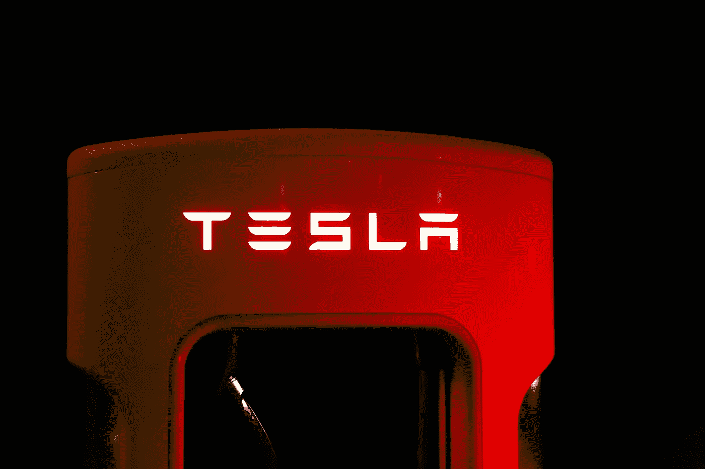
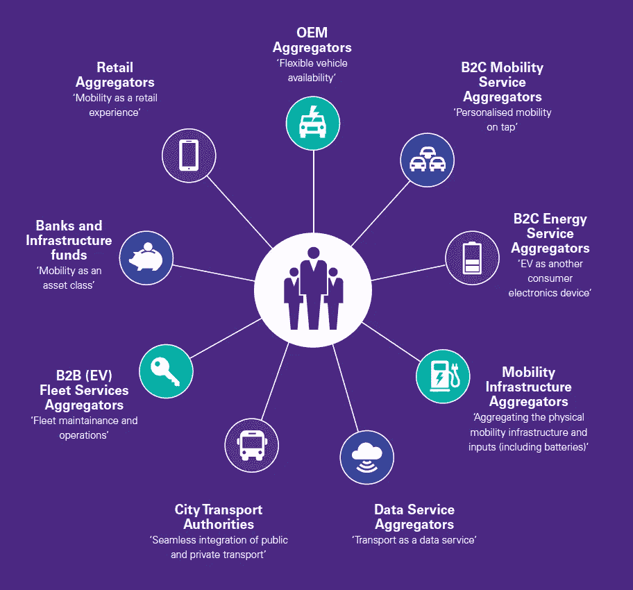
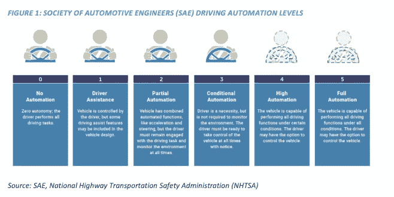
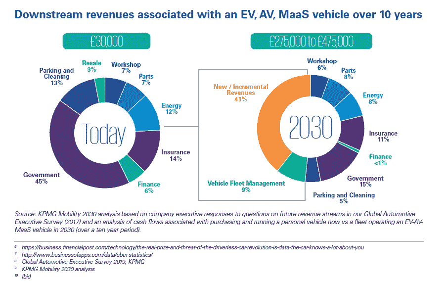

# 特斯拉股票为什么这么高

> 原文：<https://medium.datadriveninvestor.com/why-is-tesla-stock-so-high-283606a73683?source=collection_archive---------13----------------------->

## ACES——自主、互联、电动、共享

Image by [PixaBay](https://www.pexels.com/@pixabay) [Pexels](https://medium.com/u/5c7773c5a002?source=post_page-----283606a73683--------------------------------)

埃隆·马斯克拥有全球头条新闻，因为他的公司在过去一年里飙升了 700%以上。2021 年 1 月，特斯拉成为第五大最有价值的公司，市值超过脸书。随着世界的发展，在政府监管降低二氧化碳水平的推动下，特斯拉将增加其制造产量。欧洲已经出台法律，要求汽车制造商在 2020 年达到电动汽车平均 5%的销售份额，在 2021 年[达到 10%，否则将面临罚款](https://www.transportenvironment.org/sites/te/files/publications/01%202020%20Draft%20TE%20Infrastructure%20Report%20Final.pdf)。

对冲基金经理、投资者、技术专家以及任何有平台发表意见的人，要么认为特斯拉被高估，要么赞赏特斯拉有潜力成为垄断企业。两个阵营的人都对特斯拉有强烈的看法。

> “在我们看来，从几乎所有常规指标来看，特斯拉股票不仅被高估了，而且被大大高估了。”
> 
> — [标准普尔道琼斯指数](https://www.nytimes.com/2020/12/18/business/tesla-stock-sp-500-index.html)的高级指数分析师霍华德·西尔弗布拉特

自动驾驶和联网汽车(ACV)需要一个复杂的、跨多个行业的生态系统。我并不猜测特斯拉的股价是过高还是过低，但我认为特斯拉有潜力在 ACV 实现超乎想象的增长。

# 1.自主、互联、电动、共享(ACES)生态系统

2019 年，全球仅售出 200 万辆电动汽车。电动汽车仅占全球轻型汽车市场的 2.5%，因此电动汽车有很大的增长机会。电动汽车提供了轻型汽车市场之外的巨大机会，这种机会来自于代表九个关键领域的以下 ACES 生态系统。

[KPMG report](https://assets.kpmg/content/dam/kpmg/nl/pdf/2019/sector/the-rise-of-electric-shared-and-autonomous-fleets.pdf): The rise of electric, shared and autonomous fleets

[ACES 车辆定义为](https://www.cargroup.org/wp-content/uploads/2018/07/Impact-of-ACES.pdf):

*   具有 SAE 级或 5 级能力的自动车辆(见下文)
*   具有车对物(V2X)通信、空中(OTA)更新、车内客户服务等连接能力的车辆。,
*   电池电动汽车，包括混合动力汽车；以及
*   由按需提供短期车辆访问的服务提供商管理的共享车辆-可以由客户(如今天的 ZipCar)、第三方(如当前的 Lyft 服务)或计算机驱动。

许多投资者已经改变了他们对特斯拉的最初看法，一度将该公司视为类似于 20 世纪通用汽车(GM)的汽车制造商。

特斯拉是一家制造软件和硬件的技术公司，除了*银行和基础设施基金、*城市交通部门和 *OEM 聚合商、*之外，它还涉足所有 ace 细分市场，包括:

*   制造车辆的机器的自动化
*   开发先进的传感器覆盖范围，提供车辆周围的 360 度视野
*   未来将实现自动驾驶的自动驾驶功能
*   电动汽车充电站的设备
*   电动汽车电池制造
*   [移动即零售服务](https://www.tesla.com/nl_NL/service?redirect=no)等等。

为了拥有和管理其电动汽车的整个供应链，2017 年，特斯拉甚至收购了制造公司 [Perbix，](https://www.reuters.com/article/us-perbix-m-a-tesla/tesla-buys-automation-equipment-maker-perbix-idUSKBN1D71PH)该公司生产制造特斯拉汽车的机器。

# 2.来自电动汽车制造商的竞争

与竞争对手的电动汽车制造商相比，特斯拉拥有强大的优势，因为他们已经在 ACES 生态系统中建立了自己的产品和服务。特斯拉还开发了与所有特斯拉车型集成的客户界面。这意味着，其他需要在 ACV 市场竞争的电动汽车制造商将需要创造自己的产品和服务，或者与 Alphabet [(Waymo)](https://waymo.com/) 或优步等公司合作。

优步已经提供了移动性的无缝集成，为客户提供灵活的车辆可用性。随着越来越多的电动汽车制造商看到与 ACES 生态系统中的公司合作的优势，特斯拉可能会成为提供 B2B 服务的合作伙伴。如果特斯拉成为标准的、无与伦比的电动汽车制造商，他们将有机会提供多种 B2B 服务；机器制造、传感器、移动服务和特斯拉的自动驾驶仪(下图)，为客户创造无缝连接。

> “特斯拉拥有比 Waymo 更好的 AI 硬件和软件”
> 
> —[way mo 首席执行官约翰·克拉夫茨克](https://www.forbes.com/sites/johanmoreno/2021/01/25/elon-musk-responds-to-waymo-ceo-tesla-has-better-ai-hardware--software-than-waymo/?sh=6e8e06757eff)

由于特斯拉是一家技术公司，你可以比较他们的 B2B 服务类似于标准的 [SaaS 模式](https://en.wikipedia.org/wiki/Software_as_a_service)的可能性。

Video of Tesla’s Autopilot

# 3.通过移动零售服务获得下游收入

特斯拉有机会成为客户收入流的主要“聚合者”。据[毕马威](https://assets.kpmg/content/dam/kpmg/nl/pdf/2019/sector/the-rise-of-electric-shared-and-autonomous-fleets.pdf)称，在一辆汽车的 10 年生命周期内，下游收入流可能会增加 10 倍。这些收入流估计将来自内容、媒体和零售，当自动驾驶变得多产时，客户将在乘车时购买这些内容、媒体和零售。

KPMG Mobility analysis of 2030

# 未来会怎样？

自主、互联、电动、共享汽车还有很长的路要走；然而，已经有了实质性的技术进步，为轻型车和电动卡车的电动汽车制造商铺平了道路。电动汽车和卡车已经进入全球市场。

随着我们迈向未来，特斯拉是一家将取得成功的公司。对我来说，他们今天、明天或十年后的股价是多少并不重要。我真正关心的是我看到的在年轻一代中成长的趋势和道德，以及与我想要的未来相一致的趋势和道德；

*   降低二氧化碳排放量(电动汽车)
*   [生命周期评估](https://en.wikipedia.org/wiki/Life-cycle_assessment) (LCA)
*   [可持续管理系统](https://sustainabledevelopment.un.org/partnership/?p=1020) (SMS)
*   零浪费/ [因素 10](https://en.wikipedia.org/wiki/Factor_10) 。

当你把上述放在一个角度来看时，特斯拉的股价就没那么重要了。特斯拉通过降低电动汽车制造过程中的二氧化碳排放，并挑战 20 世纪的汽车制造商也这样做，从而推动环保意识的能力，比市场上任何汽车制造股票都更有价值。

***感谢阅读，***

***里克·戈维奇***