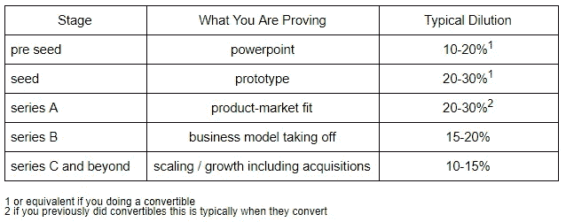
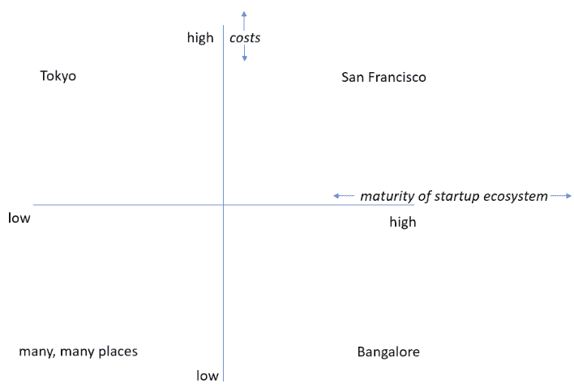
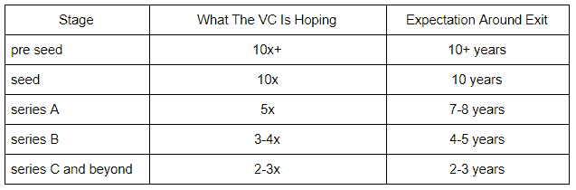

# 为什么那个创业者筹的比我多那么多？

> 原文：<https://medium.datadriveninvestor.com/why-is-that-entrepreneur-raising-so-much-more-than-me-ca65484a3e0c?source=collection_archive---------13----------------------->

养多少既是一门艺术，也是一门科学，这个话题在许多其他帖子中有详细讨论。本文关注的是像你这样的企业家可能会筹集更多资金的具体原因。这实际上是五个因素的函数:阶段、地理位置、投资者、可信度和策略。

1)阶段——筹集的资金数量并不能定义一家公司的阶段，而是你用这些钱做什么。框架并不完美，但却是有用的指导方针，下面这个就是我们在 Tau Ventures 所信奉的。后期意味着以更高的估值筹集更多资金。

**2)地理** —世界绝对不是平的。下面的 2x2 矩阵是另一个要考虑的框架，列出了一些有代表性的城市。你在两个轴上越高，圆就越大。

**3)投资者**——“机构投资者”是传统的、以财务为动机的风险投资公司的总称。以下框架是理解每个投资者视角的实用方法，从而理解他们会考虑投资的金额和估值:

关于退出预期的巨大警告——基金可以通过出售给其他基金来提前退出。例如，在实践中，种子投资者将在第 4-7 年间进行二次投资(即向另一个投资者出售所有权，通常是更大的投资者)，此时初创公司已经进入 B 轮，基金已经实现了 5 倍的回报。

希望站稳脚跟的基金通常会支付更多。外国基金通常属于这一类。战略投资者通常是跟风而非引领，但当他们设定条款时，他们往往比纯粹出于财务动机的投资者在金额/估值方面涵盖更广的范围。

信誉——在所有条件相同的情况下，两家初创公司可能仍然会根据创业者的情况筹集到大不相同的资金。要考虑的三个主要因素是企业家的

*   工作经验
*   退出历史
*   与投资者的关系

你可能会问——数量/估值上的一些差异是可以理解的，但数量级如何证明合理呢？风险资本是建立在权力法则的基础上的，也就是说，一些创业公司获得了巨大的成功。因此，人们相信，过度押注于一个更有经验、有更多退出机会、风投已经很了解的企业家，实际上风险要低得多。

最后，一个企业家可能只是在建立一个资本更加密集的模式，或者/和愿意忍受更多的稀释。考虑种子阶段的两个竞争对手，一个以 500 万美元的价格筹集了 100 万美元，另一个以 1000 万美元的价格筹集了 300 万美元。第一种是稀释 20%,大概每月燃烧 10 万美元，持续 12 个月。第二种是稀释 33%,大概保持每月约 25 万美元的燃烧，持续 24 个月。由于估值和烧钱率很少公开披露，仅仅根据筹集的金额，第二个企业家可能看起来占了上风——这不是全部情况。

*原载于* [*数据驱动投资人*](https://www.datadriveninvestor.com/2020/06/14/why-is-that-entrepreneur-raising-so-much-more-than-me) *，“我很乐意在其他平台上辛迪加。我是*[*Tau Ventures*](https://www.linkedin.com/pulse/announcing-tau-ventures-amit-garg/)*的管理合伙人和联合创始人，在硅谷工作了 20 年，涉足企业、创业公司和风险投资基金。这些都是专注于实践见解的有目的的短文(我称之为 GL；dr —良好的长度；确实读过)。我的许多文章都在*[*https://www . LinkedIn . com/in/am garg/detail/recent-activity/posts*](https://www.linkedin.com/in/amgarg/detail/recent-activity/posts/)*上，如果它们能让人们对某个话题产生足够的兴趣，从而进行更深入的探讨，我会感到非常兴奋。如果这篇文章有对你有用的见解，请对这篇文章和 Tau Ventures 的 LinkedIn 页面***发表评论和/或给予赞，感谢你对我们工作的支持。这里表达的所有观点都是我自己的。**