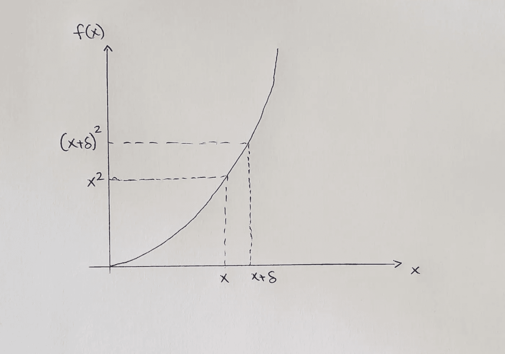

# 为什么 X 的导数是 2X？

> 原文：<https://medium.datadriveninvestor.com/why-is-the-differential-of-x%C2%B2-2x-840166043100?source=collection_archive---------0----------------------->

## 理解最基本的分化过程

首先让我们明白什么是差异化。微分是一个过程，通过它我们可以找到一个函数的变化率或斜率。牛津的[一个微分态的数学定义](https://www.lexico.com/en/definition/differential)；

> 关于无穷小的差别或函数的导数的

现在我们知道了什么是微分，让我们定义一个函数并画出它的图形，其中 f(x) = x。这可以在左边看到。这里的δ表示与上述定义的“微小”变化。因为 f(x) = x，所以 x 轴上的 x 导致 y 轴上的 x。同样，x 轴上的 x+δ导致 y 轴上的(x+δ)。

要测量变化率(或斜率)，我们必须测量 y 轴上的变化，然后除以 x 轴上的变化。y 轴上的变化是'(x+δ) — (x)'。x 轴上的变化为“x+δ — x”，简化为“δ”。

现在我们可以建立左边的等式。我们有δ → 0 的 [lim(极限)的原因是因为我们试图找到两个值之间的“微小差异”。((x+δ)-x)/δ)表示我们正在测量 y 轴上的变化，并将其除以 x 轴上的变化。然后我们简化问题，结果是 2x。我们现在已经证明了 x 的微分等于 2x。这同样可以用其他变量来完成。这里使用的方法被称为“第一原理”。差别的第一个证明是由](https://www.mathsisfun.com/calculus/limits.html)[戈特弗里德·威廉·莱布尼茨](https://plato.stanford.edu/entries/leibniz/)解释和完成的。用来表示微分过程(dy/dx)的符号被称为莱布尼茨符号。另一种常见的符号 f'(x)被称为约瑟夫·路易斯·拉格朗日的拉格朗日符号。

 [## 教科书行业如何最终被颠覆，并将继续改变|数据驱动…

### 就此而言，教科书产业在美国乃至全世界都有着悠久的历史。事实上，他们已经…

www.datadriveninvestor.com](https://www.datadriveninvestor.com/2018/09/25/how-the-textbook-industry-has-finally-been-disrupted-and-will-continue-to-change/) 

**访问专家视图—** [**订阅 DDI 英特尔**](https://datadriveninvestor.com/ddi-intel)