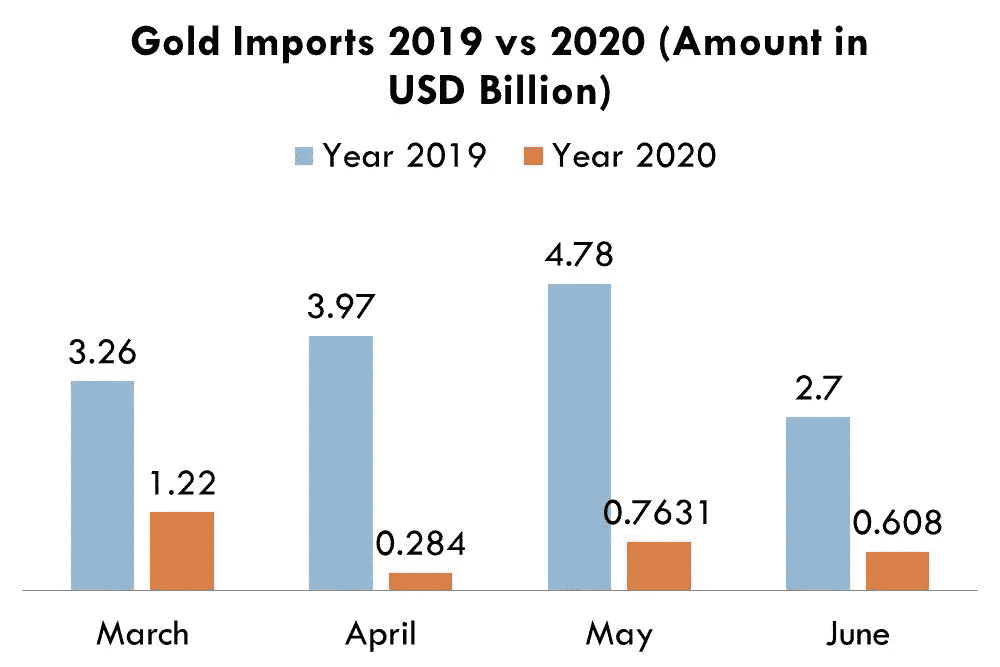
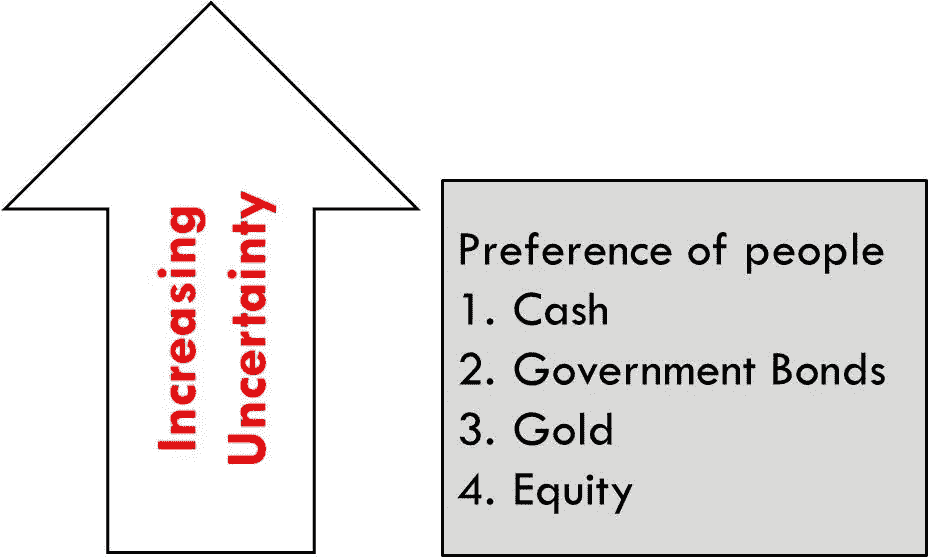

# 为什么黄金会不受控制地出现？

> 原文：<https://medium.datadriveninvestor.com/why-is-the-gold-on-an-unbridled-ride-2d9919d5279e?source=collection_archive---------5----------------------->

## 了解淘金热！

Photo by [rupixen.com](https://unsplash.com/@rupixen?utm_source=medium&utm_medium=referral) on [Unsplash](https://unsplash.com?utm_source=medium&utm_medium=referral)

2020 年黄金价格一直在波动，因为我们见证了自 2011 年以来的最高峰值。2020 年 7 月 28 日星期二，黄金期货自 2011 年以来首次突破每盎司 1800 美元。分析师预计，最近金价的涨势将持续一段时间。

但是，为什么金子会如此明亮？

让我们一点一点了解事情。

# 最大的黄金进口国需求不足

中国是最大的黄金进口国，其次是印度。然而，在新冠肺炎疫情，事情发生了巨大的变化。

[中国通过香港的黄金净进口低于出口](https://financialpost.com/pmn/business-pmn/china-becomes-net-exporter-of-gold-via-hong-kong-in-april)，从而使净进口为负。这是自 2011 年以来的首次。这是从今年 4 月开始的，接着是 5 月，这种趋势似乎在 6 月也在继续！

印度的情况与中国不相上下。全世界都知道印度对实物黄金的痴迷，但这一次，情况发生了变化。该国的封锁引发了黄金需求的下降，从可信的金店购买黄金是印度同胞心目中的最后一件事。这是一个证明需求下降的小图表-

*(Created by user in MS Power Point)*

那么，当中国和印度这两个最大的黄金进口国都不购买黄金时，谁会购买呢？

# **需求由东向西转移**

需求已经从亚洲转移到了美国和欧洲。这就是为什么金价会出现无节制的上涨。今年纽约各地的金库增加了 700 多吨黄金，这是自 1993 年以来的最高纪录。

*(Created by user in MS Power Point)*

# 美国或欧洲对黄金的突然喜爱是怎么回事？

恐惧是一种危险的情绪！随着不确定性和环境风险的增加，投资者倾向于重新调整投资组合，将资金转移到安全的避风港。

(Created by user in MS Power Point)

由于不确定性普遍存在，投资者倾向于持有更多现金。在低迷时期，现金是王道。但是现金并不能给你带来收入。因此，很少有谨慎的投资者把钱存在收益型和安全型资产类别中。

我想到的最好的东西是“政府债券”或“短期国库券”。美国中央银行，即美联储是全球最稳定的中央银行之一。因此，如果一个人把钱投资在这种国库券上，这笔钱肯定会连本带利地收回来。

赚取的利息取决于债券收益率。对于 primer 来说，收益率就是我投资的回报。所以，如果我买了 100 美元的债券，过了一段时间后，我得到了 101 美元，那么收益率就是 1%。债券收益率的公式是**‘债券利息’/‘债券市价’。**还必须注意，债券的利息是固定的，但债券的市场价格不断变化。不用说，

*   债券的**【市价】**越高，**【债券收益率】**越低。
*   债券的**【市价】**越低，债券的**【收益率】**越高。

在像疫情这样的“电晕”时代，投资者会避开像“股票”这样的高风险资产类别，这些资金会被存放在像“短期国债”这样的更安全的资产类别中。

[然而，2020 年 3 月 15 日，美联储宣布降息，降至‘0’](https://www.cnbc.com/2020/03/03/fed-cuts-rates-by-half-a-percentage-point-to-combat-coronavirus-slowdown.html)。首先，每当经济放缓时，央行往往会降低利率以降低借贷成本，从而缓解资金流入经济的压力。由于新冠肺炎，美联储做了这一戏剧性的举动。

 [## 所以你想投资创业公司？除了做全职风投|数据驱动型投资者之外的 5 种方式

### 有没有考虑过投资创业公司但不想做全职 VC？还有其他途径，这篇文章将…

www.datadriveninvestor.com](https://www.datadriveninvestor.com/2020/06/28/so-you-want-to-invest-in-startups-5-ways-other-than-being-a-full-time-vc/) 

但是，利率引发许多其他变量，债券市场价格是其中之一。债券市场价格与利率成反比。因此，随着利率下降，债券市场价格开始上涨，这进一步降低了债券收益率。较低的债券收益率意味着债券现在不再是有吸引力的投资类别。

在萧条时期，当谈到安全时，猜测第二好的资产是没有奖励的！**‘黄金’**正是。历史上，在 2008 年臭名昭著的雷曼倒闭后，黄金价格从每盎司 700 美元飙升至 2011 年的每盎司 1900 美元。在所有的不确定性中，难怪它在 2020 年也是投资者的宠儿。

除了实物黄金，黄金 ETF 也从未出现过如此巨大的需求[(总持有量超过 600 吨)](https://economictimes.indiatimes.com/markets/stocks/news/gold-funds-underpin-pandemic-price-rally-as-jewelers-vanish/articleshow/76793773.cms?from=mdr)超过了印度和中国的实物黄金购买量。

这就是推动黄色金属价格的原因！

**访问专家视图—** [**订阅 DDI 英特尔**](https://datadriveninvestor.com/ddi-intel)