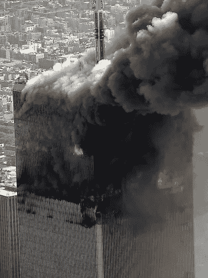

# 为什么这个消息让你焦虑？

> 原文：<https://medium.datadriveninvestor.com/why-is-the-news-making-you-anxious-3a5cb64eb864?source=collection_archive---------10----------------------->

9/11 World Trade Center Police Chopper

这条新闻是为了让你焦虑吗？

想想这些 2020 年 7 月 21 日的头条新闻

美国疾病控制与预防中心称，美国部分地区的病例数远远高于报道的数字

*持枪歹徒携炸药在乌克兰巴士上劫持乘客为人质:当地警方-福克斯新闻*

*洪水死亡人数上升，中国炸毁大坝*

你害怕了吗？你应该害怕！它们都是 2020 年 7 月 21 日疾病、恐怖主义和灾难的头条。

让我们把这个变得更有趣。如果头条说，

*你需要知道的关于冠状病毒的一切——连线*

或者说，

*这个标题是人写的还是机器写的？-连线*

你注意到什么了吗？它们并不令人吃惊。有些人可能会说这很无聊。心理学家称之为[可用性启发式](https://www.theguardian.com/commentisfree/2018/feb/17/steven-pinker-media-negative-news)。启发是人们高估悲剧发生频率的能力。

例如，许多人害怕死于飞机失事，尽管事实上你更有可能死在去机场的车里。你也更有可能死于心脏病，而不是龙卷风，但是前者很少出现在新闻中，因为它不那么引人注目。

 [## 区块链驱动的社交媒体 2.0 能取代脸书吗？数据驱动的投资者

### 到 2021 年，活跃的社交媒体用户的数量预计将达到令人难以置信的水平，超过三分之一的…

www.datadriveninvestor.com](https://www.datadriveninvestor.com/2019/03/20/could-blockchain-powered-social-media-2-0-dethrone-facebook/) 

这也不是意外。数据科学家 Kalev Leetaru 使用自然语言处理(NLP)对 1945 年至 2005 年的新闻故事进行了情感分析。他发现在过去的六十年里，新闻变得越来越负面。

所有这些消极情绪都让人们感到沮丧，焦虑、轻蔑、敌意和普遍的坏情绪越来越多。负面报道也习惯于为消费者歪曲事实。例如，一些人认为冠状病毒诊断是死亡判决。这是妄想。事实上，你有 96-97%的机会完全康复。只有病人和老人才真正有危险。

但这个故事不是关于冠状病毒的。这是关于现代新闻周期的业务。

我们是怎么来到这里的？

在新闻业陷入黑暗的六十年里，它作为一种媒介也发生了变化。新闻不再由报纸出售和发行。其中一些仍然是。如今，大多数新闻都是由脸书、Twitter、Youtube 和 LinkedIn 等社交媒体公司发布的。作为私营公司，他们有自己发布消息的动机。这些动机通过使用各种社会工程技巧给你提供一种短暂的社区感而被货币化。

他们是怎么做到的？

我们都想被喜欢，社交媒体让这变得容易。脸书有一个类似的按钮。Twitter 有明星，我不需要解释其他的。人们更喜欢回复喜欢他们帖子的人。社交媒体公司知道这一点，当你被人喜欢时，他们会立即通知你。正是这些提醒对许多人来说是提升自尊的不可抗拒的糖果。

还有就是害怕错过 FOMO。对一些人来说，真正的担心是他们可能会错过社交媒体上的有益体验。你知道，就像猫的视频。这种恐惧对一些人来说是个问题，会导致上瘾。

社交媒体公司知道这一点。他们非常清楚这一点，这为他们赢得了数十亿美元的广告收入。他们通过在你的手机上提供源源不断的*声、蜂鸣声、*或*铃声*来利用你对确认和猫视频的需求。这些声音是故意设计来让你对自己的叙述做出反应的。

Snapchat 的团队已经将这变成了一个游戏，用 Streak Score 奖励访客保持参与。花费最多时间向他人发送照片的消费者得分最高。这个分数激励消费者去竞争。此外，它引入了一个“沉没成本”陷阱，使消费者在投入大量时间后更难退出。

这种瘾会因为你的性格类型而增强。如果你是一个对抗抑郁和焦虑的人，那么你更有可能将自己与你认为更好的人进行比较。如果你是一个通过钓鱼来煽动他人的痛苦而获得快乐的人，那么你很可能会将自己与那些你认为比你更糟糕的人进行比较。这两种活动都是会上瘾的应对机制。

但是社交媒体上的新闻是如何让我感到压力的呢？

你还在滚动吗？很好，我们可以继续了。当你寻找下一个喜欢的人时，你注意到什么了吗？有没有类似新冠肺炎和警察暴行的灾难报道？如果你在未来读到这篇文章，请在评论中留下你对当前生命威胁的绝望咆哮。你现在一定发现了威胁。你意识到这些威胁，因为大脑本能地对任何潜在的危险做出反应。这是生物生存的必要条件，也是许多压力的原因。对这些威胁的不确定性是焦虑的主要驱动力。正是这种不确定性驱使人们不断搜索信息，试图重新获得控制权。但是，这些信息非但没有重新获得控制，反而证实了我们的恐惧，并在恶性反馈循环中进一步加剧了我们的焦虑。

社交媒体上源源不断的帖子、赞和 FOMO 都构成了一种自我实现的焦虑预言，我们称之为**末日滚动**。

Twitter Doomscroll

**我怎么才能戒掉？**

焦虑可能是一种顽固的疾病，一旦它在你的头脑中扎根，就很难去除，我可以从经验中说出来。当这种感觉真的到来并像一只听话的狗一样跟踪你时，你很难逃脱。然而，还是有一条出路的。根据我的经验，当你需要摆脱你的头脑时，这些方法都是有效的。

◻️改变你的位置。出去走走，慢跑或开车在镇上转转。

◻️关闭你的浏览器，深呼吸几次。

◻️打开一些舒缓的音乐。

◻️尝试了一项新活动。

◻️给自己找了一个新的挑战，就像解决一个难题。

◻️有什么想法吗？_______________________________

**访问专家视图—** [**订阅 DDI 英特尔**](https://datadriveninvestor.com/ddi-intel)