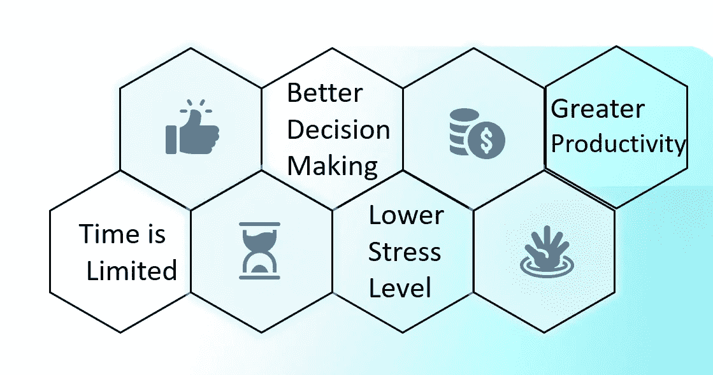

# 为什么时间管理是一项关键技能？

> 原文：<https://medium.datadriveninvestor.com/why-is-time-management-a-key-skill-74d81bd76859?source=collection_archive---------28----------------------->

## 从领导团队的角度来看

Photo by [Tristan Gassert](https://unsplash.com/@tristangassert?utm_source=medium&utm_medium=referral) on [Unsplash](https://unsplash.com?utm_source=medium&utm_medium=referral)

在任何专业领域，你都需要“软技能”，即帮助你在工作中表现更好的非技术技能，如创造力、团队合作、诚信、沟通、责任、批判性思维等等。但我为什么要专门谈论时间管理呢？嗯，我在一个软件开发团队中担任团队领导已经有几年了，我必须学会不仅管理自己的时间，还要管理别人的时间。我的团队每天都有大量的工作要做，所以我不得不分配和组织任务，这样我们不仅能按时完成要求的任务。

但是等等…时间管理是什么意思？

它基本上是指有效地管理时间，以便将正确的时间分配给正确的活动。

# 为什么这如此重要？

Image by Author

*   时间有限

你的时间是有限的，一旦失去就再也不会回来。尽量利用它。

*   更好的决策

当你根据可用时间提前计划你的任务时，你一定能做出更好的决定，更有效地处理你的工作。

*   较低的应力水平

如果你是一个负责任的人，如果你关心你的工作，当你快没时间的时候，你会感到非常紧张。

当你手头有很多任务，但却不知道从哪里开始，如何着手时，压力和焦虑就会增加。如果你准备了一份清单，对你的任务进行优先排序，并制定一个计划来及时完成它们，你将能够战胜压力。

*   更高的生产率

很多时间浪费在思考和计划下一步该做什么。当你准备一个时间表来更有效地管理你的时间时，你已经知道下一步要做什么，因此可以带来更大的生产力。

# 管理时间的技巧

1.  设定目标

通过设定每天、每周、每月或每年的目标，你对预期要完成的事情有一个清晰的愿景，当目标设定后就更容易衡量进展。

设定现实的目标极其重要，为什么？如果你计划的比你能做的多，你会有压力，感觉你实际上挣得不够多。记住，“不要贪多嚼不烂”。

2.规划

一旦你设定了目标，现在你需要计划如何实现它们，谁能完成这个任务？需要分配多少时间？。

3.优先考虑

好的，你有目标和实现目标的计划，但是不要忘记区分任务的优先顺序，选择你喜欢的方法，然后去做，也许你想先做快速的任务，然后是最难和最长的任务，或者你可能会考虑在商业术语中完成一个特定任务的重要性，然后开始做。

4.意识

意识到你拥有什么，什么最适合你和你的团队。通过简单地了解你的团队，你可以制定更好的计划。

过去，我的团队中有一个人在下午工作得更好，那么我做了什么？当我想通了这一点，我开始在上午要求更容易的任务，把最难的任务留到下午。

了解你的团队，看看他们的动力是什么，他们喜欢怎样工作。

5.委托

> “你可以做任何事，但不是所有事”——大卫·艾伦

有时我们觉得我们必须做所有的事情，我们害怕把重要的任务委派给别人，但这是一个大错误，你必须相信你的团队。如果你试图做所有的工作，可能会有这样的情况，你需要连续几天不停地工作来独自完成所有的事情，这会有多累？很累，对吧？所以不要那么做。

教你的团队如何做事，与他们一起工作，将重要的任务委派给他们，因为团队必须能够在没有你的情况下完美运作。

做一个好的时间管理者会大大提高你的工作效率。无论你做什么类型的工作，优先排序和安排工作的能力都是非常可取的。

良好的时间管理随着实践而变得更好，找到对你和你的团队更有效的方法，并保持下去。