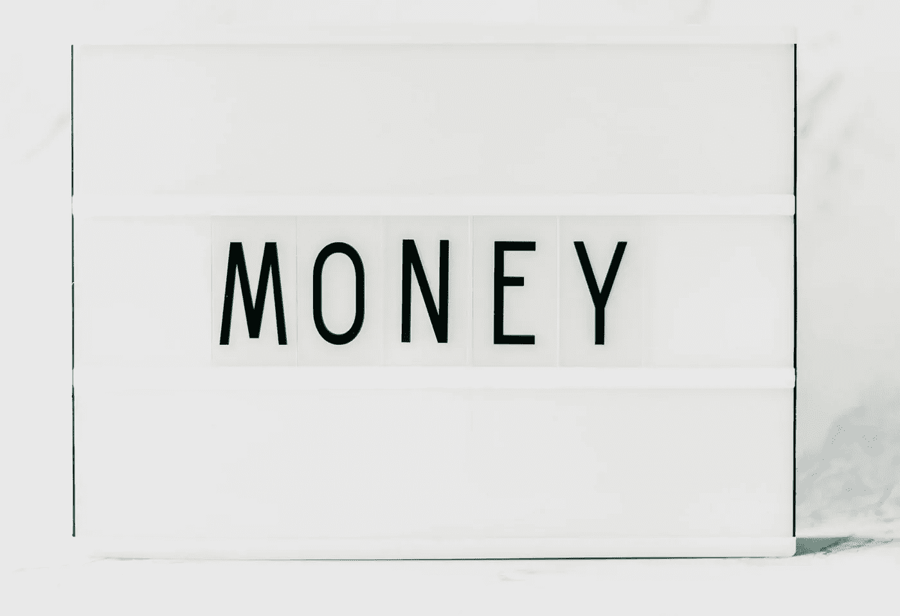
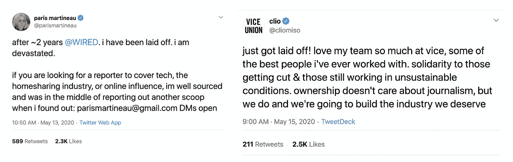
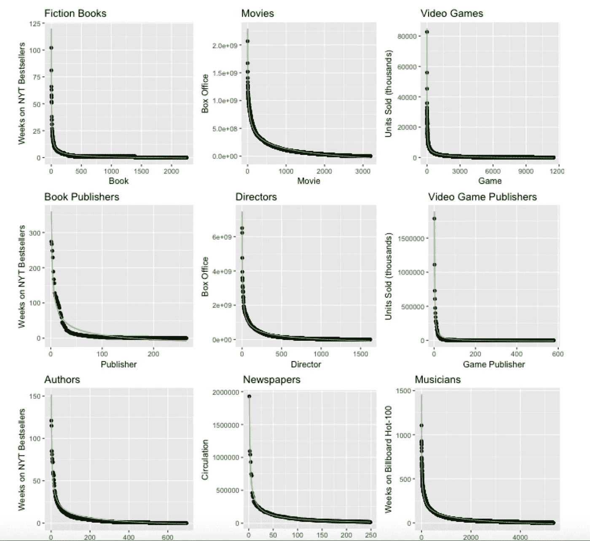
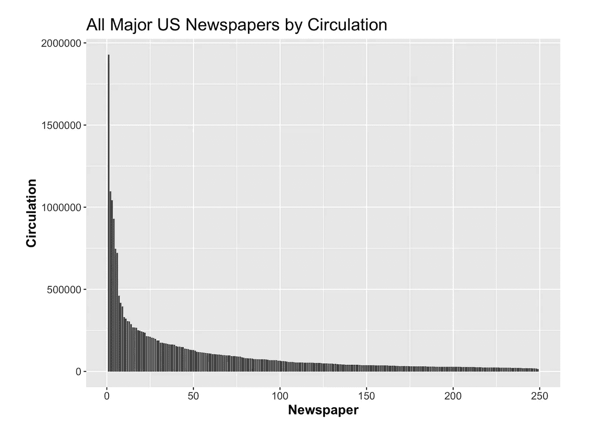

# 为什么网络名气不是更值钱？

> 原文：<https://medium.datadriveninvestor.com/why-isnt-internet-fame-more-valuable-d7a1d0d85ea4?source=collection_archive---------4----------------------->

## 关于新闻媒体价值的思考

photo [Oleg Magni](https://www.pexels.com/@oleg-magni) from pexels.com

Covid 危机似乎正在摧毁主流新闻媒体。到目前为止，[副](https://variety.com/2020/digital/news/vice-media-layoffs-155-employees-covid19-1234607610/)， [Vox](https://techcrunch.com/2020/04/17/vox-media-furloughs/) ，[奔忙](https://variety.com/2020/digital/news/the-outline-shut-down-joshua-topolsky-layoffs-bustle-1234570276/)，轮廓[，](https://www.fastcompany.com/90231483/the-outline-has-laid-off-all-of-its-staff-writers)，[有线](https://www.thedailybeast.com/wired-staff-unionizing-as-conde-nast-bosses-weigh-coronavirus-layoffs)，[石英](https://www.nytimes.com/2020/05/14/business/media/quartz-to-lay-off-80-employees.html)，[更多的分店](https://www.poynter.org/business-work/2020/here-are-the-newsroom-layoffs-furloughs-and-closures-caused-by-the-coronavirus/)已经裁员或者正在考虑大幅度裁员。当然，这并不奇怪。具有自由竞争和网络效应的领域往往以少数赢家和许多输家告终。到目前为止，看起来《纽约时报》注定会成为新闻的赢家，就像脸书是社交媒体的赢家一样。

这让那些无法获得大型媒体工作的记者前景黯淡。我担心这些记者，除了一件事，他们中的许多人都是网络名人。当然，他们可以用一些文化声望来换取现金。

也许不是。

即使在 2019 年和 2020 年的媒体末日之前，大多数记者也没有赚到大钱。[共享的媒体工作者工资电子表格](https://www.cjr.org/cjr_outbox/google-doc-journalism-media-pay.php)显示，许多人勉强净赚 5 万英镑。尽管如此，这些工人中的一些人拥有成千上万的推特粉丝。他们的作品对我们的文化有着深远的影响，从微妙地引导公众舆论到[让首席执行官们被解雇](https://www.hollywoodreporter.com/live-feed/jonathan-friedland-exits-netflix-1122675)。那么这种文化影响力到底为什么不能用钱来换呢？毕竟， [instagram 上影响力较小的人](https://www.petalcard.com/blog/money-instagram-influencer-make)可以通过出售注意力来赚取数千美元。为什么记者不能这样做？

# 幂律和信息网络

当想到互联网时，我发现看一下这张图表会有所帮助。

distribution of success in various media

数据显示，在每一种形式的网络媒体中，都会有一些大赢家(幂律曲线的顶端)，一大群小玩家(尾巴)，而中间不会有太多。在这个框架下，中档媒体出版物的死亡是完全可以预料的。例如，这是最近一次衰退前报纸发行量的图表。

我预计那些拥有 10 万到 30 万读者的报纸中有很多已经死亡。

但对新闻记者来说，这并不全是坏消息。同样的[帕累托分布](https://en.wikipedia.org/wiki/Pareto_distribution)驱使 80%的收益流向 20%的渠道，这意味着大部分价值是由少数作家创造的。这些顶级作家理论上可以比他们在传统新闻编辑室里少得可怜的 5 万到 10 万英镑赚得更多。

幂律曲线还有其他含义。正如克里斯·安德森著名的指出的那样，它的长尾为那些愿意抑制自己野心的人留下了足够的空间。小作家有大量的空间，他们可以间接赚钱，或者满足于不把写作作为全职工作。无论哪种方式，商业模式的发展应该有助于曲线两端的人。让我们看看一些货币化的选择。

# 子堆栈

占其出版物价值 80%的 20%的网络作家可能是[子栈](https://substack.com/)的完美人选。该平台提供免费出版，处理报纸通常会处理的所有技术问题。它还允许作家为他们的作品收取经常性费用。当然，要真正做到这一点，作家需要自己吸引读者。这就是拥有一个大的在线形象的用处所在。已经有[马特·泰比](https://twitter.com/mtaibbi)(41.5 万推特粉丝)辞去了他在滚石的工作，转而全职从事 Substack。现在，财经和政治新闻的读者可以直接付钱给他，而不是他以前的老板。在较小的层面上，Eve Peyser (8 万名追随者)已经能够写任何她感兴趣的东西，并从 Substack 的忠实支持者那里获得报酬。有了这种与观众的个人联系，作家可以建立一个持久的价值来源，更重要的是，收获大部分的价值。

# 帕特里翁和唯一的粉丝

订阅收入并不是互联网写作的唯一商业模式。像 Patreon 这样的服务允许所有类型的内容和所有类型的货币化。以下是 2019 年 pat reon 上的[顶级作家名单。它涵盖了出售大量小说的作者，建议专栏作家，拥有自己的互动媒体网站的作家。](https://www.forbes.com/sites/adamrowe1/2019/06/29/the-top-10-writers-on-patreon-in-2019/#370bdfeb6f77)

最近， [Onlyfans](https://blog.onlyfans.com/writers-and-onlyfans/) 作为一种在互联网上获得报酬的新服务加入了这场争论。该平台目前因主要被性工作者使用而声名鹊起，但事实上，它支持任何类型的内容。许多[类型的艺术家](https://blog.onlyfans.com/how-musicians-can-monetise-their-following/)已经开始在平台上分享关于他们生活的个性化内容。性格外向的作家可能很快也会这样做。就像 Snapchat 曾经被认为是一个发送色情短信的应用程序一样，Onlyfans 现在被认为是一个出售裸照的平台。我认为这种情况可能会改变，有吸引力的作者将很快利用该网站获得额外收入。正如写书真正的钱是公开演讲，写新闻真正的钱可能是个性化服务。播客和图片，音频和视频，都是比互联网上的文本更好的赚钱方式。

# 老派赞助人

富人通过赞助支持艺术有着悠久的历史。今天，我们有杰夫·贝索斯补贴华盛顿邮报记者的薪水，就像佛罗伦萨的美第奇家族曾经资助鲁本斯和其他伟大的画家一样。除了贝佐斯，其他暴发户如[马克·贝尼奥夫](https://www.cnbc.com/2018/09/17/bezos-to-marc-benioff-why-billionaires-are-buying-media-companies.html)、[克里斯·休斯](https://en.wikipedia.org/wiki/The_New_Republic)和比尔·盖茨都试图通过支持老化的新闻出版物来擦亮他们的遗产。我认为互联网很可能会使这种慈善事业民主化。

像 Patreon 这样的服务是一个好的开始，但它们并没有真正抓住艺术家和顾客之间的全部关系。毕竟，为美第奇家族工作的画家应该在晚宴上露面。今天的艺术家没有这样的工具来直接回报他们的支持者。我可以想象一种未来的服务，在这种服务中，有朝一日，微富人可以支持微名人。也许有一天，我会付给一个著名的吉克托人几千美元，让我出现在他们的一个视频里。我的意思是，我已经可以付钱让蓝斯·巴斯帮我录语音邮件了。为什么我不能付钱给我最喜欢的 YouTube 明星让我大声喊出来给我所有的朋友看？对于作家来说，特殊的工作可以在顾客认为服务不足的领域采取定制研究的形式。随着在[激情经济](https://a16z.com/2019/10/08/passion-economy/)中与观众互动的方式越来越多，产生真正收入的方式也将越来越多。

# 最后的想法

正如尤瓦尔·赫拉利会说的那样，名誉和金钱都是社会虚构的东西，只存在于人们的头脑中。那么为什么互联网知名媒体写手拿不到报酬呢？为什么他们不能把一部社会小说换成另一部呢？我认为很明显，这种脱节是真实存在的，亟待解决。最近[的](https://twitter.com/taylorlorenz/status/1256777114709307393)风险资本家 vs 记者[推特大战](https://twitter.com/balajis/status/1225930241006325761?lang=en)就是这种[吉拉第恩分裂](http://www.imitatio.org/brief-intro)的一个例子。风投拥有数十亿美元，但在硅谷泡沫之外没有得到认可。记者和媒体有影响力的人有名气，但没有真正的财富。双方都对自己的巨大特权感到不舒服，而且双方真的可以互惠互利。正如旧佛罗伦萨的高利贷者和金融家可以用文艺复兴时期的艺术来净化他们的良心一样，风险资本也可以通过适当的赞助来购买体面。只是需要一些时间和创造力来创造市场。