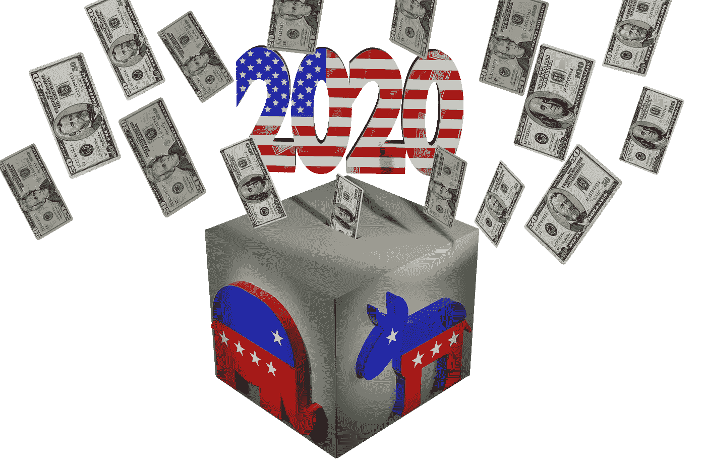

# 为什么看起来不可能战胜特朗普？

> 原文：<https://medium.datadriveninvestor.com/why-it-seems-impossible-to-trump-trump-d3ee9c527b55?source=collection_archive---------1----------------------->

Image by [conolan](https://pixabay.com/users/conolan-4525104/?utm_source=link-attribution&utm_medium=referral&utm_campaign=image&utm_content=4720103) from [Pixabay](https://pixabay.com/?utm_source=link-attribution&utm_medium=referral&utm_campaign=image&utm_content=4720103)

我注意到标题说拜登仍然在总统竞选中领先。在这样的标题背后，人们可以感觉到一种担忧，即在选举日之前的最后几周，从新冠肺炎恢复过来的川普将再次施展一些魔法并赢得胜利。参考 2016 年 10 月发布的著名的 [*访问好莱坞*录音带](https://en.wikipedia.org/wiki/Donald_Trump_Access_Hollywood_tape)，在上次总统大选前几周，我称之为十月惊喜综合症。对于一个谨慎的人来说，很明显可以预见那段视频将是唐纳德·j·特朗普(Donald J. Trump)政治生涯的终结。一个如此粗俗的男人吹嘘自己猥亵女性——这是令人厌恶的、不道德的、非法的——怎么可能当选总统呢？几天后，特朗普的支持者不愿谈论此事。

从那以后，一群曾与特朗普共事的人拿出了证词，证实了每个人都可以从特朗普的推文或公开言论中得出的结论:他作为总统是不称职的，作为一个人是卑鄙的。尽管如此，特朗普获得了共和党的无条件支持，在民意调查中仅落后乔·拜登几个百分点。特朗普的魔法是什么，让他对很久以前会摧毁任何其他政治家的错误免疫？

我们可以通过倾听特朗普的对手来找出答案。例如，莫丽·格雷[决定与支持川普的家庭](https://medium.com/an-injustice/im-out-of-excuses-for-my-pro-trump-family-ea722d09e1d0)分开。她认为他们是“无知、自私、种族主义和偏执的可怜虫”，尽管他们有着她“一生所爱”的面孔。令她厌恶的是，他们无视她所有反对特朗普的道德观点。她觉得他们对她的道德主张的驳斥是关于经济的。意味深长的是，她不赞同地提到她的家人对奥巴马总统持高度批评态度。格雷并不好奇为什么“她所爱的”正派人士认为奥巴马比特朗普更糟糕。

摆在我们面前的问题是，一个道德可疑的人能否成为一名好总统？比尔·克林顿玩弄女性却逍遥法外。毕竟，我们选的是领袖，不是圣人。

Image by [Gerd Altmann](https://pixabay.com/users/geralt-9301/?utm_source=link-attribution&utm_medium=referral&utm_campaign=image&utm_content=3500987) from [Pixabay](https://pixabay.com/?utm_source=link-attribution&utm_medium=referral&utm_campaign=image&utm_content=3500987)

# 移民，特朗普的致命弱点

从第一天起，特朗普就反对移民。移民使美国变得伟大。但是从共和国的一开始，他们中的许多人一进来就主张关上身后的大门，这样就不会有更多的移民到来。这种本土主义趋势总是迎合人性最糟糕的一面:种族主义、宗教偏见和仇外心理。大约一百年前，这种倾向盛行，最终导致了 1924 年的移民法案。经过修改，该法的关键条款仍然是我们移民政策的核心。它在概念上是非美国的，它对我们的经济有害，而且对那些渴望成为美国人的外国人不尊重。结果，我们的移民法无法执行，我们有数百万非法移民。

为了繁荣，美国需要比移民法允许的更多的移民。目前，大约有 4500 万美国人是在国外出生的，约占总人口的 14%。这个数字是估计出来的，因为大约四分之一的移民是没有证件的，而且关于他们中有多少人在美国存在争议。在加拿大，合法移民[约占人口的 22%](https://www12.statcan.gc.ca/census-recensement/2016/as-sa/fogs-spg/Facts-can-eng.cfm?Lang=Eng&GK=CAN&GC=01&TOPIC=7)；他们[在澳洲几乎占 30%](https://www.abs.gov.au/statistics/people/population/migration-australia/latest-release) 。为了赶上加拿大的移民水平，美国将需要接纳额外的 2200 万新移民，并使所有目前没有证件的移民合法化。美国没有一个政治家有足够的勇气告诉他或她的选民真相，我们需要更多的移民。

2006 年失败的移民改革提议适度增加合法移民。本土主义者强烈反对它。他们得到了一些亲工会的民主党参议员的支持，包括巴拉克·奥巴马和独立的伯尼·桑德斯，扼杀了让我们的移民政策更加现实的卑微尝试。

Image by [Gerd Altmann](https://pixabay.com/users/geralt-9301/) from [Pixabay](https://pixabay.com/illustrations/usa-trump-first-america-flag-2372124/)

一个多世纪以来，美国人一直被灌输我们的移民政策有多好。他们不知道我们的移民规则是一堆废话，但我们不执行法律，这激怒了他们。特朗普关于移民的无礼主张与这些挫折产生了共鸣。像大多数美国人一样，莫丽·格雷的家人对我们的移民乱局感到愤怒。特朗普告诉他们，前任政府使用的温和方法是问题所在。他采取了“不戴手套”的方法，这吸引了那些在工作中弄脏自己手的人。

现任政府使用暴力强行实施我们的移民法，让我们清楚地看到这是多么不人道和愚蠢。这使得特朗普很容易支持这种无稽之谈。对格雷来说，这可能是一个向她父亲证明特朗普在经济方面是错误的机会。

格雷女士没有认识到，她的家庭成员并不是唯一被一个世纪的系统性虚假信息所欺骗的人。在她所推崇的移民问题上，巴拉克·奥巴马也受到了欺骗。左倾民主党参议员伊丽莎白·沃伦和伯尼·桑德斯也是如此。在他们的移民政策提案中，没有提到增加移民。他们赞成在执行我们不人道的移民政策时再次心慈手软。

特朗普作为[受骗者](https://medium.com/datadriveninvestor/the-leader-of-the-deceived-f0b0760839d3)的领袖赢得选举。[解决移民问题](https://medium.com/@hak1010/troubleshooting-immigration-893c7d2d9f)从[商业的角度](https://medium.com/@hak1010/immigration-business-cc65d7cb8dd7)告诉我们川普的移民政策遵循[欺骗大师的蛊惑](https://medium.com/discourse/roy-beck-the-accomplished-master-of-deception-b6f1baf1bf99)。他修建边境墙的旗舰项目就像政客们能够做出 2+2=5 一样现实。我带来了我以前关于这个主题的文章的链接，以强调我们对移民政策的批评和政策本身一样古老。我没有想到任何新的东西；我报道了众所周知的事实和论点。

然而，格雷女士在《纽约时报》、*、《华盛顿邮报》*、*、*、或*《大西洋月刊》*，或通过听*、*或看 *CNN* 中找不到这种推理。媒体也没有用这种想法来推广文章。特朗普赢得总统大选主要是因为他无情的移民政策。他真的有机会再坐四年牢，因为为了满足他们的政治议程，他的对手没有仔细研究我们移民政策的概念，也没有准备一个更好的替代方案。

# 奥巴马医改，复仇

这是特朗普利用对手失败的又一个例子。

民主的规则是，一个特定的政治组织可以在今天执政，但在下次选举后可能成为反对党。这意味着任何重要的立法都需要得到反对派有意义的支持，以抵御未来的挑战。

《平价医疗法案》却不是这样。共和党人一致反对，一些民主党人也反对。尽管如此，民主党还是设法以微弱多数通过了该法案。格雷女士的家庭成员在谴责奥巴马时，最有可能想到的是这一背叛民主传统的行为。他们可能没有读过《联邦党人文集》,但他们从骨子里觉得有些事情不对劲。从这个意义上来说，民主党在之前的总统选举中失败是因为巴拉克·奥巴马，而不是希拉里·克林顿。

Image by [Gerd Altmann](https://pixabay.com/users/geralt-9301/?utm_source=link-attribution&utm_medium=referral&utm_campaign=image&utm_content=3501018) from [Pixabay](https://pixabay.com/?utm_source=link-attribution&utm_medium=referral&utm_campaign=image&utm_content=3501018)

尽管奥巴马医改没有兑现承诺，但政治家们没有坐下来制定双方都能接受的可行方案。当美国人因为低劣的医疗保健而受苦时，他们继续他们的自我斗争。如果他们就更好的医疗政策达成一致，他们可能会有一位能够击败特朗普的总统候选人。这位候选人可能是共和党人，也可能是民主党人，但肯定比特朗普对美国更有利。

现在，格雷女士的家庭以及所有美国人都面临着艰难的选择。他们应该与反对奥巴马医改的特朗普站在一起，还是应该冒险与民主党站在一起，后者可能像奥巴马一样关心民主传统？格雷女士没有注意到这种困境是真实的。

# 气候变化

在过去，当我们有带指针的时钟时，人们常说即使一个坏的时钟也能一天正确显示两次时间。特朗普说的、发的或做的几乎都没有意义，除了他在气候变化上的行动。总的来说，他在这件事上是正确的。

在主要媒体上，占主导地位的咒语是，如果我们不在短期内花光我们所有的钱和所有我们可以借的钱来应对人类引起的气候变化，我们的文明将很快崩溃。这引起了我的注意，因为巨额支出会影响我的生活质量。在仔细观察了气候变化辩论中的科学和金钱之后，我得出结论说[这与气候无关，也与变化无关。这更像是](https://medium.com/discourse/it-is-not-about-climate-and-it-is-not-change-b7f1cf591050)[拿着锄头迎着太阳](https://medium.com/@hak1010/with-a-hoe-against-the-sun-5de7b838c1fa)前进，因为这是[本世纪最大的骗局](https://medium.com/discourse/the-swindle-of-the-century-e6bf2ef81f4f)。

Image by [Gerd Altmann](https://pixabay.com/users/geralt-9301/?utm_source=link-attribution&utm_medium=referral&utm_campaign=image&utm_content=1777538) from [Pixabay](https://pixabay.com/?utm_source=link-attribution&utm_medium=referral&utm_campaign=image&utm_content=1777538)

我提供了我关于这个主题的文章的链接，但在这些链接中，我只报道了我在公共领域中发现的合理和令人信服的内容。同样，格雷女士在《纽约时报》*、*、《华盛顿邮报》*、*、《华尔街日报》*或《大西洋月刊》*、或收听*、NPR* 或收看*美国有线电视新闻网*中也找不到这些理由。中级*也不推广这种观点的文章。当我试图让一些议员参与辩论时，他们阻止了我。我猜想，格雷女士的家人是至少倾听怀疑论者声音的大约一半美国人中的一员。*

大多数人不应该像我一样，把所有的闲暇时间都用来研究我们的政治困境。他们为什么要这么做？这是媒体的工作。但是，直觉上，当人们看到反对大多数人观点的科学家沉默时，他们会觉得气候变化警告信息有问题。

合乎逻辑的结论是，特朗普声称精英试图通过媒体操纵来搅乱大众，这是有道理的。格雷女士看不出这种联系；她责怪她的家人。大约一半的美国人。

# 反对社会主义

特朗普总统声称他将保护我们免受社会主义之害，这是一个世纪笑话。首先，我们当前的移民政策是一个纯粹的社会主义概念。通过捍卫它并残酷地执行它，他成了掌权的社会主义者。然而，川普不是来自伯尼·桑德斯阵营的社会主义者。他更像本尼托·墨索里尼或胡安·佩龙。狭隘的民族主义是他的议程；民粹主义是场所。

随着美国政治混乱和经济停滞，许多年轻的美国人认为社会主义是一个有效的选择。其他美国人害怕社会主义是他们自由的终结。对于一个生活在社会主义国家、研究社会主义并与之斗争的人来说，美国与社会主义的整个事件是一出悲喜剧。由于在政治问题上受到的教育相对较少，美国社会主义的支持者和反对者有一个共同点；他们对什么是社会主义有模糊的认识。

对特朗普来说，这是一个让大约一半害怕社会主义的美国人相信他可以保护他们免受另一半更喜欢社会主义的美国人伤害的机会。同样，他的对手，尤其是那些来自伯尼·桑德斯和伊丽莎白·沃伦旗下的人，不能称他为社会主义者，因为这意味着承认社会主义是邪恶的。

Image by [Gerd Altmann](https://pixabay.com/users/geralt-9301/?utm_source=link-attribution&utm_medium=referral&utm_campaign=image&utm_content=774835) from [Pixabay](https://pixabay.com/?utm_source=link-attribution&utm_medium=referral&utm_campaign=image&utm_content=774835)

如果媒体就社会主义的潜在利益和风险进行公开辩论，一个受过良好教育的社会就不会听信任何一方的蛊惑。我们没有讨论，而是进行政治斗争。特朗普知道如何通过在我们混乱的政治中推行他的蛊惑人心的政策来获胜。

格雷女士的家庭成员和许多其他美国人可能不会买账，因为他们发现特朗普令人信服或讨人喜欢。他们可能会认为，由于他的无能，他无法有效地实施他的荒谬想法。法院处处阻挠他的裁决。但是，从长期来看，特朗普的无能对国家的伤害可能比受过更好教育的民主党人的治理要小。现在受到亲社会主义派别的强烈影响，如果赢得总统大选，民主党人可以设法将更多的亲社会主义解决方案强加给这个国家，这些解决方案可能与奥巴马医改一样无效，一样昂贵，一样难以逆转。这将使美国走上大约一个世纪前 T2 和 T3 走过的路。

格雷女士在切断与家人的联系时没有考虑到这种可能性。她不会在*《纽约时报》*、*《华盛顿邮报》*、*《华尔街日报》*、或*《大西洋月刊》*，或通过听*《NPR》*或看 *CNN* 找到这个建议。现在，她可以在*介质*上找到它。

上述猜测在即将到来的选举中用处不大。由于如此多的主要政治家年事已高，加上新冠肺炎四处游荡，我们不能排除在新当选的国会和总统就职之前出现意外转折的可能性。不管是谁，摆在我们面前的问题都是一样的。除非我们正面解决这些问题，否则我们将重新开始政治废话的迷人循环，但会有新的演员和不同的音乐。

*原载于 2020 年 10 月 7 日*[*【https://www.datadriveninvestor.com】*](https://www.datadriveninvestor.com/2020/10/07/why-it-seems-impossible-to-trump-trump/)*。*