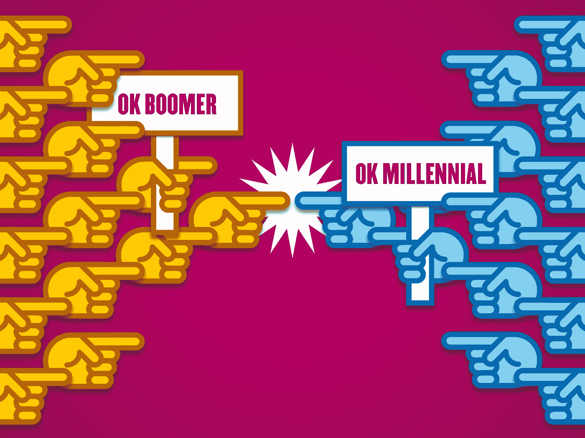

# 为什么发动一场代际战争不是一个坏主意

> 原文：<https://medium.datadriveninvestor.com/why-its-not-a-bad-idea-to-start-an-intergenerational-war-b1409d5ad5a8?source=collection_archive---------17----------------------->

**千禧一代 vs 婴儿潮一代**

对世界来说，全球代际战争可能是一件好事。世界主要由婴儿潮一代(57-75 岁)统治，他们很少或根本不知道他们对世界做了什么，他们给世界带来了什么问题，以及需要做什么来解决这些问题。

人们很容易将代际战争误认为是基于年龄的歧视，并将其视为一件坏事。如果对年龄歧视言论进行调查，就很容易注意到有一个反对婴儿潮一代的真实案例，因为他们是年龄歧视问题的集体组成部分。

婴儿潮一代是年龄歧视的主要来源。他们处于年龄歧视的中心。因为他们已经存在了足够长的时间，他们垄断了所有的权力职位，不愿意让千禧一代进入这些职位。

我们在代表权方面有问题。千禧一代代表不足，婴儿潮一代代表过多。这是一个全球性的问题，既存在于民主国家，也存在于专制国家。从美国到欧洲，从中国到印度尼西亚，从乌干达到津巴布韦。

Jessica Wildfire 在一篇名为[的文章中从微观层面探讨了这些问题，这篇文章是关于为什么大多数千禧一代的生活如此糟糕的权威指南。](https://medium.com/datadriveninvestor/the-definitive-guide-to-why-life-is-terrible-for-millennials-130104f8b2df)

由于智慧与年龄无关，因此将领导力与年龄脱钩是有意义的。世界需要更多的千禧一代领袖。不幸的是，如果不把一些婴儿潮一代人从政策决策的特权位置上赶走，我们就不可能有更多的千禧一代领导人。

# **反对婴儿潮一代的案例**

*   他们偷走了我们的未来
*   他们制造了世界上大多数的问题
*   他们不明白他们制造了这些问题
*   他们不能成为解决方案的一部分，因为他们不明白他们是问题的一部分。
*   为了以一种对每个人都有利的方式改写世界，千禧一代(在混乱的世界中首当其冲)需要让婴儿潮一代离开。

# **婴儿潮一代如何搅乱世界？**

*   他们让世界负债累累。
*   这些年来，他们提高了生活成本，生活对我们千禧一代来说是不可承受的。
*   他们肆无忌惮地掠夺地球的资源。
*   他们扼杀了房地产市场。
*   他们扼杀了就业机会。
*   他们污染了地球母亲。
*   他们用无休止的官僚作风腐蚀政治、治理和行政。
*   他们垄断了地球的资源，不想分享这个世界。

这些问题和年龄有关系吗？答案是肯定的，因为它们不成比例地影响着社会的各个部分。婴儿潮一代受益于经济的过度扩张。他们在繁荣时期积累了资本，所以他们的债务负担没有我们的沉重。他们有储蓄，有经通胀调整的投资，他们还参与股票市场，因此他们不会完全受到生活成本上涨的影响。他们拥有房子。他们有工作，或者还在继续工作。她们担任大多数公职。

总体而言，我们在这个世界上遇到的问题不会像影响千禧一代那样影响婴儿潮一代。因此，修复世界的激励和动机略有不同。对婴儿潮一代来说没那么糟糕。只有婴儿潮一代承认存在问题，代际不平等才能得到解决。

# **战争的目标**

*   让婴儿潮一代尽快脱离权力和公共政策的位置。

# **我们如何发动战争**

*   **第一步是提高意识**——这一步的一个关键“要做的事”是让千年一代对那些正在实施年龄歧视的人将会提出的年龄歧视指控做好心理准备。
*   第二步是组织起来——这可能需要形成一个全球反婴儿潮运动，领导推翻婴儿潮一代的所有权力和公共政策。有了社交网络，人们有很大的空间来围绕目标进行组织和集中。
*   **第三步是“采取行动**”——这可以采取让更多千禧一代参与政治的形式，本质上是让千禧一代过度参与政治。如果组织起来，我们千禧一代可以要求将选举和相关过程数字化。我们可以要求所有超过退休年龄的人退休。我们可以推动婴儿潮一代为我们制定的某些古老法律的改变。我们可以以有益于地球母亲和地球上所有人的方式重写整个世界。

很难消化的东西。

再见。