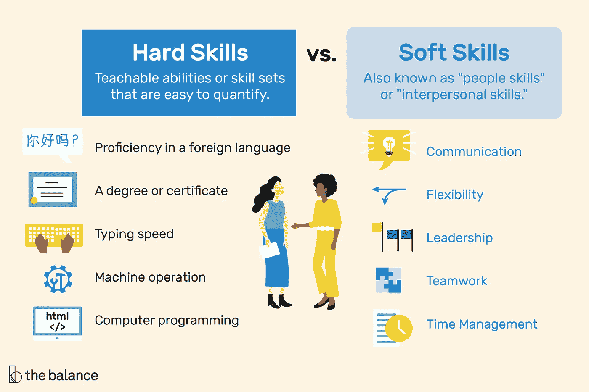
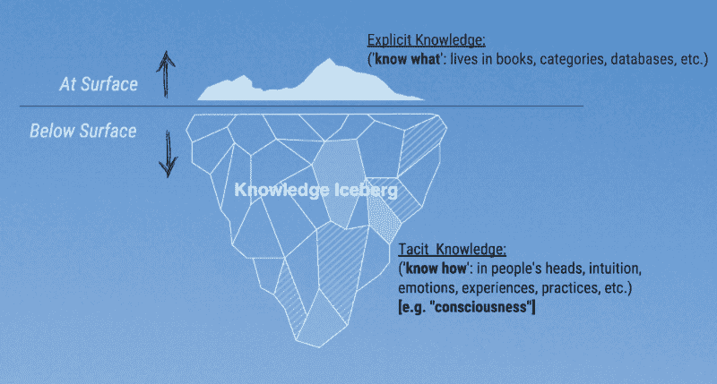

# 为什么训练机器人的软技能如此困难

> 原文：<https://medium.datadriveninvestor.com/why-its-so-hard-to-train-robots-soft-skills-1698f97dd2d?source=collection_archive---------8----------------------->

## 毕竟，训练人类的软技能已经够难了。

Photo by [Lenin Estrada](https://unsplash.com/@lenin33?utm_source=medium&utm_medium=referral) on [Unsplash](https://unsplash.com?utm_source=medium&utm_medium=referral)

遇见瓦力，来自电影(惊喜)*瓦力*。他是为了收集地球上的垃圾而生的，但他远不止这些——他收藏纪念品，玩任何引起他兴趣的东西，并且喜欢探测器 EVE。

整部电影中，瓦力和伊芙都展示了自己的个性和各种“软技能”。这两个人表现出很好的沟通，对彼此的同情，甚至是牺牲。

但是机器人在现实生活中有可能做到这一点吗*？去模仿人类难以企及的善良和同情？*

*不幸的是，现实是，让机器人达到这种程度的互动有点复杂——在一些人看来，这是不可能的。让我们深入研究一下。*

# *什么是软技能？*

**

*Source: [The Balance Careers](https://www.thebalancecareers.com/hard-skills-vs-soft-skills-2063780)*

*[**软技能**](https://www.thebalancecareers.com/what-are-soft-skills-2060852)——在工作中取得成功所需的个人属性、个性特征、固有的社交暗示和沟通能力。它们描述了一个人在与他人的关系中是如何互动的。它们包括适应性、沟通、创造性思维、解决冲突等。*

*这与 [**硬技能**](https://www.thebalancecareers.com/what-are-hard-skills-2060829) 相反，硬技能是你可以通过教育、认证和培训获得的特定工作技能。根据工作的不同，这可能包括从计算机编程到木质框架的任何东西。*

# *软技能>硬技能*

*如今，越来越多的人基于软技能而不是硬技能进行招聘，原因有很多。*

*首先，学习新的软技能比硬技能更难。学习软技能需要**个人对发展的奉献**，当然，每个人的“课程”看起来都不一样。例如，一个人可能在做错事之后，通过一个角色模型等来学习同理心。*

*但是有了硬技能，一个人可以通过足够的练习和指导学会任何东西。一个很好的例子是计算机科学——一个人是否拥有计算机科学的学士学位，或者是否通过参加新兵训练营学会了编码都不重要，只要你能做好这份工作。另外，你个人有多敬业并不重要。只要你做了工作，你就会学到技巧，不管你对这个话题的感觉如何。*

*除了培训，软技能对于职场也是必要的。新的、现代的公司不再像传统的朝九晚五的日子，穿着西装的人整天坐在小房间里。它变得更加随意、个性化和协作化。即使你有一堆花里胡哨的证书，如果和你一起工作的人是个混蛋，你也不会坚持很久。*

# *编程软技能*

*神经网络的灵感来自于我们大脑中的神经元。强化学习类似于人类通过试错来学习。所以，让我们利用人类的经验。你是如何学会感同身受，理解人们的需求，或者成为一名团队成员的？我们从**的错误**中吸取教训。*

*假设我试图创建一个算法来画一只狗。*

1.  *画一个圆。*
2.  *画一张脸。*
3.  *画耳朵。*

*…等等。*

*现在，假设我试着创建一个友好的算法。*

1.  *不打人？*

*也许在最好的情况下，我的列表应该是这样的:*

1.  *体谅别人的感受。*
2.  *不要刻薄或粗鲁。*

*但是体贴是什么意思呢？你怎么知道其他人在想什么？这就涉及到了连*更*的软技能传授！*

*生活并不总是非黑即白。看到有人欺负你朋友怎么办？在那种情况下，“善良”是什么样的？这在那种情况下重要吗？*

*简单来说，教人类软技能已经够难了，更别说机器人了。*

# *波兰尼悖论*

> *“我们能知道的比我们能说的多。”*
> 
> *——迈克尔·波拉尼，心照不宣的维度(1966)*

*迈克尔·波拉尼，一位著名的科学家和哲学家，最著名的是他对隐性知识的发现和见解。*

**

*[Source: David Loewen Blog](http://www.davidloewen.org/blog/2017/5/22/tip-of-the-icebergs-clichd-metaphors-in-education)*

*[**隐性知识**](https://dictionary.cambridge.org/us/dictionary/english/tacit-knowledge)**——你不是从别人教的，或者从书本等获得的知识。而是从个人经历中得到的。例如，幽默、直觉、领导力和美学都是隐性知识的形式。***

***[**显性知识**](https://dictionary.cambridge.org/us/dictionary/english/explicit-knowledge)——可以用文字、数字、符号表示并储存在书本、电脑等中的知识。***

***波兰尼是第一个区分这两者的人。但是他走得更远，声称有些事情我们知道却无法解释——这就是著名的波兰尼悖论。***

*** [## 要避免的 5 个机器人流程自动化陷阱|数据驱动型投资者

### 在一些大公司的机器人流程自动化(RPA)之旅中，我从一开始就在这些公司工作…

www.datadriveninvestor.com](https://www.datadriveninvestor.com/2020/09/29/5-robotic-process-automation-traps-to-avoid/) 

虽然这对人类来说没问题，但当试图编写一个算法来教会机器这一点时，就会出现问题。

> 从根本上说，计算机遵循程序员精心设计的程序。为了让计算机完成一项任务，****程序员必须首先完全理解执行该任务所需的步骤序列**，然后必须编写一个程序，实际上，使机器精确地模拟这些步骤。**
> 
> **— [大卫·奥特尔的《波兰尼悖论与就业增长的形态》](https://economics.mit.edu/files/11611)**

**在这种情况下，我们如何对我们自己都不知道如何做的事情进行编程呢？**

# **机器人软技能的未来**

****

**Photo by [Alex Knight](https://unsplash.com/@agkdesign?utm_source=medium&utm_medium=referral) on [Unsplash](https://unsplash.com?utm_source=medium&utm_medium=referral)**

**基于波兰尼悖论，我们不能明确地将软技能编程到机器人中。不会有代码块翻译成“协作”或“领导”。**

**毕竟，这不是我们人类学习软技能的方式。不是来自一步一步的过程，而是来自*经验*。**

**由于我们已经开始以人工智能的形式复制智能，我不会说用软技能做类似的事情完全不可能。我们已经通过人工智能展示了**计算机可以从经验中学习**。**

**我们没有像以前那样，设置规则并让机器遵循规则(“自上而下”策略)，而是让机器根据结果制定自己的规则(“自下而上”策略)。**

**为什么同样的话不能用软技能说？人工共情已经在研究中，有像 [Pepper](https://www.softbankrobotics.com/emea/en/pepper) 这样专注于人类互动的机器人。**

**然而，与人类相比，机器人可以学习的软技能的程度和熟练程度是一个单独的问题。**

# **这对人类意味着什么**

**老实说，自动化软技能可能不是一件坏事。即使机器人在某种程度上被赋予了情商，它仍然可以帮助人类，而不是取代他们。**

> **“任务**不能计算机化**的事实并不意味着计算机化对该任务没有影响。相反；计算机无法替代的任务一般都由信息技术来补充**
> 
> **— [波兰尼悖论与就业增长的形态，作者戴维·奥特尔](https://economics.mit.edu/files/11611)**

**换句话说，自动化并不意味着你会失业。所以，只要磨练你的软技能就行了，因为有些事情机器人不能比人做得更好。***** 

## *****引人深思的事*****

*****假设在未来，机器人最终能够学习软技能。他们可以像人类一样交流、强调和合作。那么会不会有没有自动化风险的工作呢？*****

# *****关键要点*****

*   *******软技能**是在工作中取得成功所需的个人品质和沟通能力，而**硬技能**是你可以通过教育、认证和培训获得的特定工作技能。*****
*   *****如今，软技能更有价值，因为它们更难训练，更容易应用。*****
*   *****使用传统编程很难编写软技能，在传统编程中，人们创建特定的规则并让计算机遵循它们。**波兰尼悖论，**陈述即“我们能知道的比我们能说的多”，也支持了这一点——我们不能清楚地解释我们心照不宣地知道的东西！*****
*   *****但是人工智能已经向我们展示了计算机可以从经验中学习，而不需要硬编码。所以，可能性肯定是有的。*****
*   *****尽管如此，除非机器人能达到和人类一样的情感能力，否则它们很可能不会取代人类。专注于提高你的软技能，你会没事的。*****

*****嘿，我叫 Alexis，是一名 18 岁的大学新生，对人工智能、写作和个人发展很感兴趣！*****

******感谢阅读——欢迎随时关注我的 Medium、*[*LinkedIn*](https://www.linkedin.com/in/alexis-wang-a50285180/)*，或者给我发邮件了解更多信息。下次见！******

*****电子邮件:alexiswang55@gmail.com*****

*******访问专家视图—** [**订阅 DDI 英特尔**](https://datadriveninvestor.com/ddi-intel)*****