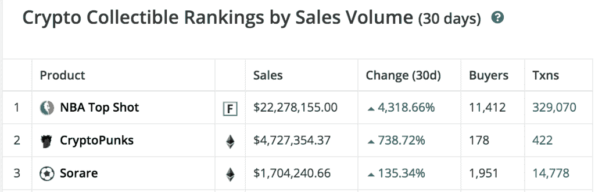
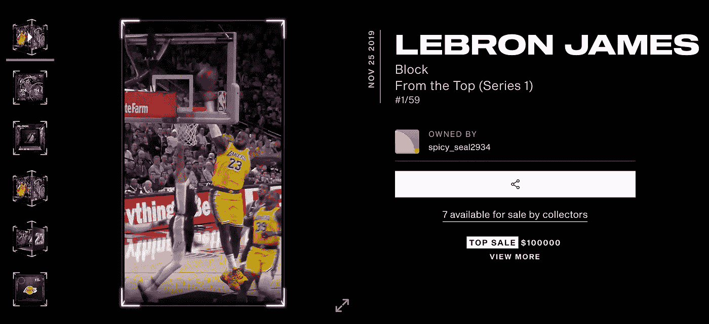
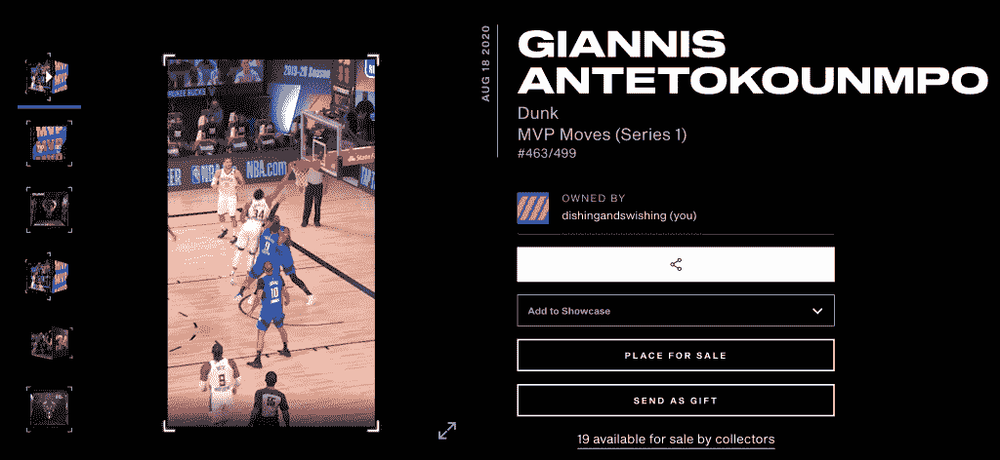
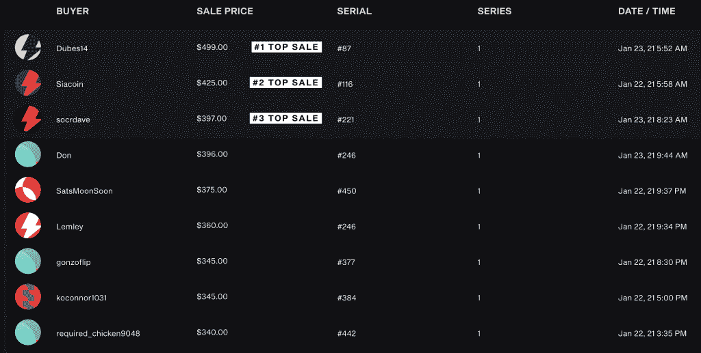
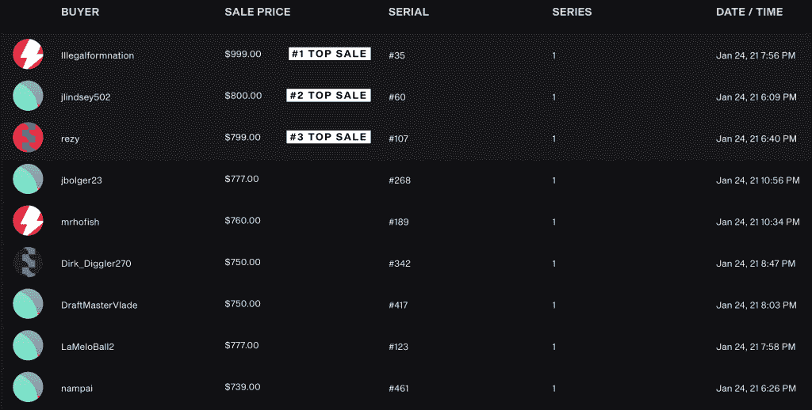

# 为什么是时候投资 NBA 顶级投篮了

> 原文：<https://medium.datadriveninvestor.com/why-its-time-to-invest-in-nba-top-shot-c31025647d8?source=collection_archive---------0----------------------->

篮球。加密货币。交易卡。市场。

尽管它们看起来不同，但有一个产品将它们结合在一起:NBA Top Shot，这是一个区块链驱动的平台，在这里你可以买卖 NBA 集锦。

你可以把它想象成比特币和实体运动卡的混搭。然而，你不是交换卡片，而是交换 NBA 比赛中激动人心的“时刻”的视频集锦。

但是等等！我们就不能在 YouTube 上免费看同样的集锦吗？我们当然可以。我们还可以免费打印一张霍纳斯·瓦格纳棒球卡的图像…但是祝你好运，能以 300 万美元的价格卖出去！每一个数字时刻的价值都来自于它的真实性和稀缺性，这使得它与黄金、比特币、艺术品和交易卡等商品非常相似。

Top Shot 的早期采用可不是闹着玩的。他们的市场现在每天都能看到[100 万美元的销售额](https://www.actionnetwork.com/news/nba-top-shot-blockchain-nba-highlight-marketplace)。该产品的销售额超过了 2000 万美元，其中大部分都是在上个月实现的。《壮志凌云》背后的公司 Dapper Labs 已经得到了联合广场风险投资公司(Union Square Ventures)和安德森·霍洛维茨(Andreessen Horowitz)等风投巨头以及安德烈·伊戈达拉、斯宾塞·丁翁迪和阿隆·戈登等 NBA 球员的投资。

NBA Top Shot is easily the most popular crypto collectible in the world. Source: [CryptoSlam!](https://cryptoslam.io/)

这个平台仍然有很多不确定性，我承认这个概念起初对我来说似乎很疯狂和愚蠢。但是现在，我相信 NBA 最佳射手会一直在这里。

请记住，这篇文章不是投资建议。这些是我的个人观点，仅用于信息目的！

# 为什么 NBA 顶级投篮会成功

我相信 NBA Top Shot 将成为一个受欢迎的市场，如果不是市场的话，对 NBA 球迷来说将成为:

1.  **投资者**:那些**投资**NBA 球员未来成功或受欢迎程度的人。
2.  **交易者**:那些喜欢发现市场无效率和**翻转**资产以获得好交易的人。
3.  **收藏者**:享受**拥有**稀有资产并炫耀的人。

有很多人对至少做这些事情中的一件感兴趣。我们不要忘记，全世界有数十亿 NBA 球迷。

对我来说，这个系统听起来像是一个**股票市场，但有 NBA 球员**，因为它提供了一种间接的方式来押注 NBA 球员的成功。这对投资者、交易者和收藏家都很有吸引力，他们可能会涌向锡安·威廉姆森(Zion Williamson)这样的年轻明星或勒布朗·詹姆斯(Lebron James)这样的一代天才——他们两人的每个瞬间都刚刚卖出了 10 万美元！

As of today, the King shares the crown for the most valuable Top Shot moment. Source: [NBA Top Shot](https://www.nbatopshot.com/moment/spicy_seal2934+0ce6787a-e854-43db-a29d-90faffa9311c)

理论上，一个类似的系统已经存在于体育纪念品中，但是这个系统充满了物理资产的许多问题。收藏者不得不保存卡片的物理状态，处理运输的麻烦，并冒险从不知名的易贝供应商那里购买。所有这些因素使得实体卡成为流动性很差的资产。坐在区块链上的纯数字收藏品可以改变这一切。

# 价格正在上涨

NBA 顶级投篮时刻的价值增长有多快？为了找到答案，我决定看一眼我自己的收藏。作为参考，我的第一包是 2020 年 9 月买的。从那以后，我又从市场上买了两包和一些时刻。

我最有价值的时刻之一是卫冕 MVP 扬尼斯·阿德托昆博在最近的 NBA 季后赛中的一次扣篮。

我在 12 月 5 日****【16】美元**从市场买了这个时刻[。](https://www.nbatopshot.com/listings/p2p/b73fe6f1-ae28-468b-a4b3-4adb68e7d6bc+6311056f-0bd3-48d1-90a1-8c8cdbdd98cd)**

**我不想撒谎…我很便宜，所以为一个视频片段付那么多钱让我担心了一段时间。最后，我扣动了扳机，心里想着有一天它会值多少钱。**

**事实证明，我不用等很久就能得到答案。在接下来的一个月里，NBA Top Shot 获得了强劲的势头。在 1 月 23 日写这篇博客的时候，我决定查看一下我的《Giannis moment》的其他副本在市场上的最新销售情况。以下是有史以来销售额最高的前三名的截图，随后是市场上最近的销售额:**

****

**哇！！考虑到这个时刻的序列号，我的时刻突然价值 350 美元。也就是说，在大约七周的时间里，回报率达到了 2088%。**

**第二天，我决定再看一下市场，只是为了确保所有的数字都准确无误，然后再发表我的博文:**

****

**嗯……不好意思？？原来我的数字是错的！不到两天，销售价格翻了一番。我的时刻现在价值约 750 美元，总回报率为 4588%。**

**回答最初的问题:这些时刻正在迅速增值。与投资了数十万美元的球员相比，我的收藏仍然微不足道。然而，很明显，顶级镜头的价值已经飙升。**

# **为什么你仍然应该保持谨慎**

**当然，就像世界上任何资产一样，我们有理由持怀疑态度。**

**最精彩的瞬间属于不可替代的标志类别，仍然面临着大量的审查。没有实物或有形资产的支持，纯数字资产能长期保值吗？这是加密货币面临的一个大问题，尤其适用于 NFT。**

**还有过去失败的 NFT 的问题。在建立 NBA Top Shot 之前，Dapper Labs 创造了 [CryptoKitties](https://www.cryptokitties.co/) ，它以其迅速崛起和突然衰落而闻名。如今，隐猫的价值只是其巅峰时期的一小部分。**

# **判决**

**对 NBA 最佳投篮的担忧是有根据的。但是如果你觉得 FOMO 不是第一个购买这种狂热的人，那么这可能是个好消息。如果不是因为风险，谁知道这些时刻会卖多高！**

**[乔纳森·贝尔斯](https://luckymaverick.substack.com/p/nft)，最近花了 35000 美元买了一个 Ja Morant moment，他说得很简单:“如果简单明了，每个人都会去做。”毕竟，早期在比特币上赌博的人不多，但那些赌过的人今天收获了丰厚的回报。下行空间有限，但上行空间巨大。**

**归根结底，任何资产的价值取决于有人愿意为之支付的价格。到目前为止，人们愿意为 NBA 顶级投篮时刻支付大量费用。**

**鉴于当今世界的趋势，以及它独特地融合了如此多的流行兴趣，我非常相信这款产品是与众不同的。押注 NBA Top Shot 等于同时押注 NBA、加密货币和信用卡收藏——对我来说，这是一场艰难的战斗！**