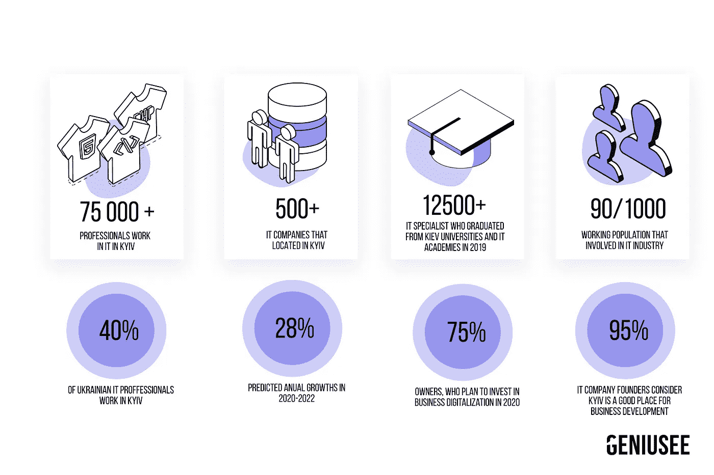

# 为什么基辅是乌克兰和欧洲最有吸引力的信息技术外包地

> 原文：<https://medium.datadriveninvestor.com/why-kiev-is-the-most-attractive-it-outsourcing-place-in-ukraine-europe-1ca893764cb7?source=collection_archive---------8----------------------->

乌克兰信息技术市场逐年稳定增长。根据普华永道的分析，信息技术市场最近增长了 3 倍。在 2011-2015 年期间，其增长率为 150%，2020 年已经达到 57 亿美元。根据信息技术外包新闻发布的最新统计数据，2020 年，世界市场上有 22 万乌克兰程序员。这是欧洲最高的指标，在全球表现排名第四。82%的乌克兰 IT 员工集中在前 5 大城市——基辅、哈尔科夫、利沃夫、第聂伯罗和敖德萨(2020 年)。自乌克兰 IT 部门成立以来，基辅一直保持着领先地位，被认为是乌克兰最具吸引力的 IT 外包地。

## 乌克兰信息技术市场概述

2019 年，基辅是世界上 100 个技术最先进的城市之一。智能城市天文台、IMD 世界竞争力中心和新加坡科技设计大学的一项[研究](https://www.imd.org/smart-city-observatory/smart-city-index/)对此进行了阐述。该评级考虑了以下几类城市的可制造性:健康与安全、流动性、娱乐性、机遇和管理。此外，专家们还评估了技术对城市居民的可用性。以下列出的指标最能说明基辅 IT 基础设施的快速增长。

## 基辅信息技术市场概述

## **75000+专员**

寻找 IT 外包合作伙伴时，公司希望实现的主要目标之一是确定发展业务的最佳地点。这样的信息技术外包场所应该结合灵活的价格政策、劳动力市场上各种有才华的专业人士和有利的商业生态系统。

 [## 软件开发过程:如何选择正确的过程？|数据驱动型投资者

### 软件是任何企业组织成功的生命线。没有软件的帮助，一个…

www.datadriveninvestor.com](https://www.datadriveninvestor.com/2020/01/16/software-development-process-how-to-pick-the-right-process/) 

由于基辅是首都，这里有来自乌克兰各地的各种各样的专家，为发展和实现不同的商业目标提供了巨大的机遇。这里有 75，000 名专家，占乌克兰 IT 行业就业人口的 40%。这个数字还在不断增长。基辅有 500 多家信息技术公司。其中约 20%为产品公司，约 13%为混合(产品+外包)公司，67%采用外包业务模式。

## **28%年度市场开发**

基辅是一个 IT 和商业潜力快速增长的城市。《金融时报》将基辅列为 2020 年十大性价比城市之一。《T2 基辅邮报》报道称，当地科技产业对乌克兰经济至关重要。基辅的 IT 行业是有益的，即使在疫情，因为大多数技术专家很快适应变化，例如，从办公室到远程模式的工作过渡。据 [ESOMAR](https://www.esomar.org/) 和专业服务公司 [BDO](https://www.bdo.ua/) 称，行业发展呈现积极势头。2020 年基辅 IT 行业的增长将是 28%。

据 IT 领域的专家称，基辅的行业将继续以更快的速度增长，并吸引更多的投资。有趣的是，95%的 It 外包首席执行官认为这座城市是开展业务的好地方。

早在 2015 年，基辅市议会就表示，基辅和整个乌克兰的 IT 产业已经成为发展和投资的重中之重。在过去的 5 年里，实施了一项战略，旨在维持、确保稳定的收入，并发展基辅的 IT 部门。

## **基辅 12500 多名 IT 学生**

对于那些决定释放自己的潜力并致力于 IT 发展的人来说，基辅是乌克兰最好的地方。截至 2020 年 5 月，约有 12，500 名各种 IT 领域的学生注册，2019 年有 5，200 名学生成为毕业生。在基辅，有全国最好的教育机构，其中 33 所设有技术学院。其中包括基辅理工大学、国立航空大学、基辅塔拉斯·舍甫琴科国立大学、基辅国立技术与设计大学等。

此外，50 多个研究中心和研究院定期举办关于现代技术和相关主题的研讨会、讲座和会议。

同样是在基辅，有很多 IT 学校的老师都是在基辅设有办事处的世界大公司的技术负责人。对于这样的课程，任何人都可以学习从 Javascript 到 Objective-C 或 Swift 的趋势编程语言。最优秀的开发人员完成了 STEP Computer Academy、Main Academy、CyberBionic Systematics、IT Education Academy (ITEA)、GoIT、QALight 等课程。

## **13，000 多名技术爱好者参加基辅的 IT 活动**

基辅是欧洲最大的科技之都之一。每年，这里都会举办 100 多场技术活动——从基辅 IT 公司组织的小型本地会议开始，到汇集了 13，000 多名技术爱好者的世界大会结束。

基辅主办了世界上最大的 IT 会议。去年，这一活动汇集了来自乌克兰和其他国家的 13，000 名参与者。虽然只有一天时间，但这次会议非常重要。在 iForum 有 6 个流和一个巨大的展区，在这里，既有想让自己出名的初创公司，也有老牌公司。

另一个预期的事件是 Devoxx 乌克兰(前 JavaDay)会议。Devoxx 是世界上最大的 Java 会议，有数百名杰出的国际演讲者、赞助商、庞大的内容数据库和新的演讲格式。这是一年一度的国际会议，有 60 多位来自全球的演讲者——来自美国、加拿大、西欧和其他国家的知名 Java 专业人士。Devoxx 大家庭每年接待 17，000 多名开发人员，他们分布在比利时、英国、法国、波兰、摩洛哥以及全球另外 14 个城市。而且，Devoxx4Kids 通过遍布全球的分会，为 10000 个孩子带来了编码的魔力。

而且城市里有很多社区从各个领域联合起来的。反过来，他们帮助那些希望掌握技术并深入其中的人——在诸如初级前端、初级 NodeJS、初级后端等领域的免费教育计划。最著名的社区之一是 Kottans。

## **1500 多家酒店和 50 条国际航线。**

基辅是乌克兰文化的中心，到处都是剧院、博物馆、宗教场所、现代建筑和古代遗迹，每年都有数百万外国人来到这里(2020 年春夏除外)。建于 1015 年的基辅佩切尔斯克拉夫拉和圣索菲亚大教堂(1037 年)是世界遗产。它拥有发达的基础设施，大量的酒店(目前超过 1500 家)，拥有世界各种美食的餐厅，以及许多购物和娱乐中心。

在基辅，有大量的商业中心、共同工作的地方和办公室，公司在那里消除与合作伙伴的合作。基辅温和的气候和有利的地理位置会让每个人都很开心。此外，Boryspil 和基辅机场这两个大型机场可以飞往全球 50 多个不同的目的地。从伦敦起飞大约需要 3.5 小时，我们来自美国的朋友可以在 8-10 小时内到达基辅。

基辅是一座人才济济的城市。基辅无条件且不可逆转地成为了一座花园城市。基辅是一个多面的城市。基辅是不被原谅的，不是美味的食物，不是友好的经理，不是微笑的服务员。在基辅，每个人都跑步，做运动，不看电视。基辅每天都不一样。

我们可以得出结论，基辅不仅是乌克兰，也是整个欧洲最吸引 IT 合作伙伴的城市之一。物有所值也会让那些想外包软件开发的企业家高兴。