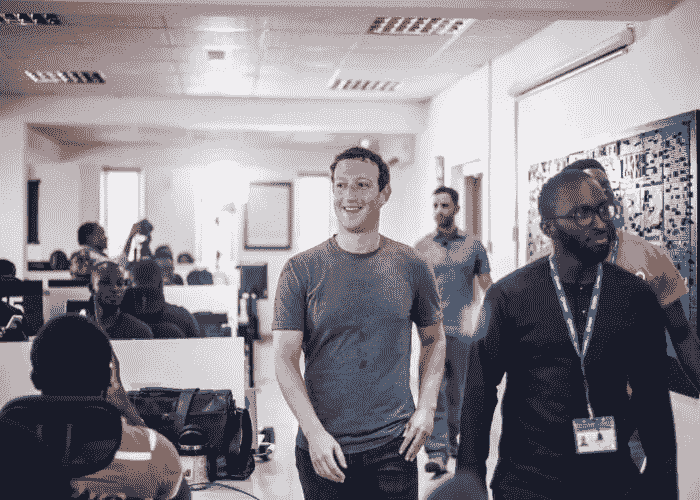

# 为什么马克·扎克伯格、脸书和 WhatsApp 将拥有非洲的未来

> 原文：<https://medium.datadriveninvestor.com/why-mark-zuckerberg-facebook-and-whatsapp-will-own-the-african-future-30ccd6ba42c0?source=collection_archive---------10----------------------->

Mark Zuckerberg in Africa

我感觉自己像一个圣经中的先知，因为我的预见引起了一些世界上最大的企业家的兴趣。近年来，世界上一些最杰出的企业家和创始人对非洲越来越感兴趣。我们已经看到[马云](https://www.forbes.com/sites/tobyshapshak/2018/08/07/alibaba-founder-jack-ma-to-launch-10m-african-entrepreneurial-prize)[【I】](http://file///C:/Users/Mac/Documents/Business%20-%20Projects/0.%20SIL/Afrineur/Blog/Mark%20Zuckerberg%20-%20Africa/Why%20Mark%20Zuckerberg%20will%20Own%20the%20African%20Future.docx#_edn1)[马克·扎克伯格、比尔·盖茨、史蒂夫·凯斯和蒂姆·德雷珀](http://file///C:/Users/Mac/Documents/Business%20-%20Projects/0.%20SIL/Afrineur/Blog/Mark%20Zuckerberg%20-%20Africa/Draper%20https:/moguldom.com/132457/5-reasons-mark-zuckerbergs-visit-africa-important/)[【ii】](http://file///C:/Users/Mac/Documents/Business%20-%20Projects/0.%20SIL/Afrineur/Blog/Mark%20Zuckerberg%20-%20Africa/Why%20Mark%20Zuckerberg%20will%20Own%20the%20African%20Future.docx#_edn2)访问并对非洲大陆产生了浓厚的兴趣。新的事情是，对他们中的一些人来说，这不仅仅是从慈善的角度来看。

 [## 天秤座可能是脸书的末日

### 2019 年，脸书越过了一条红线。公司宣布了 Libra 项目。在深入了解天秤座之前，我们先来了解一下…

www.datadriveninvestor.com](https://www.datadriveninvestor.com/2020/03/14/libra-may-be-the-end-for-facebook-part-i/) 

当脸书创始人马克·扎克伯格在 2016 年访问非洲时，那次访问对我们许多人来说意义重大。然而，这对整个世界来说意义重大。简而言之，我认为这是一个比喻:这是最能接触到大数据和解读大数据的人现在最关注的地方。世界，注意了！

据《福布斯》报道，马克·扎克伯格声称未来将建在非洲[【iv】](http://file///C:/Users/Mac/Documents/Business%20-%20Projects/0.%20SIL/Afrineur/Blog/Mark%20Zuckerberg%20-%20Africa/Why%20Mark%20Zuckerberg%20will%20Own%20the%20African%20Future.docx#_edn4)。

# 马克看到了什么:

**显而易见的**

*   **非洲互联网用户增加:** [统计(internetworldstats.com)显示，只有 36%的非洲人口使用互联网。截至 2018 年 10 月 21 日，这占所有互联网用户的 11%。这大约是 4.65 亿人。任何全球互联网创始人都会注意到的一件令人担忧的事情是，从 2000 年到 2018 年，非洲的用户增长率最高。在此期间，非洲的增长率为 10，199%，相比之下，非洲的增长率最高。事实上，它高于所有其他地区的总和，甚至使 1066%的世界平均水平相形见绌。我很肯定脸书的人看到这些数字后，会发现巨大的机会就在他们面前。怎么会有人忽略这个——10，199%？？？？](https://www.internetworldstats.com/stats.htm)
*   **非洲脸书用户增加:** [同样，根据 internetworldstats.com 的数据，截至 2017 年 12 月 31 日，非洲拥有 1.77 亿脸书用户，而全球用户总数为 21.19 亿。由于我不确定脸书用户目前的统计数据，很容易假设非洲互联网用户的总体增长推动了脸书用户的增长。这 10，119%的增长非常有助于扩大脸书的用户群。我们也不要忘记扎克伯格的 internet.org 努力，旨在消除互联网接入的成本因素，防止发展中国家的大量人口上网。](https://www.internetworldstats.com/stats1.htm)
*   **非洲移动使用量增加:**[Allafrica.com 表示，非洲的移动网络订阅率目前为 80%，拥有 9.6 亿移动用户(尽管许多用户拥有不止一个电话号码)。](https://allafrica.com/stories/201704251054.html)[【VII】](http://file///C:/Users/Mac/Documents/Business%20-%20Projects/0.%20SIL/Afrineur/Blog/Mark%20Zuckerberg%20-%20Africa/Why%20Mark%20Zuckerberg%20will%20Own%20the%20African%20Future.docx#_edn7)
*   **移动支付技术与非洲和发展中国家的关系越来越密切:**如果你熟悉非洲，你可能会知道越来越多的人可以通过电话联系，但不是每个人都使用智能手机。这对于生活在农村地区的非洲人和老年非洲人来说尤其如此。因此，通过 GSM 移动设备上的 USSD(非结构化补充业务数据)技术，用户可以获得更多的业务。[这些服务允许通过 USSD 进行移动支付(和其他服务)。Wiza Jalakasi 的这篇文章很好地解释了这一点。[viii]](http://qz.com/africa/1296120/how-a-20-year-old-mobile-technology-protocol-is-revolutionizing-africa/) 这基本上意味着，只要个人能够使用 GSM 移动电话和移动货币服务，他们就有可能将钱从一个用户转移到另一个 GSM 电话用户。[仅撒哈拉以南非洲就有 140 家移动支付服务，分布在 39 个国家。](https://www.forbes.com/sites/tobyshapshak/2017/07/11/sub-saharan-african-will-have-500m-mobile-users-by-2020-already-has-over-half-mobile-money-ervices/#431d86f52456)[【IX】](http://file///C:/Users/Mac/Documents/Business%20-%20Projects/0.%20SIL/Afrineur/Blog/Mark%20Zuckerberg%20-%20Africa/Why%20Mark%20Zuckerberg%20will%20Own%20the%20African%20Future.docx#_edn9)同样，[马克访问肯尼亚的原因之一是因为肯尼亚是移动支付的全球领导者](https://www.wired.com/2016/10/zuckerberg-in-africa/)[【x】](http://file///C:/Users/Mac/Documents/Business%20-%20Projects/0.%20SIL/Afrineur/Blog/Mark%20Zuckerberg%20-%20Africa/Why%20Mark%20Zuckerberg%20will%20Own%20the%20African%20Future.docx#_edn10)。他明白这是一项创新，世界可以从非洲学到很多东西。
*   **来自非洲的 Whatsapp 用户增加:** Whatsapp 是非洲使用最多的消息应用。[由于现在归脸书公司所有，截至 2018 年初，Whatsapp 拥有 15 亿用户。这是自 2014 年脸书公司收购以来用户群的巨大增长。](http://www.techcrunch.com/2018/01/31/whatsapp-hits-1-5-billion-monthly-users-19b-not-so-bad)[【Xi】](http://file///C:/Users/Mac/Documents/Business%20-%20Projects/0.%20SIL/Afrineur/Blog/Mark%20Zuckerberg%20-%20Africa/Why%20Mark%20Zuckerberg%20will%20Own%20the%20African%20Future.docx#_edn11)当时有 4.5 亿用户，不到 4 年新增用户 10 亿简直是疯了！现在，Whatsapp 从其所有者那里获得实际收入的时机已经成熟。
*   **最近推出的“Whatsapp for Business”:**这款新应用预示着商业新时代的开始。[目前它是免费的，企业可以通过移动设备更好地与客户联系，以获得客户支持、营销和其他服务。](http://www.techcrunch.com/2018/01/31/whatsapp-hits-1-5-billion-monthly-users-19b-not-so-bad)[【XII】](http://file///C:/Users/Mac/Documents/Business%20-%20Projects/0.%20SIL/Afrineur/Blog/Mark%20Zuckerberg%20-%20Africa/Why%20Mark%20Zuckerberg%20will%20Own%20the%20African%20Future.docx#_edn12)然而，面向商业的 Whatsapp 才是“未来”的开始。如果惊人的移动货币服务出现，我敢打赌，它将通过这个平台出现。
*   **非洲无银行账户人口比例:**截至 [2017 年，约有 20 亿人无银行账户。金融普惠被认为是解决全球贫困问题的一个关键因素。](http://uk.businessinsider.com/the-worlds-unbanked-population-in-6-charts-2017-8?IR=T/#the-vast-majority-94-of-adults-in-oecd-high-income-countries-said-they-had-a-bank-account-in-2014-while-only-54-of-those-in-developing-countries-did-the-middle-east-had-the-lowest-proportion-of-account-holders-with-only-14-on-average-1)从 2011 年到 2014 年，拥有银行账户的人数增加了 7 亿，从某些方面来看，有理由预计这一数字将继续增长。然而，人们提到的没有账户的主要原因是负担不起。在我看来，一些银行的利率(至少在马拉维的一些银行)是绝对荒谬的，即使是在储蓄账户上。也就是说，脸书公司有商业模式、规模和独创性来赚钱，而不会给最终用户带来财务压力。毕竟，他们目前的商业产品(脸书赞助的广告)连我都负担得起。无论他们推出什么，普通用户也能负担得起。

**不太明显的**

*   **移动支付领域的领导空间:**如前所述，撒哈拉以南非洲地区有 140 家移动支付提供商。脸书已经习惯了统治。如果它进入这个领域，它将有望成为移动支付领域的全球领导者。关于它没有两种方法。现实是:他们其实可以做到这一点，而且做得很好。
*   **脸书和 Whatsapp 在满足移动资金缺口方面的相关性:**我自己在 2017 年访问过中国，对微信在我们所到之处的普及感到惊叹，像微信这样的解决方案在非洲可用的想法令人兴奋。
*   **大数据&世界其他地方永远无法获得的洞察力:**这必须是最令人兴奋的考虑因素。他们看到了什么样的大数据洞察并据此做出决策？这是他们肯定已经注意到的事情之一，甚至在脸书购买 Whatsapp 之前。当脸书决定购买 Whatsapp 时，matrics 展示了不祥之兆。用户流量活动使其不可否认。再过几年，用户将增加 7 亿，他们必须看到迫使他们将自己视为世界“微信”的趋势(就像“微信”对于中国一样)。底线是他们将在促进全球而不仅仅是非洲用户之间的支付方面赚到的疯狂的钱。可能除了谷歌之外，没有其他公司能更好地做到这一点……但脸书明白，谷歌在这一领域遥遥领先。

**我的预测**

**(基于我对事实的解释和非常生动的想象):**

*   马克的 Whatsapp 将成为非洲移动商务和移动货币的微信。谁知道呢，甚至可能是手机银行。我估计这还不到 5 年。
*   如果谷歌是聪明的(:P，我们也可以假设他们是)，我看到他们在追逐成为第一个领导者。然而，在最初几年，脸书将遥遥领先。我给他们 3 年的时间，他们必须用不同于 WhatsApp 的方式来处理事情。也许走虚拟信用卡路线。然而，WhatsApp 将永远占据上风，因为脸书似乎比谷歌更关注发展中市场的货币化。
*   WhatsApp mobile money option 在可访问性和用户基础方面将使我们已经使用的任何东西相形见绌。我们在马拉维等国家的首选汇款服务提供商将不再是 Airtel Money、TNM Mpamba 或电汇。
*   该商务解决方案将整合全球支付选项。该解决方案将与现有的全球信用卡和借记卡提供商兼容并与之竞争。

# 这对以下人员意味着什么:

*   **终端用户:**可能在接下来的两年左右没有变化。
*   **企业:**在 Whatsapp 上为企业提供最初的基本服务之后，expect 增加了广告、客户支持和销售促进之外的服务。
*   替代支付平台，如 Airtel Money、TNM·姆潘巴、穆库鲁和银行 : WhatsApp 可能真的需要它们(至少在最初)。此后，他们可能会变得可有可无。祝你好运。

这一切是好是坏？我希望它是好的，但是你永远不知道。并非每一项创新都是完全好的——看看 internet.org 和网络中立的另一面:这完全取决于谁拥有它。(但不要让我开始谈论这个)

反正就是这样。你有什么想法？请在下面留下评论。

*想了解更多关于麦克莱恩·姆伯普拉的信息吗？在 Linkedin 或 Medium 上找到她。她的* [*写了 3 本书(一本从草根的角度看创业(《接受挑战》)和两本诗集，可以在亚马逊*](https://www.amazon.com/author/macleanmbepula) *上购买。请随时支持她的工作，成为她在 Patreon* *的顾客之一。*

**来源:**

[【我】](http://file///C:/Users/Mac/Documents/Business%20-%20Projects/0.%20SIL/Afrineur/Blog/Mark%20Zuckerberg%20-%20Africa/Why%20Mark%20Zuckerberg%20will%20Own%20the%20African%20Future.docx#_ednref1)[https://www . Forbes . com/sites/tobyshapshak/2018/08/07/Alibaba-founder-jack-ma-to-launch-10m-African-entrepreneur-prize](https://www.forbes.com/sites/tobyshapshak/2018/08/07/alibaba-founder-jack-ma-to-launch-10m-african-entrepreneurial-prize)

[【二】](http://file///C:/Users/Mac/Documents/Business%20-%20Projects/0.%20SIL/Afrineur/Blog/Mark%20Zuckerberg%20-%20Africa/Why%20Mark%20Zuckerberg%20will%20Own%20the%20African%20Future.docx#_ednref2)德雷珀[https://moguldom . com/132457/5-理由-马克-扎克伯格-访问-非洲-重要/](https://moguldom.com/132457/5-reasons-mark-zuckerbergs-visit-africa-important/)

[【iii】](http://file///C:/Users/Mac/Documents/Business%20-%20Projects/0.%20SIL/Afrineur/Blog/Mark%20Zuckerberg%20-%20Africa/Why%20Mark%20Zuckerberg%20will%20Own%20the%20African%20Future.docx#_ednref3)[http://www.forbes.com/profile/mark-zuckerberg/](http://www.forbes.com/profile/mark-zuckerberg/)

[【iv】](http://file///C:/Users/Mac/Documents/Business%20-%20Projects/0.%20SIL/Afrineur/Blog/Mark%20Zuckerberg%20-%20Africa/Why%20Mark%20Zuckerberg%20will%20Own%20the%20African%20Future.docx#_ednref4)[https://www . Forbes . com/sites/tobyshapshak/2016/09/01/Africa-will-build-the-future-says-Zuckerberg-visits-Kenya-on-first-Africa-trip/# f5ff 35470 b23](https://www.forbes.com/sites/tobyshapshak/2016/09/01/africa-will-build-the-future-says-zuckerberg-visits-kenya-on-first-african-trip/#f5ff35470b23)

[【v】](http://file///C:/Users/Mac/Documents/Business%20-%20Projects/0.%20SIL/Afrineur/Blog/Mark%20Zuckerberg%20-%20Africa/Why%20Mark%20Zuckerberg%20will%20Own%20the%20African%20Future.docx#_ednref5)[https://www.internetworldstats.com/stats.htm](https://www.internetworldstats.com/stats.htm)

[【VI】](http://file///C:/Users/Mac/Documents/Business%20-%20Projects/0.%20SIL/Afrineur/Blog/Mark%20Zuckerberg%20-%20Africa/Why%20Mark%20Zuckerberg%20will%20Own%20the%20African%20Future.docx#_ednref6)【https://www.internetworldstats.com/stats1.htm】T2

【https://allafrica.com/stories/201704251054.html】【VII】

[【VIII】](http://file///C:/Users/Mac/Documents/Business%20-%20Projects/0.%20SIL/Afrineur/Blog/Mark%20Zuckerberg%20-%20Africa/Why%20Mark%20Zuckerberg%20will%20Own%20the%20African%20Future.docx#_ednref8)[http://qz . com/Africa/1296120/how-a-20 岁-mobile-technology-protocol-is-revolutionary-Africa/](http://qz.com/africa/1296120/how-a-20-year-old-mobile-technology-protocol-is-revolutionizing-africa/)

[【IX】](http://file///C:/Users/Mac/Documents/Business%20-%20Projects/0.%20SIL/Afrineur/Blog/Mark%20Zuckerberg%20-%20Africa/Why%20Mark%20Zuckerberg%20will%20Own%20the%20African%20Future.docx#_ednref9)[https://www . Forbes . com/sites/tobyshapshak/2017/07/11/撒哈拉以南非洲到 2020 年将拥有 5 亿移动用户已经拥有超过一半的移动货币服务/#431d86f52456](https://www.forbes.com/sites/tobyshapshak/2017/07/11/sub-saharan-african-will-have-500m-mobile-users-by-2020-already-has-over-half-mobile-money-ervices/#431d86f52456)

[【x】](http://file///C:/Users/Mac/Documents/Business%20-%20Projects/0.%20SIL/Afrineur/Blog/Mark%20Zuckerberg%20-%20Africa/Why%20Mark%20Zuckerberg%20will%20Own%20the%20African%20Future.docx#_ednref10)[https://www.wired.com/2016/10/zuckerberg-in-africa/](https://www.wired.com/2016/10/zuckerberg-in-africa/)

[【Xi】](http://file///C:/Users/Mac/Documents/Business%20-%20Projects/0.%20SIL/Afrineur/Blog/Mark%20Zuckerberg%20-%20Africa/Why%20Mark%20Zuckerberg%20will%20Own%20the%20African%20Future.docx#_ednref11)[http://www . TechCrunch . com/2018/01/31/whatsapp-hits-1-50 亿-每月-用户-19b-不那么糟糕](http://www.techcrunch.com/2018/01/31/whatsapp-hits-1-5-billion-monthly-users-19b-not-so-bad)

[【XII】](http://file///C:/Users/Mac/Documents/Business%20-%20Projects/0.%20SIL/Afrineur/Blog/Mark%20Zuckerberg%20-%20Africa/Why%20Mark%20Zuckerberg%20will%20Own%20the%20African%20Future.docx#_ednref12)[http://www . TechCrunch . com/2018/01/31/whatsapp-hits-1-50 亿-每月-用户-19b-不那么糟糕](http://www.techcrunch.com/2018/01/31/whatsapp-hits-1-5-billion-monthly-users-19b-not-so-bad)

**访问专家视图—** [**订阅 DDI 英特尔**](https://datadriveninvestor.com/ddi-intel)