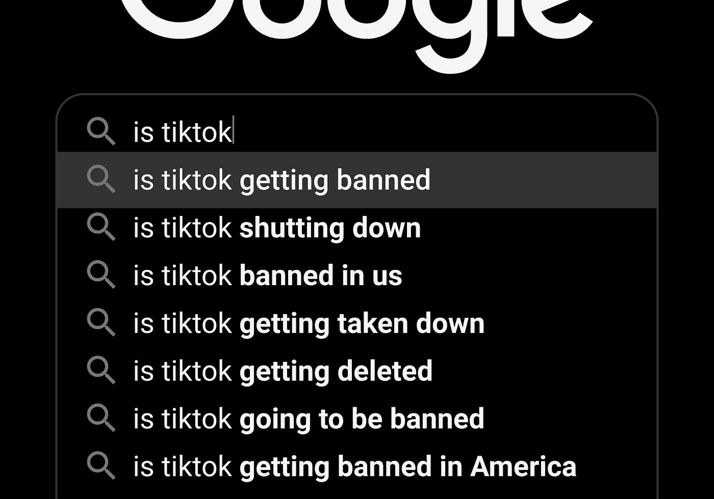

# 为什么微软想要抖音

> 原文：<https://medium.datadriveninvestor.com/why-microsoft-wants-tiktok-c9eac063761e?source=collection_archive---------14----------------------->

## 川普希望禁止抖音在美国运营

Photo by [Franck V.](https://unsplash.com/@franckinjapan?utm_source=medium&utm_medium=referral) on [Unsplash](https://unsplash.com?utm_source=medium&utm_medium=referral)

在川普总统表示应该接管抖音的美国业务后，[金融时报报道](https://www.ft.com/content/45d739f5-37cc-4957-874d-a310c2ac8e07)微软打算收购整个抖音，而不仅仅是其在美国的业务。然而，谈判仍处于初步阶段。

8 月 2 日，微软表示，它正在寻求收购抖音所有业务的交易，不仅仅是在美国，还包括澳大利亚、新西兰和加拿大。收购抖音的全球业务肯定会让微软更有力地控制和支持其地位。

特朗普总统[将最后期限定为 9 月 15 日](https://www.theverge.com/2020/8/3/21352878/trump-us-ban-tiktok-microsoft-acquisition-treasury-interview-deadline)，并评论说，如果抖音将其美国业务出售给任何一家美国公司，那么他不会禁止该应用程序。

Photo by [wu yi](https://unsplash.com/@takeshi2?utm_source=medium&utm_medium=referral) on [Unsplash](https://unsplash.com?utm_source=medium&utm_medium=referral)

如果你仔细想想，微软收购抖音似乎是一次相当不寻常的收购。微软在 Groove Music、Windows phone、Kinect Xbox、微软 band fitness 等各种服务上花费了多年时间。抖音如何适应这种青少年跳舞的商业模式？

答案很简单——**数据，数据，更多的数据。**

# 微软希望抖音支持其人工智能(AI)业务

众所周知，抖音从不缺少上传到其平台上的视频数据，每年都有数十亿条。这些视频提供了对流行文化的深刻见解，展示了不同种族的人们参与各种各样的活动。微软可以利用所有这些数据，创建其训练模型，然后帮助其人工智能系统学习和获得洞察力。

微软的所有竞争对手都有自己的视频数据消防水管，谷歌拥有 YouTube，亚马逊拥有 Twitch 游戏流媒体服务，脸书的庞大用户群不断上传数百万视频。

 [## 将爱好展示变成赚钱机器|数据驱动的投资者

### 这是造梦者奥斯卡·冈萨雷斯响应号召的地方。他是一名独立的在家工作的顾问，担任…

www.datadriveninvestor.com](https://www.datadriveninvestor.com/2020/02/14/turn-hobby-showcase-into-money-maker/) 

微软是一个受青睐的买家，因为它是少数几个没有被反竞争策略调查的科技巨头之一。所有主要科技巨头(苹果、谷歌、亚马逊、脸书)的首席执行官出现在调查所有这些科技巨头滥用权力的众议院小组委员会面前。但微软首席执行官塞特亚·纳德拉不是。

微软的市值轻松超过 1.5 万亿美元，在美国上市的公司中仅次于苹果。该公司的资产负债表上现金充裕，拥有超过 1350 亿美元的现金，并且容易获得资金，这给了微软收购抖音的巨大优势。

如果对抖音的收购成功，并且抖音超过 1 亿的用户仅在美国，这将为微软创造一个巨大的机会来收获视频数据，以启动其人工智能的雄心。这将有助于该公司了解消费者中的流行趋势，这将为微软带来许多有利可图的机会。数据就是一切——公司愿意花费数十亿美元来获得真实而有意义的数据。抖音是一个信息的数据矿。

Photo by [visuals](https://unsplash.com/@visuals?utm_source=medium&utm_medium=referral) on [Unsplash](https://unsplash.com?utm_source=medium&utm_medium=referral)

如果微软成功收购抖音，它很可能会让该公司独立运营，就像它最近对社交网络 LinkedIn 的重大收购一样。鉴于 9 月 15 日的最后期限已经不远，抖音的所有者字节跳动需要要么卖掉美国业务，要么冒着失去全部业务的风险。接下来的几周将会非常激动人心。

**进入专家视角—** [**订阅 DDI 英特尔**](https://datadriveninvestor.com/ddi-intel)