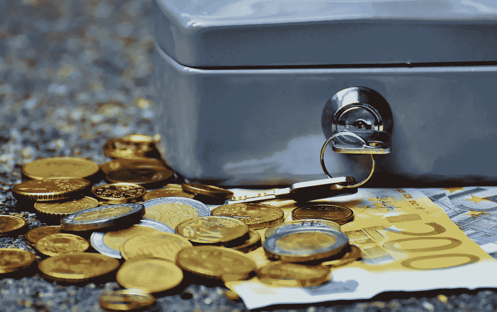

# 为什么钱不属于支票账户或储蓄账户

> 原文：<https://medium.datadriveninvestor.com/why-money-doesnt-belong-in-a-checking-account-9ba9b3c751b1?source=collection_archive---------9----------------------->

## 让你的钱隐形的好处

Photo by [Pixabay](https://www.pexels.com/@pixabay) via Pexels

没错，是我说的。钱不属于支票账户。

支票账户或低息储蓄账户中的钱是场外资金。它没有让你赚更多的钱，也没有投入到资产中，只是等着被花掉。

我的储蓄账户是我的应急基金。当生活给我当头一棒时，可以随时取用的钱。它不是为了让我赚更多的钱而存在的。

我的支票账户充当我的球队的控球后卫，分配助攻，给我的投资投出空中接力。一旦资金被分配，他们永远不会被传回到控球后卫。这使得钱看不见了。

我一直在练习让我的钱变得看不见，并且会继续这样做，因为它会给我带来好处。

# 让金钱隐形的好处

我从未遇到过我喜欢的支票账户，你也不会。支票账户里的钱就是你脑子里的钱，不可避免地会在你的口袋里烧出一个洞。

当你让你的钱看不见的时候，你就完全把它从你的头脑中移除了。例如，如果你的支票账户里有 1000 美元，并且把其中的 800 美元变得不可见，那么剩下的 200 美元就是你实际上可以花的全部了。

这就是为什么你投入的，让你隐形的钱，要被看成是你收不回来的钱。一去不复返了。

这样看待你的钱对你的支票账户来说可能不健康，但对你的净值来说确实是健康的。将你的钱分散到不同的资产中，这些资产会随着时间的推移而增值，这是让钱为你工作的最好方法。

让你的钱隐形对获取财富有双重影响。它通过把钱从你的支票账户中取出来来阻止你花同样多的钱，并且通过强迫你投资这些额外的钱来帮助你赚更多的钱。

**这是财富的方程式。**

现在你知道了把钱从电网中取出的好处，下一个需要回答的问题是:你把它放在哪里？

# 如何让你的钱隐形

## 股票

你不必做日间交易，把握市场时机，甚至不必冒险在股市中赚钱。

确保你的钱安全并在市场中持续增值的一个好方法是投资安全的股票。我说的是指数基金，交易所交易基金，甚至投资大多数债券市场都会比低息储蓄账户给你赚更多的钱。

老实说，我认为我的股票投资组合是我真正的储蓄账户。这让我觉得我应该从银行获得利息，即使我持有安全股票的股份。

另一个非常棒的主意——我一直在写——是只投资有股息的股票。如果有足够的资金投资在稳定的股息股票上，那么公司的表现再好也没用。只要它能够支付股息，你的投资就会比任何支票或储蓄账户赚得更多。

## 房地产

像股票一样，房地产是另一个众所周知的财富创造者，你可以把钱藏起来。无论你如何削减它，房地产投资工程，将使你的钱隐形。

把钱藏在房地产中的困难之处在于，启动资金可能会很高。有很多方法可以解决这个问题:

*   像 [**Fundrise**](http://www.fundrise.com) 这样的应用程序，可以用更低的资本进入房地产投资，而不用成为房东。
*   探索像房屋黑客这样的选择可以帮助你获得你可能买不起的房产。
*   如果你有合适的技能，以低廉的价格购买破旧的房屋，并装修好供房客居住是一件很棒的事情。

把你的钱投资在房地产上，不仅能从你的租户那里赚到钱，建立资产净值，还能帮助你获得减税的资格。你的储蓄账户能做到吗？

 [## 如何在不牺牲孩子或财务的情况下安全理智地离婚|数据驱动…

### 在美国，七月是以孩子为中心的离婚月。作为 cdfaⓡ的专业人士，我可以向你保证，从长远来看…

www.datadriveninvestor.com](https://www.datadriveninvestor.com/2020/07/28/how-to-divorce-safely-and-sanely-without-sacrificing-your-children-or-your-finances/) 

## 高息储蓄账户

如果你一定要有一个储蓄账户，把你的钱放在一个高利率的储蓄账户是一个不错的选择。

不，你不可能获得和股票市场或房地产市场一样的回报。

是的，你的钱将比股票或房地产更安全，并且比任何定期储蓄账户获得更多的利息。

像 [**Ally Bank**](http://www.ally.com) 这样的网上高收益储蓄账户，由于其可访问性，近年来越来越受欢迎。你不必走进一个实体的位置去做你的银行业务。你可以把你的资金转移过去，看着他们成长。

对于高息储蓄账户，要记住的一个重要观点是，你永远不要碰这笔钱。一旦没了，就忘了吧。

在处理高息储蓄账户时，你需要这种健忘的性格，因为“高息”仍然只意味着你的钱的年回报率约为 0.60%。没错，还是基本没有。

然而，如果你能将 10，000 美元存入高息储蓄账户，那么你每年将获得 60.17 美元的回报。这比任何普通银行的储蓄账户利息都要高得多。

## 贵重金属

既然我们已经过了更受欢迎的投资方法，是时候投入更多样的方法让你的钱隐形了。贵金属——特别是黄金——是投资的好去处。

从历史上看，黄金的价值会上升，最近我们看到了黄金价格的大幅波动。我不是说把你所有的钱都投入金条，但是分散投资总是明智的。

黄金将保持其价值，并随着时间的推移而上涨。这也是一种物质财富，你可以把它传递给你家庭的年轻一代。

你可以投资的不仅仅是金条。金币在黄金市场的表现也很好，有些金币因为受欢迎或者是因为它们被创造出来的时间而升值。

当你把钱藏在黄金中时，有几个重要的因素需要考虑。由于黄金是有形的，所以需要存放在保险箱或防火保险箱等安全的地方。此外，出售黄金往往很棘手。不是不可能，只是棘手。

这些都是我在决定是否应该把钱藏在黄金里时考虑过的事情。我已经决定要做这件事，但是我会慢慢来。此外，我把我的有形投资放在银行的保险箱里。

## 任何会升值的东西

我用来藏钱的最后一个选择是任何升值的东西。出于这个原因，买一块劳力士手表已经排在了我清单的首位。合适的手表将保持其价值，甚至可能在几年后升值。

其他通常比你的储蓄账户升值更多的物品包括乐高玩具、稀有的运动鞋和交易卡。总的来说，大多数主流玩具品牌的价值会随着新型号的减少而上升。

投资时最重要的是要有创造性。它会让你在正确的时间、正确的地点走在学习曲线的前面。我上周卖了一张神奇宝贝卡，卖了 200 美元。八个月前，我花了 43 美元买了它，那是在最近神奇宝贝卡片大受欢迎之前。我不是灵媒，但我研究了为它所做的大肆宣传。

做你的研究，对你投资的资产保持开放的心态，享受让你的钱隐形的乐趣。

**进入专家视角—** [**订阅 DDI 英特尔**](https://datadriveninvestor.com/ddi-intel)