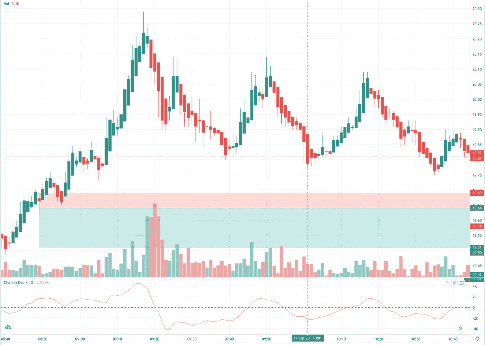
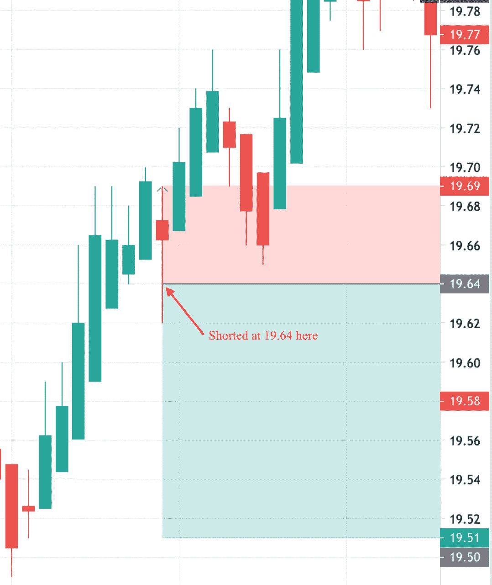
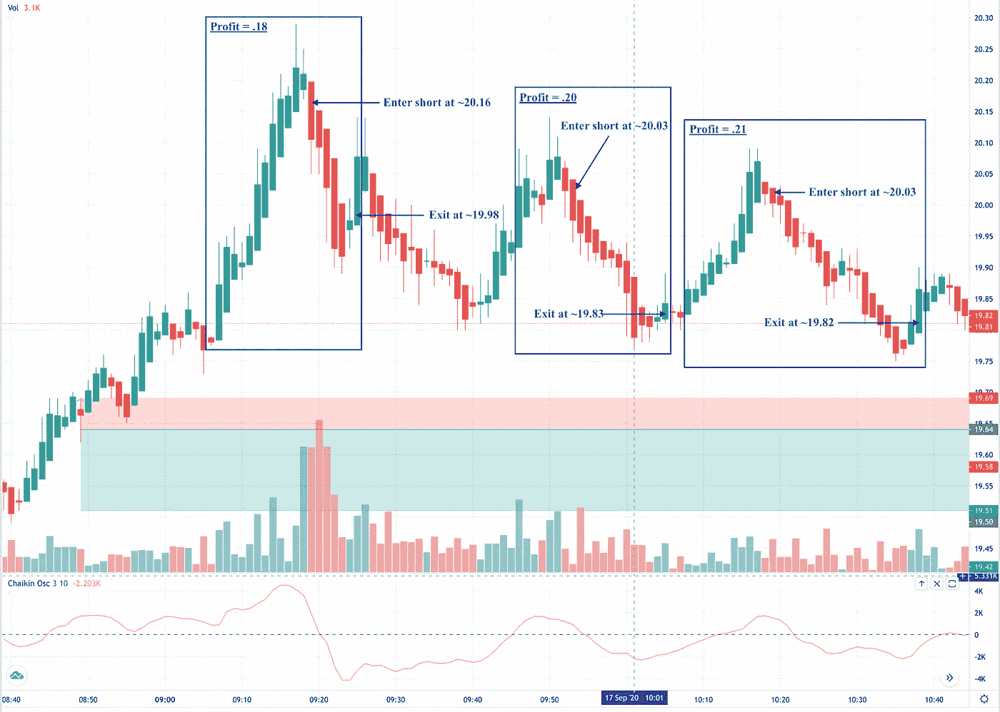
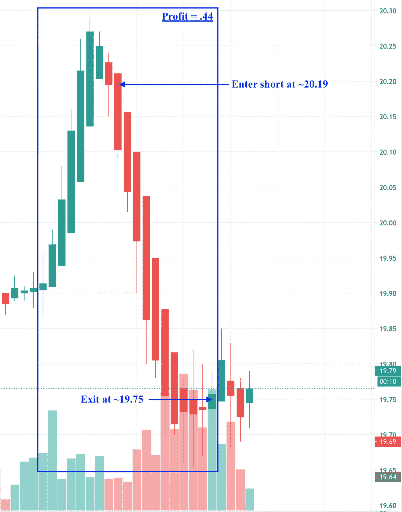

# 为什么大多数人在日内交易中亏损(以及如何不成为他们中的一员)

> 原文：<https://medium.datadriveninvestor.com/why-most-people-lose-money-day-trading-and-how-to-not-be-one-of-them-5196a916b513?source=collection_archive---------1----------------------->

Photo by [Andrea Piacquadio](https://www.pexels.com/@olly?utm_content=attributionCopyText&utm_medium=referral&utm_source=pexels) from [Pexels](https://www.pexels.com/photo/a-man-in-red-shirt-covering-his-face-3760043/?utm_content=attributionCopyText&utm_medium=referral&utm_source=pexels)

日内交易很难，大多数人都赔钱。

我确实有。事实上，我曾经在一天内损失的钱比许多人在一份固定工作上一整年赚的钱还多。稍后会有更多的介绍。

首先，我们必须找出问题所在，然后我们才能寻找解决问题的方法。我要说的是，如果你能遵循两个非常简单的规则，那么你很有可能成为全职交易者。

有一个“众所周知”的统计数据，95%的日内交易者亏损。这个推测的数字可能很低；很可能接近 98%。虽然没有很多严谨的学术研究来支持这些统计数据，但是有一些研究揭示了活跃的日内交易的成败。

## 问题是

请考虑以下情况:

1.  66%的日内交易者在开始一年内退出日内交易。 为什么？也许他们不成功，退出是为了避免更多的损失，或者他们没钱了，无法继续下去。
2.  **76%的人在两年后退出，只有 15%的人存活了三年。换句话说，绝大多数尝试日内交易的人都没有成功到能坚持一年以上。**
3.  活跃的交易者每年表现差 6.5%。这篇论文的作者发现，交易最多的交易者年回报率为 11.4%，而市场回报率为 17.9%。也就是说，大多数活跃的交易者最好投资一只标准普尔 500 指数基金，然后就此打住。
4.  95.3%的无利可图的日内交易者继续尝试日内交易。超过 50 天日内交易经验的无利可图的交易者继续交易，这意味着他们可能没有意识到他们不擅长日内交易。或者希望是永恒的？同一篇论文发现，“近四分之三的日内交易量是由至少有 10 天日内交易经验的不成功日内交易者产生的。”⁴

这些统计数据为未来的日内交易者描绘了一幅可怕的画面。形势对你非常不利。诸如此类的统计数据可以阐明正在发生的事情，但它们没有明确解释为什么会发生。我相信大多数日内交易者失败是因为他们的行为是情绪化的，而不是理性的。

## 一个个人的例子

我将分享两个亲身经历，证明情绪交易是如何毁灭日内交易者的。第一个例子是二十年前的，第二个是今天的。

**二十年前**

我曾经在一家年收入 40 亿美元的计算机公司担任网络架构师，这家公司最终倒闭了。在他们走下坡路的时候，我被解雇了，我得到了一笔遣散费，这笔钱足以支付我至少一年的账单。

作为一个年轻、聪明的技术人员，我决定花时间从事交易。我有一个我认为很棒的关于股票价格变动的想法，我认为这会给我带来交易优势。简而言之，我的算法是寻找某一天出现高百分比波动的股票，然后观察它们第二天的历史表现。我创建了一个 Perl 程序，使用多变量回归分析来预测未来的走势。

这是相当奇特的东西(至少在我自己看来)，大约六个月后，我准备尝试一下。我在纸上交易了大约一个星期，它似乎在工作。然后我开始用活钱交易。起初，我每天都有小利润，我对此感觉很好。这似乎证实了我的概念。

然而，最终我失败了，这是相当惊人的。事情是这样的:我使用的交易平台有一个实时社区聊天功能，交易者可以在这里聊天，发布他们的进出交易，等等。你大概可以看到这是怎么回事。很快，我就被卷入了这场炒作。有人会发布一些东西，其他人会加入进来。过了一段时间，我不再使用我的系统，而是根据势头、谣言和聊天即兴发挥。我一直在追逐巨大的胜利，我成为了一个不怕做空的人，这满足了我的自尊心。

这一切工作了一段时间，但我开始违反更多自己的规则。首先它离开了我的系统。然而，我也讨厌承担任何损失。这就是所谓的害怕后悔，或后悔理论。交易者情绪化地投资于他们的进场价格点，即使为了避免更大的损失而退出可能更好，他们也会坚持持仓以避免亏损。

我有一个原则，那就是我不会持仓过夜，但后来我的仓位在一天结束时没有盈利。“让我们看看明天早上会发生什么，”我告诉自己，很快我就有了亏损更严重的头寸。

你可以猜到发生了什么。市场经历了糟糕的一天，我被迫追加保证金。我登录了，突然，我所有的头寸都被平仓了，不是我平仓的。我的经纪人已经采取行动保护自己。我最终损失了大约 45，000 美元，这几乎是我当时所有的钱。

我不会细说那次经历造成的情感伤害，但它确实很严重。我日内交易自己获得财富和财富的梦想瞬间破灭了，我必须找到一份工作，重新工作。

 [## 为什么大多数人在日内交易中亏损(以及如何不成为他们中的一员)|数据驱动的投资者

### 日内交易很难，大多数人都赔钱。我确实有。事实上，我曾经在一个单一的损失更多的钱…

www.datadriveninvestor.com](https://www.datadriveninvestor.com/2020/09/23/why-most-people-lose-money-day-trading-and-how-to-not-be-one-of-them/) 

**今天**

如果你读过我的其他文章或者访问过我的网站，你就会知道我大约在十年前了解了期权交易，并且期权是我这些天关注的焦点。我在期权交易方面非常成功，主要是因为保守和相对有条理。

然而，大约一周前，我基于看跌波动理论，决定做一些非常有限的日内交易。到目前为止，它运行得很好，但是我发现自己有一些相同的情绪倾向，这种倾向束缚了大多数交易者。

看看下面的图表:

Heikin Ashi Chart (Top), Chaikin Oscillator (3, 10) (Bottom)

我希望在上涨后做空这种资产(绿色条)，然后在它到达底部并再次上涨时买入回补。在我写这篇文章时，红色和绿色阴影区域是一个开放的位置。下图显示了我的入口点的放大视图:

Entered Short at 19.64

对于入口点，我有几个规则:

1.  在反转(峰值)之前，至少有三根绿色的强柱或至少五根绿色的趋势上升柱。
2.  在*第二根*红色柱显示确定的下降趋势之前，不要做空。

满足规则#1，因为在它变成红色之前有七个绿色条。然而，我违反了规则 2，没有等待第二根红棒线，三个小时后，我仍然被困在这个亏损的交易中。

为什么我违反了自己的规则？有几个原因:首先，我直到开市前两分钟才登录，因为我的孩子们在打架，而我在调解。只是普通的，日常的东西，但是当我到达我的办公桌时，我感到很匆忙。

然后，这一资产在公开赛之后进行了一次*精彩的*跳水，但我错过了，因为我还没有准备好。理想情况下，我的目标是每笔交易赚 0.13 美元或更多，而最初的开盘跌幅超过了 0.60 美元。我很沮丧，我错过了最初的交易，因为那会在交易的前十分钟完成我每天 0.30-. 50 的目标。

然后，那个大的落差让我在接下来的几个周期里有点胆怯，所以我也错过了那些。我可以感觉到我的挫折感在积累，有一段时间，资产停留在一个相对狭窄的范围内，没有任何机会对我的专注没有帮助。

最后，我成功地做了一笔交易，每股盈利 0.06 美元，我开始感觉好些了。然而，因为第一个小时，我仍然对 FOMO 有一种强烈的暗流(害怕错过)。所以当红棒线在一波不错的上涨后出现时(记住红棒线在我进场时更长，但后来又收回了)，我冲动地决定进场。交易已经预装，只需点击鼠标即可完成。我不想错过又一次辉煌的降落！

你可以看到接下来发生了什么。那根红柱是另一次上涨前的短暂盘整。从那以后，它就一直在我的入口点之上。这个错误最糟糕的部分是，我错过了多个额外的交易，因为我被困在这个交易中。出于风险管理和保证金的原因，我一次只进行一笔交易。

这是原来的图表，但这次我强调了我可能会进入和退出交易的区域。

Hypothetical Missed Trades

在显示的时间跨度内，我错过了三笔潜在利润约为 0.59 美元/股的交易。在图表之外的时间里，至少有四次以上这样的情况，但是你明白了。

## 如何不输

我个人的两个错误都有一个共同点，我相信大多数交易者都有同样的问题:控制情绪，不遵守自己的原则。我将在下面更详细地探讨这个问题，但这里有一篇相关的文章，也是关于成功交易者需要具备的性格特征的:

 [## 成功交易者的五个特征

### 或者，如何不死于飞行滑翔伞

medium.com](https://medium.com/@Tim_Garlick/character-traits-of-an-exceptional-stock-or-options-trader-e4a4846ddf5e) 

管理你的情绪并坚持你的原则比学习技术分析或基本面或其他任何东西都要重要得多。那些数学和交易技巧重要吗？是的，当然，但是如果你犯了基于情绪的错误，那么这些技巧都没有用，因为你会破坏你自己，最终会让你自食其果。你将成为 98%不成功交易者中的一员，而不是 2%只要喜欢就能以此为生的人。

我将给你们留下另一张图表，显示我完成这篇文章时发生的事情:

Another Beautiful Missed Hypothetical Trade

看那座美丽的悬崖！今天本可以是史诗般的一天，但那一个错误。我是一个经验丰富的个人交易者，我知道情绪对人类思维的影响，但我还是被它们抓住了。除非你是一个机器人，否则管理你的情绪可能是你获得的最难的技能。

我鼓励你在所有的交易活动中遵循这两条规则:

1.  学会识别你的倾向和情绪，当你察觉到它们时，有意识地向自己指出。
2.  *毫无例外地遵循自己的交易规则！*

相信我，我会虔诚地遵循这两条规则。从明天开始！

## 序言

如果你想知道，我终于在常规交易时段结束前 11 分钟退出了交易。我以 19.46 美元买入，获利 0.18 美元。我不能抱怨，因为这是成功的一天(两天交易的总利润为 0.24 美元/股)，但如果我遵循自己的原则，利润会是现在的 3-4 倍。

活到老，学到老。

# 想了解更多有关选项的信息吗？

蒂姆·加尔利克投资和交易股票和期权已经超过 25 年了。访问 Tim 的网站 [The Options Hive](http://www.theoptionshive.com) ，在那里你可以找到免费的教育、工具和资源来学习更多关于股票期权交易的知识。

# 你可能会喜欢的 Tim 的其他文章:

 [## 你能以交易期权为生吗？

### 是的，但是…如何成为期权交易者。

medium.com](https://medium.com/@Tim_Garlick/can-you-make-a-living-trading-options-d84286d808b2)  [## 如何在期权交易中不亏损

### 一个代价高昂的错误如何教会我成为一个更好的期权交易者

medium.com](https://medium.com/swlh/how-to-not-lose-money-trading-options-5ceb1ec53f26)  [## 如何在 Robinhood |数据驱动的投资者上不破产交易期权

### 新手交易的五个简单规则

medium.com](https://medium.com/datadriveninvestor/how-to-not-go-broke-trading-options-on-robinhood-data-driven-investor-f11c0518369a) 

Brad Barber 等人(2017)，[日内交易者理性地了解自己的能力吗？](https://faculty.haas.berkeley.edu/odean/papers/Day%20Traders/Day%20Trading%20and%20Learning%20110217.pdf)

Brad Barber 和 Terrance Odean 在*《金融杂志》* (2000)，[交易对你的财富有害:个人投资者的普通股投资业绩](https://faculty.haas.berkeley.edu/odean/Papers%20current%20versions/Individual_Investor_Performance_Final.pdf)

参考文件是关于活跃的投资者，而不是具体的日内交易，但是人们可以合理地推断结果，交易越活跃，表现越差。还要注意的是，由于交易成本比现在高得多，在论文的数据期间，表现不佳的情况更严重。

⁴·巴伯等人，[理性地做日内交易者](https://faculty.haas.berkeley.edu/odean/papers/Day%20Traders/Day%20Trading%20and%20Learning%20110217.pdf)，第 5 页

**访问专家视图—** [**订阅 DDI 英特尔**](https://datadriveninvestor.com/ddi-intel)