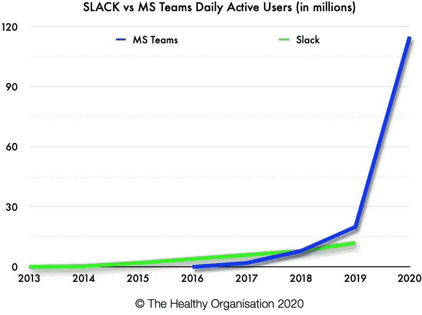

# 为什么 MS Teams 很烂还能打败 Slack？

> 原文：<https://medium.datadriveninvestor.com/why-ms-teams-sucks-and-still-beats-slack-56cc636a1380?source=collection_archive---------5----------------------->

Photo by [Dimitri Karastelev](https://unsplash.com/@dkfra19?utm_source=medium&utm_medium=referral) on [Unsplash](https://unsplash.com?utm_source=medium&utm_medium=referral)

2020 年是数字化转型的关键一年。疫情推动在家工作的订单促使世界各地的公司迅速适应远程工作。有句老话说，水涨船高。在某种程度上，这对于 B2B 数字播放器来说是真实的。大多数船只都上涨了，但是涨潮并不是均匀分布的。

这种在短暂的非典型企业敏捷性中取得成功的差异，突显了哪些竞争因素造就了企业技术市场中坚固的船体，哪些船只如果不进行重大加固将会沉没。

2020 年 12 月初，Slack 被 Salesforce Borg 吸收的传言成为事实。如果收购成功，这将是 Salesforce 迄今为止最大的一笔交易，sales force 是无机增长的定义。

Slack 创始人斯图尔特·巴特菲尔德早就表明了独立运营 Slack 的意图。尽管你能想到的任何大型企业科技公司都在考虑收购 T2 的 Slack T3(包括微软)，但到目前为止还没有一家成功。

## 为什么是现在？

在收购公告中，Slack 还报告了第三季度的同比收入增长+60%(3)。就其本身而言，这是任何公司在任何一年都会感到兴奋的事情。在 2020 年全球经济衰退之际，许多公司会为+60%的收入增长而欣喜若狂。

然而，在这个顶线数字背后，Slack 的船体有一些裂缝。

1.  **Slack 的表现不如潮流:**像 [Zoom](https://medium.com/u/c4c2efc9bc0a?source=post_page-----56cc636a1380--------------------------------) 这样的企业科技同行在疫情的表现远远好于 Slack。(2)
2.  **Slack 的运营亏损不断增加:**-2020 年第三季度为 9500 万美元，相当于收入的 56%。在 2019 年第三季度，这占收入的 48 %( 3)
3.  **Slack 正在被微软团队采用:**微软团队的日活跃用户或“dau”在推出后两年内就超过了 Slack 的 dau。Slack 的回应是不再报告 dau，抱怨该数字作为采用衡量标准的有效性，并提出其他指标(1)。这是 Slack 版的 WeWork“社区调整 EBITDA”时刻。MS Teams 报告 2020 年 dau 数为 1.15 亿(4)，比 Slack 最近报告的数字多 1 亿。

## 分销优势&捆绑销售的力量

这篇文章一开始是对 [Dhodgk](https://medium.com/u/7833838bcf14?source=post_page-----56cc636a1380--------------------------------) 关于[壁画诉米罗](https://medium.com/swlh/mural-v-miro-which-remote-digital-whiteboard-should-you-choose-e38ebcd55f98)以及 MS Whiteboard 如何与这两家令人敬畏的初创公司进行比较的深刻问题的回答。在这个问题中，Dhodgk 正确地指出了为什么[微软](https://medium.com/u/d97749d23c4a?source=post_page-----56cc636a1380--------------------------------)白板已经赢得了他们公司的支持——它是 Office 365 的免费软件。微软早就明白了捆绑销售的优势和威力。

像微软团队或白板这样的新产品很少能与“激励”他们的初创公司相提并论(Slack、[wall](https://medium.com/u/bb76103e9f36?source=post_page-----56cc636a1380--------------------------------)、 [Miro](https://medium.com/u/962c48776891?source=post_page-----56cc636a1380--------------------------------) )。然而，微软版本只需要 80%好就可以销售。本着敏捷开发的精神，这个足够好的产品可以在微软现有的企业发行版的轨道上运行，以便客户快速采用，将竞争对手扼杀在摇篮中。

如果一个新的 MS 产品比 inspiration 产品好不到 80%但超过 10%，它可以捆绑到现有的 O365 企业订阅中，并从侧面攻击竞争对手的进步。这阻碍了竞争对手的采用。

想要竞争对手产品(Slack、Mural、Miro 等)的内部企业用户被迫与 IT 和采购部门争论，当公司已经拥有随团队、白板等提供的 O365 订阅时，为什么还要支持另一家供应商/产品。

它希望降低复杂性并最大限度地提高安全性。采购部门希望降低复杂性和成本。即使竞争对手(Slack、Miro、Mural 等)同样安全或更安全，简单的等式就是更多供应商=更复杂=更多 IT 和采购工作。除了管理成本，还有竞争对手产品的成本，用户发现他们正在进行一场艰苦的战斗，以说服他们的公司采用更好的产品。

有了微软的分发优势，MS Teams 和 MS Whiteboard 这样的产品不一定要和竞争对手的创业公司一样优秀。他们只需要:

1.  安全且
2.  足够好，对于非用户来说，它们不会明显糟糕到不可接受。

这里的非用户指的是把关者和决策者，他们对产品的选择有控制权，但不需要自己使用产品。IT、采购、财务或高管可能是非用户的例子。

明显更差意味着与优选产品相比，重量调整后的益处为 10%或更少。超过这个阈值，捆绑产品更有可能被非用户接受。非用户决策者不会享受到优质产品的好处，但会产生成本，因此会代表用户接受劣质产品。

企业销售能力很难建立，一旦建立了客户关系，这种关系往往会持续数年。这是像微软这样的在位者所享有的分布优势。他们的产品可能没有那么好，但他们的销售是惊人的。

## 为什么 Slack 出售给 Salesforce

这种分销优势就是 Slack 卖给 Salesforce 的原因。Salesforce 可能是现有公司中名字最恰当的一家——很少有公司像 Salesforce 那样拥有强制销售的声誉。

Salesforce 通过无机增长(收购公司)快速增长。每次收购都会增加一种新产品，Salesforce 销售团队可以向现有客户推销这种产品。这将客户获取成本分摊到更多的产品上，降低了每种产品的分销成本，增加了销量。

MS Teams 并没有通过成为更好的产品而胜过 Slack。MS Teams 的表现优于 Slack，因为它是一个更好的分布式产品。

对于超过 1200 万的 Slack 用户，MS 团队可能被视为降级。然而，对于大多数员工来说，MS Teams 并没有取代 Slack，而是取代了 non-consumption。大多数工人以前都没有使用过这两种产品。

## 启动课程

对于以产品为导向的人来说，我们倾向于相信更好的产品会胜出(最终)。Slack 的收购是一个友好的提醒，伟大的产品死于默默无闻。你的产品需要到达你的客户那里才能成功。如果你想随波逐流，分销可以胜过产品，而强大的船体需要分销和产品。

PS。Salesforce 为什么收购 Slack？[看到这里。](https://www.linkedin.com/posts/mikestevensonmba_the-briefing-salesforce-buying-slack-for-activity-6740512956464828416-Ptz5)

## 参考

1.  [https://slack . com/intl/en-au/blog/news/work-is-fuel-by-true-engagement](https://slack.com/intl/en-au/blog/news/work-is-fueled-by-true-engagement)
2.  [https://www . barrons . com/articles/slack-stock-dives-after-earnings-not-zoom-51591377445](https://www.barrons.com/articles/slack-stock-dives-after-earnings-it-isnt-zoom-51591377445)
3.  [https://slack . com/intl/en-au/blog/news/slack-announces-record-2020 财年第三季度业绩](https://slack.com/intl/en-au/blog/news/slack-announces-record-third-quarter-fiscal-year-2020-results)
4.  [https://www . Microsoft . com/en-us/Microsoft-365/blog/2020/10/28/Microsoft-teams-reaches-1.15 亿 dau-plus-a-new-daily-collaboration-minutes-metric-for-Microsoft-365/](https://www.microsoft.com/en-us/microsoft-365/blog/2020/10/28/microsoft-teams-reaches-115-million-dau-plus-a-new-daily-collaboration-minutes-metric-for-microsoft-365/)