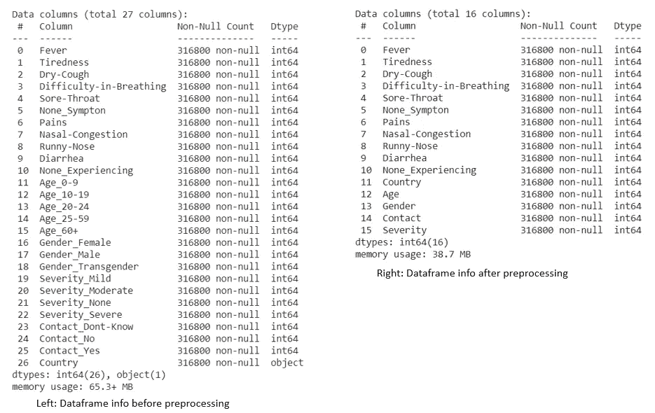
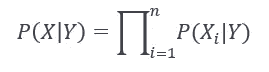
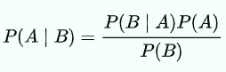
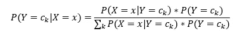
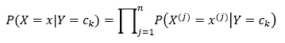
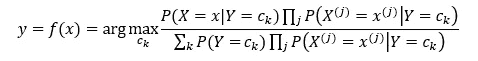
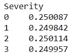
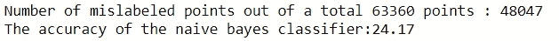

# 为什么朴素贝叶斯无法判断你是否患有新冠肺炎

> 原文：<https://medium.datadriveninvestor.com/why-naive-bayes-fails-to-tell-if-you-have-covid-19-54aae712a590?source=collection_archive---------10----------------------->

在这篇文章中，我们将重点放在一个朴素贝叶斯分类器上，根据他的症状来检查某人是否患有新冠肺炎，以及他的感染有多严重。正如题目所揭示的，测试预测的准确性不令人满意，这不能用这种方法确定感染的严重程度。


Photo by [Annie Spratt](https://unsplash.com/@anniespratt?utm_source=unsplash&utm_medium=referral&utm_content=creditCopyText) on [Unsplash](https://unsplash.com/s/photos/covid-19-test?utm_source=unsplash&utm_medium=referral&utm_content=creditCopyText)

# 1.Kaggle 数据集

> 这些数据将有助于根据一些预定义的标准症状来识别任何人是否患有冠状病毒疾病。这些症状是基于 who.int 世界卫生组织(世卫组织)和印度卫生和家庭福利部给出的指南。

[](https://www.kaggle.com/iamhungundji/covid19-symptoms-checker) [## 新冠肺炎症状检查器

### 预测某人是否有冠状病毒？

www.kaggle.com](https://www.kaggle.com/iamhungundji/covid19-symptoms-checker) 

数据集包含七个主要变量，每个变量的描述如下:

1.  症状:根据世卫组织的说法，5 是新冠肺炎的主要症状，发烧、疲倦、呼吸困难、干咳和喉咙痛。
2.  经历任何其他症状:疼痛，鼻塞，流鼻涕，腹泻，和其他。
3.  性别:有三种性别(男性、女性、变性人)
4.  基于世卫组织年龄组标准的每个人的年龄组分类
5.  此人是否接触过其他新冠肺炎患者
6.  严重性级别，无、轻度、中度、重度
7.  国家:访问过的国家列表(包括中国，法国，德国，伊朗，意大利，其他，韩国，西班牙和阿联酋。

# 2.数据预处理

这个 Kaggle 数据存储库中上传了两个 CSV 文件。为了节省时间，我只选择了已清理的数据，并跳过了数据清理这一步。

显然，在给定的数据集中有分类特征，例如国家。处理它们的一个简单方法是给它们分配一个编号，代码如下所示:

```
# df is the data frame read the csv file.
country_id = {"Country":     {"China": 0, "UAE": 1, 'Italy':2,'Spain':3,'Iran':4,'Republic of Korean':5,
                              'France':6,'Germany':7,'Other-EUR':8,'Other':9}}
df = df.replace(country_id)
```

一些特征，例如年龄、性别、严重程度，由不同元素的数量的大小的二进制向量来描述。没有问题，但我们只是想在同一格式的所有功能。因此，我们需要用下面的代码来处理它们:


```
df['Age'] = df['Age_0-9']*0+df['Age_10-19']*1+df['Age_20-24']*2+df['Age_25-59']*3+df['Age_60+']*4
```

这个想法很容易用**序数变量**来标记年龄特征，这也将在所有特征中使用。我们可以将这一过程称为顺序编码，对于具有自然排序的分类变量非常有用。



Image by Author: display of the dataframe, before and after the processes in this section. Comments: the output (Y1, Y2, Y3, Y4) is column 19–22 at the image left. The new output (Y, the only one) is column 15 at the image right.

# 3.朴素贝叶斯

朴素贝叶斯分类器是用于分类任务的概率机器学习模型。分类是一个两步的过程，学习步骤和预测步骤。在学习步骤中，基于给定的训练数据开发模型。在预测步骤中，模型用于预测给定数据的响应。朴素贝叶斯分类器通过假设特征独立于给定类别，即，



其中 X=X1，X2，..Xn 是特征向量，Y 是类别。

根据贝叶斯定理，其中 A 和 B 是事件，P(B)不为零，条件概率可以用下面的公式计算。



这个公式有助于**贝叶斯推断**，其中**T3 可以进行一个假设的概率。鉴于前因后果，如果 A 是后果，那么 B 就是带来 A 的潜在变量，在一个分类问题中，Y 代表类，X 代表特征。我们可以发现对 Y 的预测是基于对 x 的观察。**

如果给定 n 维 X，Y 属于{c1，c2，…，ck}，所有可能类的集合，



由于 X 向量中的每个特征都是独立的，因此



通过结合这两个公式，我们得到了朴素贝叶斯分类器的表达式，这对我们以后的编程工作是必不可少的。在我们的代码中，我们只是使用了 NumPy 和 Pandas，以便对这个数学表达式有进一步的理解。



朴素贝叶斯在许多实际应用中被证明是有效的，包括文本分类、医疗诊断和系统性能管理。

# 4.基于 Numpy 和 Pandas 的朴素贝叶斯分类器

首先，我们应该将数据分成训练集和测试集。像大多数人一样，我们将 80%的数据划分到训练集中，其余的数据划分到测试集中。

```
np.random.seed(1)
train=df.sample(frac=0.8,random_state=1) 
test=df.drop(train.index)
```

然后我们开始计算先验概率 P(Y=ck)。

```
prior = (train.groupby('Severity').size()).div(len(train)) 
print(prior)
```



image by Author: index: 0 represents none in severity, in other words, not infected; 1 is mild severity; 2 is moderate severity; 3 is a severe infection. values at the left represent the prior probability of y=0, 1, 2, 3.

基于先验概率，我们可以继续计算找到给定类别标签的每个要素的概率。

```
likelihood = {}
**for** x **in** train.columns[:-1]:
  likelihood[x] = (train.groupby(['Severity',x]).size()).div(len(train)).div(prior)
```

在字典似然中，我们保存了任务所需的朴素贝叶斯分类器的后验概率——新冠肺炎检验器。

为了预测某人是否患有新冠肺炎，我们只需要输入各种症状、经历和个人信息的特征向量。然后模型可以告诉我们他是否感染了新冠肺炎病毒，以及他的感染程度有多严重。全部代码都写在 Colab 上。

然而，模型的测试结果并不像我们想象的那么好:



image by Author: prediction in the test set

顺便说一下，我们不必每次都只用熊猫或 Numpy 来实现贝叶斯分类器。我们可以直接从 Sklearn 导入适当的分类器，如下所示:

```
**from** **sklearn.naive_bayes** **import** GaussianNB,CategoricalNB
gnb = CategoricalNB()
y_pred = gnb.fit(x_train, y_train).predict(x_test)
```

在本文中，我们用 Numpy 和 Pandas 进行编码，只是为了让这个过程更加透明和直观。如果你对贝叶斯分类模型不陌生，强烈推荐 Sklearn，效率更高。

# 5.估价

到目前为止，我们已经训练了一个朴素贝叶斯分类器，用于基于 Kaggle 的给定数据集检查新冠肺炎感染。不幸的是，它的测试集预测并不比黑暗中的射击好，对于 Y 空间中的 4 个目标，它也可以达到大约 1/4 Acc。

发生了什么事？

在我们深入细节之前，我们应该始终牢记的一个前提是**特征在朴素贝叶斯分类器下是独立的**。

我们的新冠肺炎检查的特征向量由主要症状和其他经历组成，它们不是完全相互独立的。我们可以想象，如果有人发烧，那个人也会很容易疲倦。如果有人现在鼻塞，下一分钟就可能流鼻涕。无论你感染的是哪一种，主要症状通常是相互伴随的。

另一方面，并非所有列出的特征都是分类的重要特征。它们可能起到了显示病人情况的作用，但不够科学或详细。我们知道 37.9°C 和 39.9°C 无疑是发烧的信号。一个体温 37.9 摄氏度的人可以闲逛，而另一个体温 39.9 摄氏度的人肯定会发烧，这在给定的数据中没有得到清楚的解释。对特征进行定量测量会有很大帮助。除了判断是否发烧，我们还可以用温度来更准确地描述症状。其他症状也是如此，如持续咳嗽或偶尔咳嗽。我们需要一个合适的比例来定义特征。

如果我们能在这两个方面做出相应的调整，朴素贝叶斯分类器在检测新冠肺炎感染方面应该会显示出良好的性能。

最后，建议与我们的话题无关。如果你感觉不舒服，并且一些症状已经出现好几天了，抗体测试可以告诉你是否感染了病毒。即使是最著名的医生也不能仅仅根据你的口头描述来判断是否有新冠肺炎感染。这实际上是训练模型不起作用的第三个原因😅。

# 6.参考

[Rish，伊琳娜。"朴素贝叶斯分类器的实证研究."人工智能经验方法国际学术会议 2001 研讨会。第三卷。№22.2001.](https://www.cc.gatech.edu/~isbell/reading/papers/Rish.pdf)