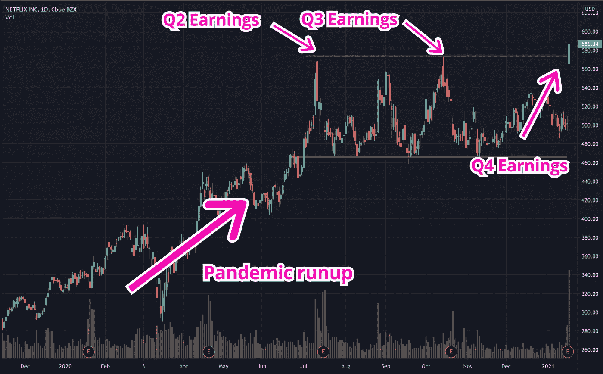
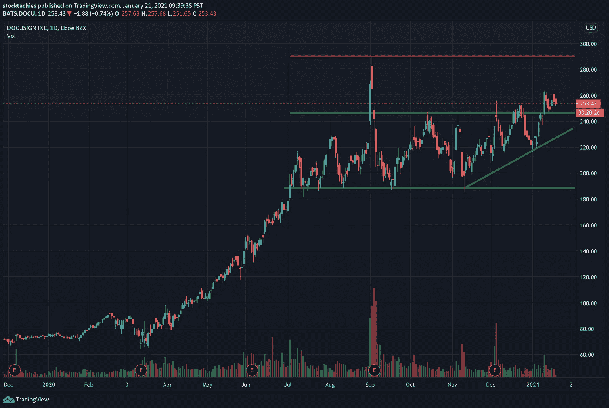
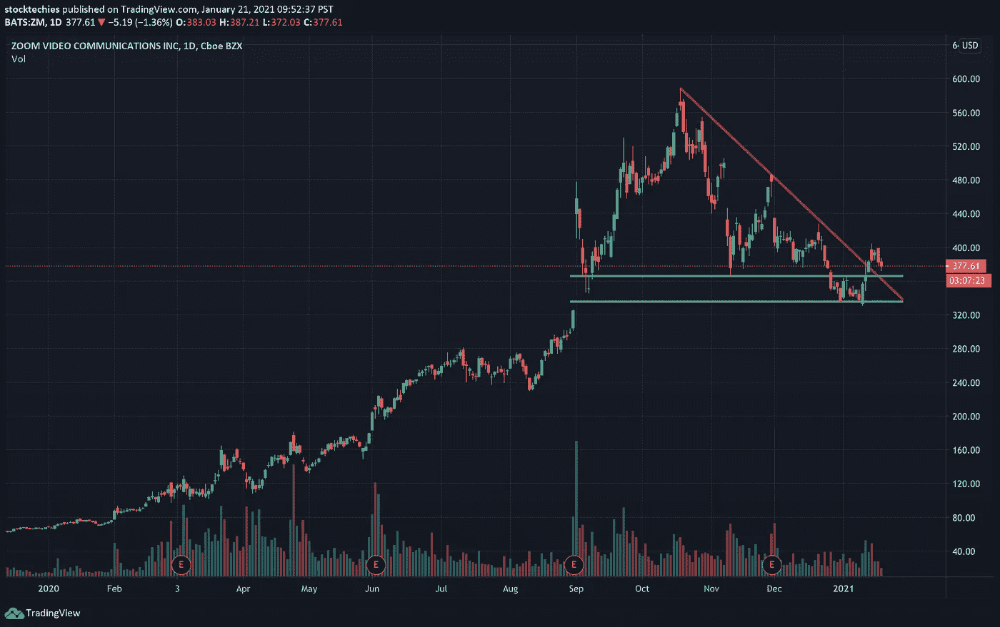
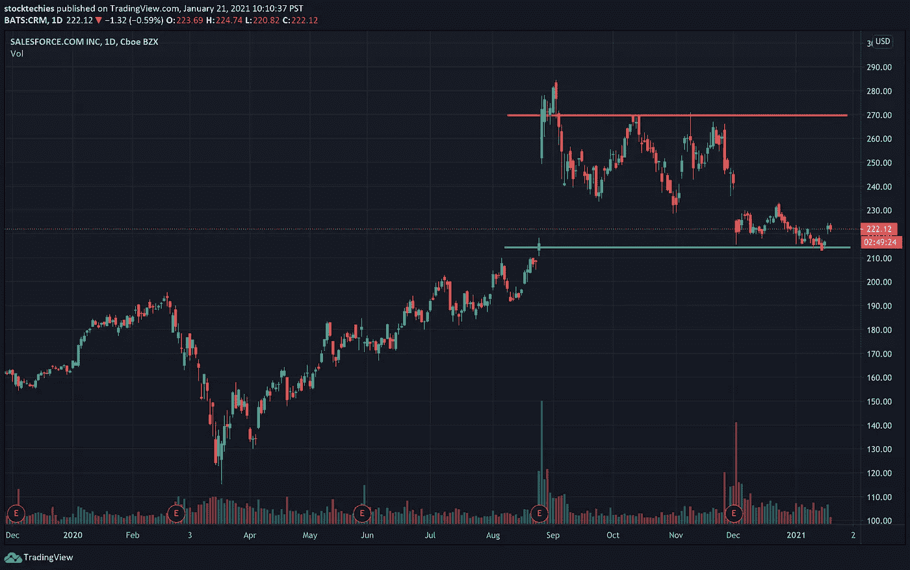
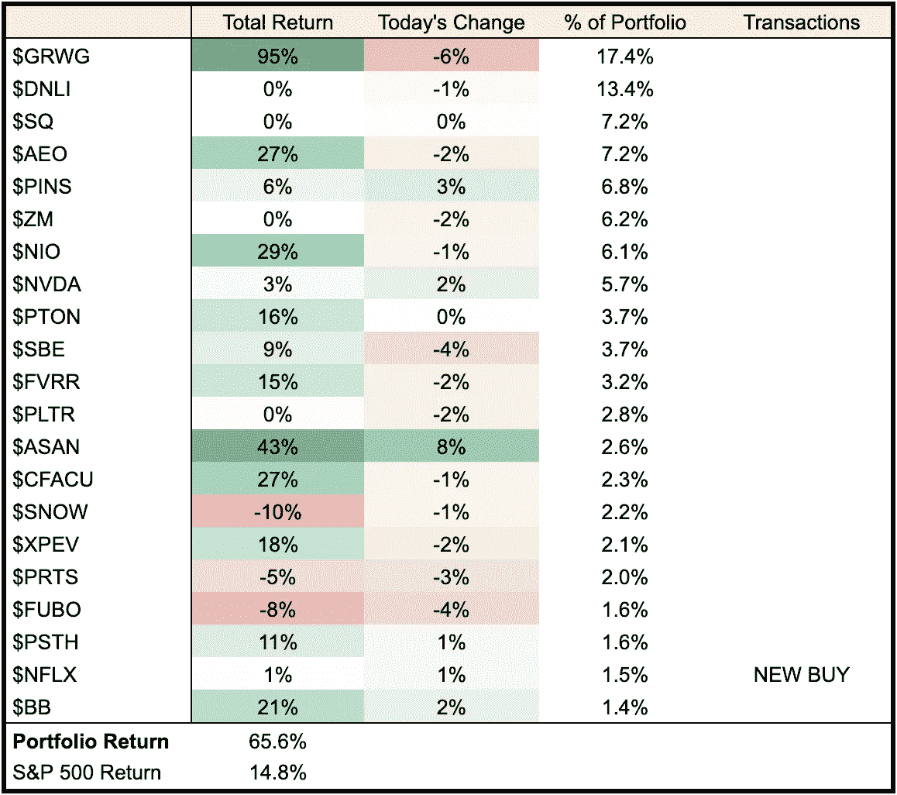

# 网飞(NFLX)股价上涨的原因和 3 只可以效仿的居家股票

> 原文：<https://medium.datadriveninvestor.com/why-netflix-nflx-is-up-and-3-stay-at-home-stocks-that-can-follow-suit-4b4d71736081?source=collection_archive---------24----------------------->

如何使用网飞收益来指导你的下一次交易


Photo by [Jens Kreuter](https://unsplash.com/@jenskreuter?utm_source=medium&utm_medium=referral) on [Unsplash](https://unsplash.com?utm_source=medium&utm_medium=referral)

尽管没有达到 2020 年第四季度的收益，网飞股票([纳斯达克:NFLX](https://finance.yahoo.com/quote/NFLX?p=NFLX) )周三飙升 17%，达到历史新高。我们将研究网飞股票上涨的原因，以及潜在的行业轮动如何帮助 3 只呆在家里的股票实现类似的结果。

*准备好开始你的股票交易之旅了吗？* [*开立一个 Webull 交易账户*](http://bit.ly/3nWkbxT) *即可获赠 4 只价值高达 3700 美元的免费股票。)*

# 收入二分法

网飞宣布 2020 年第四季度收入为 66.4 亿美元，略高于预期 0.3%，而每股收益为 1.19 美元(低于预期 13.8%)。

```
 Expected      Actual        ResultQ4'2020
   Revenue                 $6.62B       $6.64B      BEAT by 0.3%
   Earnings Per Share      $1.38        $1.19       MISS by 13.8%Q3'2020
   Revenue                 $6.38B       $6.64B      BEAT by 4.1%
   Earnings Per Share      $2.13        $1.74       MISS by 18.3%Q2'2020
   Revenue                 $6.05B       $6.15B      BEAT by 2.1%
   Earnings Per Share      $1.81        $1.59       MISS by 12.2%
```

对比 2020 年的收益报告，它们都具有相似的特征(收入低于预期，收益低于预期)，但投资者对第四季度的报告反应积极，不像他们在 Q2 和第三季度那样。价格走势的差异是由投资者在前几个季度对网飞的乐观前景造成的。



作为背景，网飞一直是疫情的主要受益者，因为人们呆在家里，将可支配收入从传统的食品、旅游和娱乐行业转移到为家庭成员提供商品和服务的公司(流媒体、在家工作、锻炼、家居装修等)。).因此，从疫情开始到 2020 年，网飞和许多这些“呆在家里”的股票价格大幅上涨。然而，鉴于疫苗即将问世，经济最终将回到正常状态，人们对股价存在疑问。

以网飞为例，该公司在 2020 年初的订户数量大幅增加，因为流媒体是家庭娱乐的主要来源。然而，许多人认为，这些增长数据是从未来几个季度“拉”出来的。换句话说，当时的想法是，网飞并没有真正增加其收入和用户群，而只是从未来几个季度转移注册用户，以使其当前的增长率不可持续。这种担忧在第三季度明显感受到了，与前几个季度实现的 700 万到 1000 万用户增长相比，网飞仅增长了 220 万用户。由于投资者对该公司的未来前景提出质疑，股价在 Q2 和第三季度财报公布后均告下跌，随后上涨至历史最高水平。

# 第四季度及以后

第四季度，网飞报告用户增长了 850 万，轻松超过了分析师预测的 600 万。随着美元 NFLX 反弹至历史高点，真正的问题是他们的增长和未来前景能否保持。以下是$NFLX 能够保持当前价格并有可能进一步上涨的一些原因。

*   **季度展望** —第四季度的用户数量揭穿了增长被“向前拉”(至少暂时)的想法。随着第四季度业绩的公布，网飞投资者至少可以在下一次收益公布之前对该股持乐观态度。
*   **疫苗缓慢推出**——在第三季度财报季期间，人们认为疫苗即将问世，导致许多投资者撤出呆在家里的股票。三个月后，虽然我们已经有了疫苗，但是推出的速度很慢，推出的过程没有什么大的变化。许多人预计至少在接下来的两到三个季度里，他们将住在这个疫情州。
*   **呆在家里成为常态**——即使随着疫情的结束，许多呆在家里的行为将成为新的常态。人们会坐飞机亲自去见潜在客户，还是更喜欢视频会议这种更快更便宜的替代方式？同样多的人会去电影院看最新的电影，或者更喜欢在家里舒适地观看(想想迪士尼+的《灵魂》和 HBO Max 的《神奇女侠》)。疫情从根本上改变了我们的行为，在可预见的未来，许多全职公司仍将保持强势。

# 网飞效应

在整个疫情，网飞一直是“煤矿中的金丝雀”，因为它是第一只在每个季度公布收益的本土股票。这里有 3 只经历了类似前景担忧的家庭股，但有可能出现类似的趋势反转，就像 NFLX 正在经历的那样。



DOCU Price Levels

## DocuSign ( [纳斯达克:DOCU](https://finance.yahoo.com/quote/DOCU?p=DOCU) )

DocuSign 的第三季度表现惊人，收入增长 6%，每股收益增长 69%。虽然在宣布后出现了最初的上涨，但由于对前景的担忧，价格走低并呈横向趋势。预计 3 月 11 日的第四季度业绩，在 240 美元附近寻找一个入口。

```
 Expected      Actual         ResultQ3'2020
   Revenue                 $361M        $383M       BEAT by   6%
   Earnings Per Share      $0.13        $0.22       BEAT by  69%Q2'2020
   Revenue                 $319M         $342M      BEAT by 0.3%
   Earnings Per Share     -$0.21         $0.17      BEAT by  81%
```



ZM Price Levels

## 变焦([纳斯达克:ZM](https://finance.yahoo.com/quote/ZM?p=ZM) )

Zoom 在第三季度取得了巨大的收益，收入超出预期 12%，每股收益超出预期 21%。尽管受到打击，但由于收入和每股收益增长率的放缓，该股仍从历史高点下跌。在 365 美元附近寻找一个入口，因为它接近 Q2 前的水平。收益将于 3 月 3 日公布。

```
 Expected      Actual         ResultQ3'2020
   Revenue                 $694M        $777M       BEAT by  12%
   Earnings Per Share      $0.76        $0.92       BEAT by  21%Q2'2020
   Revenue                 $500M        $664M       BEAT by  33%
   Earnings Per Share      $0.45        $0.92       BEAT by 104%
```



CRM Price Levels

## Salesforce ( [纽约证券交易所:CRM](https://finance.yahoo.com/quote/CRM?p=CRM) )

Salesforce 的收入和每股收益分别超出第三季度收益预期 3%和 132%。股价受到他们以 280 亿美元收购 Slack Technologies 以及疫情前景上涨的负面影响。预计 2 月 23 日第四季度的业绩，在 215 美元水平寻找一个入口。

```
Q3'2020
   Revenue                 $5.25B       $5.42B      BEAT by   3%
   Earnings Per Share      $0.75        $1.74       BEAT by 132%Q2'2020
   Revenue                 $4.90B       $5.15B      BEAT by   5%
   Earnings Per Share      $0.67        $1.44       BEAT by 115%
```

# 截至 2021 年 1 月 21 日的投资组合摘要



## $NFLX

收益使价格飙升至 590 美元的历史高点，随后稳定在 570 美元，因为卖家希望获利。在 571 美元处将网飞加入投资组合，因为该水平是 10 月份的前期高点，可能会成为下一轮上涨的支撑。

准备好开始你的股票交易之旅了吗？ [*开立一个 Webull 交易账户*](http://bit.ly/3nWkbxT) *即可获赠 4 只价值高达 3700 美元的免费股票。)*

一如既往，我很想知道你的交易进展如何。请在下面的评论区留下你的评论或问题，我会尽快回复你。

交易愉快！

*本网站的内容仅用于教育目的。*